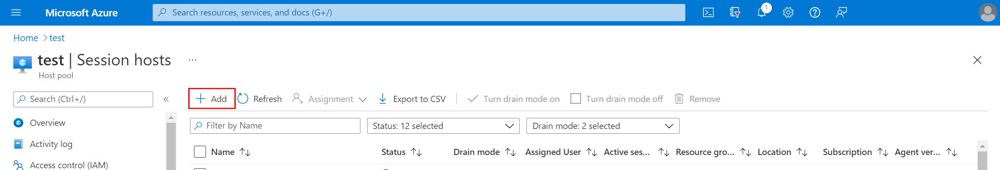
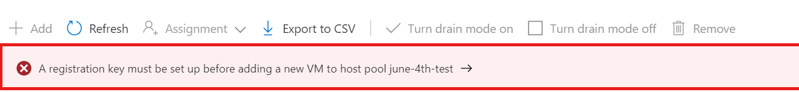
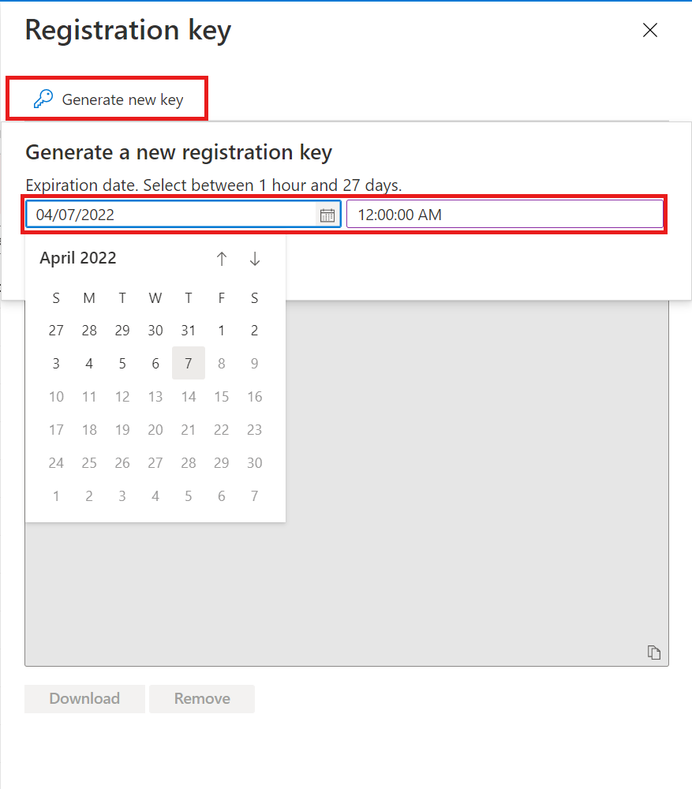

# Expand an existing host pool with new session hosts

>[!IMPORTANT]
>This content applies to Azure Virtual Desktop with Azure Resource Manager Azure Virtual Desktop objects. If you're using Azure Virtual Desktop (classic) without Azure Resource Manager objects, see [this article](./virtual-desktop-fall-2019/expand-existing-host-pool-2019.md).

As you ramp up usage within your host pool, you may need to expand your existing host pool with new session hosts to handle the new load.

This article will tell you how you can expand an existing host pool by adding new session hosts.

## What you need to expand the host pool

Before you start, make sure you've created a host pool and session host virtual machines (VMs) using one of the following methods:

- [Azure portal](./create-host-pools-azure-marketplace.md)
- [Create a host pool with PowerShell](./create-host-pools-powershell.md)

You'll also need the following information from when you first created the host pool and session host VMs:

- Registration token
- VM size, image, and name prefix
- Domain join administrator credentials
- Virtual network name and subnet name

## Add virtual machines with the Azure portal

To expand your host pool by adding virtual machines:

1. Sign in to the Azure portal.

2. Search for and select **Azure Virtual Desktop**.

3. In the menu on the left side of the screen, select **Host pools**, then select the name of the host pool you want to add virtual machines to.

4. Select **Session hosts** from the menu on the left side of the screen.

5. Select **+Add** to start adding session hosts to your host pool.

    > [!div class="mx-imgBorder"]
    > 

6. If the registration token you used to initially create the host pool has now expired, you'll receive the following banner. Select **->** to generate a new registration token. If your host pool's registration token is still valid, skip ahead to step 10.

    > [!div class="mx-imgBorder"]
    > 

7. Select **Generate new key** and select an expiration date. We recommend you set the expiration date to be the maximum of 27 days so that you don't need to regenerate a registration key frequently. Select **Ok** to generate the registration key.

    > [!div class="mx-imgBorder"]
    > 

8.  After a few seconds, your host pool's new registration key will get filled in the text box. Select **Download** and then exit out of the **Registration key** context blade. 

9. Select **+Add** once again to start adding session hosts to your host pool.

10. Ignore the the Basics tab and instead select the **Virtual machines** tab. Here you can view and edit the details of the virtual machine (VM) you want to add to the host pool.

11. Select the resource group you want to create the VMs in, then select the region. You can choose the current region the VMs in your host pool are in or a new region.

12. Enter the number of session hosts you want to add to your host pool into **Number of VMs**. For example, if you're expanding your host pool by five hosts, enter **5**.

    >[!NOTE]
    >Although it's possible to edit the image and prefix of the VMs, we don't recommended editing them if you have VMs with different images in the same host pool. Edit the image and prefix only if you plan on removing VMs with older images from the affected host pool.

13. For the **Virtual network**, select the virtual network and subnet to which you want the virtual machines to be joined. You can select the same virtual network your host pool's existing machines are currently in or choose a different one that's more suitable to the region you selected in step 11.

14. For the **Domain to join**, select if you want to join the virtual machines to Active Directory or [Azure Active Directory](deploy-azure-ad-joined-vm.md). Selecting **Enroll the VM with Intune** automatically enrolls the virtual machines in Intune. All virtual machines in a host pool should be joined to the same domain or Azure AD tenant.

15. For the **AD domain join UPN**, enter an Active Directory domain username and password associated with the domain you selected. These credentials will be used to join the virtual machines to the Active Directory domain.

      >[!NOTE]
      >Ensure your admin names comply with info given here. And that there is no MFA enabled on the account.

16. For the **Virtual Machine Administrator account**, enter the local administrator account information you want to use for all virtual machines.

17. Select the **Tags** tab if you have any tags that you want to group the virtual machines with. Otherwise, skip this tab.

18. Select the **Review + Create** tab. Review your choices, and if everything looks fine, select **Create**.

## Next steps

Now that you've expanded your existing host pool, you can sign in to a Azure Virtual Desktop client to test them as part of a user session. You can connect to a session with any of the following clients:

- [Connect with the Windows Desktop client](./users/connect-windows.md)
- [Connect with the web client](./users/connect-web.md)
- [Connect with the Android client](./users/connect-android-chrome-os.md)
- [Connect with the macOS client](./users/connect-macos.md)
- [Connect with the iOS client](./users/connect-ios-ipados.md)
