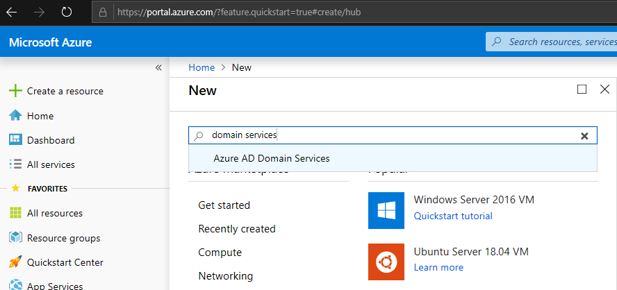

# Prepare Azure Files for an FSLogix profile containers

This article will show you how to prepare Azure Files to create an FSLogix profile container.

## Configure Azure Active Directory Domain Services

To configure your Azure Active Directory (AD) Domain Services account for FSLogix profile containers:

1. Sign in to the Microsoft Azure Portal with an account that has contributor or administrator permissions.

2. Select **New**, then search for and select **Azure AD Domain Services**.

    

3. When the Azure AD Domain Services window opens, select **Create**.

4. In the **Basics** tab:

   - Enter the DNS domain name.
   - Select an active Azure subscription (if multiple subscriptions are available).
   - Select an empty resource group or create a new one by selecting **Create new**.
   - Select a location.

   

5. For the **Network** tab, configure a virtual network or select an existing one. We recommend you create a new one by selecting **Create new** and entering the following information:

   - Visual network name
   - Address space
   - Subnet name
   - Subnet address range

   

6. For the **Administrator group** tab, select the Azure AD users that will manage the Azure AD Domain Services configuration.

7. For most deployments, you won't need to change any information in the **Synchronization** tab. Keep the default values unless told otherwise.

8. Finally, you'll see the **Summary** tab. Review the information to make sure you've selected the right settings. When you're done, select **OK** to start the deployment.

   

   To check your deployment's progress, select the **Notifications** icon in the global controls bar.

9. When the deployment is done, go to **Azure AD Domain Services** and confirm that Azure AD Domain Services is running.

## Add Azure AD Domain Services admins

To add additional admins, you create a new user and grant them permissions.

To add an admin:

1. Select **Azure Active Directory** from the sidebar, then select **All users**, and then select **New user**.

2.  Enter the user details into the fields.

3. In the Azure Active Directory pane on the left side of the screen, select **Groups**.

4. Select the **AAD DC Administrators** group.

5. In the left pane, select **Members**, then select **Add members** in the main pane. This will show a list of all users available in Azure AD. Select the name of the user profile you just created.

## Create and configure an Azure Files storage account

Now it's time to enable Azure AD Domain Services authentication over Server Message Block (SMB). For more details on this process, see the Azure Storage Documentation.

<!-->This needs a link<-->

To enable authentication:

1. Go to the Microsoft Azure Portal, then select **All services**, and then select **Storage accounts**.

2. Select **Add** to create a storage account.
3. In the window that appears:

    - Select **Subscription** (if applicable).
    - Select an existing **Resource group** or select **Create new** to create a new one.
    - Enter the **Storage account name**.
    - Select the **Location**. (We recommend using the same location as the session host VMs.)
    - Select the **Performance type**.
    - For **Account type**, select a **StorageV2 (general purpose V2) account**.

4. Select **Review + create**. This will start the validation process for the information you entered for your new storage account.

5. Once the validation process is done, select **Create**. This will start the deployment process.

6. Once the deployment is done, select **Go to resource**.

7. Select **Configuration** from the pane on the left side of the screen, then enable **Azure Active Directory authentication for Azure Files** in the main pane. Confirm this change by selecting **Save**.

8. Select **Overview** in the pane on the left side of the screen, then select **Files** in the main pane.

9. Select **File share** and enter the **Name** and **Quota** into the fields that appear on the right side of the screen.

## Assign access permissions to an identity

From Microsoft Azure portal navigate to the **Files share** created in the previous section.

1. Select **Access Control (IAM)**.
2. Select **Add a role assignment**.
3. In the **Add role assignment** tab, select the appropriate built-in role from the role list. You'll need to at least select **Storage File Data SMB Share Contributor** for the account to get proper permissions.
4. For **Assign access to**, select **Azure AD user, group, or service principal**.
5. Select a name or email address for the target Azure AD identity.
6. Select **Save**.

## Obtain storage account access key

1. From the Microsoft Azure Portal sidebar, select **Storage accounts**.

2. From the list of storage accounts, select the account for which you enabled Azure AD Domain Services and created the custom roles in steps above.

3. Under **Settings**, select **Access keys** and copy the key from **key1**.

   >[!NOTE]
   >If the key contains the "/" symbol, hit the **Refresh** icon to generate a new key.

4. Go to the **Virtual Machines** tab and locate any VM that is going to be part of your host pool.

5. Select the name of the virtual machine (VM) under **Virtual Machines (adVM)** and select **Connect**

    This will download an RDP file that will let you sign in to the VM with its own credentials.

    

6. When you've signed in to the VM, run a command prompt as an administrator.

7. Run the following command:

     ```cmd
     net use <desired-drive-letter>: \\<storage-account-name>.file.core.windows.net\<share-name> <storage-account-key> /user:Azure\<storage-account-name>
     ```

    - Replace **<desired-drive-letter>** with a drive letter of your choice (for example, `y:`).
    - Replace all instances of **<storage-account-name>** with the name of the storage account you specified earlier.
    - Replace **<share-name>** with the name of the share you created earlier.
    - Replace **<storage-account-key>** with the storage account key from Azure.

    Here's an example of what the command will look like:  
  
     ```cmd
     net use y: \\fsprofile.file.core.windows.net\share HDZQRoFP2BBmoYQ=(truncated)= /user:Azure\fsprofile)
     ```

8. Run the following command to grant the user full access to the Azure Files share.

     ```cmd
     icacls <mounted-drive-letter>: /grant <user-email>:(f)
     ```

    - Replace **<mounted-drive-letter>** with a drive letter of choice.
    - Replace **<user-email>** with the UPN of the user who will be accessing the session host VMs and needs a profile.

    Here's an example of what the command will look like:
     
     ```cmd
     icacls y: /grant alexwilber\@airlift2020outlook.onmicrosoft.com:(f)
     ```
