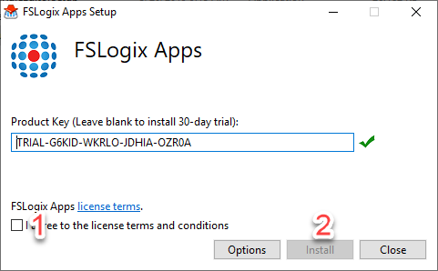
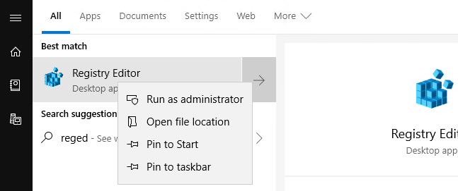
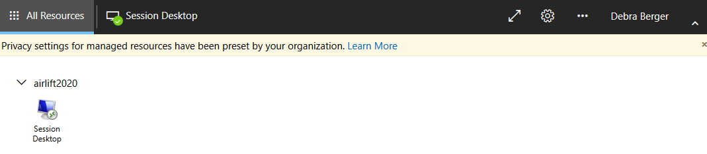

# Configure FSLogix on session host VMs

Now it's time to configure the FSLogix profile container. For more details on this process, see Set up a user profile share for a host pool.

While still remotely logged in to the session host VM, download and install the FSLogix agent (.zip file, 166 MB.

Unzip the downloaded file and navigate to

**x64\\Releases and execute FSLogixAppsSetup.exe**.

>[!NOTE]
> if there are multiple VMs in the host pool the below configuration must be done for each VM.


Once the installer launches, select **I agree to the license terms and conditions.** If applicable, provide a new key.

Select **Install**.



Navigate to **C:\\Program Files\\FSLogix\\Apps** to confirm that the FSLogix agent was properly installed.


Run **Registry Editor** (RegEdit) as an administrator.



Navigate to **Computer\\HKEY_LOCAL_MACHINE\\software\\FSLogix**, right click on **FSLogix**, select **New**, then **Key**.

Create a new key named **Profiles**.


Right click on **Profiles**, select **New**, and select **DWORD (32-bit) Value.** Name the value **Enabled** and set the **Value data** to **1.**


Right click on **Profiles**, select **New**, and select **Multi-String Value**. Name the value **VHDLocations** and set enter the URI for the Azure Files share ([\\\\fsprofile.file.core.windows.net\\share](file:///\\fsprofile.file.core.windows.net\share)) as the **Value data**.


## Assign users to session host

Run Windows PowerShell as an administrator and log in to Windows Virtual Desktop
through PowerShell by executing the following command:

```powershell
Import-Module Microsoft.RdInfra.RdPowershell

#Optional
Install-Module Microsoft.RdInfra.RdPowershell

\$brokerurl = "https://rdbroker.wvd.microsoft.com"

Add-RdsAccount -DeploymentUrl \$brokerurl
```

When prompted for credentials, enter the same user that was granted the Tenant Creator role or RDS Owner/RDS Contributor role on the Windows Virtual Desktop tenant.

Execute the following commands to assign the user to the remote desktop group:

```powershell
$tenant = "<your-wvd-tenant>"

$pool1 = "<wvd-pool>"

$appgroup = "Desktop Application Group"

$user1 = "<user-principal>"

Add-RdsAppGroupUser $tenant $pool1 $appgroup $user1
```

Here's an example of what the command will look like:

```powershell
$pool1 = "airlift2020"

$tenant = "airlift2020"

$appgroup = "Desktop Application Group"

$user1 = "debra.berger@airlift2020outlook.onmicrosoft.com"

Add-RdsAppGroupUser $tenant $pool1 $appgroup $user1
```

## Verify the profile creation

You are now ready to verify that the profile was created.

To do this:

1.  Open a browser of choice.

2.  Navigate to https://aka.ms/wvdweb.

3.  Sign in with the user account that was assigned to the remote desktop group.

    

4.  Once the user session has been established, navigate back to the Microsoft
    Azure Portal and log in with an administrative account.

5.  From the sidebar, select **Storage accounts**.

6.  Select the storage account that was configured as the file share for your
    session host pool and enabled with Azure AD Domain Services.

7.  Select the **Files** icon, then expand your share.


1.  Inside there will be a **Directory** named `<user SID>-<username>`


