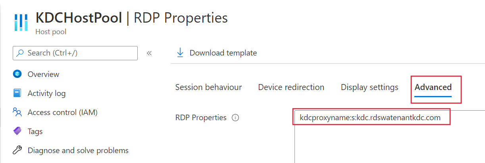

# Configure a Kerberos Key Distribution Center proxy

Security-conscious customers, such as financial or government organizations, often sign in using Smartcards. Smartcards make deployments more secure by requiring multifactor authentication (MFA). However, for the RDP portion of an Azure Virtual Desktop session, Smartcards require a direct connection, or "line of sight," with an Active Directory (AD) domain controller for Kerberos authentication. Without this direct connection, users can't automatically sign in to the organization's network from remote connections. Users in an Azure Virtual Desktop deployment can use the KDC proxy service to proxy this authentication traffic and sign in remotely. The KDC proxy allows for authentication for the Remote Desktop Protocol of an Azure Virtual Desktop session, letting the user sign in securely. This makes working from home much easier, and allows for certain disaster recovery scenarios to run more smoothly.

However, setting up the KDC proxy typically involves assigning the Windows Server Gateway role in Windows Server 2016 or later. How do you use a Remote Desktop Services role to sign in to Azure Virtual Desktop? To answer that, let's take a quick look at the components.

There are two components to the Azure Virtual Desktop service that need to be authenticated:

- The feed in the Azure Virtual Desktop client that gives users a list of available desktops or applications they have access to. This authentication process happens in Microsoft Entra ID, which means this component isn't the focus of this article.
- The RDP session that results from a user selecting one of those available resources. This component uses Kerberos authentication and requires a KDC proxy for remote users.

This article will show you how to configure the feed in the Azure Virtual Desktop client in the Azure portal. If you want to learn how to configure the RD Gateway role, see [Deploy the RD Gateway role](/windows-server/remote/remote-desktop-services/remote-desktop-gateway-role).

## Requirements

To configure an Azure Virtual Desktop session host with a KDC proxy, you'll need the following things:

- Access to the Azure portal and an Azure administrator account.
- The remote client machines must be running at least Windows 10 and have the [Windows Desktop client](/windows-server/remote/remote-desktop-services/clients/windowsdesktop) installed. The web client isn't currently supported.
- You must have a KDC proxy already installed on your machine. To learn how to do that, see [Set up the RD Gateway role for Azure Virtual Desktop](/windows-server/remote/remote-desktop-services/remote-desktop-gateway-role).
- The machine's OS must be Windows Server 2016 or later.

Once you've made sure you meet these requirements, you're ready to get started.

## How to configure the KDC proxy

To configure the KDC proxy:

1. Sign in to the Azure portal as an administrator.

2. Go to the Azure Virtual Desktop page.

3. Select the host pool you want to enable the KDC proxy for, then select **RDP Properties**.

4. Select the **Advanced** tab, then enter a value in the following format without spaces:

    
    > kdcproxyname:s:\<fqdn\>
    

    > [!div class="mx-imgBorder"]
    > 

5. Select **Save**.

6. The selected host pool should now begin to issue RDP connection files that include the kdcproxyname value you entered in step 4.

## Next steps

To learn how to manage the Remote Desktop Services side of the KDC proxy and assign the RD Gateway role, see [Deploy the RD Gateway role](/windows-server/remote/remote-desktop-services/remote-desktop-gateway-role).

If you're interested in scaling your KDC proxy servers, learn how to set up high availability for KDC proxy at [Add high availability to the RD Web and Gateway web front](/windows-server/remote/remote-desktop-services/rds-rdweb-gateway-ha).
