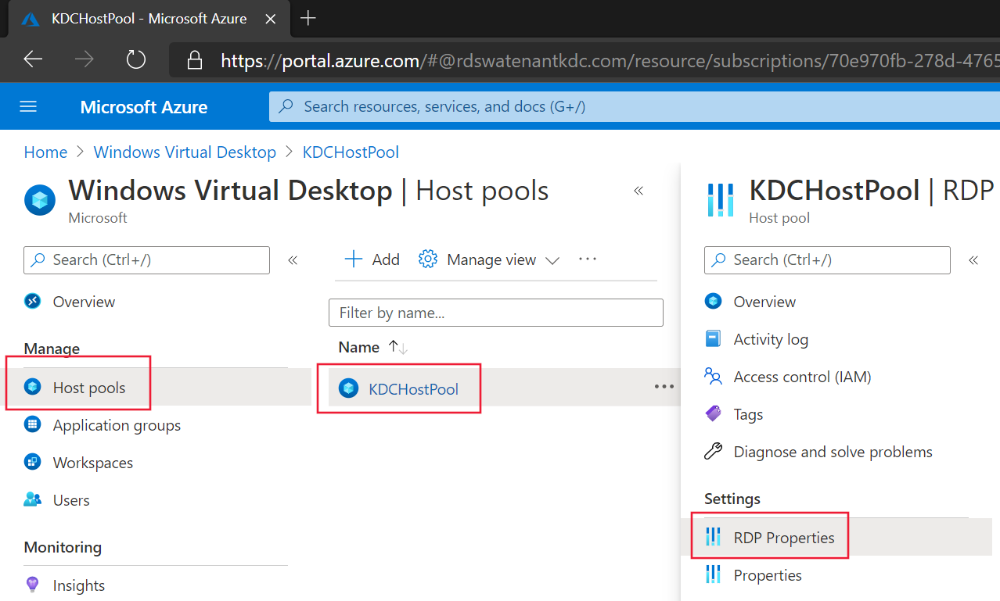

# Configure a Kerberos Key Distribution Center proxy (preview)

> [!IMPORTANT]
> This feature is currently in public preview.
> This preview version is provided without a service level agreement, and we don't recommend using it for production workloads. Certain features might not be supported or might have constrained capabilities.
> For more information, see [Supplemental Terms of Use for Microsoft Azure Previews](https://azure.microsoft.com/support/legal/preview-supplemental-terms/).

This article will show you how to configure a Kerberos Key Distribution Center (KDC) proxy (preview) for your host pool. This proxy lets organizations authenticate with Kerberos outside of their enterprise boundaries. For example, you can use the KDC proxy to enable Smartcard authentication for external clients.

## How to configure the KDC proxy

To configure the KDC proxy:

1. Sign in to the Azure portal as an administrator.

2. Go to the Windows Virtual Desktop page.

3. Select the host pool you want to enable the KDC proxy for, then select **RDP Properties**.

    > [!div class="mx-imgBorder"]
    > 

4. Select the **Advanced** tab, then enter a value in the following format without spaces:

    > kdcproxyname:s:\<fqdn\>

    > [!div class="mx-imgBorder"]
    > 

5. Select **Save**.

6. The selected host pool should now begin to issue RDP connection files with the kdcproxyname field that you entered included.

## Next steps

The RDGateway role in Remote Desktop Services includes a KDC proxy service. See [Deploy the RD Gateway role in Windows Virtual Desktop](rd-gateway-role.md) for how to set one up to be a target for Windows Virtual Desktop.
