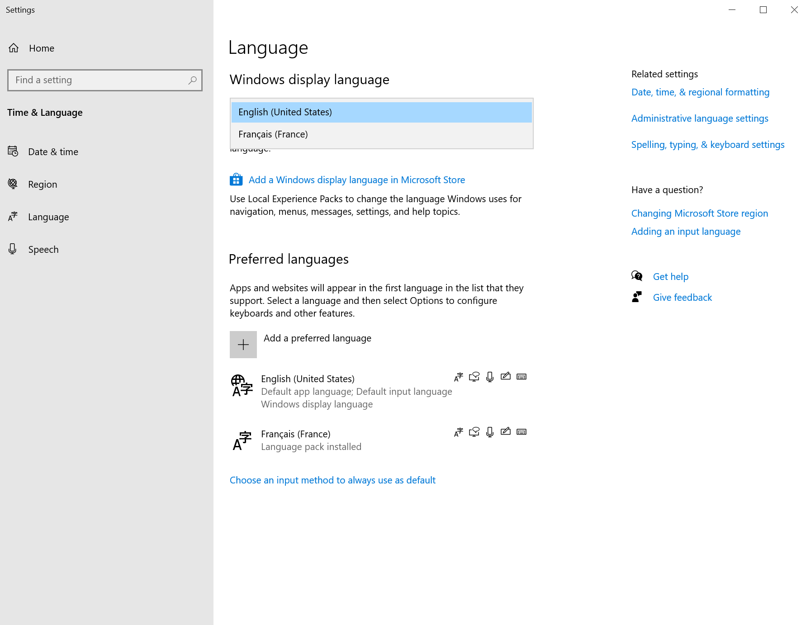
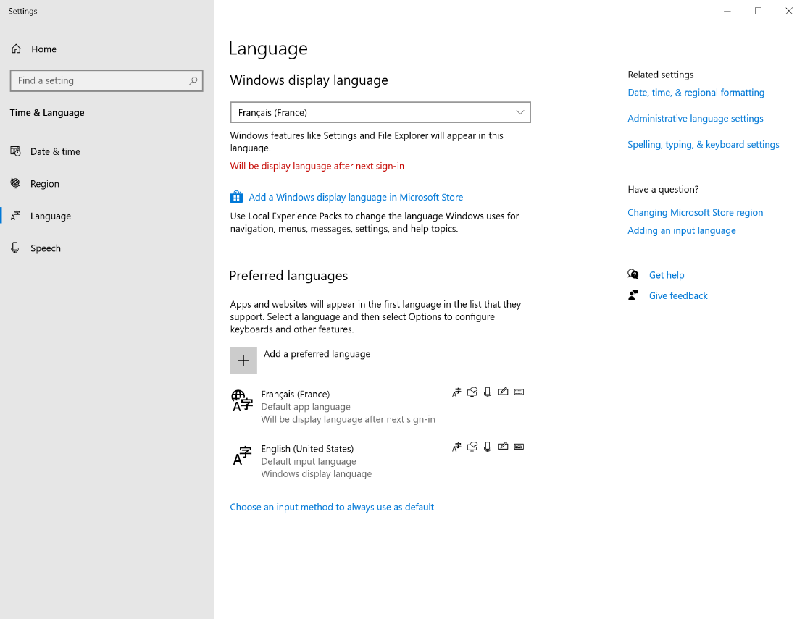

# Install language packs on Windows 10 Multi-session VMs

When you set up Windows Virtual Desktop deployments internationally, it's a good idea to make sure your deployment supports multiple languages. You can install language packs on a Windows 10 Multi-session VM image to support as many languages as you need. This article will tell you how to install language packs and how users can change the display language.

Learn more about deploy a VM in Azure at [Create a Windows virtual machine in an availability zone with the Azure portal](/virtual-machines/windows/create-portal-availability-zone).

## install a language pack

- Make sure you are signed in as an Administrator

1. Sign in as an admin.
2. Make sure you've installed all the latest Windows and Windows Store updates.
3. Go to **Settings** > **Time & Language** > **Region**.
4. Under **Country or region**, select your preferred country or region from the drop-down menu.
    In this example, we're going to select **France**, as shown in the following screenshot:

    

5. After that, select **Language**, then select **Add a language**. Choose the language you want to install from the list, then select **Next**.
6. When the **Install language features** window opens, select the check box labeled **Install language pack and set as my Windows display language**.
7. Select **Install**.

    >[!NOTE]
    >To add multiple languages at once, select **Add a language**, then repeat the process to add a language in steps 5 and 6. Repeat this process for each language you want to install. However, you can only set one language as your display language at a time.

    The following example images show how you would install the French and Dutch language packs, then set French as the display language.

    

    

    

8. After your language packs have installed, you should see the names of your language packs appear in the list of languages.


1. Depending on how your system is configured, a window may appear that asks you to sign out of your session. Sign out, then sign in again. Your display language should now be the language you selected.

10. Go to **Control Panel** > **Clock and Region** > **Region**.

11. When the **Region** window opens, select the **Administration** tab, then select **Copy settings**.

12. Select the check boxes labeled **Welcome screen and system accounts** and **New user accounts**.
13. Select **OK**.
14. A window will open and tell you to restart your session. Select **Restart now**.

   

   

15. After you've signed back in, go back to **Control Panel** > **Clock and Region** > **Region**.

16. Select the **Administration** tab.

17. Select **Change system locale...**

18. In the drop-down menu under *Current system locale**, select your desired locale language. After that, select **OK**.

19. Select **Restart now** to restart your session once again.


You've finished installing your languages! Before you continue, check one more time that you have the latest versions of Windows and Windows store installed.


## Sysprep

Next, you need to sysprep your machine.

1. Open PowerShell as an Administrator.
2. Navigate to:
   
    ```powershell
    cd Windows\System32\Sysprep
    ```

3. Next, run the following cmdlet:
    
    ```powershell
    .\sysprep.exe
    ```

    

4. The System Preparation Tool window will open. Select the check box labelled **Generalize**, then go to Shutdown Options and select **Shut down** from the drop-down menu.

   

5. If you encoutner a sysprep error, open **File Exploer**, open **Drive C**, then go to **Windows** > **System32 Sysprep** > **Panther**, then open the **setuperr** file.

   

   The error will indicate that the specific language package needs to be uninstalled. Copy the language package name to your clipboard.

   

   

6. Open a new PowerShell window and run the following cmdlet to remove the language package that's causing the error:

   ```powershell
   Remove-AppxPackage <package name>
   ```

- After it uninstalls, rerun the same command, as shown below, to ensure it has been removed.

    >[!NOTE]
    >you will know it has been removed successfully if you receive an error when trying to remove it a second time


10. After the language pack is removed, run sysprep again.


>[!NOTE]
>The syprep process will take a few minutes to finish. As the VM shuts down, your remote session will disconnect.


## Capture the image

- Navigate to your Azure portal and select the Virtual Machine you have just run a sysprep on

- Capture the image of this machine by clicking "Capture" on the horizontal menu


You will be taken to a panel that prompts you to create an image

- Enter a name for your image and assign it to the resource group of your choosing

- Then click "Create"


- Once you wait for it to be validated, you will see a message, like the snippet below, in your notification center, indicating that you have successfully created the image


- Once you have reached this stage, you can now deploy a new VM in Azure with the image that you just created

- Ensure that when you are completing the process to [deploy a VM in Azure](https://docs.microsoft.com/en-us/azure/virtual-machines/windows/create-portal-availability-zone), you select the image that was just created from this sysprep

### Change a language as a standard user

>[!NOTE]
>This example illustrates a non-admin user changing the language from English to French

- Assuming you are currently logged into your session as a non-admin user, navigate to the Language Settings panel by searching for "Language" in the Start Menu

- Then choose the language you want to change the Windows display language to, from the dropdown

- You should see a message informing you the language you chose "Will be display language after next sign in"





- Once you log out and log into your session again, the welcome screen and your desktop should be presented in the language you chose


- **Success**! You have changed the language as a non-admin
