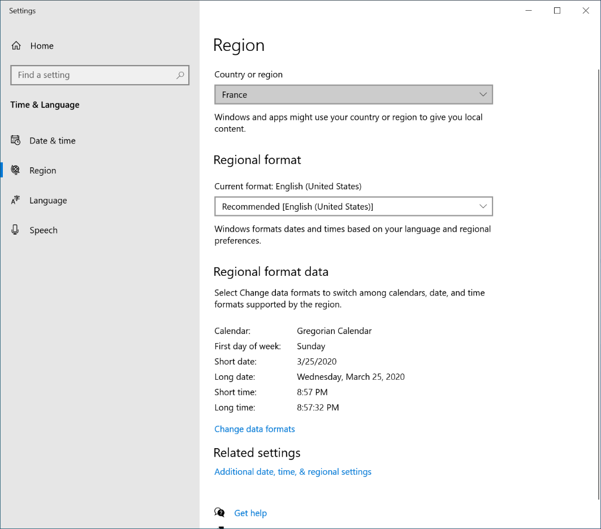
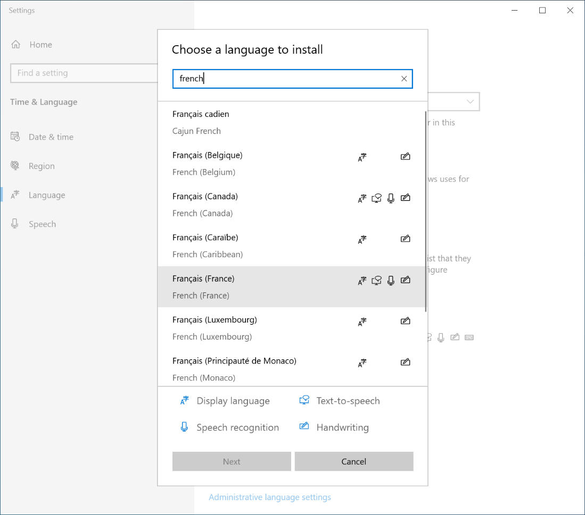
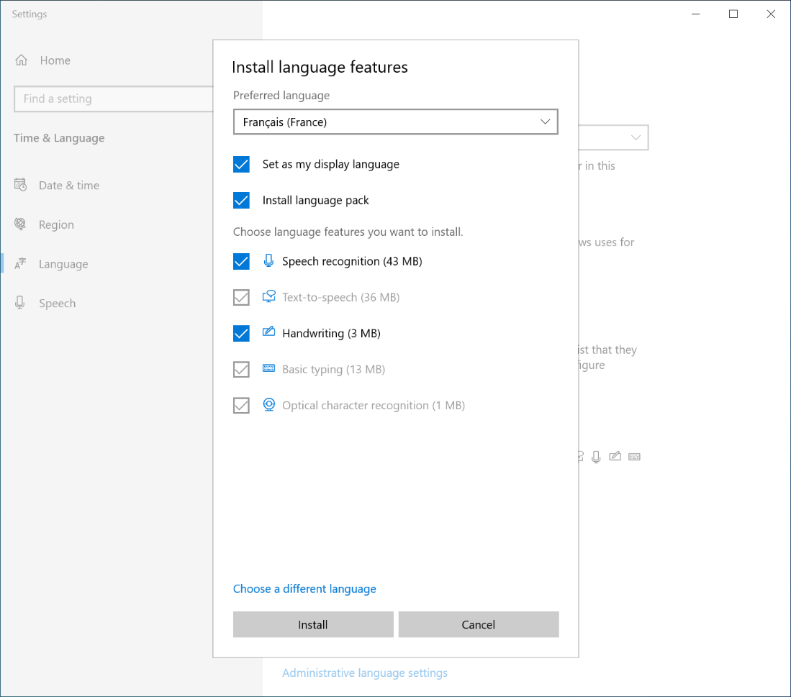
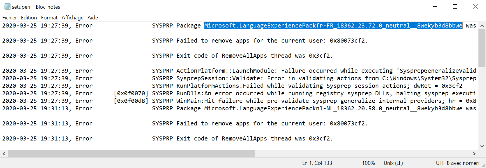
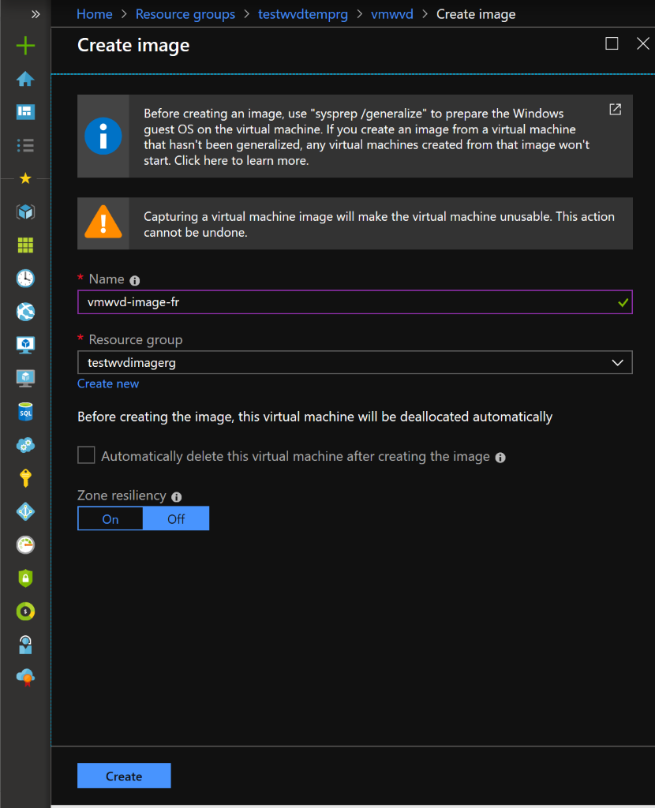

# Install language packs

When you set up Windows Virtual Desktop deployments internationally, it's a good idea to make sure your deployment supports multiple languages. You can install language packs on a Windows 10 Enterprise multi-session virtual machine (VM) image to support as many languages as your organization needs. This article will tell you how to install language packs and capture images that let your users choose their own display languages.

Learn more about how to deploy a VM in Azure at [Create a Windows virtual machine in an availability zone with the Azure portal](../virtual-machines/windows/create-portal-availability-zone.md).

>[!NOTE]
>This article applies to Windows 10 Enterprise multi-session VMs.

## Install a language pack

To create a VM image with language packs, you first need to install language packs onto a machine and capture an image of it.

To install language packs:

1. Sign in as an admin.
2. Make sure you've installed all the latest Windows and Windows Store updates.
3. Go to **Settings** > **Time & Language** > **Region**.
4. Under **Country or region**, select your preferred country or region from the drop-down menu.
    In this example, we're going to select **France**, as shown in the following screenshot:

    

5. After that, select **Language**, then select **Add a language**. Choose the language you want to install from the list, then select **Next**.
6. When the **Install language features** window opens, select the check box labeled **Install language pack and set as my Windows display language**.
7. Select **Install**.
8. To add multiple languages at once, select **Add a language**, then repeat the process to add a language in steps 5 and 6. Repeat this process for each language you want to install. However, you can only set one language as your display language at a time.

    Let's run through a quick visual demonstration. The following images show how to install the French and Dutch language packs, then set French as the display language.

    

    

    

    After your language packs have installed, you should see the names of your language packs appear in the list of languages.

    

9. If a window appears asking you to sign out of your session. Sign out, then sign in again. Your display language should now be the language you selected.

10.  Go to **Control Panel** > **Clock and Region** > **Region**.

11.  When the **Region** window opens, select the **Administration** tab, then select **Copy settings**.

12.  Select the check boxes labeled **Welcome screen and system accounts** and **New user accounts**.

13.  Select **OK**.

14.  A window will open and tell you to restart your session. Select **Restart now**.

15.  After you've signed back in, go back to **Control Panel** > **Clock and Region** > **Region**.

16.  Select the **Administration** tab.

17.  Select **Change system locale**.

18. In the drop-down menu under **Current system locale**, select the locale language you want to use. After that, select **OK**.

19. Select **Restart now** to restart your session once again.

Congratulations, you've installed your language packs!

Before you continue, make sure your system has the latest versions of Windows and Windows store installed.

## Sysprep

Next, you need to sysprep your machine to prepare it for the image capturing process.

To sysprep your machine:

1. Open PowerShell as an Administrator.
2. Run the following cmdlet to go to the correct directory:
   
    ```powershell
    cd Windows\System32\Sysprep
    ```

3. Next, run the following cmdlet:
    
    ```powershell
    .\sysprep.exe
    ```

4. When the System Preparation Tool window opens, select the check box labeled **Generalize**, then go to **Shutdown Options** and select **Shut down** from the drop-down menu.

>[!NOTE]
>The syprep process will take a few minutes to finish. As the VM shuts down, your remote session will disconnect.

### Resolve sysprep errors

If you see an error message during the sysprep process, here's what you should do:

1. Open **Drive C** and go to **Windows** > **System32 Sysprep** > **Panther**, then open the **setuperr** file.

   The text in the error file will tell you that you need to uninstall a specific language package, as shown in the following image. Copy the language package name for the next step.

   

2. Open a new PowerShell window and run the following cmdlet with the package name you copied in step 2 to remove the language package:

   ```powershell
   Remove-AppxPackage <package name>
   ```

3. Check to make sure you've removed the package by running the `Remove-AppxPackage` cmdlet again. If you've successfully removed the package, you should see a message that says the package you're trying to remove isn't there.

4. Run the `sysprep.exe` cmdlet again.

## Capture the image

Now that your system is ready, you can capture an image so that other users can start using VMs based on your system without having to repeat the configuration process.

To capture an image:

1. Go to the Azure portal and select the name of the machine you configured in [Install a language pack](#install-a-language-pack) and [sysprep](#sysprep).

2. Select **Capture**.

3. Enter a name for your image into the **Name** field and assign it to the resource group using the **Resource group** drop-down menu, as shown in the following image.

   

4. Select **Create**.

5. Wait a few minutes for the capture process to finish. When the image is ready, you should see a message in the Notifications Center letting you know the image was captured.

You can now deploy a VM using your new image. When you deploy the VM, make sure to follow the instructions in [Create a Windows virtual machine in an availability zone with the Azure portal](../virtual-machines/windows/create-portal-availability-zone.md).

### How to change display language for standard users

Standard users can change the display language on their VMs.

To change the display language:

1. Go to **Language Settings**. If you don't know where that is, you can enter **Language** into the search bar in the Start Menu.

2. In the Windows display language drop-down menu, select the language you want to use as your display language.

3. Sign out of your session, then sign back in. The display language should now be the one you selected in step 2.
