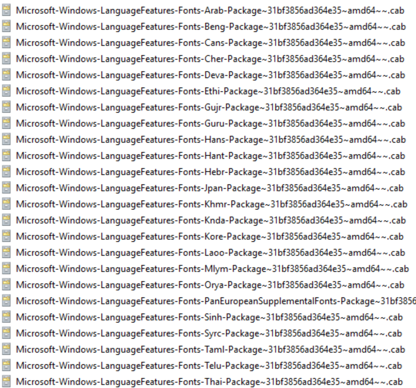

# Add language packs to a Windows 10 multi-session image

Windows Virtual Desktop is a service that your users can deploy anytime, anywhere. That's why it's important that your users be able to customize which language their Windows 10 Enterprise multi-session image displays.

There are two ways you can accommodate the language needs of your users:

- Build dedicated host pools with a customized image for each language.
- Have users with different language and localization requirements in the same host pool, but customize their images to ensure they can select whichever language they need.

The latter method is a lot more efficient and cost-effective. However, it's up to you to decide which method best suits your needs. This article will show you how to customize languages for your images.

## Prerequisites

You need the following things to customize your Windows 10 Enterprise multi-session images to add multiple languages:

- An Azure virtual machine (VM) with Windows 10 Enterprise multi-session, version 1903 or later

- The Language ISO, Feature on Demand (FOD) Disk 1, and Inbox Apps ISO of the OS version the image uses. You can download them here:
     
     - Language ISO:
        - [Windows 10, version 1903 or 1909 Language Pack ISO](https://software-download.microsoft.com/download/pr/18362.1.190318-1202.19h1_release_CLIENTLANGPACKDVD_OEM_MULTI.iso)
        - [Windows 10, version 2004 or 20H2 Language Pack ISO](https://software-download.microsoft.com/download/pr/19041.1.191206-1406.vb_release_CLIENTLANGPACKDVD_OEM_MULTI.iso)

     - FOD Disk 1 ISO:
        - [Windows 10, version 1903 or 1909 FOD Disk 1 ISO](https://software-download.microsoft.com/download/pr/18362.1.190318-1202.19h1_release_amd64fre_FOD-PACKAGES_OEM_PT1_amd64fre_MULTI.iso)
        - [Windows 10, version 2004 or 20H2 FOD Disk 1 ISO](https://software-download.microsoft.com/download/pr/19041.1.191206-1406.vb_release_amd64fre_FOD-PACKAGES_OEM_PT1_amd64fre_MULTI.iso)
        
     - Inbox Apps ISO:
        - [Windows 10, version 1903 or 1909 Inbox Apps ISO](https://software-download.microsoft.com/download/pr/18362.1.190318-1202.19h1_release_amd64fre_InboxApps.iso)
        - [Windows 10, version 2004 Inbox Apps ISO](https://software-download.microsoft.com/download/pr/19041.1.191206-1406.vb_release_amd64fre_InboxApps.iso)
        - [Windows 10, version 20H2 Inbox Apps ISO](https://software-download.microsoft.com/download/pr/19041.508.200905-1327.vb_release_svc_prod1_amd64fre_InboxApps.iso)
     
     - If you use Local Experience Pack (LXP) ISO files to localize your images, you will also need to download the appropriate LXP ISO for the best language experience
        - If you're using Windows 10, version 1903 or 1909:
          - [Windows 10, version 1903 or 1909 LXP ISO](https://software-download.microsoft.com/download/pr/Win_10_1903_32_64_ARM64_MultiLng_LngPkAll_LXP_ONLY.iso)
        - If you're using Windows 10, version 2004 or 20H2, use the information in [Adding languages in Windows 10: Known issues](/windows-hardware/manufacture/desktop/language-packs-known-issue) to figure out which of the following LXP ISOs is right for you:
          - [Windows 10, version 2004 or 20H2 **9B** LXP ISO](https://software-download.microsoft.com/download/pr/Win_10_2004_64_ARM64_MultiLang_LangPckAll_LIP_LXP_ONLY)
          - [Windows 10, version 2004 or 20H2 **9C** LXP ISO](https://software-download.microsoft.com/download/pr/Win_10_2004_32_64_ARM64_MultiLng_LngPkAll_LIP_9C_LXP_ONLY)
          - [Windows 10, version 2004 or 20H2 **10C** LXP ISO](https://software-download.microsoft.com/download/pr/LanguageExperiencePack.2010C.iso)
          - [Windows 10, version 2004 or 20H2 **11C** LXP ISO](https://software-download.microsoft.com/download/pr/LanguageExperiencePack.2011C.iso)
          - [Windows 10, version 2004 or 20H2 **1C** LXP ISO](https://software-download.microsoft.com/download/pr/LanguageExperiencePack.2101C.iso)
          - [Windows 10, version 2004 or 20H2 **2C** LXP ISO](https://software-download.microsoft.com/download/pr/LanguageExperiencePack.2102C.iso)
          - [Windows 10, version 2004 or 20H2 **3C** LXP ISO](https://software-download.microsoft.com/download/pr/LanguageExperiencePack.2103C.iso)

- An Azure Files Share or a file share on a Windows File Server Virtual Machine

>[!NOTE]
>The file share (repository) must be accessible from the Azure VM you plan to use to create the custom image.

## Create a content repository for language packages and features on demand

To create the content repository for language packages and FODs and a repository for the Inbox Apps packages:

1. On an Azure VM, download the Windows 10 Multi-Language ISO, FODs, and Inbox Apps for Windows 10 Enterprise multi-session, version 1903/1909, and 2004 images from the links in [Prerequisites](#prerequisites).

2. Open and mount the ISO files on the VM.

3. Go to the language pack ISO and copy the content from the **LocalExperiencePacks** and **x64\\langpacks** folders, then paste the content into the file share.

4. Go to the **FOD ISO file**, copy all of its content, then paste it into the file share.
5. Go to the **amd64fre** folder on the Inbox Apps ISO and copy the content in the repository for the inbox apps that you've prepared.

     >[!NOTE]
     > If you're working with limited storage, only copy the files for the languages you know your users need. You can tell the files apart by looking at the language codes in their file names. For example, the French file has the code "fr-FR" in its name. For a complete list of language codes for all available languages, see [Available language packs for Windows](/windows-hardware/manufacture/desktop/available-language-packs-for-windows).

     >[!IMPORTANT]
     > Some languages require additional fonts included in satellite packages that follow different naming conventions. For example, Japanese font file names include “Jpan."
     >
     > [!div class="mx-imgBorder"]
     > 

6. Set the permissions on the language content repository share so that you have read access from the VM you'll use to build the custom image.

## Create a custom Windows 10 Enterprise multi-session image manually

To create a custom Windows 10 Enterprise multi-session image manually:

1. Deploy an Azure VM, then go to the Azure Gallery and select the current version of Windows 10 Enterprise multi-session you're using.
2. After you've deployed the VM, connect to it using RDP as a local admin.
3. Make sure your VM has all the latest Windows Updates. Download the updates and restart the VM, if necessary.
4. Connect to the language package, FOD, and Inbox Apps file share repository and mount it to a letter drive (for example, drive E).

## Create a custom Windows 10 Enterprise multi-session image automatically

If you'd rather install languages through an automated process, you can set up a script in PowerShell. You can use the following script sample to install the Spanish (Spain), French (France), and Chinese (PRC) language packs and satellite packages for Windows 10 Enterprise multi-session, version 2004. The script integrates the language interface pack and all necessary satellite packages into the image. However, you can also modify this script to install other languages. Just make sure to run the script from an elevated PowerShell session, or else it won't work.

```powershell
########################################################
## Add Languages to running Windows Image for Capture##
########################################################

##Disable Language Pack Cleanup##
Disable-ScheduledTask -TaskPath "\Microsoft\Windows\AppxDeploymentClient\" -TaskName "Pre-staged app cleanup"

##Set Language Pack Content Stores##
[string]$LIPContent = "E:"

##Spanish##
Add-AppProvisionedPackage -Online -PackagePath $LIPContent\es-es\LanguageExperiencePack.es-es.Neutral.appx -LicensePath $LIPContent\es-es\License.xml
Add-WindowsPackage -Online -PackagePath $LIPContent\Microsoft-Windows-Client-Language-Pack_x64_es-es.cab
Add-WindowsPackage -Online -PackagePath $LIPContent\Microsoft-Windows-LanguageFeatures-Basic-es-es-Package~31bf3856ad364e35~amd64~~.cab
Add-WindowsPackage -Online -PackagePath $LIPContent\Microsoft-Windows-LanguageFeatures-Handwriting-es-es-Package~31bf3856ad364e35~amd64~~.cab
Add-WindowsPackage -Online -PackagePath $LIPContent\Microsoft-Windows-LanguageFeatures-OCR-es-es-Package~31bf3856ad364e35~amd64~~.cab
Add-WindowsPackage -Online -PackagePath $LIPContent\Microsoft-Windows-LanguageFeatures-Speech-es-es-Package~31bf3856ad364e35~amd64~~.cab
Add-WindowsPackage -Online -PackagePath $LIPContent\Microsoft-Windows-LanguageFeatures-TextToSpeech-es-es-Package~31bf3856ad364e35~amd64~~.cab
Add-WindowsPackage -Online -PackagePath $LIPContent\Microsoft-Windows-NetFx3-OnDemand-Package~31bf3856ad364e35~amd64~es-es~.cab
Add-WindowsPackage -Online -PackagePath $LIPContent\Microsoft-Windows-InternetExplorer-Optional-Package~31bf3856ad364e35~amd64~es-es~.cab
Add-WindowsPackage -Online -PackagePath $LIPContent\Microsoft-Windows-MSPaint-FoD-Package~31bf3856ad364e35~amd64~es-es~.cab
Add-WindowsPackage -Online -PackagePath $LIPContent\Microsoft-Windows-Notepad-FoD-Package~31bf3856ad364e35~amd64~es-es~.cab
Add-WindowsPackage -Online -PackagePath $LIPContent\Microsoft-Windows-PowerShell-ISE-FOD-Package~31bf3856ad364e35~amd64~es-es~.cab
Add-WindowsPackage -Online -PackagePath $LIPContent\Microsoft-Windows-Printing-WFS-FoD-Package~31bf3856ad364e35~amd64~es-es~.cab
Add-WindowsPackage -Online -PackagePath $LIPContent\Microsoft-Windows-StepsRecorder-Package~31bf3856ad364e35~amd64~es-es~.cab
Add-WindowsPackage -Online -PackagePath $LIPContent\Microsoft-Windows-WordPad-FoD-Package~31bf3856ad364e35~amd64~es-es~.cab
$LanguageList = Get-WinUserLanguageList
$LanguageList.Add("es-es")
Set-WinUserLanguageList $LanguageList -force

##French##
Add-AppProvisionedPackage -Online -PackagePath $LIPContent\fr-fr\LanguageExperiencePack.fr-fr.Neutral.appx -LicensePath $LIPContent\fr-fr\License.xml
Add-WindowsPackage -Online -PackagePath $LIPContent\Microsoft-Windows-Client-Language-Pack_x64_fr-fr.cab
Add-WindowsPackage -Online -PackagePath $LIPContent\Microsoft-Windows-LanguageFeatures-Basic-fr-fr-Package~31bf3856ad364e35~amd64~~.cab
Add-WindowsPackage -Online -PackagePath $LIPContent\Microsoft-Windows-LanguageFeatures-Handwriting-fr-fr-Package~31bf3856ad364e35~amd64~~.cab
Add-WindowsPackage -Online -PackagePath $LIPContent\Microsoft-Windows-LanguageFeatures-OCR-fr-fr-Package~31bf3856ad364e35~amd64~~.cab
Add-WindowsPackage -Online -PackagePath $LIPContent\Microsoft-Windows-LanguageFeatures-Speech-fr-fr-Package~31bf3856ad364e35~amd64~~.cab
Add-WindowsPackage -Online -PackagePath $LIPContent\Microsoft-Windows-LanguageFeatures-TextToSpeech-fr-fr-Package~31bf3856ad364e35~amd64~~.cab
Add-WindowsPackage -Online -PackagePath $LIPContent\Microsoft-Windows-NetFx3-OnDemand-Package~31bf3856ad364e35~amd64~fr-fr~.cab
Add-WindowsPackage -Online -PackagePath $LIPContent\Microsoft-Windows-InternetExplorer-Optional-Package~31bf3856ad364e35~amd64~fr-FR~.cab
Add-WindowsPackage -Online -PackagePath $LIPContent\Microsoft-Windows-MSPaint-FoD-Package~31bf3856ad364e35~amd64~fr-FR~.cab
Add-WindowsPackage -Online -PackagePath $LIPContent\Microsoft-Windows-Notepad-FoD-Package~31bf3856ad364e35~amd64~fr-FR~.cab
Add-WindowsPackage -Online -PackagePath $LIPContent\Microsoft-Windows-PowerShell-ISE-FOD-Package~31bf3856ad364e35~amd64~fr-FR~.cab
Add-WindowsPackage -Online -PackagePath $LIPContent\Microsoft-Windows-Printing-WFS-FoD-Package~31bf3856ad364e35~amd64~fr-FR~.cab
Add-WindowsPackage -Online -PackagePath $LIPContent\Microsoft-Windows-StepsRecorder-Package~31bf3856ad364e35~amd64~fr-FR~.cab
Add-WindowsPackage -Online -PackagePath $LIPContent\Microsoft-Windows-WordPad-FoD-Package~31bf3856ad364e35~amd64~fr-FR~.cab
$LanguageList = Get-WinUserLanguageList
$LanguageList.Add("fr-fr")
Set-WinUserLanguageList $LanguageList -force

##Chinese(PRC)##
Add-AppProvisionedPackage -Online -PackagePath $LIPContent\zh-cn\LanguageExperiencePack.zh-cn.Neutral.appx -LicensePath $LIPContent\zh-cn\License.xml
Add-WindowsPackage -Online -PackagePath $LIPContent\Microsoft-Windows-Client-Language-Pack_x64_zh-cn.cab
Add-WindowsPackage -Online -PackagePath $LIPContent\Microsoft-Windows-LanguageFeatures-Basic-zh-cn-Package~31bf3856ad364e35~amd64~~.cab
Add-WindowsPackage -Online -PackagePath $LIPContent\Microsoft-Windows-LanguageFeatures-Fonts-Hans-Package~31bf3856ad364e35~amd64~~.cab
Add-WindowsPackage -Online -PackagePath $LIPContent\Microsoft-Windows-LanguageFeatures-Handwriting-zh-cn-Package~31bf3856ad364e35~amd64~~.cab
Add-WindowsPackage -Online -PackagePath $LIPContent\Microsoft-Windows-LanguageFeatures-OCR-zh-cn-Package~31bf3856ad364e35~amd64~~.cab
Add-WindowsPackage -Online -PackagePath $LIPContent\Microsoft-Windows-LanguageFeatures-Speech-zh-cn-Package~31bf3856ad364e35~amd64~~.cab
Add-WindowsPackage -Online -PackagePath $LIPContent\Microsoft-Windows-LanguageFeatures-TextToSpeech-zh-cn-Package~31bf3856ad364e35~amd64~~.cab
Add-WindowsPackage -Online -PackagePath $LIPContent\Microsoft-Windows-NetFx3-OnDemand-Package~31bf3856ad364e35~amd64~zh-cn~.cab
Add-WindowsPackage -Online -PackagePath $LIPContent\Microsoft-Windows-InternetExplorer-Optional-Package~31bf3856ad364e35~amd64~zh-cn~.cab
Add-WindowsPackage -Online -PackagePath $LIPContent\Microsoft-Windows-MSPaint-FoD-Package~31bf3856ad364e35~amd64~zh-cn~.cab
Add-WindowsPackage -Online -PackagePath $LIPContent\Microsoft-Windows-Notepad-FoD-Package~31bf3856ad364e35~amd64~zh-cn~.cab
Add-WindowsPackage -Online -PackagePath $LIPContent\Microsoft-Windows-PowerShell-ISE-FOD-Package~31bf3856ad364e35~amd64~zh-cn~.cab
Add-WindowsPackage -Online -PackagePath $LIPContent\Microsoft-Windows-Printing-WFS-FoD-Package~31bf3856ad364e35~amd64~zh-cn~.cab
Add-WindowsPackage -Online -PackagePath $LIPContent\Microsoft-Windows-StepsRecorder-Package~31bf3856ad364e35~amd64~zh-cn~.cab
Add-WindowsPackage -Online -PackagePath $LIPContent\Microsoft-Windows-WordPad-FoD-Package~31bf3856ad364e35~amd64~zh-cn~.cab
$LanguageList = Get-WinUserLanguageList
$LanguageList.Add("zh-cn")
Set-WinUserLanguageList $LanguageList -force
```

The script might take a while depending on the number of languages you need to install.

Once the script is finished running, check to make sure the language packs installed correctly by going to **Start** > **Settings** > **Time & Language** > **Language**. If the language files are there, you're all set.

After adding additional languages to the Windows image, the inbox apps are also required to be updated to support the added languages. This can be done by refreshing the pre-installed apps with the content from the inbox apps ISO. To perform this refresh in a disconnected environment (no Internet Access from the VM possible), you can use the following PowerShell script sample to automate the process.

```powershell
#########################################
## Update Inbox Apps for Multi Language##
#########################################
##Set Inbox App Package Content Stores##
[string]$InboxApps = "F:\"
##Update Inbox Store Apps##
$AllAppx = Get-Item $inboxapps\*.appx | Select-Object name
$AllAppxBundles = Get-Item $inboxapps\*.appxbundle | Select-Object name
$allAppxXML = Get-Item $inboxapps\*.xml | Select-Object name
foreach ($Appx in $AllAppx) {
    $appname = $appx.name.substring(0,$Appx.name.length-5)
    $appnamexml = $appname + ".xml"
    $pathappx = $InboxApps + "\" + $appx.Name
    $pathxml = $InboxApps + "\" + $appnamexml
    
    if($allAppxXML.name.Contains($appnamexml)){
    
    Write-Host "Handeling with xml $appname"  
  
    Add-AppxProvisionedPackage -Online -PackagePath $pathappx -LicensePath $pathxml
    } else {
      
      Write-Host "Handeling without xml $appname"
      
      Add-AppxProvisionedPackage -Online -PackagePath $pathappx -skiplicense
    }
}
foreach ($Appx in $AllAppxBundles) {
    $appname = $appx.name.substring(0,$Appx.name.length-11)
    $appnamexml = $appname + ".xml"
    $pathappx = $InboxApps + "\" + $appx.Name
    $pathxml = $InboxApps + "\" + $appnamexml
    
    if($allAppxXML.name.Contains($appnamexml)){
    Write-Host "Handeling with xml $appname"
    
    Add-AppxProvisionedPackage -Online -PackagePath $pathappx -LicensePath $pathxml
    } else {
       Write-Host "Handeling without xml $appname"
      Add-AppxProvisionedPackage -Online -PackagePath $pathappx -skiplicense
    }
}
```

>[!IMPORTANT]
>The inbox apps included in the ISO aren't the latest versions of the pre-installed Windows apps. To get the latest version of all apps, you need to update the apps using the Windows Store App and perform an manual search for updates after you've installed the additional languages.

When you're done, make sure to disconnect the share.

## Finish customizing your image

After you've installed the language packs, you can install any other software you want to add to your customized image.

Once you're finished customizing your image, you'll need to run the system preparation tool (sysprep).

To run sysprep:

1. Open an elevated command prompt and run the following command to generalize the image:  
   
     ```cmd
     C:\Windows\System32\Sysprep\sysprep.exe /oobe /generalize /shutdown
     ```

2. Stop the VM, then capture it in a managed image by following the instructions in [Create a managed image of a generalized VM in Azure](../virtual-machines/windows/capture-image-resource.md).

3. You can now use the customized image to deploy a Windows Virtual Desktop host pool. To learn how to deploy a host pool, see [Tutorial: Create a host pool with the Azure portal](create-host-pools-azure-marketplace.md).

## Enable languages in Windows settings app

Finally, after you deploy the host pool, you'll need to add the language to each user's language list so they can select their preferred language in the Settings menu.

To ensure your users can select the languages you installed, sign in as the user, then run the following PowerShell cmdlet to add the installed language packs to the Languages menu. You can also set up this script as an automated task or logon script that activates when the user signs in to their session.

```powershell
$LanguageList = Get-WinUserLanguageList
$LanguageList.Add("es-es")
$LanguageList.Add("fr-fr")
$LanguageList.Add("zh-cn")
Set-WinUserLanguageList $LanguageList -force
```

After a user changes their language settings, they'll need to sign out of their Windows Virtual Desktop session and sign in again for the changes to take effect. 

## Next steps

If you're curious about known issues for language packs, see [Adding language packs in Windows 10, version 1803 and later versions: Known issues](/windows-hardware/manufacture/desktop/language-packs-known-issue).

If you have any other questions about Windows 10 Enterprise multi-session, check out our [FAQ](windows-10-multisession-faq.yml).
