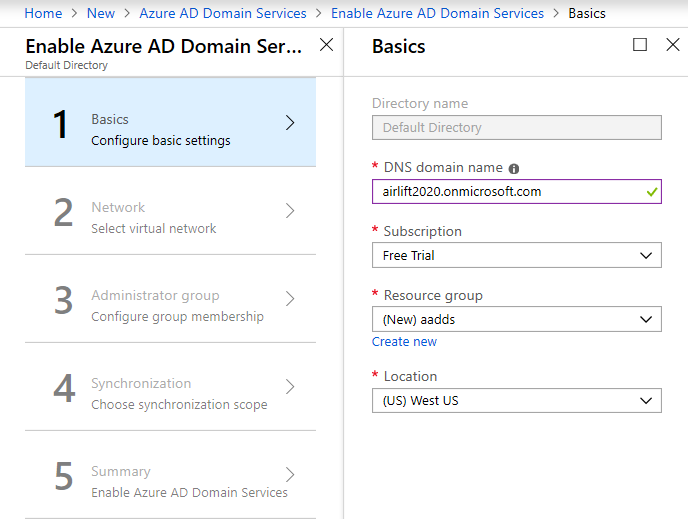
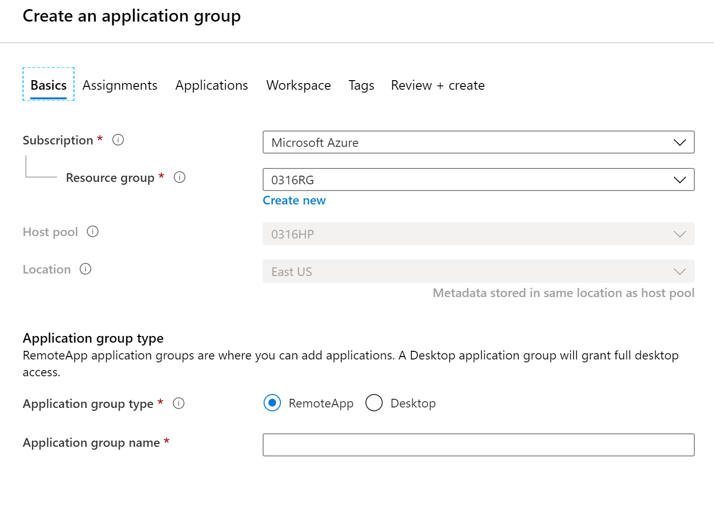
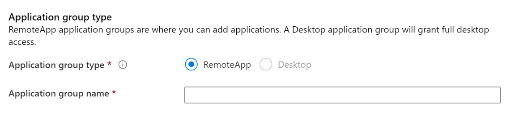
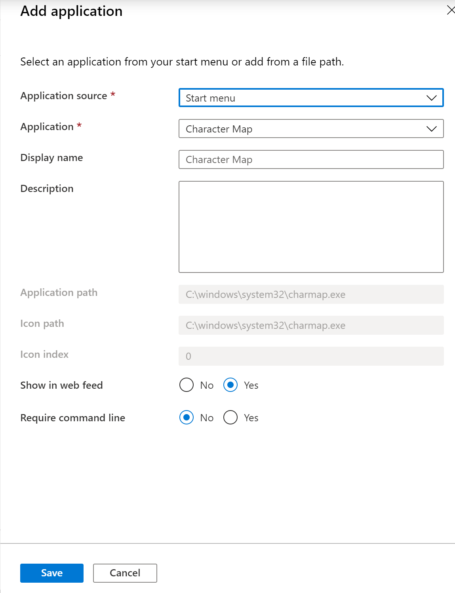
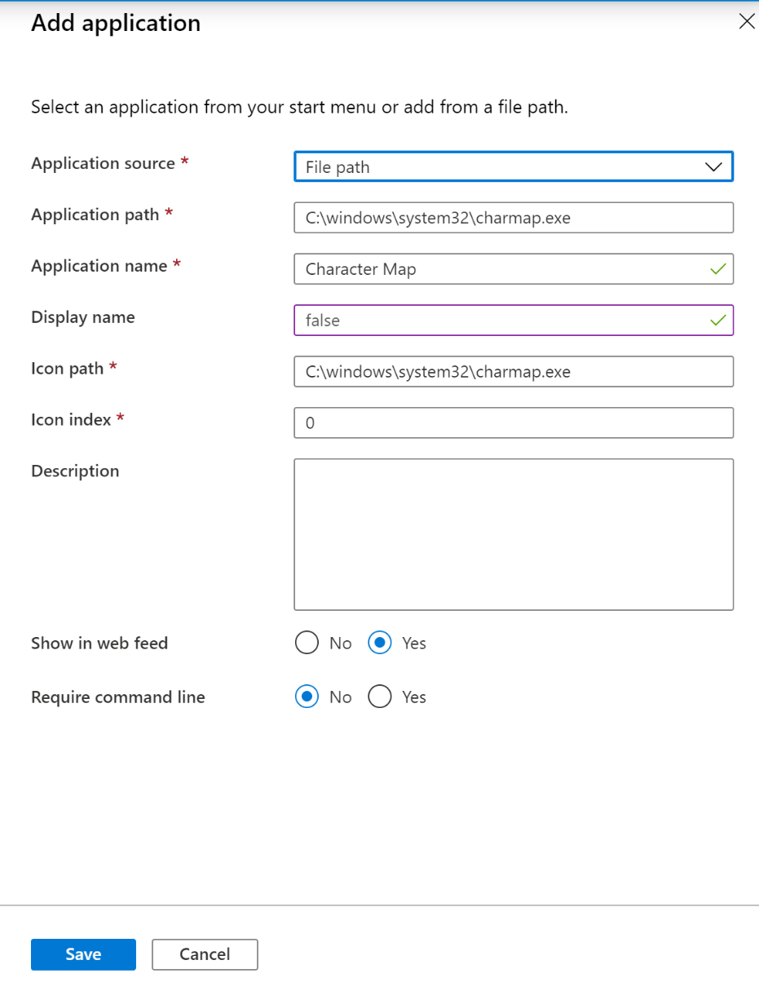
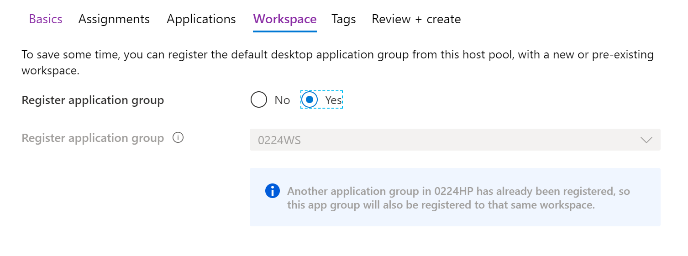

# Tutorial: Manage app groups with the Azure portal

>[!IMPORTANT]
>This content applies to the Spring 2020 update with Azure Resource Manager Windows Virtual Desktop objects. If you're using the Windows Virtual Desktop Fall 2019 release without Azure Resource Manager objects, see [this article](./virtual-desktop-fall-2019/manage-app-groups-2019.md).
>
> The Windows Virtual Desktop Spring 2020 update is currently in public preview. This preview version is provided without a service level agreement, and we don't recommend using it for production workloads. Certain features might not be supported or might have constrained capabilities. 
> For more information, see [Supplemental Terms of Use for Microsoft Azure Previews](https://azure.microsoft.com/support/legal/preview-supplemental-terms/).

The default app group created for a new Windows Virtual Desktop host pool also publishes the full desktop. In addition, you can create one or more RemoteApp application groups for the host pool. Follow this tutorial to create a RemoteApp app group and publish individual Start menu apps.

In this tutorial, learn how to:

> [!div class="checklist"]
> * Create a RemoteApp group.
> * Grant access to RemoteApp programs.

## Create a RemoteApp group

If you've already created a host pool and session host VMs using the Azure
portal or PowerShell, you can add application groups from the Azure portal with
the following process:

1.  Sign in to the [Azure portal](https://portal.azure.com/).

2.  Search for and select **Windows Virtual Desktop**.

3.  Select **Application Groups** in the menu on the left side of the page, then select **+ Add**.

4. On the **Basics** tab, select the subscription group and resource group you want to create the app group for. You can also choose to create a new resource group instead of selecting an existing one.

5. Select the host pool that will be associated with the application group from the drop-down menu next to **Host pool**.

    >[!NOTE]
    >You must select the host pool associated with the application group. App groups have apps or desktops that are served from a session host and session hosts are part of host pools. The app group needs to be associated with a host pool during creation.

    > [!div class="mx-imgBorder"]
    > 

6. If you want to add application groups to your host pool, select **Host pools** in the menu on the left side of the screen.
   
    Next, select the name of the host pool you want to add application groups to.
   
    After that, select **Application groups** from the menu on the left side of the screen, then select **+Add**.

    Finally, select the subscription group and resource group you want to create the app group in. You can either select the name of an existing resource group from the drop-down menu or select **Create new** to make a new one.

      >[!NOTE]
      >When you add application groups to your host pool, the host pool that's related to the application group is already selected because you navigated from it.
      > 
      > [!div class="mx-imgBorder"]
      >

7. Select **RemoteApp** under Application group type, then enter a name for your RemoteApp.

      > [!div class="mx-imgBorder"]
      > 

8.  Select the **Assignments** tab.

9.  To publish individual users or user groups to the app group, select **+Add Azure AD users or user groups**.

10.  Select the number of users you want to add the apps to. You can select single or multiple users and user groups.

     > [!div class="mx-imgBorder"]
     > 

11.  Select **Select**.

12.  Select the **Applications** tab, then select **+Add applications**.

13.  To add an application from the start menu: 

      - Go to **Application source** and select **Start menu** from the drop-down menu. Next, go to **Application** and choose the application from the drop-down menu.

     > [!div class="mx-imgBorder"]
     > 

      - In **Display name**, enter the name for the application that will be shown to the user on their client.

      - Leave the other options as-is and select **Save**.

14. To add an application from specific file path:

      - Go to **Application source** and select **File path** from the drop-down menu.

      - Enter the path to the application on the session host, registered with the associated host pool.

      - Enter the application's details in the **Application name**, **Display name**, **Icon path**, and **Icon index** fields.

      - Select **Save**.

     > [!div class="mx-imgBorder"]
     > 

     Repeat this process for every application you want to add to the application group.

15.  Next, select the **Workspace** tab.

16.  If you want to register the app group to a workspace, go to **Register application group** and select **Yes**. If you'd rather register the app group at a later time, select **No**.

17.  If you select **Yes**, you can select an existing workspace to register your app group to.
       
       >[!NOTE]
       >You can only register the app group to workspaces created in the same location as the host pool. Also. if you've previously registered another app group from the same host pool as your new app group to a workspace, it will be selected and you can't edit it. All app groups from a host pool must be registered to the same workspace.

     > [!div class="mx-imgBorder"]
     > 

18. Optionally, if you want to create tags to make your workspace easy to organize, select the **Tags** tab and enter your tag names.

19. When you're done, select the **Review + create** tab.

20. Wait a bit for the validation process to complete. When it's done, select **Create** to deploy your app group.

The deployment process will do the following things for you:

- Create the RemoteApp app group.
- Add your selected apps to the app group.
- Publish the app group published to users and user groups you selected.
- Register the app group, if you chose to do so.
- Create a link to an Azure Resource Manager template based on your configuration that you can download and save for later.

## Next steps

In this tutorial, you learned how to create an app group, populate it with RemoteApp programs, and assign users to the app group. To learn how to create a validation host pool, see the following tutorial. You can use a validation host pool to monitor service updates before rolling them out to your production environment.

> [!div class="nextstepaction"]
> [Create a host pool to validate service updates](./create-validation-host-pool.md)
