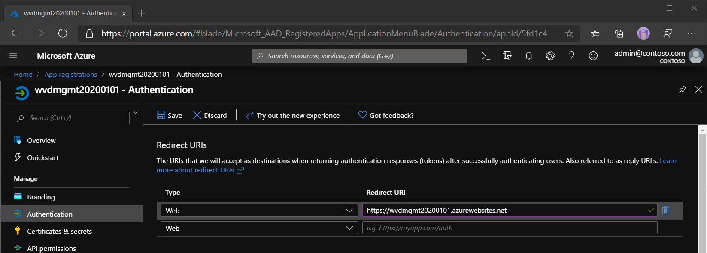

# Deploy a management tool using a service principal

The management tool provides a user interface (UI) for managing Microsoft Virtual Desktop resources. In these instructions, you'll learn how to deploy the management tool using a service principal and connect to the management tool.

## Important considerations

Since the app requires consent to interact with Windows Virtual Desktop, this tool doesn't support Business-to-Business (B2B) scenarios. Each Azure Active Directory (AAD) tenant's subscription will need its own separate deployment of the management tool.

This management tool is a sample. Microsoft will provide important security and quality updates. The [source code is available in GitHub](https://github.com/Azure/RDS-Templates/tree/master/wvd-templates/wvd-management-ux/deploy). Customers and partners are encouraged to customize the tool to fit their business needs.

To following browsers are compatible with the management tool:
- Google Chrome 68 or later
- Microsoft Edge 40.15063 or later
- Mozilla Firefox 52.0 or later
- Safari 10 or later (macOS only)

## What you need to run the Azure Resource Manager template

Before deploying the Azure Resource Manager template, you'll need an Azure Active Directory user to deploy the management UI. This user must:

- Have permission to create resources in your Azure subscription
- Have permission to create an Azure AD application. Follow these steps to check if your user has the [required permissions](https://docs.microsoft.com/azure/active-directory/develop/howto-create-service-principal-portal#required-permissions).

After deploying the Azure Resource Manager template, you'll want to launch the management UI to validate. This user must:
- Have a role assignment to view or edit your Windows Virtual Desktop tenant

## Create an Azure Active Directory app registration

This section will show you how to use PowerShell to create the Azure Active Directory app and assign the appropriate API permissions for it.

1. Open PowerShell as an Administrator.
2. Sign in to Azure with an account that has Owner or Contributor permissions on the Azure subscription you would like to use for the diagnostics tool:
   ```powershell
   Login-AzAccount
   ```
3. Sign in to Azure AD with the same account:
   ```powershell
   Connect-AzureAD
   ```
4. Go to the [RDS-Templates GitHub repo](https://github.com/Azure/RDS-Templates/tree/master/wvd-templates/wvd-management-ux/deploy/scripts) and run the **createWvdMgmtUxAppRegistration.ps1** script in PowerShell.
5.  When the script prompts you, enter the two parameters:
    - AppName: A unique name for the app registration, like "wvdmgmt20200101".
    - AzureSubscriptionId: The Azure subscription ID where the application will be registered and running.

After the script successfully runs, it should show the following things in its output:

-  A message that confirms your app now has a service principal role assignment.
-  Your **Client ID** and **Client Secret Key** that you'll need for when you deploy the management tool.

Now that you've registered your app, it's time to verify the app registration.

## Verify the app registration and provide consent

Before you continue deploying the management tool, we recommend that you verify that your Azure Active Directory application has API permissions. To make sure your app registration has the appropriate API permissions:

1. Open your internet browser and sign in to the [Azure portal](https://portal.azure.com/) with your administrative account.
2. From the search bar at the top of the Azure portal, search for **App registrations** and select the item under **Services**.
3. Select **All applications** and search for it using the unique app name you provided for the PowerShell script.
4. In the left panel, select **API permissions** to confirm that permissions were added.
5. If you are a global admin, select the button to and follow the dialog prompts to provide admin consent for your organization.
    

## Deploy the management tool

1. Go to the [GitHub Azure RDS-Templates page](https://github.com/Azure/RDS-Templates/tree/master/wvd-templates/wvd-management-ux/deploy).
2. Deploy the template to Azure.
    - If you're deploying in an Enterprise subscription, scroll down and select **Deploy to Azure**. See [Guidance for template parameters](#guidance-for-template-parameters).
    - If you're deploying in a Cloud Solution Provider subscription, follow these instructions to deploy to Azure:
        1. Scroll down and right-click **Deploy to Azure**, then select **Copy Link Location**.
        2. Open a text editor like Notepad and paste the link there.
        3. Right after <https://portal.azure.com/> and before the hashtag (#), enter an at sign (@) followed by the tenant domain name. Here's an example of the format: <https://portal.azure.com/@Contoso.onmicrosoft.com#create/>.
        4. Sign in to the Azure portal as a user with Admin/Contributor permissions to the Cloud Solution Provider subscription.
        5. Paste the link you copied to the text editor into the address bar.
3. When entering the parameters, do the following:
    - For the **isServicePrincipal** parameter, select **true**.
    - For the credentials, enter the **Client ID** and the **Client Secret Key** that displayed after running the PowerShell script for the app registration.
    - For the **applicationName**, use the unique app name that you entered for the app registration.
4. Once you provide the parameters, accept the terms and conditions and select **Purchase**.

## Set the Redirect URI
To set the Redirect URI:

1.  In the [Azure portal](https://portal.azure.com/), go to **App Services** and locate the application you created.
2.  Go to the **Overview** page and copy the **URL** you find there.
3.  Navigate to **App registrations** and select the app you want to deploy.
4.  In the left panel, select **Authentication**.
5.  Enter the desired Redirect URI into the **Redirect URI** text box, then select **Save** in the top-left corner of the menu.
6.  Select **Web** in the drop-down menu under Type.
7.  Enter the URL from the web app overview page.
    

## Update the API URL for the web application

This section will show you how to use PowerShell to update API URL in web application front end of mainbundle.js file:

1. Open PowerShell as an Administrator.
2. Sign in to Azure with an account that has Owner or Contributor permissions on the Azure subscription you would like to use for the diagnostics tool:
   ```powershell
   Login-AzAccount
   ```
3. Sign in to Azure AD with the same account:
   ```powershell
   Connect-AzureAD
   ```
4. Go to the [RDS-Templates GitHub repo](https://github.com/Azure/RDS-Templates/tree/master/wvd-templates/wvd-management-ux/deploy/scripts) and run the **updateWvdMgmtUxApiUrl.ps1** script in PowerShell.
5.  When the script prompts you, enter the two parameters:
    - AppName: The same name you in the first PowerShell script for the app registration, like "wvdmgmt20200101".
    - AzureSubscriptionId: The Azure subscription ID where the application will be registered and running.

You can now start using the management tool.

## Use the management tool

You can now access the management tool at any time. Follow these instructions to launch the tool:

1. In a web browser, enter the URL of the web app, for example <https://wvdmgmt20200101.azurewebsites.net>. If you do not remember it, sign in to Azure, find the app service you deployed, then click on the URL.
2. Sign in using your Windows Virtual Desktop credentials.
   > [!NOTE]
   > If you were unable to grant admin consent earlier in these steps, each user who logs in will be need to provide their own user consent to use the tool.
3. When prompted to choose a Tenant Group, select **Default Tenant Group** from the drop-down list.
4. When you select Default Tenant Group, a menu should appear on the left side of your window. In this menu, find the name of your tenant group and select it.

> [!NOTE]
> If you have a custom Tenant Group, enter the name manually instead of choosing from the drop-down list.

## Report issues

If you encounter any issues with the management tool or other Windows Virtual Desktop tools, follow the directions in [ARM Templates for Remote Desktop Services](https://github.com/Azure/RDS-Templates/blob/master/README.md) to report them on GitHub.

## Next steps

Now that you've learned how to deploy and connect to the management tool, you can learn how to use Azure Service Health to monitor service issues and health advisories.

* [Set up service alerts tutorial](./set-up-service-alerts.md)