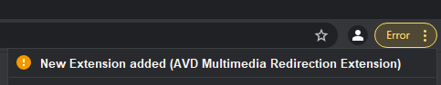
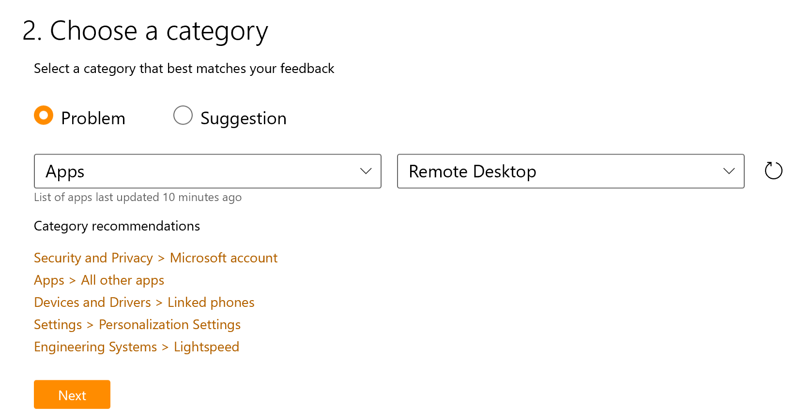
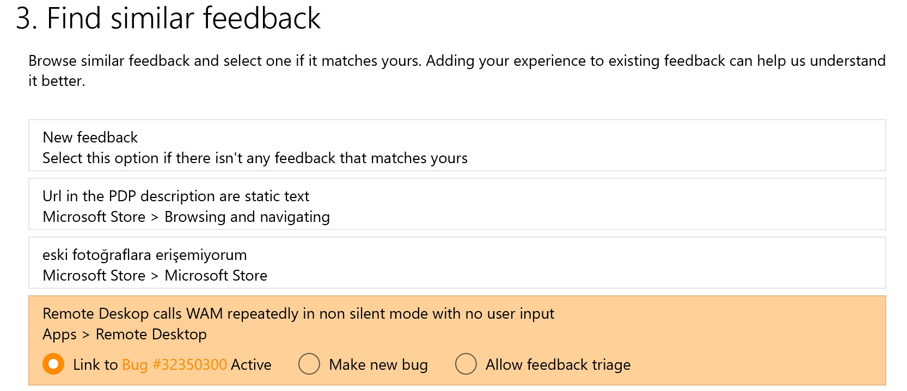
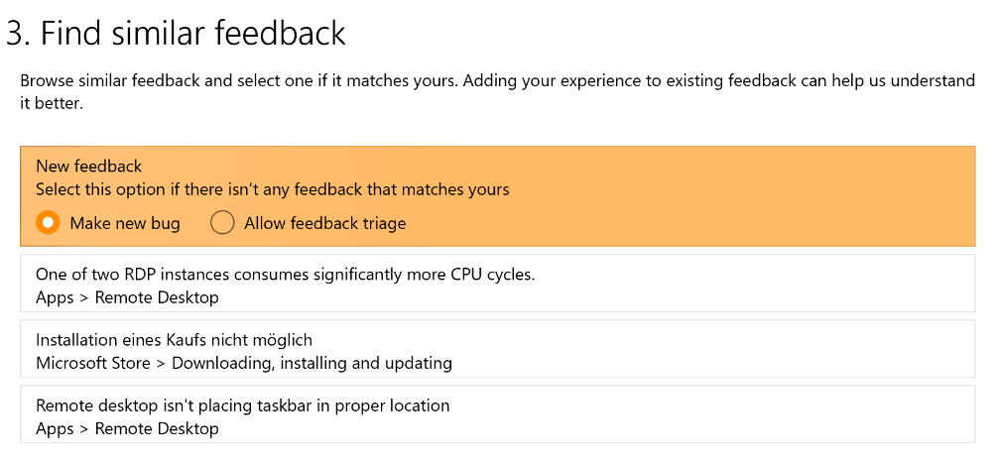

# Multimedia Redirection (MMR) on Azure Virtual Desktop (preview)

> [!IMPORTANT]
> Multimedia redirection for Azure Virtual Desktop is currently in preview.
> See the [Supplemental Terms of Use for Microsoft Azure Previews](https://azure.microsoft.com/support/legal/preview-supplemental-terms/) for legal terms that apply to Azure features that are in beta, preview, or otherwise not yet released into general availability.

>[!NOTE]
>Azure Virtual Desktop doesn't currently support multimedia redirection on Azure Virtual Desktop for Microsoft 365 Government (GCC), GCC-High environments, and Microsoft 365 DoD.
>
>Multimedia redirection on Azure Virtual Desktop is only available for the Windows Desktop client on Windows 10 machines. Multimedia redirection requires the Windows Desktop client, version 1.2.2222 or later.

Multimedia redirection (MMR) gives you smooth video playback while watching videos in your Azure Virtual Desktop browser. MMR remotes the media element from the browser to the local machine for faster processing and rendering. Both Microsoft Edge and Google Chrome support the MMR feature. However, the public preview version of MMR for Azure Virtual Desktop has restricted playback on YouTube, so you'll need to [enable an extension]() to test YouTube within your deployment.

## Requirements

Before you can use Multimedia Redirection on Azure Virtual Desktop, you'll need
to do these things:

1. [Install the Windows Desktop client](./user-documentation/connect-windows-7-10.md#install-the-windows-desktop-client) () on a Windows 10 or Windows 10 IoT Enterprise device that meets the [hardware requirements for Teams on a Windows PC](/microsoftteams/hardware-requirements-for-the-teams-app#hardware-requirements-for-teams-on-a-windows-pc/). Installing version 1.2.2222 or later of the client will also install the MMR plugin (MsMmrDVCPlugin.dll) on the client device. To learn more about updates and new versions, see [What's new in the Windows Desktop client](/windows-server/remote/remote-desktop-services/clients/windowsdesktop-whatsnew).

2. [Configure the client machine for the insider group](create-host-pools-azure-marketplace).

3. Install [the Multimedia Redirector service]() and any required browser extensions on the virtual machine (VM).

4. Configure the client machine to let your users access the Insiders program. To configure the client for the Insider group, set the following registry information:

   - **Key**: HKLM\\Software\\Microsoft\\MSRDC\\Policies
   - **Type**: REG_SZ
   - **Name**: ReleaseRing
   - **Data**: insider

   To learn more about the Insiders program, see [Windows Desktop client for admins](/windows-server/remote/remote-desktop-services/clients/windowsdesktop-admin#configure-user-groups).

5. Use [the MSI installer (MsMmrHostMri)]() to install the MMR extensions on your Azure VM for your internet browser. MMR for Azure Virtual Desktop currently only supports Microsoft Edge and Google Chrome.

## Managing group policies for the MMR browser extension

Using the MMR MSI will install the browser extensions. However, as this service is still in public preview, user experience may vary. For more information about known issues, see [Known issues](#known-issues-and-limitations).

In some cases, you can change the group policy to manage the browser extensions and improve user experience. For example:

- You can install the extension without user interaction.
- You can restrict which websites use MMR.
- You can pin the MMR extension icon in Google Chrome by default (the extension is already pinned by default in Microsoft Edge).

### Configure Microsoft Edge group policies for MMR

To configure the group policies, you'll need to edit the Microsoft Ege Administrative Template. You should see the extension configuration options under **Administrative Templates Microsoft Edge Extensions** > **Configure extension management settings**.

The following code is an example of a Microsoft Edge group policythat fores installation of the MMR extension and only lets MMR load on YouTube:

```cmd
{ "joeclbldhdmoijbaagobkhlpfjglcihd": { "installation_mode": "force_installed", "runtime_allowed_hosts": [ "*://*.youtube.com" ], "runtime_blocked_hosts": [ "*://*" ], "update_url": "https://edge.microsoft.com/extensionwebstorebase/v1/crx" } }
```

To learn more about group policy configuration, see [Microsoft Edge group policy](/DeployEdge/configure-microsoft-edge).

### Configure Google Chrome group policies for MMR

To configure the Google Chrome group policies, you'll need to edit the Google Chrome Administrative Template. You should see the extension configuration options under **Administrative Templates** > **Google** > **Google Chrome Extensions** > **Extension management settings**.

The following example is much like the code example in [Configure Microsoft Edge group policies for MMR](#configure-microsoft-edge-group-policies-for-mmr). This policy will force the MMR extension to install with the icon pinned in the top-right menu, and will only allow MMR to load on YouTube.

```cmd
{ "lfmemoeeciijgkjkgbgikoonlkabmlno": { "installation_mode": "force_installed", "runtime_allowed_hosts": [ "*://*.youtube.com" ], "runtime_blocked_hosts": [ "*://*" ], "toolbar_pin": "force_pinned", "update_url": "https://clients2.google.com/service/update2/crx" } }
```

Additional information on configuring [Google Chrome group policy](https://support.google.com/chrome/a/answer/187202#zippy=%2Cwindows).

## Run the MMR extension manually on a browser

MMR uses remote apps and the session desktop for Microsoft Edge and Google Chrome browsers. Once you've fulfilled [the requirements](#requirements), open your supported browser. If you didn't install the browsers or MMR extension with a group policy, users will need to manually run the extension. This section will tell you how to manually run the extension in one of the currently supported browsers.

### Microsoft Edge

To run the extension on Microsoft Edge manually, look for the yellow exclamation mark on the overflow menu. You should see a prompt to enable the Azure Virtual Desktop Multimedia Redirection extension. Select **Enable extension**.

### Google Chrome

To run the extension on Google Chrome manually, look for the notification message that says the new extension was installed, as shown in the following screenshot. 



Select the notification to allow your users to enable the extension. Users should also pin the extension so that they can see from the icon if MMR is connected.

Once the extensions have been enabled head over to YouTube and enjoy some smooth video playback.

### The MMR status icon

To quickly tell if MMR is active in your browser, we've added the following icon states:

| Icon State  | Definition  |
|-----------------|-----------------|
| [The default Azure Virtual Desktop program icon with no status applied.](/media/icon-default.png) | This is the default icon appearance with no status applied. |
| [The Azure Virtual Desktop program icon with a red square with an x that indicates MMR isn't working.](/media/icon-disconnect.png) | The red square with an "X" inside of it means that the client wasn't able to connect to MMR. |
| [The Azure Virtual Desktop program icon with a green square with a check mark inside of it, indicating that MMR is working.](/media/icon-connect.png) | The green square with a check mark inside of it means that the client successfully connected to MMR. |

Selecting the icon will display a pop-up menu that has a checkbox you can select to enable or disable MMR on all websites. It also lists the version numbers for each component of the service.

## Send feedback during public preview

If you run into any issues, please tell us in the feedback hub on both the client and VM host.

To send us feedback:

1. Open the **feedback hub** on both the client and server.

2. Select **Report a problem**.

3. Use the same title on both issue reports, but specify where you're submitting the report from by putting either "[Client]" or "[Host]" at the beginning.

    For example, if you're submitting an issue from the client, you'd format it like this:

    >[Client] Title of your report

    If you're submitting an issue from the host, you'd format it like this:

    >[Host] Title of your report

4. In the **Explain in more detail** field, describe the issue you're experiencing. We recommend also including the URL of the video you were watching when the issue happened.

5. Once you're done, select **Next**.

6. Select the **Problem** bubble, then select **Apps** and **Remote Desktop** from the two drop-down menus, as shown in the following screenshot.

    

7. Select **Next**.

8. Check to see if there's a similar issue in the list to the one you plan to submit.
   
   - If a bubble appears that links to an active bug, make sure the bug's description matches the issue you're reporting. If it does, select the bubble, then select **Link to bug**, as shown in the following screenshot.

    

    - If you don't see a similar issue, select **Make new bug**.

    

9. Select **Next**.

10. In the **Add more details** window, select **Include data about Remote Desktop (Default)**, then answer all questions with as much detail as possible.

    If you'd like to add a video recording of the issue, select **Include data about Remote Desktop (Default)**, then select the **Start recording** button. While recording, open Remote Desktop and do the process that led to the issue happening. When you're done, return to the browser, then test the video to make sure it recorded properly.

    Once you're done, agree to send the attached files and diagnostics to Microsoft, then select **Submit**.

### Known issues and limitations

The following issues are ones we're already aware of, so you won't need to report them:

- MMR only works on the Windows Desktop client, not the web client.

- MMR doesn't currently support protected content, so videos from Pluralsight and Netflix won't work.

- During public preview, MMR will be disabled on all sites except YouTube. However, if you have the extension, you can enable MMR for all websites. We added the extension so organizations can test the feature on their company websites.

- There's a small chance that the MSI installer won't be able to install the extension during internal testing. If this happens, you'll need to install the MMR extensions from the Microsoft Edge Store or Google Chrome Store.

    - [MMR browser extension (Microsoft Edge)](https://microsoftedge.microsoft.com/addons/detail/wvd-multimedia-redirectio/joeclbldhdmoijbaagobkhlpfjglcihd)
    - [MMR browser extension (Google Chrome)](https://chrome.google.com/webstore/detail/wvd-multimedia-redirectio/lfmemoeeciijgkjkgbgikoonlkabmlno)

- Installing the MMR extensions on host machines with the MSI installer will either prompt users to accept the extension on first run or display a warning or error message. If users deny this prompt, it can cause the extensions not to load. To avoid this, install the extensions by [editing the group policy](#managing-group-policies-for-the-mmr-browser-extension).

- When you resize the video window, the window's size will adjust faster than the video itself. You'll also see this issue when miniizing and maximizing the window. 

## Next steps

If you're interested in video streaming on other parts of Azure Virtual Desktop, check out [Teams for Azure Virtual Desktop](teams.md).
