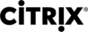
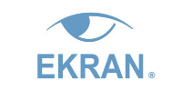
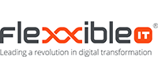
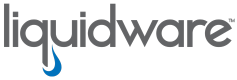
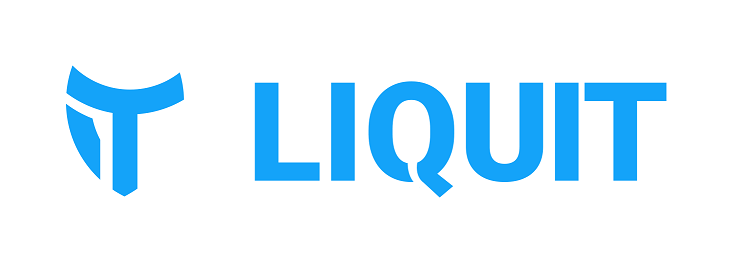
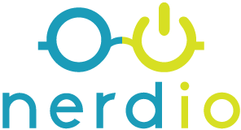
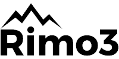
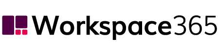

# Windows Virtual Desktop partner integrations

This article lists approved partner providers and independent software vendors for Windows Virtual Desktop.

## Citrix

Citrix is an approved provider that offers enterprises centralized hybrid management of virtual apps and desktops workloads in Azure, side by side with on-premises deployments. Citrix Workspace with the Virtual Apps and Desktops service allows users to access apps and desktops from any device, leveraging the advanced Citrix HDX protocol to deliver a high definition experience from anywhere.

Citrix extends the value of Windows Virtual Desktop with robust enterprise tools to improve user density and performance, provision workloads on demand, and simplify image and application management. IT can optimize costs with intelligent scaling tools, while delivering an incredible user experience that's field-tested against the toughest applications across industries. Additionally, Citrix Managed Desktops is a Windows Virtual Desktop-enabled desktops-as-a-service program that provides a simple, cloud-based management solution for delivering virtual apps and desktops to any device.

- [Go to the partner website](https://more.citrix.com/wvd).

## VMware

VMware Horizon Cloud on Microsoft Azure is a native cloud service that lets organizations quickly deploy remote desktops and applications from their existing Microsoft Azure subscriptions while leveraging all the features of VMware Horizon. Horizon Cloud uses the Horizon Control Plane to provide a single management interface for all Horizon environments, on-premises or in the cloud. This enables hybrid desktop virtualization and lets customers move their workloads to Azure at their own pace.

As a Windows Virtual Desktop approved provider, VMware can help customers that want to use Windows Virtual Desktop while still enjoying the additional functionality that comes with VMware Horizon, such as integrated and easy-to-use power management, cloud-based monitoring, and the Blast Extreme protocol. These features adapt to changing network conditions on the fly to provide a consistently excellent user experience. VMware Horizon Cloud also comes with VMware App Volumes and Dynamic Environment Manager, which add advanced application and user environment management capabilities that work with MSIX app attach and FSLogix.

- [Go to the partner website](https://www.vmware.com/products/horizon-cloud-virtual-desktops.html).
- [Read VMWare Horizon Cloud technical documentation](https://techzone.vmware.com/mastering-horizon-cloud-microsoft-azure).

## 10ZiG

10ZiG Technology, with cutting-edge Thin and Zero Client hardware and software, is a longstanding partner with Microsoft and a dedicated Microsoft Azure and Windows Virtual Desktop partner. 10ZiG Windows 10 IoT-based Thin Clients are powerful, reliable, and affordable endpoints for all Windows Virtual Desktop multi-users. 10ZiG Manager Software provides exceptional management and deployment without license limitations at no additional cost. The 10ZiG Tech Team, Advance Warranty Program, and no-hassle demos are a one-stop Windows Virtual Desktop multi-session support solution in the cloud.

10ZiG's world-market leadership in Thin and Zero Client endpoint devices and management software for virtual desktops is exemplified by how they work for their customers. Its Thin Client hardware comes with thoughtfully constructed benefit features and options designed to ensure customers receive the right Client devices based on their needs. 10ZiG customizes its devices to fit into customer environments with Windows-based and Linux-based Clients that provide the best possible performance in virtual desktops, both inside and outside the cloud.

- [Go to the partner website](https://www.10zig.com/).

## Cloudhouse

Cloudhouse is a Windows Virtual Desktop value-added services provider that offers customers a turnkey application migration service that can move all applications, including ones that are incompatible with modern Windows operating systems, to the Windows Virtual Desktop environment, allowing customers to truly leverage multi-session Windows 10. 

By leveraging proven Cloudhouse containerization technology, the Cloudhouse service takes all applications, including ones designed for Windows XP, Windows 7, or Windows 8, and deploys them to a modern Windows Virtual Desktop without needing to change code or impact user experience. Cloudhouse further adds to the value of Windows Virtual Desktop by isolating applications from the underlying operating system, allowing Windows Servicing updates to be rolled out without affecting the containerized application. 

- [Go to the partner website](https://cloudhouse.com/resources/migrate-everything-to-windows-10-on-microsoft-windows-virtua).

## CloudJumper

CloudJumper is a Windows Virtual Desktop value-added services provider that equips solution providers and enterprise IT with software to  provision and manage Windows Virtual Desktop environments holistically. With CloudJumper software, IT can manage every layer of a Windows Virtual Desktop deployment. Delivery of workloads and applications is automated, ensuring that users can quickly access their desktop anywhere on any device.

CloudJumper's software, Cloud Workspace Management Suite extends the value of Windows Virtual Desktop by simplifying deployment and ongoing administration tasks in Azure. From a single pane of glass, IT can provision, manage, and optimize infrastructure for user workspaces. CloudJumper's Simple Script Triggering Engine integrates with IT service platforms to automate tasks involved in provisioning Windows Virtual Desktop. Additionally, CloudJumper APIs allow further extensibility and integration with other enterprise systems like ServiceNow and BMC Ready.

- [See the joint solution brief](https://query.prod.cms.rt.microsoft.com/cms/api/am/binary/RE3p0Mg).
- [Go to the partner website](https://cloudjumper.com/wvd/).

## ControlUp

ControlUp is a Windows Virtual Desktop value-added services provider that enables IT teams to monitor, troubleshoot, analyze, and directly remediate problems in their on-premises, hybrid cloud, and cloud infrastructure in real time from a single console. ControlUp's analytics and management platform also allows IT to proactively automate fixes for a rapidly growing set of use cases.

When used with Windows Virtual Desktop, ControlUp provides additional capabilities to optimize Windows Virtual Desktop environments and the end-user experience. From the ControlUp console, IT gets end-user environment visibility to effectively monitor and troubleshoot performance issues. An intuitive dashboard provides insights and analytics for virtual desktop deployments, as well as options for automated reporting enriched with community benchmarks. ControlUp can manage multiple data sources and types, organizing them in high-performance data sets aggregated across compute, storage, and Windows Virtual Desktop infrastructure, allowing granular visibility from a single pane of glass.

- [See the joint solution brief](https://query.prod.cms.rt.microsoft.com/cms/api/am/binary/RE3PUit).
- [Go to the partner website](https://www.controlup.com/solutions/ms_wvd/).

## Dell

Dell Technologies' thin clients are optimized to access Microsoft Azure and Windows Virtual Desktop services. Capable of meeting the needs from collaborative knowledge workers up to graphics-intensive power users, Wyse thin clients deliver a high-quality computing experience to take full advantage of the growing number of apps and content. Ideal for space-constrained environments, Wyse thin clients adapt to the way people work with versatile form factors and a wide array of choices for mounting options.

Wyse thin clients are designed with security in mind with limited attack surface, support for security compliance standards, and advanced multi-factor authentication solutions. Deploy highly secure thin clients with Dell-exclusive Wyse ThinOS, or experience secure access to cloud applications and virtual workspaces from hardened Wyse ThinLinux with a commercial proven design and Windows 10 IoT Enterprise with Dell-added security features. With secure, HTTPS-based communications and active directory authentication for role-based administration, Wyse Management Suite keeps Wyse endpoints always up to date, and the mobile app for WMS Pro allows IT to view critical alerts and send real-time commands with one tap at any time.

- [Go to the partner website](https://www.delltechnologies.com/en-us/wyse/index.htm#scroll=off&overlay=//www.dellemc.com/en-us/collaterals/unauth/brochures/products/thin-clients/Wyse_Windows_Embedded_Standard_thin_clients_brochure.pdf).

## deviceTRUST

deviceTRUST is a Windows Virtual Desktop value-added services provider that contextualizes the corporate enterprise. It allows users the freedom to access their Windows Virtual Desktop from any location, on any device, over any network, while giving IT departments the information and control they need to meet their governance requirements. 

deviceTRUST extends the value of Windows Virtual Desktop with their contextual security technology. deviceTRUST enables conditional access for a secure Windows Virtual Desktop access, conditional application access within Windows Virtual Desktop and to apply conditional Windows Virtual Desktop policies without any additional infrastructure. Using deviceTRUST enables a mobile, flexible workspace that meets all security, compliance, and regulatory requirements. 

- [Go to the partner website](https://devicetrust.com/wvd).

## Ekran System

Ekran System is a Windows Virtual Desktop value-add partner that lets IT teams monitor all remote user activity on Microsoft Azure virtual machines. With Ekran System, you can record on-screen activity for every user session in published applications or virtual desktops while collecting a wide range of context-rich metadata, such as application names, active window titles, visited URLs, and keystrokes. Advanced features offer in-depth visibility and quick incident response times, making Ekran System an efficient insider threat management and compliance solution.  

The unique floating endpoint licensing of Ekran System clients is automated to support dynamically changing virtual desktops. Ekran System lets you automatically unassign licenses from deleted non-persistent virtual desktops and remove them from your database. Ekran System seamlessly integrates with Azure Active Directory and Azure Sentinel.

- [See the joint solution brief](https://query.prod.cms.rt.microsoft.com/cms/api/am/binary/RE4yqY8).
- [Go to the partner page](https://www.ekransystem.com/product/supported-platforms/windows-virtual-desktop-monitoring).

## Flexxible IT

Flexxible IT is a Windows Virtual Desktop value-add partner that offers organizations the ability to rapidly scale, monitor, and efficiently manage Windows Virtual Desktop and Citrix Workspace infrastructure. Flexxible|SUITE allows IT admins to intelligently provision and manage Windows Virtual Desktop workloads on-premises and hosted in Azure.
 
Flexxible IT's technology extends the value of both native Windows Virtual Desktop and Citrix Workspace by automating common processes to simplify infrastructure configuration, desktop provisioning, and day-to-day management. With no need for complex PowerShell scripts or time-consuming manual processes, SUITE provides scalable desktop deployment, extensive monitoring and reporting, and secure delegated management. These features allow you to focus on delivering enhanced levels of service and a quality Windows Virtual Desktop experience for your users.

- [See the joint solution brief](https://query.prod.cms.rt.microsoft.com/cms/api/am/binary/RE4yj7A).
- [Go to the partner website](https://www.flexxible.com/suite-for-windows-virtual-desktop).

## HP

HP Thin Client is an approved and verified partner of Microsoft's Azure and Windows Virtual Desktop services. HP Thin Clients with Windows 10 IoT Enterprise offer out-of-box support for Azure-based workloads and Windows Virtual Desktop hosted desktops. The hardware and OS are optimized to provide a best-in-class experience that effectively delivers remote workloads while reducing the OS footprint, hardware, and maintenance costs.

As HP looked at industry trends, customer challenges, and the solutions virtualization offered during the development process, they were inspired to invent the ideal cloud endpoint using a four-pillar value proposition: design, manageability, security, and versatility. Every HP Thin Client is purpose-built with IT decision makers in mind. HP Thin Clients are long-lasting, secure, easy to deploy and manage, and powerful so you can effortlessly transition to VDI or cloud computing. HP's versatile portfolio gives you the freedom to choose the modern endpoint solution that's right for you.

- [Go to the partner website](https://hp.com/go/thin).

## IGEL

IGEL is an approved and verified partner of Microsoft Azure and Windows Virtual Desktop services. IGEL offers IGEL OS, the next-gen edge OS for cloud workspaces designed to access virtual apps, desktops, and cloud workspaces from one or more user devices with a lightweight, simple, and secure Linux-based endpoint. A platform-independent software solution, IGEL OS and its server-based management and control software, IGEL Universal Management Suite (UMS), comprise an endpoint management and control solution that frees enterprises to take full advantage of Azure-based cloud instances and Windows Virtual Desktop desktops, including economical multi-session Windows Virtual Desktop, while reducing endpoint hardware and endpoint device management and operations costs.
 
IGEL OS supports all popular virtual apps, desktops, and cloud workspace client protocols from Citrix, Microsoft, and VMware. It includes integrated technologies from 85 peripheral, interface, and protocol partners to help organizations quickly adopt Windows Virtual Desktop services into their own unique user environments. IGEL OS is a read-only, modular endpoint OS, which helps protect it from tampering. It now also includes a complete "chain of trust" that verifies the integrity of all key major processes running on the endpoint, from the endpoint hardware (some selected models) or UEFI process all the way to the Azure cloud and Windows Virtual Desktop services. With IGEL OS, enterprises can subscribe to Windows Virtual Desktop from the Azure cloud with full confidence in the integrity, security, and manageability of their users' endpoint devices.

- [See the joint solution brief](https://query.prod.cms.rt.microsoft.com/cms/api/am/binary/RE4vviO).
- [Go to the partner website](https://www.igel.com/igel-os-universal-desktop-operating-system/).

## Ivanti

Ivanti User Workspace Manager is a Windows Virtual Desktop value-added service that eases desktop deployment and management by separating user data from the desktop for seamless portability. With Ivanti, users can deliver complex projects like migrating to Windows 10, adopting Office 365, or moving services to the cloud faster. 

When used with Windows Virtual Desktop, Ivanti User Workspace Manager provides simple contextual management of the user desktop experience, eliminating long sign-in times and eradicating group policy nightmares. Ivanti User Workspace Manager out-of-the-box templates simplify installation for users through agents and the existing console. Ivanti User Workspace Manager delivers responsive, secure desktops that users love, saving money on servers, managing users more effectively, and reducing endpoint security risk. 

- [Go to the partner website](https://www.ivanti.com/products/user-workspace-manager).

## Lakeside Software

Lakeside Software is a Windows Virtual Desktop value-added services provider that equips IT teams with software for monitoring performance and assessing Azure migration readiness of user workloads. With this software, IT gains clearer visibility into application usage and resource consumption to streamline the migration process. Lakeside Software collects data at every workspace to create a comprehensive report on user environments, enabling quick troubleshooting and optimization of assets.

Lakeside Software's digital experience monitoring solution, SysTrack, can help provide a great user experience by tracking performance and identifying ideal workloads for migration. SysTrack works to extend the value of Windows Virtual Desktop through right-sizing assessments and continuous monitoring of user environments.

- [See the joint solution brief](https://query.prod.cms.rt.microsoft.com/cms/api/am/binary/RE3oL8Q).
- [Go to the partner website](https://www.lakesidesoftware.com/assessments/wvd).

## Liquidware

Liquidware is a Windows Virtual Desktop value-added services provider that delivers software that manages and optimizes Windows Virtual Desktop deployment. The Liquidware Essentials suite provides application delivery through layering, user environment management, and key user experience visibility and diagnostics. With solutions for assessing migration readiness and analyzing usage metrics, Liquidware provides a seamless virtual desktop experience for end users.

Liquidware Essentials extends the value of Windows Virtual Desktop by efficiently harvesting user profiles and gathering key user data to streamline migration of user environments to Azure. Additionally, Liquidware Essentials simplifies image management by unifying user profiles and layering apps based on configurable rights management settings.

- [See the joint solution brief](https://query.prod.cms.rt.microsoft.com/cms/api/am/binary/RE3oSY1).
- [Go to the partner website](https://www.liquidware.com/solutions/solutions-platform/microsoft).

## Liquit

Liquit application aggregation and delivery software enables enterprises and service providers to connect to and combine with all workspace back-ends (Citrix, VMWare, Windows Virtual Desktop, RDP, and Legacy) and deliver a customized and consistent customer experience, regardless of where the customer's applications reside. When a customer publishes the smart icon, Liquit decides where to start the application based on the customer's location, device, and profile rights.

As a certified integration partner, Liquit helps accelerate transition to the cloud without a rip-and-replace delay. Windows Virtual Desktop can easily connect to an existing environment, create a workspace, and deliver the desktop. You can then take your time migrating off of old platforms and make changes on the back-end without your users noticing. Gain a consistent end-user experience, flexible infrastructure, and maintain control of your applications no matter where they are.

- [See the joint solution brief](https://query.prod.cms.rt.microsoft.com/cms/api/am/binary/RE4yol8).
- [Go to the partner website](https://www.liquit.com/wvd/).

## Login VSI

Login VSI is a Windows Virtual Desktop value-added services provider and Microsoft partner delivering software for application performance testing in Windows Virtual Desktop environments. Customers moving their on-premises business services to Windows Virtual Desktop use Login VSI Enterprise Edition to evaluate and maintain optimal performance, scalability, and availability of Windows 10  Enterprise multi-session, Windows 10 Enterprise, and Windows 7 enabled with their business critical applications.

- [Go to the partner website](https://www.loginvsi.com/use-cases-initiatives/windows-virtual-desktop).

## Nerdio

Nerdio is an Azure IT automation platform that makes it easy to deploy and manage Windows Virtual Desktop. Nerdio provides the knowledge and technology to deploy, price, package, manage, and optimize customers' Azure deployments—with Windows Virtual Desktop front-and-center.

Nerdio extends the value of Windows Virtual Desktop by making it easy to provision Azure resources and streamline deployment. With Nerdio for Azure, IT can automatically deploy and manage a complete Azure environment, including Windows Virtual Desktop, in under two hours.

- [See the joint solution brief](https://query.prod.cms.rt.microsoft.com/cms/api/am/binary/RE3p0Mh).
- [Go to the partner website](https://getnerdio.com/windows-virtual-desktop/).

## Numecent

Numecent is a Windows Virtual Desktop value-added services provider that significantly reduces the total operating costs through rapid onboarding and migration of complicated or incompatible Windows apps in Windows Virtual Desktop environments. Numecent also minimizes the amount of configuration that users need to do, reduces application updates, and simplifies complex processes. Because Numecent Cloudpaging supports more applications seamlessly than any other application delivery tool, it reduces time and IT workloads in environments with a diverse set of applications. 

When used with Windows Virtual Desktop, Cloudpaging further reduces costs by completing software asset lifecycle from deployment to upgrading, metering, and removing applications. Cloudpaging simplifies image management by dynamically provisioning apps as needed in real time to the Windows Virtual Desktop deployments. Cloudpaging helps applications run without administration or intervention through the periodic Windows 10 updates. Cloudpaging also reduces the licensing cost of expensive applications by enabling more efficient deployment and usage of these applications. 

- [Go to the partner website](https://www.numecent.com/partners/cloudpaging-for-windows-applications-windows-virtual-desktop/).

## PolicyPak

PolicyPak Software is a Windows Virtual Desktop partner that performs total settings management for applications, desktop, browsers, Java, and security settings. PolicyPak keeps your desktop, system, and security settings in compliance. PolicyPak enhances the value of Windows Virtual Desktop by adding a suite of components to enhance Windows' built-in administration. Use your existing Active Directory Group Policy and/or Windows Intune to deliver PolicyPak's settings and increase administrators' ability to manage their Windows 10 machines. 

The top use cases for PolicyPak are to remove local admin rights and overcome UAC prompts, block Ransomware, manage multiple browsers, manage Internet Explorer's Enterprise and Compatibility modes, reduce the number of GPOs, manage Windows 10 File Associations, manage Windows 10 Start Menu and Taskbar, and manage Windows 10 Features and Optional features.  

- [See the joint solution brief](https://query.prod.cms.rt.microsoft.com/cms/api/am/binary/RE4vviN).
- [Go to partner website](https://www.policypak.com/integration/policypak-windows-virtual-desktop.html).

## PrinterLogic

PrinterLogic is a Windows Virtual Desktop value-added service provider platform that empowers IT professionals to eliminate all print servers and deliver a highly available serverless printing infrastructure. PrinterLogic extends the value of Windows Virtual Desktop and Azure by making it easy to manage centrally and deploy printer objects to any printer or endpoint OS. 

Available as SaaS or as a web stack in your own private cloud, the PrinterLogic platform ensures users always have the right printers they need in their virtual sessions based on user ID, device name, or location. This functionality is complemented by a full suite of enterprise print management features such as print tracking and reporting, mobile printing, and secure badge release printing. 

- [Go to partner website](https://www.printerlogic.com).

## Printix

Printix is a Windows Virtual Desktop value-added service provider that automates user connection to office printing resources. As the missing piece in your customer Azure migration, Printix is the most cost-effective service available to remove infrastructure and IT tasks associated with supporting and optimizing print workflow for every user, regardless of location.

Printing is a fundamental task in just about every office and small business environment. In order to take full advantage of Windows Virtual Desktop and provide a great user experience, it's essential to ensure your users can connect to printers with minimum effort and maximum reliability. With Printix, you can get the most out of Windows Virtual Desktop through single sign-on (SSO), silent configuration, regular updates, and continuous monitoring of your print environment.

- [See the joint solution brief](https://query.prod.cms.rt.microsoft.com/cms/api/am/binary/RE4aiK2).
- [Go to the partner website](https://www.printix.net/printix-for-windows-virtual-desktop).

## RDPSoft

RDPSoft is a Windows Virtual Desktop partner that provides powerful and inexpensive monitoring, management, and reporting solutions. Their Remote Desktop Commander offerings allow IT professionals to gain insight into the health, performance, user activity, licensing, and security of their Windows Virtual Desktop deployments. 
 
RDPSoft's Remote Desktop Commander solutions enhance Windows Virtual Desktop administration. Premium Management features simplify delegation of Windows Virtual Desktop management tasks to support desk staff by providing remote assistance, user session, and process management. At the same time, the Remote Desktop Commander Suite collects rich metrics about per-user performance and load, user activity and auditing, Windows Virtual Desktop connection quality (latency and bandwidth), licensing, and security into a central Azure SQL database instance for review. With RDPSoft, rich historic reporting and comprehensive dashboards are just a click away.

- [Go to the partner website](https://www.rdpsoft.com/products/remote-desktop-commander/suite/).

## Rimo3

Rimo3 enhances the Windows Virtual Desktop experience by accelerating deployment and improving ongoing change management. Rimo3 equips IT teams with the knowledge they need to support your application portfolio for Azure migration readiness of application workloads. Users can onboard applications and test them in their target Windows Virtual Desktop workspace quickly and painlessly. Users can also proactively understand the impact of any changes as their organization rolls out new applications and updates. Finally, IT admins can leverage Rimo3's Intelligent Smoke Testing capability and automate functionality testing without interrupting user sessions.

Rimo3 offers an easy-to-use, scalable, automated application testing platform. This platform includes capabilities for all three application testing fundamentals: compatibility, functionality, and performance. It allows organizations, leaders, and teams to improve business continuity, adopt change faster, and optimize user experience.

- [See the joint solution brief](https://query.prod.cms.rt.microsoft.com/cms/api/am/binary/RE4yj7B).
- [Go to the partner website](https://rimo3.com/outcomes/).

## sepago

sepago was founded in 2002 by four friends in Cologne. Today, sepago is an IT management consultancy with a steadily increasing number of sepagists, with locations throughout Germany in Cologne, Munich, and Hamburg. sepago are experts on automated application provisioning, virtualization, cloud solutions, and IT security. sepago supports medium-sized and large companies on their way to digital transformation and ensure that users can work securely and efficiently.

sepago's innovation and development lab builds smart solutions using big data and AI technologies. These solutions focus on improving the business, user experience, and administrations of partner products like Windows Virtual Desktop.

- [See the joint solution brief](https://query.prod.cms.rt.microsoft.com/cms/api/am/binary/RE4qMsm).
- [Go to the partner website](https://www.sepago.de/en/).

## ThinPrint

ThinPrint is a Windows Virtual Desktop value-added services provider that delivers simple and secure cloud printing from Windows Virtual Desktop. With its services and software, existing print infrastructure can be utilized to print documents from the cloud. ThinPrint enables connection to both local and network printers, making it easy for users to print while at the office or working remotely.

ThinPrint's ezeep solution extends the value of Windows Virtual Desktop by enabling the connection to existing enterprise print infrastructure. ezeep gives users control over printing in the enterprise no matter where they are. Using ezeep, users can bridge the gap between Windows Virtual Desktop and printing hardware.

- [See the joint solution brief](https://query.prod.cms.rt.microsoft.com/cms/api/am/binary/RE3oYas).
- [Go to partner website](https://www.ezeep.com/wvd-printing).

## Tricerat

Tricerat offers a superior print management solution for Windows Virtual Desktop and other desktop platforms. Tricerat software has robust functionality, offering a better experience for both users and administrators. Administrators gain efficiencies through complete driver management, simplified deployment of print queues, and consistent management across hybrid platforms. User experience improves with shorter sign-in times, intelligent print queues based on user, device, and network location, and self-service options for quick printer selection. 

With Tricerat, printing is seamless in Windows Virtual Desktop and beyond. Tricerat software allows administrators to easily connect on-premises printers to the cloud, extending enterprise print management from traditional environments to new, modern workspaces.

- [Go to the partner website](https://www.tricerat.com/microsoft-printing).

## vast limits

vast limits, the uberAgent company, provides visibility in Windows Virtual Desktop deployments. It creates software for enterprise IT because it knows how IT professionals think and which tools they need. Its products help IT pros be more efficient by giving them exactly what they need to get their jobs done; no more, no less.

uberAgent is a monitoring and analytics product designed for end-user computing that doesn't just collect data—it gives customers the information that matters. uberAgent has its own metrics, covering key aspects of user experience, application performance, and endpoint security, telling you everything you need to know about your Windows Virtual Desktop VMs without affecting your systems' user density. uberAgent simplifies troubleshooting, helps with sizing, and provides rich information vital for information security.

- [Go to the partner website](https://uberagent.com/docs/uberagent/latest/about-uberagent/system-requirements/#windows-virtual-desktop).

## Workspace 365

Workspace 365 unites all your information (business data, documents, communication and micro apps) and provides access to any local, web, or hosted application in one workspace. It automatically adapts to your role, location, device, browser, and more to provide a personalized workspace. Users get a simplified and consistent experience, no matter what technology lies below the surface. You can integrate your current solutions, such as RDP, Citrix and legacy applications, and move them to Windows Virtual Desktop while maintaining the same user experience. Furthermore, you can integrate all your file locations, such as SharePoint, OneDrive, Teams, and file servers, in one document management app.

With Workspace 365, IT admins can make Windows Virtual Desktop-enabled applications available to people based on permissions. The admin can then add those applications to a shared application group. When the Windows Virtual Desktop application is visible in Workspace 365, users can open it from their workspace without having to sign in again. 

- [See the joint solution brief](https://query.prod.cms.rt.microsoft.com/cms/api/am/binary/RE4vARh).
- [Go to the partner website](https://workspace365.net/product-tour/hybrid-workspace-365/).

## Workspot

Workspot is a Windows Virtual Desktop value-added services provider that equips enterprises with high-performance desktops and workstations in Azure. With Workspot, infrastructure provisioning is automated, which means users can access their Windows Virtual Desktop environment from anywhere around the world with high availability.

Workspot extends the value of Windows Virtual Desktop by simplifying the provisioning process of cloud desktop infrastructure. With Workspot, resources can be easily scaled up and down to meet the needs of different users and uses cases. Workspot can optimize deployments for high-performance GPU workstations necessary for CAD and engineering users, as well as Windows applications and Windows 10 desktops for all business users.

- [See the joint solution brief](https://query.prod.cms.rt.microsoft.com/cms/api/am/binary/RE3oL8P).
- [Go to partner website](https://www.workspot.com/wvd).

## Next steps

- [Learn more about Windows Virtual Desktop](overview.md).
- [Create a tenant in Windows Virtual Desktop](./virtual-desktop-fall-2019/tenant-setup-azure-active-directory.md).
