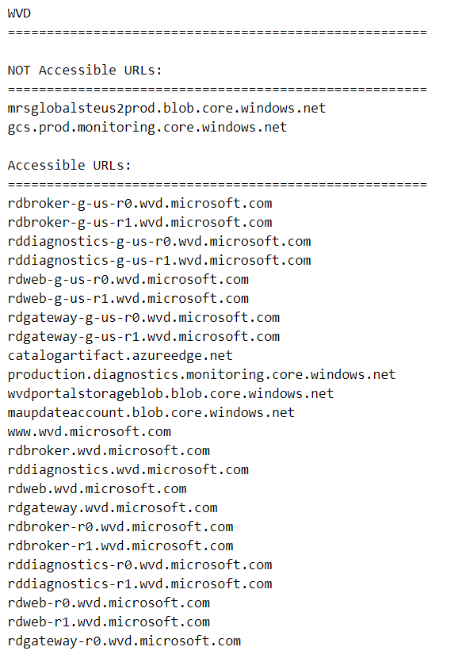
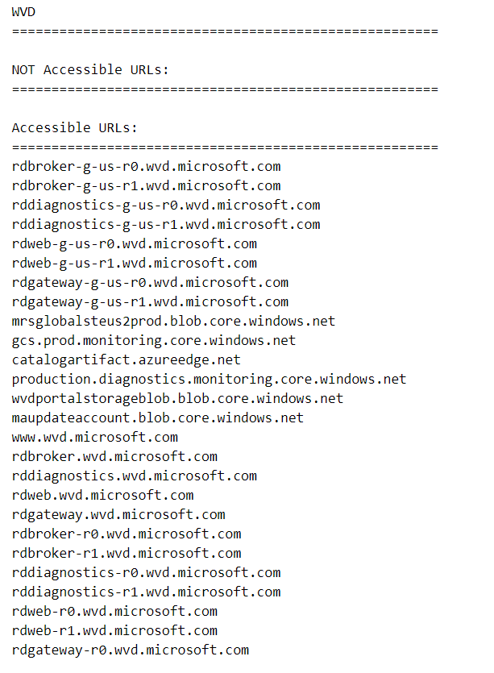

# Required URL list

In order to deploy and use Windows Virtual Desktop, you must unblock certain URLs so your virtual machines (VMs) can access them anytime. This article lists the required URLs you need to unblock in order for Windows Virtual Desktop to function properly. 

>[!IMPORTANT]
>Windows Virtual Desktop doesn't support deployments that block the URLs listed in this article.

## Required URL Check tool

The Required URL Check tool will validate URLs and display whether the URLs the virtual machine needs to function are accessible. If not, then the tool will list the inaccessible URLs so you can unblock them, if needed.

It's important to keep the following things in mind:

- You can only use the Required URL Check tool for deployments in commercial clouds.
- The Required URL Check tool can't check URLs with wildcards so make sure you unblock those URLs first.

### Requirements

You need the following things to use the Required URL Check tool:

- Your VM must have a .NET 4.6.2 framework
- RDAgent version 1.0.2944.400 or higher
- The WVDAgentUrlTool.exe file must be in the same folder as the WVDAgentUrlTool.config file

### How to use the Required URL Check tool

To use the Required URL Check tool:

1. Open a command prompt as an administrator on your VM.
2. Run the following command to change the directory to the same folder as the build agent:

    ```console
    cd C:\Program Files\Microsoft RDInfra\RDAgent_1.0.2944.1200
    ```

3. Run the following command:

    ```console
    WVDAgentUrlTool.exe
    ```
 
4. Once you run the file, you'll see a list of accessible and inaccessible URLs.

    For example, the following screenshot shows a scenario where you'd need to unblock two required non-wildcard URLs:

    > [!div class="mx-imgBorder"]
    > 
    
    Here's what the output should look like once you've unblocked all required non-wildcard URLs:

    > [!div class="mx-imgBorder"]
    > 

## Virtual machines

The Azure virtual machines you create for Windows Virtual Desktop must have access to the following URLs in the Azure commercial cloud:

|Address|Outbound TCP port|Purpose|Service Tag|
|---|---|---|---|
|*.wvd.microsoft.com|443|Service traffic|WindowsVirtualDesktop|
|gcs.prod.monitoring.core.windows.net|443|Agent traffic|AzureCloud|
|production.diagnostics.monitoring.core.windows.net|443|Agent traffic|AzureCloud|
|*xt.blob.core.windows.net|443|Agent traffic|AzureCloud|
|*eh.servicebus.windows.net|443|Agent traffic|AzureCloud|
|*xt.table.core.windows.net|443|Agent traffic|AzureCloud|
|*xt.queue.core.windows.net|443|Agent traffic|AzureCloud|
|catalogartifact.azureedge.net|443|Azure Marketplace|AzureCloud|
|kms.core.windows.net|1688|Windows activation|Internet|
|mrsglobalsteus2prod.blob.core.windows.net|443|Agent and SXS stack updates|AzureCloud|
|wvdportalstorageblob.blob.core.windows.net|443|Azure portal support|AzureCloud|
| 169.254.169.254 | 80 | [Azure Instance Metadata service endpoint](../virtual-machines/windows/instance-metadata-service.md) | N/A |
| 168.63.129.16 | 80 | [Session host health monitoring](../virtual-network/network-security-groups-overview.md#azure-platform-considerations) | N/A |

>[!IMPORTANT]
>Windows Virtual Desktop now supports the FQDN tag. For more information, see [Use Azure Firewall to protect Window Virtual Desktop deployments](../firewall/protect-windows-virtual-desktop.md).
>
>We recommend you use FQDN tags or service tags instead of URLs to prevent service issues. The listed URLs and tags only correspond to Windows Virtual Desktop sites and resources. They don't include URLs for other services like Azure Active Directory.

The Azure virtual machines you create for Windows Virtual Desktop must have access to the following URLs in the Azure Government cloud:

|Address|Outbound TCP port|Purpose|Service Tag|
|---|---|---|---|
|*.wvd.microsoft.us|443|Service traffic|WindowsVirtualDesktop|
|gcs.monitoring.core.usgovcloudapi.net|443|Agent traffic|AzureCloud|
|monitoring.core.usgovcloudapi.net|443|Agent traffic|AzureCloud|
|fairfax.warmpath.usgovcloudapi.net|443|Agent traffic|AzureCloud|
|*xt.blob.core.usgovcloudapi.net|443|Agent traffic|AzureCloud|
|*.servicebus.usgovcloudapi.net|443|Agent traffic|AzureCloud|
|*xt.table.core.usgovcloudapi.net|443|Agent traffic|AzureCloud|
|Kms.core.usgovcloudapi.net|1688|Windows activation|Internet|
|mrsglobalstugviffx.blob.core.usgovcloudapi.net|443|Agent and SXS stack updates|AzureCloud|
|wvdportalstorageblob.blob.core.usgovcloudapi.net|443|Azure portal support|AzureCloud|
| 169.254.169.254 | 80 | [Azure Instance Metadata service endpoint](../virtual-machines/windows/instance-metadata-service.md) | N/A |
| 168.63.129.16 | 80 | [Session host health monitoring](../virtual-network/network-security-groups-overview.md#azure-platform-considerations) | N/A |

The following table lists optional URLs that your Azure virtual machines can have access to:

|Address|Outbound TCP port|Purpose|Azure Gov|
|---|---|---|---|
|*.microsoftonline.com|443|Authentication to Microsoft Online Services|login.microsoftonline.us|
|*.events.data.microsoft.com|443|Telemetry Service|None|
|www.msftconnecttest.com|443|Detects if the OS is connected to the internet|None|
|*.prod.do.dsp.mp.microsoft.com|443|Windows Update|None|
|login.windows.net|443|Sign in to Microsoft Online Services, Microsoft 365|login.microsoftonline.us|
|*.sfx.ms|443|Updates for OneDrive client software|oneclient.sfx.ms|
|*.digicert.com|443|Certificate revocation check|None|
|*.azure-dns.com|443|Azure DNS resolution|None|
|*.azure-dns.net|443|Azure DNS resolution|None|

>[!NOTE]
>Windows Virtual Desktop currently doesn't have a list of IP address ranges that you can unblock to allow network traffic. We only support unblocking specific URLs at this time.
>
>If you're using a Next Generation Firewall (NGFW), you'll need to use a dynamic list specifically made for Azure IPs to make sure you can connect.
>
>For a list of safe Office-related URLs, including required Azure Active Directory-related URLs, see [Office 365 URLs and IP address ranges](/office365/enterprise/urls-and-ip-address-ranges).
>
>You must use the wildcard character (*) for URLs involving service traffic. If you prefer to not use * for agent-related traffic, here's how to find the URLs without wildcards:
>
>1. Register your virtual machines to the Windows Virtual Desktop host pool.
>2. Open **Event viewer**, then go to **Windows logs** > **Application** > **WVD-Agent** and look for Event ID 3701.
>3. Unblock the URLs that you find under Event ID 3701. The URLs under Event ID 3701 are region-specific. You'll need to repeat the unblocking process with the relevant URLs for each region you want to deploy your virtual machines in.

## Remote Desktop clients

Any Remote Desktop clients you use must have access to the following URLs:

|Address|Outbound TCP port|Purpose|Client(s)|Azure Gov|
|---|---|---|---|---|
|*.wvd.microsoft.com|443|Service traffic|All|*.wvd.microsoft.us|
|*.servicebus.windows.net|443|Troubleshooting data|All|*.servicebus.usgovcloudapi.net|
|go.microsoft.com|443|Microsoft FWLinks|All|None|
|aka.ms|443|Microsoft URL shortener|All|None|
|docs.microsoft.com|443|Documentation|All|None|
|privacy.microsoft.com|443|Privacy statement|All|None|
|query.prod.cms.rt.microsoft.com|443|Client updates|Windows Desktop|None|

>[!IMPORTANT]
>Opening these URLs is essential for a reliable client experience. Blocking access to these URLs is unsupported and will affect service functionality.
>
>These URLs only correspond to client sites and resources. This list doesn't include URLs for other services like Azure Active Directory. Azure Active Directory URLs can be found under ID 56 on the [Office 365 URLs and IP address ranges](/office365/enterprise/urls-and-ip-address-ranges#microsoft-365-common-and-office-online).
