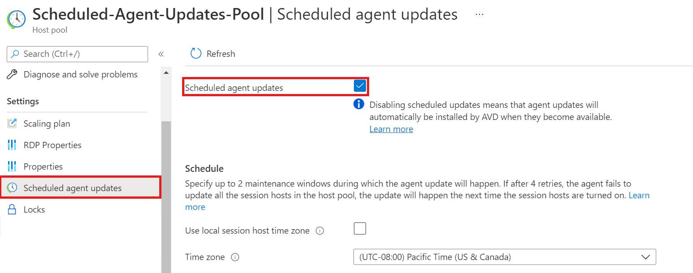
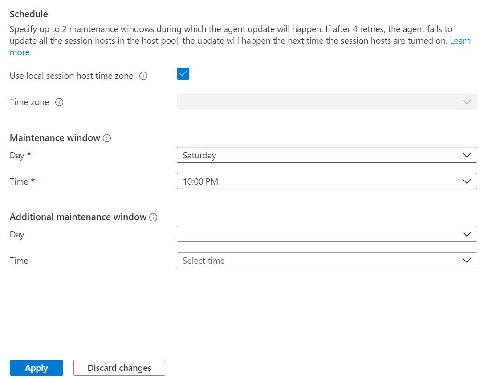

# Scheduled Agent Updates for Azure Virtual Desktop host pools

The Scheduled Agent Updates feature lets you create up to two maintenance windows for the Azure Virtual Desktop agent, side-by-side stack, and Geneva Monitoring agent to get updated so that updates don't happen during peak business hours. To monitor agent updates, you can use Log Analytics to see when agent component updates are available and when updates are unsuccessful.

This article describes how the Scheduled Agent Updates feature works and how to set it up.

>[!NOTE]
> Azure Virtual Desktop (classic) doesn't support the Scheduled Agent Updates feature.

## Configure the Scheduled Agent Updates feature using the Azure portal

To use the Azure portal to configure Scheduled Agent Updates:

1. Open your browser and go to [the Azure portal](https://portal.azure.com).

2. In the Azure portal, go to **Azure Virtual Desktop**.

3. Select **Host pools**, then go to the host pool where you want to enable the feature. You can only configure this feature for existing host pools. You can't enable this feature when you create a new host pool.

4. In the host pool, select **Scheduled Agent Updates**. Scheduled Agent Updates is disabled by default. This means that, unless you enable this setting, the agent can get updated at any time by the agent update flighting service. Select the **Scheduled agent updates** checkbox to enable the feature.

    > [!div class="mx-imgBorder"]
    > 

5. Enter your preferred time zone setting. If you select **Use local session host time zone**, Scheduled Agent Updates will automatically use the VM's local time zone. If you don't select **Use local session host time zone**, you'll need to specify a time zone.

6. Select a day and time for the **Maintenance window**. If you'd like to make an optional second maintenance window, you can also select a date and time for it here. Since Scheduled Agent Updates is a host pool setting, the time zone setting and maintenance windows you configure will be applied to all session hosts in the host pool.

7. Select **Apply** to apply your settings.

    > [!div class="mx-imgBorder"]
    > 

## Additional information

### How the feature works

The Scheduled Agent Updates feature updates the Azure Virtual Desktop agent, side-by-side stack, and Geneva Monitoring agent if any one or more of these components needs to be updated. Any reference to the agent components is referring to these three components. Scheduled Agent Updates doesn't apply to the initial installation of the agent components. When you install the agent on a virtual machine (VM), the agent will automatically install the side-by-side stack and the Geneva Monitoring agent regardless of which maintenance windows you set. Any non-critical updates after installation will only happen within your maintenance windows. Host pools with the Scheduled Agent Updates feature enabled will receive the agent update after the agent has been fully flighted to production. For more information about how agent flighting works, see [Agent update process](agent-overview.md#agent-update-process).
The agent component update won't succeed if the session host VM is shut down or deallocated during the scheduled update time. If you enable Scheduled Agent Updates, make sure all session hosts in your host pool are on during your configured maintenance window time. The broker will attempt to update the agent components during each specified maintenance window up to four times. After the fourth try, the broker will install the update by force. This process gives time for installation retries if an update is unsuccessful, and also prevents session hosts from having outdated versions of agent components. If a critical agent component update is available, the broker will install the agent component by force for security purposes.

### Maintenance window and time zone information

- You must specify at least one maintenance window. Configuring the second maintenance window is optional. Creating two maintenance windows gives the agent components additional opportunities to update if the first update during one of the windows is unsuccessful.

- All maintenance windows are two hours long to account for situations where all three agent components must be updated at the same time. For example, if your maintenance window is Saturday at 9:00 AM PST, the updates will happen between 9:00 AM PST and 11:00 AM PST.

- The **Use session host local time** parameter isn't selected by default. If you want the agent component update to be in the same time zone for all session hosts in your host pool, you'll need to specify a single time zone for your maintenance windows. Having a single time zone helps when all your session hosts or users are located in the same time zone.

- If you select **Use session host local time**, the agent component update will be in the local time zone of each session host in the host pool. Use this setting when all session hosts in your host pool or their assigned users are in different time zones. For example, let's say you have one host pool with session hosts in West US in the Pacific Standard Time zone and session hosts in East US in the Eastern Standard Time zone, and you've set the maintenance window to be Saturday at 9:00 PM. Enabling **Use session host local time** ensures that updates to all session hosts in the host pool will happen at 9:00 PM in their respective time zones. Disabling **Use session host local time** and setting the time zone to be Central Standard Time ensures that updates to the session hosts in the host pool will happen at 9:00 PM Central Standard Time, regardless of the session hosts' local time zones.

- The local time zone for VMs you create using the Azure portal is set to Coordinated Universal Time (UTC) by default. If you want to change the VM time zone, run the [Set-TimeZone PowerShell cmdlet](/powershell/module/microsoft.powershell.management/set-timezone) on the VM.

- To get a list of available time zones for a VM, run the [Get-TimeZone PowerShell cmdlet](/powershell/module/microsoft.powershell.management/get-timezone) on the VM.

## Next steps

For more information related to Scheduled Agent Updates and agent components, check out the following resources:

- Learn how to set up diagnostics for this feature at the [Scheduled Agent Updates Diagnostics guide](agent-updates-diagnostics.md).
- Learn more about the Azure Virtual Desktop agent, side-by-side stack, and Geneva Monitoring agent at [Getting Started with the Azure Virtual Desktop Agent](agent-overview.md).
- For more information about the current and earlier versions of the Azure Virtual Desktop agent, see [Azure Virtual Desktop agent updates](whats-new-agent.md).
- If you're experiencing agent or connectivity-related issues, see the [Azure Virtual Desktop Agent issues troubleshooting guide](troubleshoot-agent.md).
