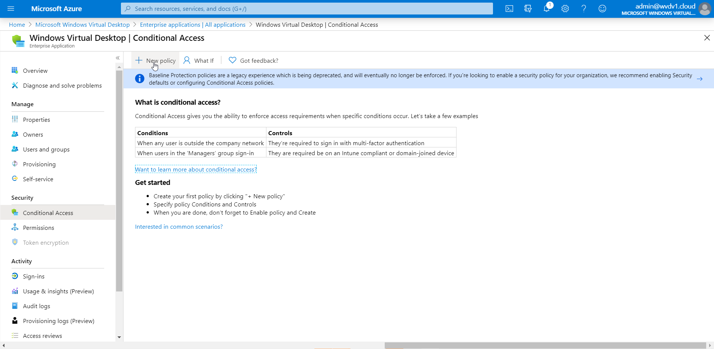
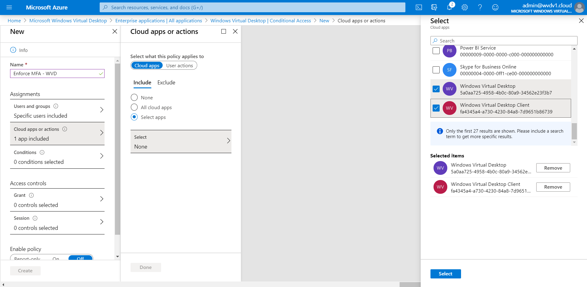
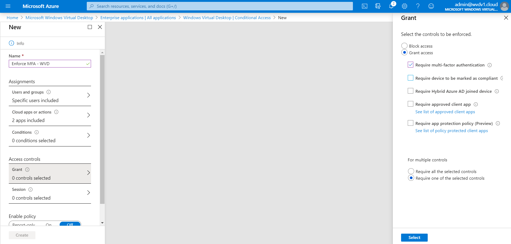
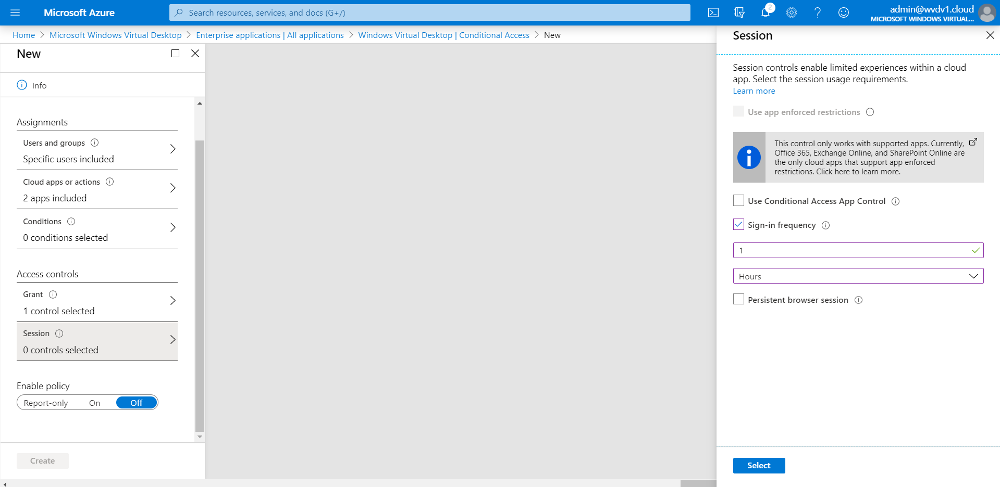
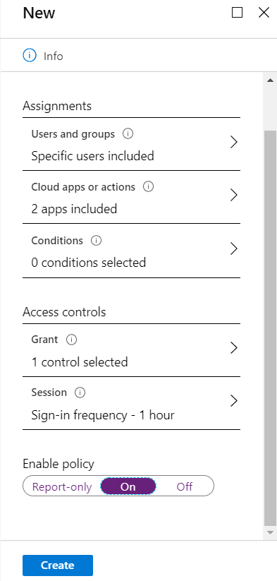
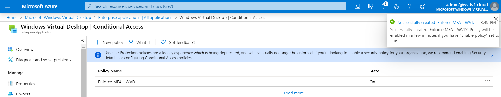

# Set up and enforce Azure multi-factor authentication

The Windows client for Windows Virtual Desktop is an excellent option for integrating Windows Virtual Desktop with your local machine. However, when you configure your Windows Virtual Desktop account into the Windows Client. When you first sign in, the client asks for your username, password, and Azure MFA. After that, the next time you sign in, the client will remember your token from your Azure AD Enterprise Application. When you select **Remember me**, your users can sign in after restarting the client without needing to reenter their credentials.

While this is beneficial in some scenarios, in Enterprise scenarios or personal devices, this could make your deployment less secure. To counteract this, you'll need to make sure the client keeps asking for Azure multi-factor authentication credentials. This article will show you how to enable this feature by opting in to the Conditional Access policy for Windows Virtual Desktop.

>[!NOTE]
>In order to use this procedure and Conditional Access feature, you need to have at least the Enterprise Mobility + Security E5 or Azure Active Directory Premium P2 license.

## Prerequisites

Before you start, make sure you have these things:

- A license for one of these:
  - Enterprise Mobility and Security E5
  - Azure Active Directory Premium P2
- An Azure Active Directory group named 

*Pre-step: Make sure to create one Azure AD group named e.g. WVD – MFA Users and make your users a group member to filter the rule based on AAD group membership.*

**Switch** back to the Azure Portal

**Open** (again) Azure Active Directory

Go to **Enterprise Applications** and search/click on **Windows Virtual Desktop Client**

Click on **Conditional Access**

Click on **+ New policy**

**Give** in a **name** for the **Rule** – select the – **WVD – MFA Users** - group that you created earlier.

Click on **Select** followed by **Done**

**Open** your **Cloud Apps or actions**.

Make sure to **select both** the Windows Virtual Desktop – and client - **Enterprise Applications.**

**Click** on **Select** and **Done**

**Optional: Whitelist users from MFA enforcement based on (trusted IPs) Named Locations**

There is also the option to create conditions to filter out this rule based on your company's public IP address. The result is that your users (working on trusted locations) can access your Windows Virtual Desktop environment with only the username and password. Once they switch back to another network e.g. from home – Azure MFA will prompt again.

>[!NOTE]
>The following setting will also apply to the Windows Virtual Desktop - HTML5 RDWeb environment (aka.ms/WVDWeb).

Enter in all your (public) IP addresses that you want to whitelist from Azure
MFA enforcement – in the - **trusted ips** - section.

**Switch back to the Rule**

**Select** MFA Trusted IPs

**Select** (at least) – Require multi-factor authentication – and – **require one** of the **selected controls**.

Click on **Select** and **Done**

Click on **Grant**

**Active** the **Require multi-factor authentication** setting

>[!NOTE]
>If some of your users in your organization run the Windows Client from a Azure AD Domain Joined (AADJ) compliant computer account (Intune managed) and don't want to enforce MFA for those users – please activate then as well the – Require device to be marked as compliant – to avoid this for AADJ compliant devices.

Click on **Session**

**Activate** the **Sign-in frequency** setting – set it on - **1 Hours.**

>[!NOTE]
>Active sessions to your Windows Virtual Desktop environment will continue to work. However, if you disconnect or logoff – you will need to provide MFA again after 60 minutes. You can set it to 1 day to extent this time-out. It's what you prefer – and what aligns with your security policy!*

*The default setting is a rolling window of 90 days, i.e. users will be asked to re-authenticate on the first attempt to access a resource after being inactive on their machine for 90 days or longer.*

**Enable** the Policy

**Confirm** the settings – click on **Create**

The **Conditional Access** rule **is created** – let's test the rule!

