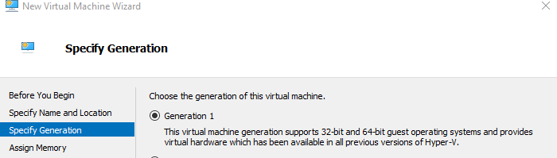
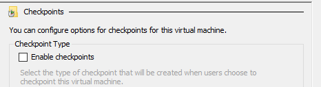
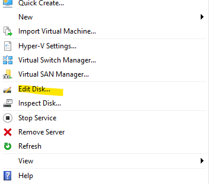
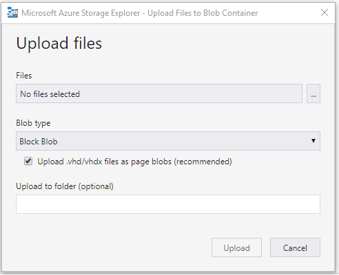
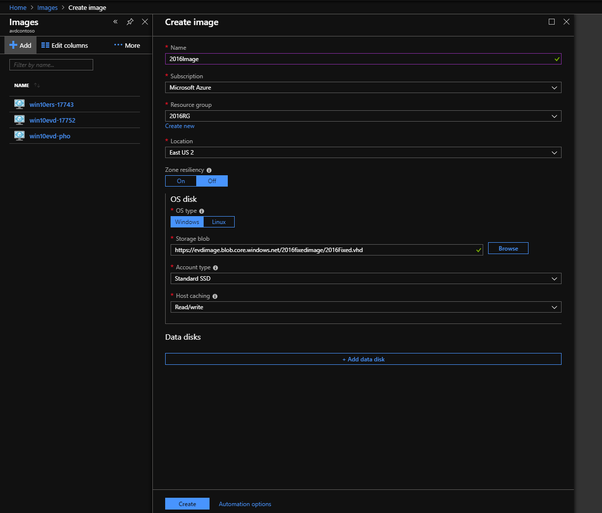
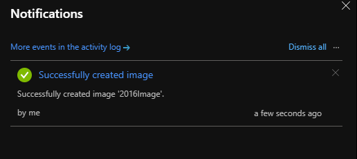

# Prepare and customize a master VHD image

This article tells you how to prepare a master virtual hard disk (VHD) image for upload to Azure, including how to create virtual machines (VMs) and install software on them. These instructions are for a Windows Virtual Desktop-specific configuration that can be used with your organization's existing processes.

## Create a VM

Windows 10 Enterprise multi-session is available in the Azure Image Gallery. There are two options for customizing this image.

The first option is to provision a virtual machine (VM) in Azure by following the instructions in [Create a VM from a managed image](../virtual-machines/windows/create-vm-generalized-managed.md), and then skip ahead to [Software preparation and installation](set-up-customize-master-image.md#software-preparation-and-installation).

The second option is to create the image locally by downloading the image, provisioning a Hyper-V VM, and customizing it to suit your needs, which we cover in the following section.

### Local image creation

Once you've downloaded the image to a local location, open **Hyper-V Manager** to create a VM with the VHD you copied. The following instructions are a simple version, but you can find more detailed instructions in [Create a virtual machine in Hyper-V](/windows-server/virtualization/hyper-v/get-started/create-a-virtual-machine-in-hyper-v/).

To create a VM with the copied VHD:

1. Open the **New Virtual Machine Wizard**.

2. On the Specify Generation page, select **Generation 1**.

    > [!div class="mx-imgBorder"]
    > 

3. Under Checkpoint Type, disable checkpoints by unchecking the check box.

    > [!div class="mx-imgBorder"]
    > 

You can also run the following cmdlet in PowerShell to disable checkpoints.

```powershell
Set-VM -Name <VMNAME> -CheckpointType Disabled
```

### Fixed disk

If you create a VM from an existing VHD, it creates a dynamic disk by default. It can be changed to a fixed disk by selecting **Edit Disk...** as shown in the following image. For more detailed instructions, see [Prepare a Windows VHD or VHDX to upload to Azure](../virtual-machines/windows/prepare-for-upload-vhd-image.md).

> [!div class="mx-imgBorder"]
> 

You can also run the following PowerShell cmdlet to change the disk to a fixed disk.

```powershell
Convert-VHD –Path c:\test\MY-VM.vhdx –DestinationPath c:\test\MY-NEW-VM.vhd -VHDType Fixed
```

## Software preparation and installation

This section covers how to prepare and install FSLogix and Windows Defender, as well as some basic configuration options for apps and your image's registry.

If you're installing Microsoft 365 Apps for enterprise and OneDrive on your VM, go to [Install Office on a master VHD image](install-office-on-wvd-master-image.md) and follow the instructions there to install the apps. After you're done, return to this article.

If your users need to access certain LOB applications, we recommend you install them after completing this section's instructions.

### Set up user profile container (FSLogix)

To include the FSLogix container as part of the image, follow the instructions in [Create a profile container for a host pool using a file share](create-host-pools-user-profile.md#configure-the-fslogix-profile-container). You can test the functionality of the FSLogix container with [this quickstart](/fslogix/configure-cloud-cache-tutorial/).

### Configure Windows Defender

If Windows Defender is configured in the VM, make sure it's configured to not scan the entire contents of VHD and VHDX files during attachment.

This configuration only removes scanning of VHD and VHDX files during attachment, but won't affect real-time scanning.

For more detailed instructions for how to configure Windows Defender on Windows Server, see [Configure Windows Defender Antivirus exclusions on Windows Server](/windows/security/threat-protection/windows-defender-antivirus/configure-server-exclusions-windows-defender-antivirus/).

To learn more about how to configure Windows Defender to exclude certain files from scanning, see [Configure and validate exclusions based on file extension and folder location](/windows/security/threat-protection/windows-defender-antivirus/configure-extension-file-exclusions-windows-defender-antivirus/).

### Disable Automatic Updates

To disable Automatic Updates via local Group Policy:

1. Open **Local Group Policy Editor\\Administrative Templates\\Windows Components\\Windows Update**.
2. Right-click **Configure Automatic Update** and set it to **Disabled**.

You can also run the following command on a command prompt to disable Automatic Updates.

```batch
reg add "HKLM\SOFTWARE\Policies\Microsoft\Windows\WindowsUpdate\AU" /v NoAutoUpdate /t REG_DWORD /d 1 /f
```

### Specify Start layout for Windows 10 PCs (optional)

Run this command to specify a Start layout for Windows 10 PCs.

```batch
reg add "HKLM\SOFTWARE\Microsoft\Windows\CurrentVersion\Explorer" /v SpecialRoamingOverrideAllowed /t REG_DWORD /d 1 /f
```

### Set up time zone redirection

Time zone redirection can be enforced on Group Policy level since all VMs in a host pool are part of the same security group.

To redirect time zones:

1. On the Active Directory server, open the **Group Policy Management Console**.
2. Expand your domain and Group Policy Objects.
3. Right-click the **Group Policy Object** that you created for the group policy settings and select **Edit**.
4. In the **Group Policy Management Editor**, navigate to **Computer Configuration** > **Policies** > **Administrative Templates** > **Windows Components** > **Remote Desktop Services** > **Remote Desktop Session Host** > **Device and Resource Redirection**.
5. Enable the **Allow time zone redirection** setting.

You can also run this command on the master image to redirect time zones:

```batch
reg add "HKLM\SOFTWARE\Policies\Microsoft\Windows NT\Terminal Services" /v fEnableTimeZoneRedirection /t REG_DWORD /d 1 /f
```

### Disable Storage Sense

For Windows Virtual Desktop session host that use Windows 10 Enterprise or Windows 10 Enterprise multi-session, we recommend disabling Storage Sense. You can disable Storage Sense in the Settings menu under **Storage**, as shown in the following screenshot:

> [!div class="mx-imgBorder"]
> 

You can also change the setting with the registry by running the following command:

```batch
reg add "HKCU\Software\Microsoft\Windows\CurrentVersion\StorageSense\Parameters\StoragePolicy" /v 01 /t REG_DWORD /d 0 /f
```

### Include additional language support

This article doesn't cover how to configure language and regional support. For more information, see the following articles:

- [Add languages to Windows images](/windows-hardware/manufacture/desktop/add-language-packs-to-windows/)
- [Features on demand](/windows-hardware/manufacture/desktop/features-on-demand-v2--capabilities/)
- [Language and region features on demand (FOD)](/windows-hardware/manufacture/desktop/features-on-demand-language-fod/)

### Other applications and registry configuration

This section covers application and operating system configuration. All configuration in this section is done through registry entries that can be executed by command-line and regedit tools.

>[!NOTE]
>You can implement best practices in configuration with either Group Policy Objects (GPOs) or registry imports. The administrator can choose either option based on their organization's requirements.

For feedback hub collection of telemetry data on Windows 10 Enterprise multi-session, run this command:

```batch
reg add "HKLM\SOFTWARE\Policies\Microsoft\Windows\DataCollection" /v AllowTelemetry /t REG_DWORD /d 3 /f
```

Run the following command to fix Watson crashes:

```batch
remove CorporateWerServer* from Computer\HKEY_LOCAL_MACHINE\SOFTWARE\Microsoft\Windows\Windows Error Reporting
```

Enter the following commands into the registry editor to fix 5k resolution support. You must run the commands before you can enable the side-by-side stack.

```batch
reg add "HKLM\SYSTEM\CurrentControlSet\Control\Terminal Server\WinStations\RDP-Tcp" /v MaxMonitors /t REG_DWORD /d 4 /f
reg add "HKLM\SYSTEM\CurrentControlSet\Control\Terminal Server\WinStations\RDP-Tcp" /v MaxXResolution /t REG_DWORD /d 5120 /f
reg add "HKLM\SYSTEM\CurrentControlSet\Control\Terminal Server\WinStations\RDP-Tcp" /v MaxYResolution /t REG_DWORD /d 2880 /f

reg add "HKLM\SYSTEM\CurrentControlSet\Control\Terminal Server\WinStations\rdp-sxs" /v MaxMonitors /t REG_DWORD /d 4 /f
reg add "HKLM\SYSTEM\CurrentControlSet\Control\Terminal Server\WinStations\rdp-sxs" /v MaxXResolution /t REG_DWORD /d 5120 /f
reg add "HKLM\SYSTEM\CurrentControlSet\Control\Terminal Server\WinStations\rdp-sxs" /v MaxYResolution /t REG_DWORD /d 2880 /f
```

## Prepare the image for upload to Azure

After you've finished configuration and installed all applications, follow the instructions in [Prepare a Windows VHD or VHDX to upload to Azure](../virtual-machines/windows/prepare-for-upload-vhd-image.md) to prepare the image.

After preparing the image for upload, make sure the VM remains in the off or deallocated state.

## Upload master image to a storage account in Azure

This section only applies when the master image was created locally.

The following instructions will tell you how to upload your master image into an Azure storage account. If you don't already have an Azure storage account, follow the instructions in [this article](/azure/javascript/tutorial-vscode-static-website-node-03) to create one.

1. Convert the VM image (VHD) to Fixed if you haven't already. If you don't convert the image to Fixed, you can't successfully create the image.

2. Upload the VHD to a blob container in your storage account. You can upload quickly with the [Storage Explorer tool](https://azure.microsoft.com/features/storage-explorer/). To learn more about the Storage Explorer tool, see [this article](https://docs.microsoft.com/azure/vs-azure-tools-storage-manage-with-storage-explorer?tabs=windows).

    > [!div class="mx-imgBorder"]
    > 

3. Next, go to the Azure portal in your browser and search for "Images." Your search should lead you to the **Create image** page, as shown in the following screenshot:

    > [!div class="mx-imgBorder"]
    > 

4. Once you've created the image, you should see a notification like the one in the following screenshot:

    > [!div class="mx-imgBorder"]
    > 

## Next steps

Now that you have an image, you can create or update host pools. To learn more about how to create and update host pools, see the following articles:

- [Create a host pool with an Azure Resource Manager template](./virtual-desktop-fall-2019/create-host-pools-arm-template.md)
- [Tutorial: Create a host pool with Azure Marketplace](create-host-pools-azure-marketplace.md)
- [Create a host pool with PowerShell](create-host-pools-powershell.md)
- [Create a profile container for a host pool using a file share](create-host-pools-user-profile.md)
- [Configure the Windows Virtual Desktop load-balancing method](configure-host-pool-load-balancing.md)
