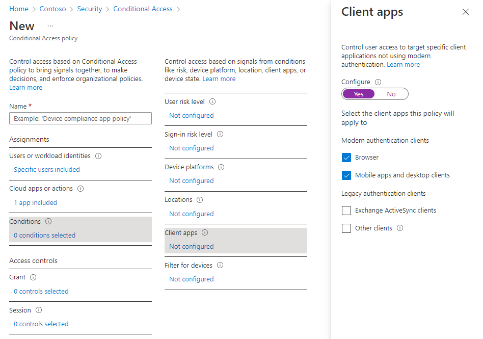

# Enforce Microsoft Entra multifactor authentication for Azure Virtual Desktop using Conditional Access

> [!IMPORTANT]
> If you're visiting this page from the Azure Virtual Desktop (classic) documentation, make sure to [return to the Azure Virtual Desktop (classic) documentation](./virtual-desktop-fall-2019/tenant-setup-azure-active-directory.md) once you're finished.

Users can sign into Azure Virtual Desktop from anywhere using different devices and clients. However, there are certain measures you should take to help keep your environment and your users safe. Using Microsoft Entra multifactor authentication (MFA) with Azure Virtual Desktop prompts users during the sign-in process for another form of identification in addition to their username and password. You can enforce MFA for Azure Virtual Desktop using Conditional Access, and can also configure whether it applies to the web client, mobile apps, desktop clients, or all clients. 

When a user connects to a remote session, they need to authenticate to the Azure Virtual Desktop service and the session host. If MFA is enabled, it's used when connecting to the Azure Virtual Desktop service and the user is prompted for their user account and a second form of authentication, in the same way as accessing other services. When a user starts a remote session, a username and password is required for the session host, but this is seamless to the user if single sign-on (SSO) is enabled. For more information, see [Authentication methods](authentication.md#authentication-methods).

How often a user is prompted to reauthenticate depends on [Microsoft Entra session lifetime configuration settings](../active-directory/authentication/concepts-azure-multi-factor-authentication-prompts-session-lifetime.md#azure-ad-session-lifetime-configuration-settings). For example, if their Windows client device is registered with Microsoft Entra ID, it receives a [Primary Refresh Token](../active-directory/devices/concept-primary-refresh-token.md) (PRT) to use for single sign-on (SSO) across applications. Once issued, a PRT is valid for 14 days and is continuously renewed as long as the user actively uses the device.

While remembering credentials is convenient, it can also make deployments for Enterprise scenarios using personal devices less secure. To protect your users, you can make sure the client keeps asking for Microsoft Entra multifactor authentication credentials more frequently. You can use Conditional Access to configure this behavior.

Learn how to enforce MFA for Azure Virtual Desktop and optionally configure sign-in frequency in the following sections.

## Prerequisites

Here's what you need to get started:

- Assign users a license that includes [Microsoft Entra ID P1 or P2](../active-directory/authentication/concept-mfa-licensing.md).
- A [Microsoft Entra group](../active-directory/fundamentals/active-directory-groups-create-azure-portal.md) with your Azure Virtual Desktop users assigned as group members.
- [Enable Microsoft Entra multifactor authentication](../active-directory/authentication/tutorial-enable-azure-mfa.md).

## Create a Conditional Access policy

Here's how to create a Conditional Access policy that requires multifactor authentication when connecting to Azure Virtual Desktop:

1. Sign in to the [Azure portal](https://portal.azure.com) as a global administrator, security administrator, or Conditional Access administrator.
1. In the search bar, type *Microsoft Entra Conditional Access* and select the matching service entry.
1. From the overview, select **Create new policy**.
1. Give your policy a name. We recommend that organizations create a meaningful standard for the names of their policies.
1. Under **Assignments** > **Users**, select **0 users and groups selected**.
1. Under the **Include** tab, select **Select users and groups** and check **Users and groups**, then under **Select**, select **0 users and groups selected**.
1. On the new pane that opens, search for and choose the group that contains your Azure Virtual Desktop users as group members, then select **Select**.
1. Under **Assignments** > **Target resources**, select **No target resources selected**.
1. Under the **Include** tab, select **Select apps**, then under **Select**, select **None**.
1. On the new pane that opens, search for and select the necessary apps based on the resources you're trying to protect. Select the relevant tab for your scenario. When searching for an application name on Azure, use search terms that begin with the application name in order instead of keywords the application name contains out of order. For example, when you want to use Azure Virtual Desktop, you need to enter '*Azure Virtual*', in that order. If you enter '*virtual*' by itself, the search doesn't return the desired application.

   # [Azure Virtual Desktop](#tab/avd)

   For Azure Virtual Desktop (based on Azure Resource Manager), you can configure MFA on these different apps:

   - **Azure Virtual Desktop** (app ID 9cdead84-a844-4324-93f2-b2e6bb768d07), which applies when the user subscribes to Azure Virtual Desktop, authenticates to the Azure Virtual Desktop Gateway during a connection, and when diagnostics information is sent to the service from the user's local device.

        > [!TIP]
        > The app name was previously *Windows Virtual Desktop*. If you registered the *Microsoft.DesktopVirtualization* resource provider before the display name changed, the application will be named **Windows Virtual Desktop** with the same app ID as Azure Virtual Desktop.

      - **Microsoft Remote Desktop** (app ID a4a365df-50f1-4397-bc59-1a1564b8bb9c) and **Windows Cloud Login** (app ID 270efc09-cd0d-444b-a71f-39af4910ec45). These apply when the user authenticates to the session host when [single sign-on](configure-single-sign-on.md) is enabled. It's recommended to match conditional access policies between these apps and the Azure Virtual Desktop app, except for the [sign-in frequency](#configure-sign-in-frequency).

      > [!IMPORTANT]
      > The clients used to access Azure Virtual Desktop use the **Microsoft Remote Desktop** Entra ID app to authenticate to the session host today. An upcoming change will transition the authentication to the **Windows Cloud Login** Entra ID app. To ensure a smooth transition, you need to add both Entra ID apps to your CA policies.

   > [!IMPORTANT]
   > Don't select the app called Azure Virtual Desktop Azure Resource Manager Provider (app ID 50e95039-b200-4007-bc97-8d5790743a63). This app is only used for retrieving the user feed and shouldn't have multifactor authentication.   

   # [Azure Virtual Desktop (classic)](#tab/avd-classic)

   For Azure Virtual Desktop (classic), you configure MFA on these apps:
       
   - **Windows Virtual Desktop** (app ID 5a0aa725-4958-4b0c-80a9-34562e23f3b7).

   - **Windows Virtual Desktop Client** (app ID fa4345a4-a730-4230-84a8-7d9651b86739), which lets you set policies on the web client.

   - **Azure Virtual Desktop/Windows Virtual Desktop** (app ID 9cdead84-a844-4324-93f2-b2e6bb768d07). Not adding this app ID blocks feed discovery of Azure Virtual Desktop (classic) resources.

   > [!IMPORTANT]
   > Don't select the app called Azure Virtual Desktop Azure Resource Manager Provider (app ID 50e95039-b200-4007-bc97-8d5790743a63). This app is only used for retrieving the user feed and shouldn't have multifactor authentication.

1. Once you selected your apps, select **Select**.

    > [!div class="mx-imgBorder"]
    > 
    
1. Under **Assignments** > **Conditions**, select **0 conditions select**.
1. Under **Client apps**, select **Not configured**.
1. On the new pane that opens, for **Configure**, select **Yes**.
1. Select the client apps this policy applies to:

    - Select **Browser** if you want the policy to apply to the web client.
    - Select **Mobile apps and desktop clients** if you want to apply the policy to other clients.
    - Select both check boxes if you want to apply the policy to all clients.    
    - Deselect values for legacy authentication clients.
   
    > [!div class="mx-imgBorder"]
    > 

1. Once you selected the client apps this policy applies to, select **Done**.
1. Under **Access controls** > **Grant**, select **0 controls selected**.
1. On the new pane that opens, select **Grant access**.
1. Check **Require multifactor authentication**, and then select **Select**.
1. At the bottom of the page, set **Enable policy** to **On** and select **Create**.

> [!NOTE]
> When you use the web client to sign in to Azure Virtual Desktop through your browser, the log will list the client app ID as a85cf173-4192-42f8-81fa-777a763e6e2c (Azure Virtual Desktop client). This is because the client app is internally linked to the server app ID where the conditional access policy was set.

> [!TIP]
> Some users may see a prompt titled *Stay signed in to all your apps* if the Windows device they're using is not already registered with Microsoft Entra ID. If they deselect **Allow my organization to manage my device** and select **No, sign in to this app only**, they may be prompted for authentication more frequently.

## Configure sign-in frequency

Sign-in frequency policies let you set the time period after which a user must prove their identity again when accessing Microsoft Entra-based resources. This can help secure your environment and is especially important for personal devices, where the local OS may not require MFA or may not lock automatically after inactivity.

Sign-in frequency policies result in different behavior based on the Microsoft Entra app selected:

| App name | App ID | Behavior |
|--|--|--|
| **Azure Virtual Desktop** | 9cdead84-a844-4324-93f2-b2e6bb768d07 | Enforces reauthentication when a user subscribes to Azure Virtual Desktop, manually refreshes their list of resources and authenticates to the Azure Virtual Desktop Gateway during a connection.  Once the reauthentication period is over, background feed refresh and diagnostics upload silently fails until a user completes their next interactive sign in to Microsoft Entra. |
| **Microsoft Remote Desktop**  **Windows Cloud Login** | a4a365df-50f1-4397-bc59-1a1564b8bb9c  270efc09-cd0d-444b-a71f-39af4910ec45 | Enforces reauthentication when a user signs in to a session host when [single sign-on](configure-single-sign-on.md) is enabled.  Both apps should be configured together as the Azure Virtual Desktop clients will soon switch from using the Microsoft Remote Desktop app to the Windows Cloud Login app to authenticate to the session host. |

To configure the time period after which a user is asked to sign-in again:

1. Open the policy you created previously.
1. Under **Access controls** > **Session**, select **0 controls selected**.
1. In the **Session** pane, select **Sign-in frequency**.
1. Select **Periodic reauthentication** or **Every time**.
    - If you select **Periodic reauthentication**, set the value for the time period after which a user is asked to sign-in again, and then select **Select**. For example, setting the value to **1** and the unit to **Hours**, requires multifactor authentication if a connection is launched more than an hour after the last one.
    - The **Every time** option is currently available in public preview and is only supported when applied to the **Microsoft Remote Desktop** and **Windows Cloud Login** apps when single sign-on is enabled for your host pool. If you select **Every time**, users are prompted to reauthenticate after a period of 5 to 15 minutes after the last time they authenticated for the Microsoft Remote Desktop and Windows Cloud Login apps.
1. At the bottom of the page, select **Save**.

> [!NOTE]
> - Reauthentication only happens when a user must authenticate to a resource. Once a connection is established, users aren't prompted even if the connection lasts longer than the sign-in frequency you've configured.
> - Users need to reauthenticate if there is a network disruption that forces the session to be re-established after the sign-in frequency you've configured. This can lead to more frequent authentication requests on unstable networks.

## Microsoft Entra joined session host VMs

For connections to succeed, you must [disable the legacy per-user multifactor authentication sign-in method](../active-directory/devices/howto-vm-sign-in-azure-ad-windows.md#mfa-sign-in-method-required). If you don't want to restrict signing in to strong authentication methods like Windows Hello for Business, you need to [exclude the Azure Windows VM Sign-In app](../active-directory/devices/howto-vm-sign-in-azure-ad-windows.md#enforce-conditional-access-policies) from your Conditional Access policy.

## Next steps

- [Learn more about Conditional Access policies](../active-directory/conditional-access/concept-conditional-access-policies.md)
- [Learn more about user sign in frequency](../active-directory/conditional-access/howto-conditional-access-session-lifetime.md#user-sign-in-frequency)
