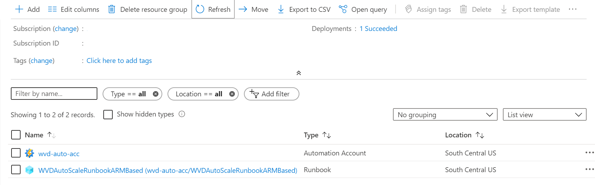
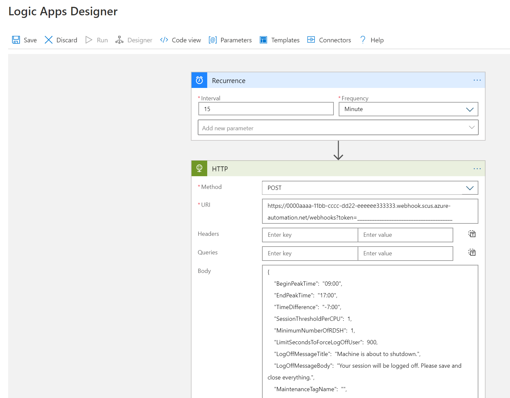
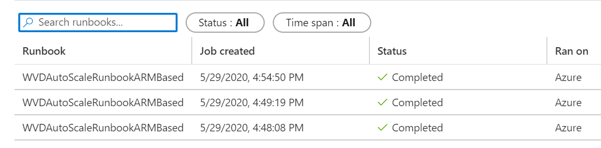
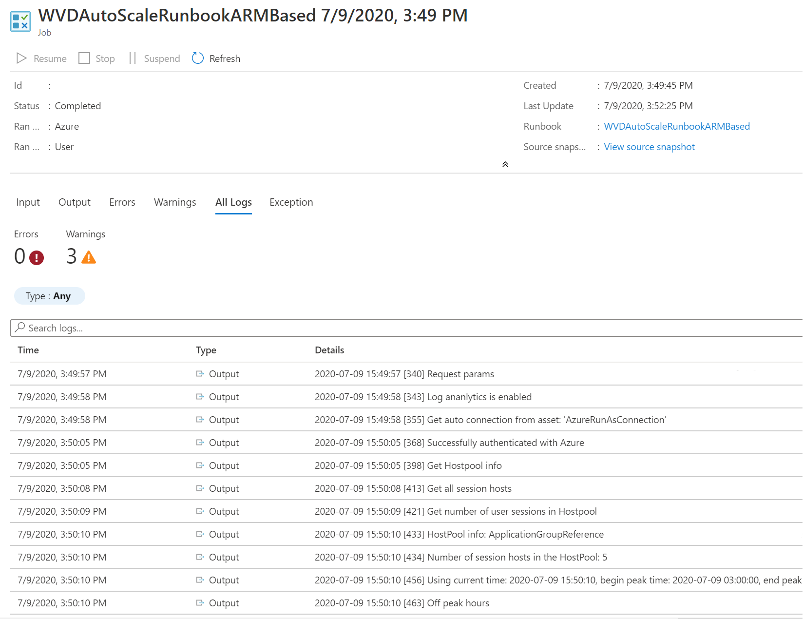

# Set up scaling tool using Azure Automation and Azure Logic Apps for Azure Virtual Desktop

In this article, you'll learn about the scaling tool that uses an Azure Automation runbook and Azure Logic App to automatically scale session host VMs in your Azure Virtual Desktop environment. To learn more about the scaling tool, see [Scale session hosts using Azure Automation and Azure Logic Apps](scaling-automation-logic-apps.md).

> [!NOTE]
> - Autoscale is an alternative way to scale session host VMs and is a native feature of Azure Virtual Desktop. We recommend you use Autoscale instead. For more information, see [Autoscale scaling plans](autoscale-scenarios.md).
>
> - You can't scale session hosts using Azure Automation and Azure Logic Apps together with [autoscale](autoscale-scaling-plan.md) on the same host pool. You must use one or the other.

## Prerequisites

Before you start setting up the scaling tool, make sure you have the following things ready:

- An [Azure Virtual Desktop host pool](create-host-pools-azure-marketplace.md).
- Session host pool VMs configured and registered with the Azure Virtual Desktop service.
- A user with the [*Contributor*](../role-based-access-control/role-assignments-portal.md) role-based access control (RBAC) role assigned on the Azure subscription to create the resources. You'll also need the *Application administrator* and/or *Owner* RBAC role to create a managed identity.
- A Log Analytics workspace (optional).

The machine you use to deploy the tool must have:

- PowerShell 5.1 or later
- The [Azure Az PowerShell module](/powershell/azure/new-azureps-module-az)

If you have everything ready, let's get started.

## Create or update an Azure Automation account

> [!NOTE]
> If you already have an Azure Automation account with a runbook running an older version of the scaling script, all you need to do is follow the instructions below to make sure it's updated.

First, you'll need an Azure Automation account to run the PowerShell runbook. The process this section describes is valid even if you have an existing Azure Automation account that you want to use to set up the PowerShell runbook. Here's how to set it up:

1. Open PowerShell.

1. Run the following cmdlet to sign in to your Azure account.

    ```powershell
    Login-AzAccount
    ```

    >[!NOTE]
    >Your account must have contributor rights on the Azure subscription where you want to deploy the scaling tool.

1. Run the following cmdlet to download the script for creating the Azure Automation account:

    ```powershell
    New-Item -ItemType Directory -Path "C:\Temp" -Force
    Set-Location -Path "C:\Temp"
    $Uri = "https://raw.githubusercontent.com/Azure/RDS-Templates/master/wvd-templates/wvd-scaling-script/CreateOrUpdateAzAutoAccount.ps1"
    # Download the script
    Invoke-WebRequest -Uri $Uri -OutFile ".\CreateOrUpdateAzAutoAccount.ps1"
    ```

1. Run the following cmdlet to execute the script and create the Azure Automation account. You can either fill in values for the parameters or comment them to use their defaults.

    ```powershell
    $Params = @{
         "AADTenantId"           = "<Azure_Active_Directory_tenant_ID>"   # Optional. If not specified, it will use the current Azure context
         "SubscriptionId"        = "<Azure_subscription_ID>"              # Optional. If not specified, it will use the current Azure context
         "UseARMAPI"             = $true
         "ResourceGroupName"     = "<Resource_group_name>"                # Optional. Default: "WVDAutoScaleResourceGroup"
         "AutomationAccountName" = "<Automation_account_name>"            # Optional. Default: "WVDAutoScaleAutomationAccount"
         "Location"              = "<Azure_region_for_deployment>"
         "WorkspaceName"         = "<Log_analytics_workspace_name>"       # Optional. If specified, Log Analytics will be used to configure the custom log table that the runbook PowerShell script can send logs to
    }

    .\CreateOrUpdateAzAutoAccount.ps1 @Params
    ```

    >[!NOTE]
    >If your policy doesn't let you create scaling script resources in a specific region, update the policy assignment and add the region you want to the list of allowed regions.

1. If you haven't created an automation account before, the cmdlet's output will include an encrypted webhook URI in the automation account variable. Make sure to keep a record of the URI because you'll use it as a parameter when you set up the execution schedule for the Azure Logic App. If you're updating an existing automation account, you can retrieve the webhook URI using [PowerShell to access variables](../automation/shared-resources/variables.md#powershell-cmdlets-to-access-variables).

1. If you specified the parameter **WorkspaceName** for Log Analytics, the cmdlet's output will also include the Log Analytics Workspace ID and its Primary Key. Make a note of the Workspace ID and Primary Key because you'll need to use them again later with parameters when you set up the execution schedule for the Azure Logic App.

1. After you've set up your Azure Automation account, sign in to your Azure subscription and check to make sure your Azure Automation account and the relevant runbook have appeared in your specified resource group, as shown in the following image:

    >[!div class="mx-imgBorder"]
    >

    To check if your webhook is where it should be, select the name of your runbook. Next, go to your runbook's Resources section and select **Webhooks**.

## Create a managed identity

Now that you have an Azure Automation account, you'll also need to set up a [managed identity](../automation/automation-security-overview.md#managed-identities) if you haven't already. Managed identities will help your runbook access other Azure AD-related resources as well as authenticate important automation processes.

To set up a managed identity, follow the directions in [Using a system-assigned managed identity for an Azure Automation account](../automation/enable-managed-identity-for-automation.md). Once you're done, return to this article and [Create the Azure Logic App and execution schedule](#create-the-azure-logic-app-and-execution-schedule) to finish the initial setup process.

> [!IMPORTANT]
> As of April 1, 2023, Run As accounts no longer work. We recommend you use [managed identities](../automation/automation-security-overview.md#managed-identities) instead. If you need help switching from your Run As account to a managed identity, see [Migrate from an existing Run As account to a managed identity](../automation/migrate-run-as-accounts-managed-identity.md). 
>
> Autoscale is an alternative way to scale session host VMs and is a native feature of Azure Virtual Desktop. We recommend you use Autoscale instead. For more information, see [Autoscale scaling plans](autoscale-scenarios.md).

## Create the Azure Logic App and execution schedule

Finally, you'll need to create the Azure Logic App and set up an execution schedule for your new scaling tool. First, download and import the [Desktop Virtualization PowerShell module](powershell-module.md) to use in your PowerShell session if you haven't already.

1. Open PowerShell.

1. Run the following cmdlet to sign in to your Azure account.

    ```powershell
    Login-AzAccount
    ```

1. Run the following cmdlet to download the script for creating the Azure Logic App.

    ```powershell
    New-Item -ItemType Directory -Path "C:\Temp" -Force
    Set-Location -Path "C:\Temp"
    $Uri = "https://raw.githubusercontent.com/Azure/RDS-Templates/master/wvd-templates/wvd-scaling-script/CreateOrUpdateAzLogicApp.ps1"
    # Download the script
    Invoke-WebRequest -Uri $Uri -OutFile ".\CreateOrUpdateAzLogicApp.ps1"
    ```

1. Run the following PowerShell script to create the Azure Logic App and execution schedule for your host pool

    >[!NOTE]
    >You'll need to run this script for each host pool you want to autoscale, but you need only one Azure Automation account.

    ```powershell
    $AADTenantId = (Get-AzContext).Tenant.Id

    $AzSubscription = Get-AzSubscription | Out-GridView -OutputMode:Single -Title "Select your Azure Subscription"
    Select-AzSubscription -Subscription $AzSubscription.Id

    $ResourceGroup = Get-AzResourceGroup | Out-GridView -OutputMode:Single -Title "Select the resource group for the new Azure Logic App"

    $WVDHostPool = Get-AzResource -ResourceType "Microsoft.DesktopVirtualization/hostpools" | Out-GridView -OutputMode:Single -Title "Select the host pool you'd like to scale"

    $LogAnalyticsWorkspaceId = Read-Host -Prompt "If you want to use Log Analytics, enter the Log Analytics Workspace ID returned by when you created the Azure Automation account, otherwise leave it blank"
    $LogAnalyticsPrimaryKey = Read-Host -Prompt "If you want to use Log Analytics, enter the Log Analytics Primary Key returned by when you created the Azure Automation account, otherwise leave it blank"
    $RecurrenceInterval = Read-Host -Prompt "Enter how often you'd like the job to run in minutes, e.g. '15'"
    $BeginPeakTime = Read-Host -Prompt "Enter the start time for peak hours in local time, e.g. 9:00"
    $EndPeakTime = Read-Host -Prompt "Enter the end time for peak hours in local time, e.g. 18:00"
    $TimeDifference = Read-Host -Prompt "Enter the time difference between local time and UTC in hours, e.g. +5:30"
    $SessionThresholdPerCPU = Read-Host -Prompt "Enter the maximum number of sessions per CPU that will be used as a threshold to determine when new session host VMs need to be started during peak hours"
    $MinimumNumberOfRDSH = Read-Host -Prompt "Enter the minimum number of session host VMs to keep running during off-peak hours"
    $MaintenanceTagName = Read-Host -Prompt "Enter the name of the Tag associated with VMs you don't want to be managed by this scaling tool"
    $LimitSecondsToForceLogOffUser = Read-Host -Prompt "Enter the number of seconds to wait before automatically signing out users. If set to 0, any session host VM that has user sessions, will be left untouched"
    $LogOffMessageTitle = Read-Host -Prompt "Enter the title of the message sent to the user before they are forced to sign out"
    $LogOffMessageBody = Read-Host -Prompt "Enter the body of the message sent to the user before they are forced to sign out"
    
    $AutoAccount = Get-AzAutomationAccount | Out-GridView -OutputMode:Single -Title "Select the Azure Automation account"
    $AutoAccountConnection = Get-AzAutomationConnection -ResourceGroupName $AutoAccount.ResourceGroupName -AutomationAccountName $AutoAccount.AutomationAccountName | Out-GridView -OutputMode:Single -Title "Select the Azure RunAs connection asset"
    
    $WebhookURI = Read-Host -Prompt "Enter the webhook URI that has already been generated for this Azure Automation account. The URI is stored as encrypted in the above Automation Account variable. To retrieve the value, see https://learn.microsoft.com/azure/automation/shared-resources/variables?tabs=azure-powershell#powershell-cmdlets-to-access-variables"
    
    $Params = @{
         "AADTenantId"                   = $AADTenantId                             # Optional. If not specified, it will use the current Azure context
         "SubscriptionID"                = $AzSubscription.Id                       # Optional. If not specified, it will use the current Azure context
         "ResourceGroupName"             = $ResourceGroup.ResourceGroupName         # Optional. Default: "WVDAutoScaleResourceGroup"
         "Location"                      = $ResourceGroup.Location                  # Optional. Default: "West US2"
         "UseARMAPI"                     = $true
         "HostPoolName"                  = $WVDHostPool.Name
         "HostPoolResourceGroupName"     = $WVDHostPool.ResourceGroupName           # Optional. Default: same as ResourceGroupName param value
         "LogAnalyticsWorkspaceId"       = $LogAnalyticsWorkspaceId                 # Optional. If not specified, script will not log to the Log Analytics
         "LogAnalyticsPrimaryKey"        = $LogAnalyticsPrimaryKey                  # Optional. If not specified, script will not log to the Log Analytics
         "ConnectionAssetName"           = $AutoAccountConnection.Name              # Optional. Default: "AzureRunAsConnection"
         "RecurrenceInterval"            = $RecurrenceInterval                      # Optional. Default: 15
         "BeginPeakTime"                 = $BeginPeakTime                           # Optional. Default: "09:00"
         "EndPeakTime"                   = $EndPeakTime                             # Optional. Default: "17:00"
         "TimeDifference"                = $TimeDifference                          # Optional. Default: "-7:00"
         "SessionThresholdPerCPU"        = $SessionThresholdPerCPU                  # Optional. Default: 1
         "MinimumNumberOfRDSH"           = $MinimumNumberOfRDSH                     # Optional. Default: 1
         "MaintenanceTagName"            = $MaintenanceTagName                      # Optional.
         "LimitSecondsToForceLogOffUser" = $LimitSecondsToForceLogOffUser           # Optional. Default: 1
         "LogOffMessageTitle"            = $LogOffMessageTitle                      # Optional. Default: "Machine is about to shutdown."
         "LogOffMessageBody"             = $LogOffMessageBody                       # Optional. Default: "Your session will be logged off. Please save and close everything."
         "WebhookURI"                    = $WebhookURI
    }

    .\CreateOrUpdateAzLogicApp.ps1 @Params
    ```

    After you run the script, the Azure Logic App should appear in a resource group, as shown in the following image.

    >[!div class="mx-imgBorder"]
    >
    
    To make changes to the execution schedule, such as changing the recurrence interval or time zone, go to the Azure Logic App autoscale scheduler and select **Edit** to go to the Azure Logic App Designer.

    >[!div class="mx-imgBorder"]
    >

## Manage your scaling tool

Now that you've created your scaling tool, you can access its output. This section describes a few features you might find helpful.

### View job status

You can view a summarized status of all runbook jobs or view a more in-depth status of a specific runbook job in the Azure portal.

On the right of your selected Azure Automation account, under "Job Statistics," you can view a list of summaries of all runbook jobs. Opening the **Jobs** page on the left side of the window shows current job statuses, start times, and completion times.

>[!div class="mx-imgBorder"]
>

### View logs and scaling tool output

You can view the logs of scale-out and scale-in operations by opening your runbook and selecting the job.

Navigate to the runbook in your resource group hosting the Azure Automation account and select **Overview**. On the overview page, select a job under **Recent Jobs** to view its scaling tool output, as shown in the following image.

>[!div class="mx-imgBorder"]
>

### Check the runbook script version number

You can check which version of the runbook script you're using by opening the runbook file in your Azure Automation account and selecting **View**. A script for the runbook will appear on the right side of the screen. In the script, you'll see the version number in the format `v#.#.#` under the `SYNOPSIS` section. You can find the latest version number [here](https://github.com/Azure/RDS-Templates/blob/master/wvd-templates/wvd-scaling-script/ARM_based/basicScale.ps1#L1). If you don't see a version number in your runbook script, that means you're running an earlier version of the script and you should update it right away. If you need to update your runbook script, follow the instructions in [Create or update an Azure Automation account](#create-or-update-an-azure-automation-account).

### Reporting issues

When you report an issue, you'll need to provide the following information to help us troubleshoot:

- A complete log from the **All Logs** tab in the job that caused the issue. To learn how to get the log, follow the instructions in [View logs and scaling tool output](#view-logs-and-scaling-tool-output). If there's any sensitive or private information in the log, you can remove it before submitting the issue to us.

- The version of the runbook script you're using. To find out how to get the version number, see [Check the runbook script version number](#check-the-runbook-script-version-number)

- The version number of each of the following PowerShell modules installed in your Azure Automation account. To find these modules, open Azure Automation account, select **Modules** under the **Shared Resources** section in the pane on the left side of the window, and then search for the module's name.
    - Az.Accounts
    - Az.Compute
    - Az.Resources
    - Az.Automation
    - OMSIngestionAPI
    - Az.DesktopVirtualization

### Log Analytics

If you decided to use Log Analytics, you can view all the log data in a custom log named **WVDTenantScale_CL** under **Custom Logs** in the **Logs** view of your Log Analytics Workspace. We've listed some sample queries you might find helpful.

- To see all logs for a host pool, enter the following query:

    ```Kusto
    WVDTenantScale_CL
    | where hostpoolName_s == "<host_pool_name>"
    | project TimeStampUTC = TimeGenerated, TimeStampLocal = TimeStamp_s, HostPool = hostpoolName_s, LineNumAndMessage = logmessage_s, AADTenantId = TenantId
    ```

- To view the total number of currently running session host VMs and active user sessions in your host pool, enter the following query:

    ```Kusto
    WVDTenantScale_CL
    | where logmessage_s contains "Number of running session hosts:"
         or logmessage_s contains "Number of user sessions:"
         or logmessage_s contains "Number of user sessions per Core:"
    | where hostpoolName_s == "<host_pool_name>"
    | project TimeStampUTC = TimeGenerated, TimeStampLocal = TimeStamp_s, HostPool = hostpoolName_s, LineNumAndMessage = logmessage_s, AADTenantId = TenantId
    ```

- To view the status of all session host VMs in a host pool, enter the following query:

    ```Kusto
    WVDTenantScale_CL
    | where logmessage_s contains "Session host:"
    | where hostpoolName_s == "<host_pool_name>"
    | project TimeStampUTC = TimeGenerated, TimeStampLocal = TimeStamp_s, HostPool = hostpoolName_s, LineNumAndMessage = logmessage_s, AADTenantId = TenantId
    ```

- To view any errors and warnings, enter the following query:

    ```Kusto
    WVDTenantScale_CL
    | where logmessage_s contains "ERROR:" or logmessage_s contains "WARN:"
    | project TimeStampUTC = TimeGenerated, TimeStampLocal = TimeStamp_s, HostPool = hostpoolName_s, LineNumAndMessage = logmessage_s, AADTenantId = TenantId
    ```

## Limitations

Here are some limitations with scaling session host VMs with this scaling script:

- The scaling script doesn’t consider time changes between standard and daylight savings.
