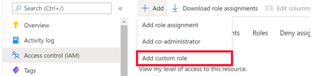
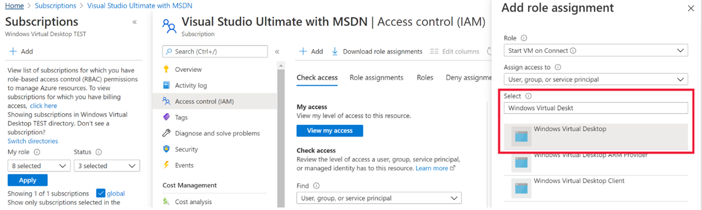
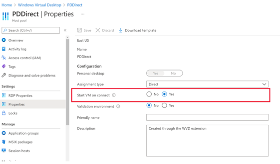

# Start virtual machine on connect (preview)

> [!IMPORTANT]
> The Start VM on Connect feature is currently in public preview.
> This preview version is provided without a service level agreement, and it's not recommended for production workloads. Certain features might not be supported or might have constrained capabilities. 
> For more information, see [Supplemental Terms of Use for Microsoft Azure Previews](https://azure.microsoft.com/support/legal/preview-supplemental-terms/).

The Start Virtual Machine (VM) on Connect (preview) feature lets you save costs by allowing end users to turn on their VMs only when they need them. You can then turn off VMs when they're not needed.

>[!NOTE]
>Windows Virtual Desktop (classic) doesn't support this feature.

## Requirements and limitations

You can only enable the Start VM on Connect feature for personal host pools. To learn more about personal host pools, see [Windows Virtual Desktop environment](environment-setup.md#host-pools).

The following Remote Desktop clients support the Start VM on Connect feature:

- [The web client](connect-web.md)
- [The Windows client (version 1.2748 or later)](connect-windows-7-10.md)
- [The Android client (version 10.0.10 or later)](connect-android.md)
- [The macOS client (version 10.6.4 or later)](connect-macos.md)

You can check for announcements about updates and client support on the [Tech Community forum](https://aka.ms/wvdtc).

The Azure Government cloud doesn't currently support Start VM on Connect.

## Create a custom role for Start VM on Connect

Before you can configure the Start VM on Connect feature, you'll need to assign your VM a custom RBAC (role-based access control) role. This role will let Windows Virtual Desktop manage the VMs in your subscription. You can also use this role to turn on VMs, check their status, and report diagnostic info. If you want to know more about what each role does, take a look at [Azure custom roles](../role-based-access-control/custom-roles.md).

### Use the Azure portal

To use the Azure portal to assign a custom role for Start VM on Connect:

1. Open the Azure portal and go to **Subscriptions**.

2. Go to **Access control (IAM)** and select **Add a custom role**.

    > [!div class="mx-imgBorder"]
    > 

3. Next, name the custom role and add a description. We recommend you name it “start VM on connect.”

4. On the **Permissions** tab, add the following permissions to the subscription you're assigning the role to: 
 
   - Microsoft.Compute/virtualMachines/start/action
   - Microsoft.Compute/virtualMachines/read

5. When you're finished, select **Ok**.

After that, you'll need to assign the role to grant access to Windows Virtual Desktop.

To assign the custom role:

1. In the **Access control (IAM) tab**, select **Add role assignments**.

2. Select the role you just created.

3. In the search bar, enter and select **Windows Virtual Desktop**.

      >[!NOTE]
      >You might see two apps if you have deployed Windows Virtual Desktop (classic). Assign the role to both apps you see.
      >
      > [!div class="mx-imgBorder"]
      > 

### Create a custom role with a JSON file template

If you're using a JSON file to create the custom role, the following example shows a basic template you can use. Make sure you replace the subscription ID value with the subscription ID you want to assign the role to.

```json
{
    "properties": {
        "roleName": "start VM on connect",
        "description": "Friendly description.",
        "assignableScopes": [
            "/subscriptions/<SubscriptionID>"
        ],
        "permissions": [
            {
                "actions": [
                    "Microsoft.Compute/virtualMachines/start/action",
                    "Microsoft.Compute/virtualMachines/read"
                ],
                "notActions": [],
                "dataActions": [],
                "notDataActions": []
            }
        ]
    }
}
```

## Configure the Start VM on Connect feature

Now that you've assigned your subscription the role, it's time to configure the Start VM on Connect feature!

### Deployment considerations 

Start VM on Connect is a host pool setting. If you only want a select group of users to use this feature, make sure you only assign the required role to the users you want to add.

>[!IMPORTANT]
> You can only configure this feature in existing host pools. This feature isn't available when you create a new host pool.

### Use the Azure portal

To use the Azure portal to configure Start VM on Connect:

1. Open your browser and go to [the Azure portal](https://portal.azure.com).

2. In the Azure portal, go to **Windows Virtual Desktop**.

3. Select **Host pools**, then find the host pool that contains the personal desktops you assigned the role to.

   >[!NOTE]
   > The host pool you configure this feature in must have personal desktops with direct role assignments. If the desktops in the host pool aren't configured correctly, the configuration process won't work.

4. In the host pool, select **Properties**. Under **Start VM on connect**, select **Yes**, then select **Save** to instantly apply the setting.

    > [!div class="mx-imgBorder"]
    > 

### Use PowerShell

To configure this setting with PowerShell, you need to make sure you have the names of the resource group and host pools you want to configure. You'll also need to install [the Azure PowerShell module (version 2.1.0 or later)](https://www.powershellgallery.com/packages/Az.DesktopVirtualization/2.1.0).

To configure Start VM on Connect using PowerShell:

1. Open a PowerShell command window.

2. Run the following cmdlet to enable Start VM on Connect:

    ```powershell
    Update-AzWvdHostPool -ResourceGroupName <resourcegroupname> -Name <hostpoolname> -StartVMOnConnect:$true
    ```

3. Run the following cmdlet to disable Start VM on Connect:

    ```powershell
    Update-AzWvdHostPool -ResourceGroupName <resourcegroupname> -Name <hostpoolname> -StartVMOnConnect:$false
    ```

## User experience

In typical sessions, the time it takes for a user to connect to a deallocated VM increases because the VM needs time to turn on again, much like turning on a physical computer. The Remote Desktop client has an indicator that lets the user know the PC is being powered on while they're connecting.

## Troubleshooting

If the feature runs into any issues, we recommend you use the Windows Virtual Desktop [diagnostics feature](diagnostics-log-analytics.md) to check for problems. If you receive an error message, make sure to pay close attention to the message content and copy down the error name somewhere for reference.

You can also use [Azure Monitor for Windows Virtual Desktop](azure-monitor.md) to get suggestions for how to resolve issues.

## Next steps

If you run into any issues that the troubleshooting documentation or the diagnostics feature couldn't solve, check out the [Start VM on Connect FAQ](start-virtual-machine-connect-faq.md).
