# Troubleshoot common Azure Virtual Desktop Agent issues

The Azure Virtual Desktop Agent can cause connection issues because of multiple factors:

 - An error on the broker that makes the agent stop the service.
 - Problems with updates.
 - Issues with installing during the agent installation, which disrupts connection to the session host.

This article will guide you through solutions to these common scenarios and how to address connection issues.

> [!NOTE]
> For troubleshooting issues related to session connectivity and the Azure Virtual Desktop agent, we recommend you review the event logs on your session host virtual machines (VMs) by going to **Event Viewer** > **Windows Logs** > **Application**. Look for events that have one of the following sources to identify your issue:
>
>- WVD-Agent
>- WVD-Agent-Updater
>- RDAgentBootLoader
>- MsiInstaller

## Error: The RDAgentBootLoader and/or Remote Desktop Agent Loader has stopped running

If you're seeing any of the following issues, this means that the boot loader, which loads the agent, was unable to install the agent properly and the agent service isn't running on your session host VM:

- **RDAgentBootLoader** is either stopped or not running.
- There's no status for **Remote Desktop Agent Loader**.

To resolve this issue, start the RDAgent boot loader:

1. In the Services window, right-click **Remote Desktop Agent Loader**.
1. Select **Start**. If this option is greyed out for you, you don't have administrator permissions and will need to get them to start the service.
1. Wait 10 seconds, then right-click **Remote Desktop Agent Loader**.
1. Select **Refresh**.
1. If the service stops after you started and refreshed it, you may have a registration failure. For more information, see [INVALID_REGISTRATION_TOKEN](#error-invalid_registration_token).

## Error: INVALID_REGISTRATION_TOKEN

On your session host VM, go to **Event Viewer** > **Windows Logs** > **Application**. If you see an event with ID 3277 with **INVALID_REGISTRATION_TOKEN** in the description, the registration token that has been used isn't recognized as valid.

To resolve this issue, create a valid registration token:

1. To create a new registration token, follow the steps in the [Generate a new registration key for the VM](#step-3-generate-a-new-registration-key-for-the-vm) section.
1. Open Registry Editor. 
1. Go to **HKEY_LOCAL_MACHINE\SOFTWARE\Microsoft\RDInfraAgent**.
1. Select **IsRegistered**. 
1. In the **Value data:** entry box, type **0** and select **Ok**. 
1. Select **RegistrationToken**. 
1. In the **Value data:** entry box, paste the registration token from step 1. 

   > [!div class="mx-imgBorder"]
   > 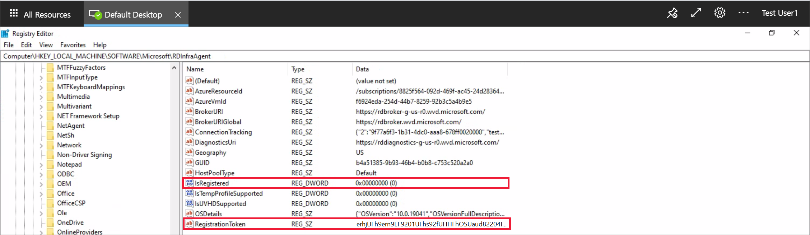

1. Open a PowerShell prompt as an administrator and run the following command to restart the RDAgentBootLoader service:

   ```powershell
   Restart-Service RDAgentBootLoader
   ```

1. Go back to Registry Editor.
1. Go to **HKEY_LOCAL_MACHINE\SOFTWARE\Microsoft\RDInfraAgent**.
1. Verify that **IsRegistered** is set to 1 and there is nothing in the data column for **RegistrationToken**. 

    > [!div class="mx-imgBorder"]
    > 

## Error: Agent cannot connect to broker with INVALID_FORM

On your session host VM, go to **Event Viewer** > **Windows Logs** > **Application**. If you see an event with ID 3277 with **INVALID_FORM** in the description, the agent can't connect to the broker or reach a particular endpoint. This may be because of certain firewall or DNS settings.

To resolve this issue, check that you can reach the two endpoints referred to as *BrokerURI* and *BrokerURIGlobal*:

1. Open Registry Editor. 
1. Go to **HKEY_LOCAL_MACHINE\SOFTWARE\Microsoft\RDInfraAgent**. 
1. Make note of the values for **BrokerURI** and **BrokerURIGlobal**.

   > [!div class="mx-imgBorder"]
   > 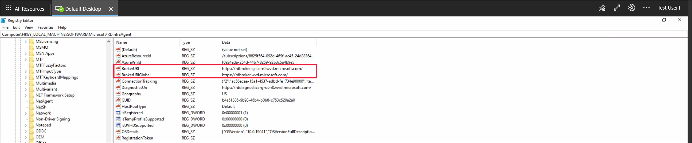

1. Open a web browser and enter your value for *BrokerURI* in the address bar and add */api/health* to the end, for example `https://rdbroker-g-us-r0.wvd.microsoft.com/api/health`.
1. Open another tab in the browser and enter your value for *BrokerURIGlobal* in the address bar and add */api/health* to the end, for example `https://rdbroker.wvd.microsoft.com/api/health`.
1. If your network isn't blocking the connection to the broker, both pages will load successfully and will show a message stating  **RD Broker is Healthy**, as shown in the following screenshots:

   > [!div class="mx-imgBorder"]
   > 

   > [!div class="mx-imgBorder"]
   > 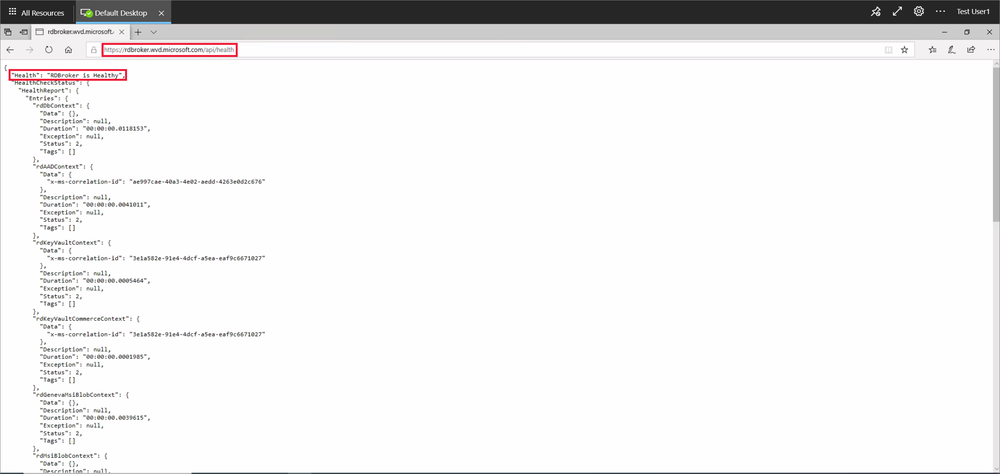
 
1. If the network is blocking broker connection, the pages will not load, as shown in the following screenshot. 

   > [!div class="mx-imgBorder"]
   > 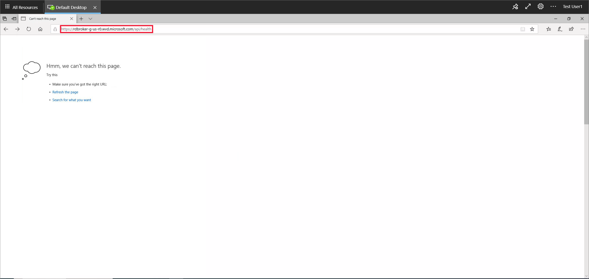

   > [!div class="mx-imgBorder"]
   > 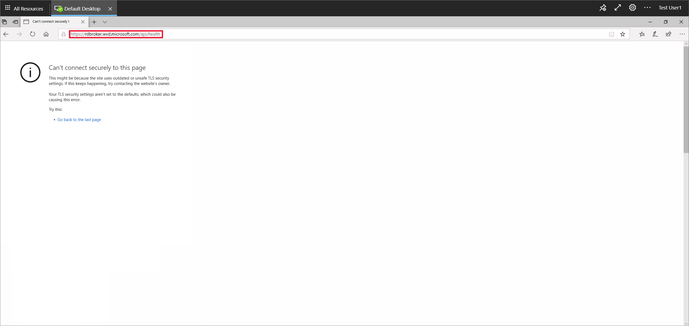

   You will need to unblock the required endpoints and then repeat steps 4 to 7. For more information, see [Required URL List](safe-url-list.md).

1. If this does not resolve your issue, make sure that you do not have any group policies with ciphers that block the agent to broker connection. Azure Virtual Desktop uses the same TLS 1.2 ciphers as [Azure Front Door](../frontdoor/concept-end-to-end-tls.md#supported-cipher-suites). For more information, see [Connection Security](network-connectivity.md#connection-security).

## Error: 3703

On your session host VM, go to **Event Viewer** > **Windows Logs** > **Application**. If you see an event with ID 3703 with **RD Gateway Url: is not accessible** in the description, the agent is unable to reach the gateway URLs. To successfully connect to your session host, you must allow network traffic to the URLs from the [Required URL List](safe-url-list.md). Also, make sure your firewall or proxy settings don't block these URLs. Unblocking these URLs is required to use Azure Virtual Desktop.

To resolve this issue, verify that your firewall and/or DNS settings are not blocking these URLs:
1. [Use Azure Firewall to protect Azure Virtual Desktop deployments.](../firewall/protect-azure-virtual-desktop.md).
1. Configure your [Azure Firewall DNS settings](../firewall/dns-settings.md).

## Error: 3019

On your session host VM, go to **Event Viewer** > **Windows Logs** > **Application**. If you see an event with ID 3019, this means the agent can't reach the web socket transport URLs. To successfully connect to your session host and allow network traffic to bypass these restrictions, you must unblock the URLs listed in the the [Required URL list](safe-url-list.md). Work with your networking team to make sure your firewall, proxy, and DNS settings aren't blocking these URLs. You can also check your network trace logs to identify where the Azure Virtual Desktop service is being blocked. If you open a Microsoft Support case for this particular issue, make sure to attach your network trace logs to the request.

## Error: InstallationHealthCheckFailedException

On your session host VM, go to **Event Viewer** > **Windows Logs** > **Application**. If you see an event with ID 3277 with **InstallationHealthCheckFailedException** in the description, this means the stack listener isn't working because the terminal server has toggled the registry key for the stack listener.

To resolve this issue:
1. Check to see if [the stack listener is working](#error-stack-listener-isnt-working-on-a-windows-10-2004-session-host-vm)
1. If the stack listener isn't working, [manually uninstall and reinstall the stack component](#error-session-host-vms-are-stuck-in-unavailable-or-upgrading-state).

## Error: ENDPOINT_NOT_FOUND

On your session host VM, go to **Event Viewer** > **Windows Logs** > **Application**. If you see an event with ID 3277 with **ENDPOINT_NOT_FOUND** in the description, this means the broker couldn't find an endpoint to establish a connection with. This connection issue can happen for one of the following reasons:

- There aren't any session host VMs in your host pool.
- The session host VMs in your host pool aren't active.
- All session host VMs in your host pool have exceeded the max session limit.
- None of the VMs in your host pool have the agent service running on them.

To resolve this issue:

1. Make sure the VM is powered on and hasn't been removed from the host pool.
1. Make sure that the VM hasn't exceeded the max session limit.
1. Make sure the [agent service is running](#error-the-rdagentbootloader-andor-remote-desktop-agent-loader-has-stopped-running) and the [stack listener is working](#error-stack-listener-isnt-working-on-a-windows-10-2004-session-host-vm).
1. Make sure [the agent can connect to the broker](#error-agent-cannot-connect-to-broker-with-invalid_form).
1. Make sure [your VM has a valid registration token](#error-invalid_registration_token).
1. Make sure [the VM registration token hasn't expired](./faq.yml). 

## Error: InstallMsiException

On your session host VM, go to **Event Viewer** > **Windows Logs** > **Application**. If you see an event with ID 3277 with **InstallMsiException** in the description, the installer is already running for another application while you're trying to install the agent, or group policy is blocking `msiexec.exe` from running.

To check whether group policy is blocking `msiexec.exe` from running:   

1. Open Resultant Set of Policy by running **rsop.msc** from an elevated command prompt.
1. In the **Resultant Set of Policy** window that pops up, go to **Computer Configuration > Administrative Templates > Windows Components > Windows Installer > Turn off Windows Installer**. If the state is **Enabled**, work with your Active Directory team to allow `msiexec.exe` to run.

   > [!div class="mx-imgBorder"]
   > 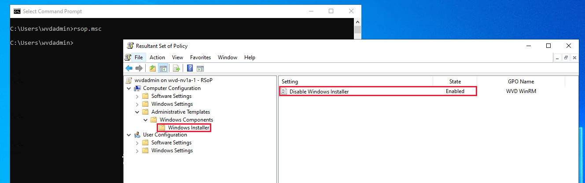

   > [!NOTE]
   > This isn't a comprehensive list of policies, just the one we're currently aware of.

## Error: Win32Exception

On your session host VM, go to **Event Viewer** > **Windows Logs** > **Application**. If you see an event with ID 3277 with **InstallMsiException** in the description, a policy is blocking `cmd.exe` from launching. Blocking this program prevents you from running the console window, which is what you need to use to restart the service whenever the agent updates.

1. Open Resultant Set of Policy by running **rsop.msc** from an elevated command prompt.
1. In the **Resultant Set of Policy** window that pops up, go to **User Configuration > Administrative Templates > System > Prevent access to the command prompt**. If the state is **Enabled**, work with your Active Directory team to allow `cmd.exe` to run.

## Error: Stack listener isn't working on a Windows 10 2004 session host VM

On your session host VM, from a command prompt run `qwinsta.exe` and make note of the version number that appears next to **rdp-sxs** in the *SESSIONNAME* column. If the *STATE* column for **rdp-tcp** and **rdp-sxs** entries isn't **Listen**, or if **rdp-tcp** and **rdp-sxs** entries aren't listed at all, it means that there's a stack issue. Stack updates get installed along with agent updates, but if this hasn't been successful, the Azure Virtual Desktop Listener won't work.

To resolve this issue:

1. Open the Registry Editor.
1. Go to **HKEY_LOCAL_MACHINE\SYSTEM\CurrentControlSet\Control\Terminal Server\WinStations**.
1. Under **WinStations** you may see several folders for different stack versions, select a folder that matches the version information you saw when running `qwinsta.exe` in a command prompt.
    1. Find **fReverseConnectMode** and make sure its data value is **1**. Also make sure that **fEnableWinStation** is set to **1**.

       > [!div class="mx-imgBorder"]
       > 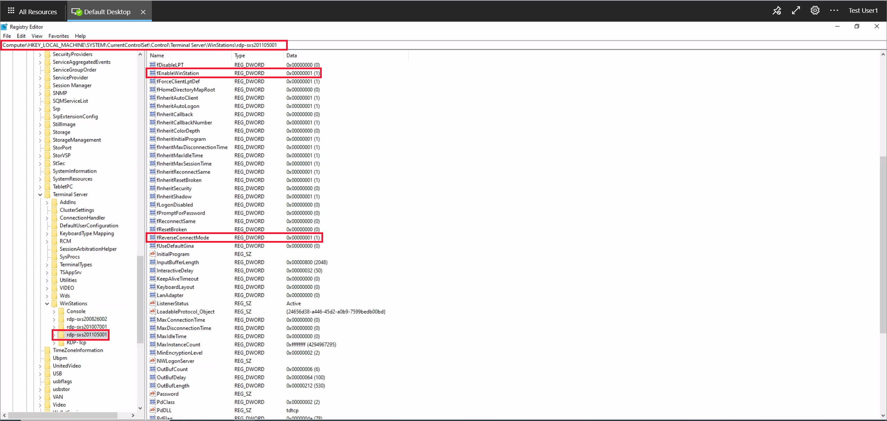

    1. If **fReverseConnectMode** isn't set to **1**, select **fReverseConnectMode** and enter **1** in its value field. 
    1. If **fEnableWinStation** isn't set to **1**, select **fEnableWinStation** and enter **1** into its value field.
1. Repeat the previous steps for each folder that matches the version information you saw when running `qwinsta.exe` in a command prompt. 

   > [!TIP]
   > To change the **fReverseConnectMode** or **fEnableWinStation** mode for multiple VMs at a time, you can do one of the following two things:
   >
   > - Export the registry key from the machine that you already have working and import it into all other machines that need this change.
   > - Create a group policy object (GPO) that sets the registry key value for the machines that need the change.

1. Restart your session host VM.
1. Open the Registry Editor.
1. Go to **HKEY_LOCAL_MACHINE\SYSTEM\CurrentControlSet\Control\Terminal Server\ClusterSettings**.
1. Under **ClusterSettings**, find **SessionDirectoryListener** and make sure its data value is `rdp-sxs<version number`, where `<version number` matches the version information you saw when running `qwinsta.exe` in a command prompt .
1. If **SessionDirectoryListener** isn't set to `rdp-sxs<version number`, you'll need to follow the steps in the section [Your issue isn't listed here or wasn't resolved](#your-issue-isnt-listed-here-or-wasnt-resolved) below.

## Error: DownloadMsiException

On your session host VM, go to **Event Viewer** > **Windows Logs** > **Application**. If you see an event with ID 3277 with **DownloadMsiException** in the description, there isn't enough space on the disk for the RDAgent.

To resolve this issue, make space on your disk by:
   - Deleting files that are no longer in user.
   - Increasing the storage capacity of your session host VM.

## Error: Agent fails to update with MissingMethodException

On your session host VM, go to **Event Viewer** > **Windows Logs** > **Application**. If you see an event with ID 3389 with **MissingMethodException: Method not found** in the description, this means the Azure Virtual Desktop agent didn't update successfully and reverted to an earlier version. This may be because the version number of the .NET framework currently installed on your VMs is lower than 4.7.2. To resolve this issue, you need to upgrade the .NET to version 4.7.2 or later by following the installation instructions in the [.NET Framework documentation](https://support.microsoft.com/topic/microsoft-net-framework-4-7-2-offline-installer-for-windows-05a72734-2127-a15d-50cf-daf56d5faec2).

## Error: Session host VMs are stuck in Unavailable or Upgrading state

If the status listed for session hosts in your host pool always says **Unavailable** or **Upgrading**, the agent or stack didn't install successfully. 

To resolve this issue, first reinstall the side-by-side stack:

1. Sign in to your session host VM as an administrator.
1. From an elevated PowerShell prompt run `qwinsta.exe` and make note of the version number that appears next to **rdp-sxs** in the *SESSIONNAME* column. If the *STATE* column for **rdp-tcp** and **rdp-sxs** entries isn't **Listen**, or if **rdp-tcp** and **rdp-sxs** entries aren't listed at all, it means that there's a stack issue.

1. Run the following command to stop the RDAgentBootLoader service:

   ```powershell
   Stop-Service RDAgentBootLoader
   ```

1. Go to **Control Panel** > **Programs** > **Programs and Features**, or on Windows 11 go to the **Settings App > Apps**.
1. Uninstall the latest version of the **Remote Desktop Services SxS Network Stack** or the version listed in Registry Editor in **HKEY_LOCAL_MACHINE\SYSTEM\CurrentControlSet\Control\Terminal Server\WinStations** under the value for  **ReverseConnectionListener**.
1. Back at the PowerShell prompt, run the following commands to add the file path of the latest installer available on your session host VM for the side-by-side stack to a variable and list its name:

   ```powershell
   $sxsMsi = (Get-ChildItem "$env:SystemDrive\Program Files\Microsoft RDInfra\" | ? Name -like SxSStack*.msi | Sort-Object CreationTime -Descending | Select-Object -First 1).FullName
   $sxsMsi
   ```

1. Install the latest installer available on your session host VM for the side-by-side stack by running the following command:

   ```powershell
   msiexec /i $sxsMsi
   ```

1. Restart your session host VM.
1. From a command prompt run `qwinsta.exe` again and verify the *STATE* column for **rdp-tcp** and **rdp-sxs** entries is **Listen**. If not, you will need to [re-register your VM and reinstall the agent](#your-issue-isnt-listed-here-or-wasnt-resolved) component.

## Error: Connection not found: RDAgent does not have an active connection to the broker

Your session host VMs may be at their connection limit and can't accept new connections.

To resolve this issue, either:
- Decrease the max session limit. This ensures that resources are more evenly distributed across session hosts and will prevent resource depletion.
- Increase the resource capacity of the session host VMs.

## Error: Operating a Pro VM or other unsupported OS

The side-by-side stack is only supported by Windows Enterprise or Windows Server SKUs, which means that operating systems like Pro VM aren't. If you don't have an Enterprise or Server SKU, the stack will be installed on your VM but won't be activated, so you won't see it show up when you run **qwinsta** in your command line.

To resolve this issue, [create session host VMs](expand-existing-host-pool.md) using a [supported operating system](prerequisites.md#operating-systems-and-licenses).

## Error: NAME_ALREADY_REGISTERED

The name of your session host VM has already been registered and is probably a duplicate.

To resolve this issue:
1. Follow the steps in the [Remove the session host from the host pool](#step-2-remove-the-session-host-from-the-host-pool) section.
1. [Create another VM](expand-existing-host-pool.md#add-virtual-machines-with-the-azure-portal). Make sure to choose a unique name for this VM.
1. Go to the [Azure portal](https://portal.azure.com) and open the **Overview** page for the host pool your VM was in. 
1. Open the **Session Hosts** tab and check to make sure all session hosts are in that host pool.
1. Wait for 5-10 minutes for the session host status to say **Available**.

   > [!div class="mx-imgBorder"]
   > 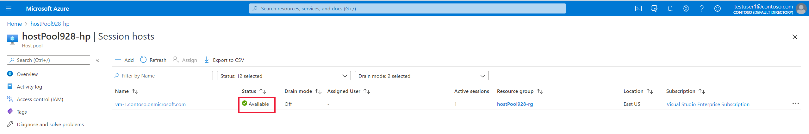

## Your issue isn't listed here or wasn't resolved

If you can't find your issue in this article or the instructions didn't help you, we recommend you uninstall, reinstall, and re-register the Azure Virtual Desktop Agent. The instructions in this section will show you how to reregister your session host VM to the Azure Virtual Desktop service by:
1. Uninstalling all agent, boot loader, and stack components
1. Removing the session host from the host pool
1. Generating a new registration key for the VM
1. Reinstalling the Azure Virtual Desktop Agent and boot loader.

Follow these instructions in this section if one or more of the following scenarios apply to you:

- The state of your session host VM is stuck as **Upgrading** or **Unavailable**.
- Your stack listener isn't working and you're running on Windows 10 version 1809, 1903, or 1909.
- You're receiving an **EXPIRED_REGISTRATION_TOKEN** error.
- You're not seeing your session host VMs show up in the session hosts list.
- You don't see the **Remote Desktop Agent Loader** service in the Services console.
- You don't see the **RdAgentBootLoader** component as a running process in Task Manager.
- You're receiving a **Connection Broker couldn't validate the settings** error on custom image VMs.
- Previous sections in this article didn't resolve your issue.

### Step 1: Uninstall all agent, boot loader, and stack component programs

Before reinstalling the agent, boot loader, and stack, you must uninstall any existing components from your VM. To uninstall all agent, boot loader, and stack component programs:
1. Sign in to your session host VM as an administrator.
2. Go to **Control Panel** > **Programs** > **Programs and Features**, or on Windows 11 go to the **Settings App > Apps**.
3. Uninstall the following programs, then restart your session host VM:

   > [!CAUTION]
   > When uninstalling **Remote Desktop Services SxS Network Stack**, you'll be prompted that *Remote Desktop Services* and *Remote Desktop Services UserMode Port Redirector* should be closed. If you're connected to the session host VM using RDP, select **Do not close applications** then select **OK**, otherwise your RDP connection will be closed.
   > 
   > [!div class="mx-imgBorder"]
   > 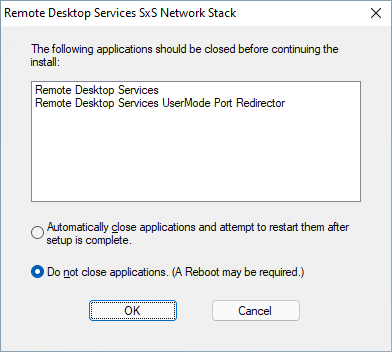

   - Remote Desktop Agent Boot Loader
   - Remote Desktop Services Infrastructure Agent
   - Remote Desktop Services Infrastructure Geneva Agent
   - Remote Desktop Services SxS Network Stack
   
   > [!NOTE]
   > You may see multiple instances of these programs. Make sure to remove all of them.

   > [!div class="mx-imgBorder"]
   > 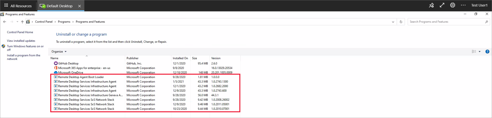

### Step 2: Remove the session host from the host pool

When you remove the session host from the host pool, the session host is no longer registered to that host pool. This acts as a reset for the session host registration. To remove the session host from the host pool:

1. Sign in to the [Azure portal](https://portal.azure.com).
1. In the search bar, type *Azure Virtual Desktop* and select the matching service entry.
1. Select **Host pools** and select the name of the host pool that your session host VM is in.
1. Select **Session Hosts** to see the list of all session hosts in that host pool.
1. Look at the list of session hosts and tick the box next to the session host that you want to remove.
1. Select **Remove**.  

   > [!div class="mx-imgBorder"]
   > 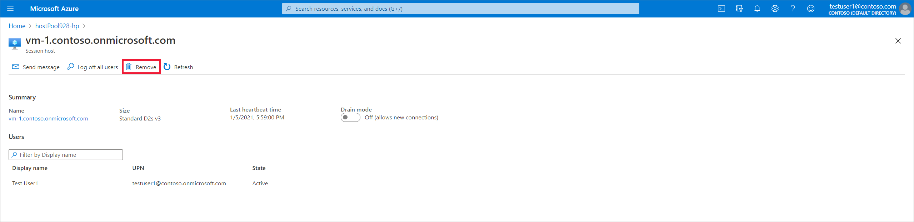

### Step 3: Generate a new registration key for the VM

You must generate a new registration key that is used to re-register your session VM to the host pool and to the service. To generate a new registration key for the VM:
1. Sign in to the [Azure portal](https://portal.azure.com).
1. In the search bar, type *Azure Virtual Desktop* and select the matching service entry.
1. Select **Host pools** and select the name of the host pool that your session host VM is in.
1. On the **Overview** blade, select **Registration key**.

   > [!div class="mx-imgBorder"]
   > 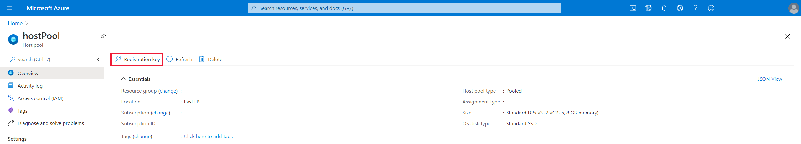

1. Open the **Registration key** tab and select **Generate new key**.
1. Enter the expiration date and then select **Ok**.  

  > [!NOTE]
  > The expiration date can be no less than an hour and no longer than 27 days from its generation time and date. Generate a registration key only for as long as you need.

1. Copy the newly generated key to your clipboard or download the file. You'll need this key later.

### Step 4: Reinstall the agent and boot loader

By reinstalling the most updated version of the agent and boot loader, the side-by-side stack and Geneva monitoring agent automatically get installed as well. To reinstall the agent and boot loader:

1. Sign in to your session host VM as an administrator and use the correct version of the agent installer for the operating system of your session host VM:
    1. For Windows 10 and Windows 11:
        1. [Azure Virtual Desktop Agent](https://query.prod.cms.rt.microsoft.com/cms/api/am/binary/RWrmXv)
        1. [Azure Virtual Desktop Agent Bootloader](https://query.prod.cms.rt.microsoft.com/cms/api/am/binary/RWrxrH)
    1. For Windows 7:
        1. [Azure Virtual Desktop Agent](https://query.prod.cms.rt.microsoft.com/cms/api/am/binary/RE3JZCm)
        1. [Azure Virtual Desktop Agent Bootloader](https://query.prod.cms.rt.microsoft.com/cms/api/am/binary/RE3K2e3)

   > [!TIP]
   > For each of the the agent and boot loader installers you downloaded, you may need to unblock them. Right-click each file and select **Properties**, then select **Unblock**, and finally select **OK**.

1. Run the agent installer
1. When the installer asks you for the registration token, paste the registration key from the from your clipboard.

   > [!div class="mx-imgBorder"]
   > 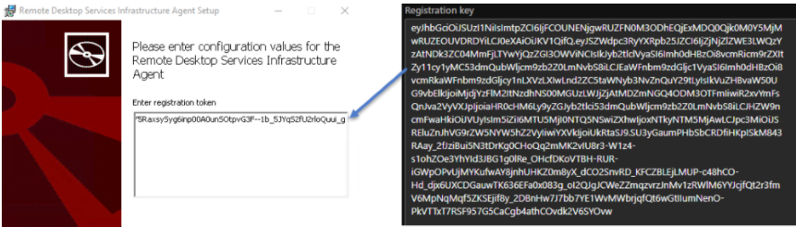

1. Run the boot loader installer.
1. Restart your session VM. 
1. Sign in to the [Azure portal](https://portal.azure.com).
1. In the search bar, type *Azure Virtual Desktop* and select the matching service entry.
1. Select **Host pools** and select the name of the host pool that your session host VM is in.
1. Select **Session Hosts** to see the list of all session hosts in that host pool.
1. You should now see the session host registered in the host pool with the status **Available**. 

   > [!div class="mx-imgBorder"]
   > 

## Next steps

If the issue continues, create a support case and include detailed information about the problem you're having and any actions you've taken to try to resolve it. The following list includes other resources you can use to troubleshoot issues in your Azure Virtual Desktop deployment.

- For an overview on troubleshooting Azure Virtual Desktop and the escalation tracks, see [Troubleshooting overview, feedback, and support](troubleshoot-set-up-overview.md).
- To troubleshoot issues while creating a host pool in a Azure Virtual Desktop environment, see [Environment and host pool creation](troubleshoot-set-up-issues.md).
- To troubleshoot issues while configuring a virtual machine (VM) in Azure Virtual Desktop, see [Session host virtual machine configuration](troubleshoot-vm-configuration.md).
- To troubleshoot issues with Azure Virtual Desktop client connections, see [Azure Virtual Desktop service connections](troubleshoot-service-connection.md).
- To troubleshoot issues with Remote Desktop clients, see [Troubleshoot the Remote Desktop client](troubleshoot-client.md).
- To troubleshoot issues when using PowerShell with Azure Virtual Desktop, see [Azure Virtual Desktop PowerShell](troubleshoot-powershell.md).
- To learn more about the service, see [Azure Virtual Desktop environment](environment-setup.md).
- To go through a troubleshoot tutorial, see [Tutorial: Troubleshoot Resource Manager template deployments](../azure-resource-manager/templates/template-tutorial-troubleshoot.md).
- To learn about auditing actions, see [Audit operations with Resource Manager](../azure-monitor/essentials/activity-log.md).
- To learn about actions to determine the errors during deployment, see [View deployment operations](../azure-resource-manager/templates/deployment-history.md).
