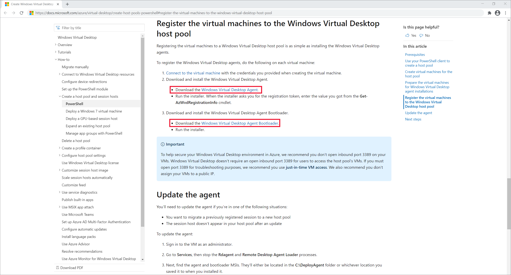

# Troubleshoot common Windows Virtual Desktop Agent issues

The Windows Virtual Desktop Agent can cause connection issues because of multiple factors:
   - An error on the broker that makes the agent stop the service.
   - Problems with updates.
   - Issues with installing during the agent installation, which disrupts connection to the session host.

This article will guide you through solutions to these common scenarios and how to address connection issues.

>[!NOTE]
>For troubleshooting issues related to session connectivity and the Windows Virtual Desktop agent, we recommend you review the event logs in **Event Viewer** > **Windows Logs** > **Application**. Look for events that have one of the following sources to identify your issue:
>
>- WVD-Agent
>- WVD-Agent-Updater
>- RDAgentBootLoader
>- MsiInstaller

## Error: The RDAgentBootLoader and/or Remote Desktop Agent Loader has stopped running

If you're seeing any of the following issues, this means that the boot loader, which loads the agent, was unable to install the agent properly and the agent service isn't running:
- **RDAgentBootLoader** is either stopped or not running.
- There's no status for **Remote Desktop Agent Loader**.

To resolve this issue, start the RDAgent boot loader:

1. In the Services window, right-click **Remote Desktop Agent Loader**.
2. Select **Start**. If this option is greyed out for you, you don't have administrator permissions and will need to get them to start the service.
3. Wait 10 seconds, then right-click **Remote Desktop Agent Loader**.
4. Select **Refresh**.
5. If the service stops after you started and refreshed it, you may have a registration failure. For more information, see [INVALID_REGISTRATION_TOKEN](#error-invalid_registration_token).

## Error: INVALID_REGISTRATION_TOKEN

Go to **Event Viewer** > **Windows Logs** > **Application**. If you see an event with ID 3277, that says **INVALID_REGISTRATION_TOKEN** in the description, the registration token that you have isn't recognized as valid.

To resolve this issue, create a valid registration token:

1. To create a new registration token, follow the steps in the [Generate a new registration key for the VM](#step-3-generate-a-new-registration-key-for-the-vm) section.
2. Open the Registry Editor. 
3. Go to **HKEY_LOCAL_MACHINE** > **SOFTWARE** > **Microsoft** > **RDInfraAgent**.
4. Select **IsRegistered**. 
5. In the **Value data:** entry box, type **0** and select **Ok**. 
6. Select **RegistrationToken**. 
7. In the **Value data:** entry box, paste the registration token from step 1. 

   > [!div class="mx-imgBorder"]
   > 

8. Open a command prompt as an administrator.
9. Enter **net stop RDAgentBootLoader**. 
10. Enter **net start RDAgentBootLoader**. 
11. Open the Registry Editor.
12. Go to **HKEY_LOCAL_MACHINE** > **SOFTWARE** > **Microsoft** > **RDInfraAgent**.
13. Verify that **IsRegistered** is set to 1 and there is nothing in the data column for **RegistrationToken**. 

   > [!div class="mx-imgBorder"]
   > 

## Error: Agent cannot connect to broker with INVALID_FORM

Go to **Event Viewer** > **Windows Logs** > **Application**. If you see an event with ID 3277 that says "INVALID_FORM" in the description, something went wrong with the communication between the agent and the broker. The agent can't connect to the broker or reach a particular URL because of certain firewall or DNS settings.

To resolve this issue, check that you can reach BrokerURI and BrokerURIGlobal:
1. Open the Registry Editor. 
2. Go to **HKEY_LOCAL_MACHINE** > **SOFTWARE** > **Microsoft** > **RDInfraAgent**. 
3. Make note of the values for **BrokerURI** and **BrokerURIGlobal**.

   > [!div class="mx-imgBorder"]
   > 

 
4. Open a browser and go to *\<BrokerURI\>api/health*. 
   - Make sure you use the value from step 3 in the **BrokerURI**. In this section's example, it would be <https://rdbroker-g-us-r0.wvd.microsoft.com/api/health>.
5. Open another tab in the browser and go to *\<BrokerURIGlobal\>api/health*. 
   - Make sure you use the value from step 3 in the **BrokerURIGlobal** link. In this section's example, it would be <https://rdbroker.wvd.microsoft.com/api/health>.
6. If the network isn't blocking broker connection, both pages will load successfully and will show a message that says **"RD Broker is Healthy"** as shown in the following screenshots. 

   > [!div class="mx-imgBorder"]
   > 

   > [!div class="mx-imgBorder"]
   > 
 

7. If the network is blocking broker connection, the pages will not load, as shown in the following screenshot. 

   > [!div class="mx-imgBorder"]
   > 

   > [!div class="mx-imgBorder"]
   > 

8. If the network is blocking these URLs, you will need to unblock the required URLs. For more information, see [Required URL List](safe-url-list.md).
9. If this does not resolve your issue, make sure that you do not have any group policies with ciphers that block the agent to broker connection. Windows Virtual Desktop uses the same TLS 1.2 ciphers as [Azure Front Door](../frontdoor/front-door-faq.MD#what-are-the-current-cipher-suites-supported-by-azure-front-door). For more information, see [Connection Security](network-connectivity.md#connection-security).

## Error: 3703

Go to **Event Viewer** > **Windows Logs** > **Application**. If you see an event with ID 3703 that says "RD Gateway Url: is not accessible" in the description, the agent is unable to reach the gateway URLs. To successfully connect to your session host and allow network traffic to these endpoints to bypass restrictions, you must unblock the URLs from the [Required URL List](safe-url-list.md). Also, make sure your firewall or proxy settings don't block these URLs. Unblocking these URLs is required to use Windows Virtual Desktop.

To resolve this issue, verify that your firewall and/or DNS settings are not blocking these URLs:
1. [Use Azure Firewall to protect Windows Virtual Desktop deployments.](../firewall/protect-windows-virtual-desktop.md).
2. Configure your [Azure Firewall DNS settings](../firewall/dns-settings.md).

## Error: 3019

Go to **Event Viewer** > **Windows Logs** > **Application**. If you see an event with ID 3019, this means the agent can't reach the web socket transport URLs. To successfully connect to your session host and allow network traffic to bypass these restrictions, you must unblock the URLs listed in the the [Required URL list](safe-url-list.md). Work with the Azure Networking team to make sure your firewall, proxy, and DNS settings aren't blocking these URLs. You can also check your network trace logs to identify where the Windows Virtual Desktop service is being blocked. If you open a support request for this particular issue, make sure to attach your network trace logs to the request.

## Error: InstallationHealthCheckFailedException

Go to **Event Viewer** > **Windows Logs** > **Application**. If you see an event with ID 3277 that says "InstallationHealthCheckFailedException" in the description, that means the stack listener isn't working because the terminal server has toggled the registry key for the stack listener.

To resolve this issue:
1. Check to see if [the stack listener is working](#error-stack-listener-isnt-working-on-windows-10-2004-vm).
2. If the stack listener isn't working, [manually uninstall and reinstall the stack component](#error-vms-are-stuck-in-unavailable-or-upgrading-state).

## Error: ENDPOINT_NOT_FOUND

Go to **Event Viewer** > **Windows Logs** > **Application**. If you see an event with ID 3277 that says "ENDPOINT_NOT_FOUND" in the description that means the broker couldn't find an endpoint to establish a connection with. This connection issue can happen for one of the following reasons:

- There aren't VMs in your host pool
- The VMs in your host pool aren't active
- All VMs in your host pool have exceeded the max session limit
- None of the VMs in your host pool have the agent service running on them

To resolve this issue:

1. Make sure the VM is powered on and hasn't been removed from the host pool.
2. Make sure that the VM hasn't exceeded the max session limit.
3. Make sure the [agent service is running](#error-the-rdagentbootloader-andor-remote-desktop-agent-loader-has-stopped-running) and the [stack listener is working](#error-stack-listener-isnt-working-on-windows-10-2004-vm).
4. Make sure [the agent can connect to the broker](#error-agent-cannot-connect-to-broker-with-invalid_form).
5. Make sure [your VM has a valid registration token](#error-invalid_registration_token).
6. Make sure [the VM registration token hasn't expired](faq.md#how-often-should-i-turn-my-vms-on-to-prevent-registration-issues). 

## Error: InstallMsiException

Go to **Event Viewer** > **Windows Logs** > **Application**. If you see an event with ID 3277, that says **InstallMsiException** in the description, the installer is already running for another application while you're trying to install the agent, or a policy is blocking the msiexec.exe program from running.

To resolve this issue, disable the following policy:
   - Turn off Windows Installer  
      - Category Path: Computer Configuration\Administrative Templates\Windows Components\Windows Installer
   
>[!NOTE]
>This isn't a comprehensive list of policies, just the ones we're currently aware of.

To disable a policy:
1. Open a command prompt as an administrator.
2. Enter and run **rsop.msc**.
3. In the **Resultant Set of Policy** window that pops up, go to the category path.
4. Select the policy.
5. Select **Disabled**.
6. Select **Apply**.   

   > [!div class="mx-imgBorder"]
   > 

## Error: Win32Exception

Go to **Event Viewer** > **Windows Logs** > **Application**. If you see an event with ID 3277, that says **InstallMsiException** in the description, a policy is blocking cmd.exe from launching. Blocking this program prevents you from running the console window, which is what you need to use to restart the service whenever the agent updates.

To resolve this issue, disable the following policy:
   - Prevent access to the command prompt   
      - Category Path: User Configuration\Administrative Templates\System
    
>[!NOTE]
>This isn't a comprehensive list of policies, just the ones we're currently aware of.

To disable a policy:
1. Open a command prompt as an administrator.
2. Enter and run **rsop.msc**.
3. In the **Resultant Set of Policy** window that pops up, go to the category path.
4. Select the policy.
5. Select **Disabled**.
6. Select **Apply**.   

## Error: Stack listener isn't working on Windows 10 2004 VM

Run **qwinsta** in your command prompt and make note of the version number that appears next to **rdp-sxs**. If you're not seeing the **rdp-tcp** and **rdp-sxs** components say **Listen** next to them or they aren't showing up at all after running **qwinsta**, it means that there's a stack issue. Stack updates get installed along with agent updates, and when this installation goes awry, the Windows Virtual Desktop Listener won't work.

To resolve this issue:
1. Open the Registry Editor.
2. Go to **HKEY_LOCAL_MACHINE** > **SYSTEM** > **CurrentControlSet** > **Control** > **Terminal Server** > **WinStations**.
3. Under **WinStations** you may see several folders for different stack versions, select the folder that matches the version information you saw when running **qwinsta** in your Command Prompt.
4. Find **fReverseConnectMode** and make sure its data value is **1**. Also make sure that **fEnableWinStation** is set to **1**.

   > [!div class="mx-imgBorder"]
   > 

5. If **fReverseConnectMode** isn't set to **1**, select **fReverseConnectMode** and enter **1** in its value field. 
6. If **fEnableWinStation** isn't set to **1**, select **fEnableWinStation** and enter **1** into its value field.
7. Restart your VM. 

>[!NOTE]
>To change the **fReverseConnectMode** or **fEnableWinStation** mode for multiple VMs at a time, you can do one of the following two things:
>
>- Export the registry key from the machine that you already have working and import it into all other machines that need this change.
>- Create a group policy object (GPO) that sets the registry key value for the machines that need the change.

7. Go to **HKEY_LOCAL_MACHINE** > **SYSTEM** > **CurrentControlSet** > **Control** > **Terminal Server** > **ClusterSettings**.
8. Under **ClusterSettings**, find **SessionDirectoryListener** and make sure its data value is **rdp-sxs...**.
9. If **SessionDirectoryListener** isn't set to **rdp-sxs...**, you'll need to follow the steps in the [Uninstall the agent and boot loader](#step-1-uninstall-all-agent-boot-loader-and-stack-component-programs) section to first uninstall the agent, boot loader, and stack components, and then [Reinstall the agent and boot loader](#step-4-reinstall-the-agent-and-boot-loader). This will reinstall the side-by-side stack.

## Error: Heartbeat issue where users keep getting disconnected from session hosts

If your server isn't picking up a heartbeat from the Windows Virtual Desktop service, you'll need to change the heartbeat threshold. Follow the instructions in this section if one or more of the following scenarios apply to you:

- You're receiving a **CheckSessionHostDomainIsReachableAsync** error
- You're receiving a **ConnectionBrokenMissedHeartbeatThresholdExceeded** error
- You're receiving a **ConnectionEstablished:UnexpectedNetworkDisconnect** error
- User clients keep getting disconnected
- Users keep getting disconnected from their session hosts

To change the heartbeat threshold:
1. Open your command prompt as an administrator.
2. Enter the **qwinsta** command and run it.
3. There should be two stack components displayed: **rdp-tcp** and **rdp-sxs**. 
   - Depending on the version of the OS you're using, **rdp-sxs** may be followed by the build number. If it is, make sure to write down this number for later.
4. Open the Registry Editor.
5. Go to **HKEY_LOCAL_MACHINE** > **SYSTEM** > **CurrentControlSet** > **Control** > **Terminal Server** > **WinStations**.
6. Under **WinStations**, you may see several folders for different stack versions. Select the folder that matches the version number from step 3.
7. Create a new registry DWORD by right-clicking the registry editor, then selecting **New** > **DWORD (32-bit) Value**. When you create the DWORD, enter the following values:
   - HeartbeatInterval: 10000
   - HeartbeatWarnCount: 30 
   - HeartbeatDropCount: 60 
8. Restart your VM.

>[!NOTE]
>If changing the heartbeat threshold doesn't resolve your issue, you may have an underlying network issue that you'll need need to contact the Azure Networking team about.

## Error: DownloadMsiException

Go to **Event Viewer** > **Windows Logs** > **Application**. If you see an event with ID 3277, that says **DownloadMsiException** in the description, there isn't enough space on the disk for the RDAgent.

To resolve this issue, make space on your disk by:
   - Deleting files that are no longer in user
   - Increasing the storage capacity of your VM

## Error: Agent fails to update with MissingMethodException

Go to **Event Viewer** > **Windows Logs** > **Application**. If you see an event with ID 3389 that says "MissingMethodException: Method not found" in the description, that means the Windows Virtual Desktop agent didn't update successfully and reverted to an earlier version. This may be because the version number of the .NET framework currently installed on your VMs is lower than 4.7.2. To resolve this issue, you need to upgrade the .NET to version 4.7.2 or later by following the installation instructions in the [.NET Framework documentation](https://support.microsoft.com/topic/microsoft-net-framework-4-7-2-offline-installer-for-windows-05a72734-2127-a15d-50cf-daf56d5faec2).


## Error: VMs are stuck in Unavailable or Upgrading state

Open a PowerShell window as an administrator and run the following cmdlet:

```powershell
Get-AzWvdSessionHost -ResourceGroupName <resourcegroupname> -HostPoolName <hostpoolname> | Select-Object *
```

If the status listed for the session host or hosts in your host pool always says "Unavailable" or "Upgrading," the agent or stack didn't install successfully.

To resolve this issue, reinstall the side-by-side stack:
1. Open a command prompt as an administrator.
2. Enter **net stop RDAgentBootLoader**. 
3. Go to **Control Panel** > **Programs** > **Programs and Features**.
4. Uninstall the latest version of the **Remote Desktop Services SxS Network Stack** or the version listed in **HKEY_LOCAL_MACHINE** > **SYSTEM** > **CurrentControlSet** > **Control** > **Terminal Server** > **WinStations** under **ReverseConnectListener**.
5. Open a console window as an administrator and go to **Program Files** > **Microsoft RDInfra**.
6. Select the **SxSStack** component or run the **msiexec /i SxsStack-<version>.msi** command to install the MSI.
8. Restart your VM.
9. Go back to the command prompt and run the **qwinsta** command.
10. Verify that the stack component installed in step 6 says **Listen** next to it.
   - If so, enter **net start RDAgentBootLoader** in the command prompt and restart your VM.
   - If not, you will need to [re-register your VM and reinstall the agent](#your-issue-isnt-listed-here-or-wasnt-resolved) component.

## Error: Connection not found: RDAgent does not have an active connection to the broker

Your VMs may be at their connection limit, so the VM can't accept new connections.

To resolve this issue:
   - Decrease the max session limit. This ensures that resources are more evenly distributed across session hosts and will prevent resource depletion.
   - Increase the resource capacity of the VMs.

## Error: Operating a Pro VM or other unsupported OS

The side-by-side stack is only supported by Windows Enterprise or Windows Server SKUs, which means that operating systems like Pro VM aren't. If you don't have an Enterprise or Server SKU, the stack will be installed on your VM but won't be activated, so you won't see it show up when you run **qwinsta** in your command line.

To resolve this issue, create a VM that is Windows Enterprise or Windows Server.
1. Go to [Virtual machine details](create-host-pools-azure-marketplace.md#virtual-machine-details) and follow steps 1-12 to set up one of the following recommended images:
   - Windows 10 Enterprise multi-session, version 1909
   - Windows 10 Enterprise multi-session, version 1909 + Microsoft 365 Apps
   - Windows Server 2019 Datacenter
   - Windows 10 Enterprise multi-session, version 2004
   - Windows 10 Enterprise multi-session, version 2004 + Microsoft 365 Apps
2. Select **Review and Create**.

## Error: NAME_ALREADY_REGISTERED

The name of your VM has already been registered and is probably a duplicate.

To resolve this issue:
1. Follow the steps in the [Remove the session host from the host pool](#step-2-remove-the-session-host-from-the-host-pool) section.
2. [Create another VM](expand-existing-host-pool.md#add-virtual-machines-with-the-azure-portal). Make sure to choose a unique name for this VM.
3. Go to the [Azure portal](https://portal.azure.com) and open the **Overview** page for the host pool your VM was in. 
4. Open the **Session Hosts** tab and check to make sure all session hosts are in that host pool.
5. Wait for 5-10 minutes for the session host status to say **Available**.

   > [!div class="mx-imgBorder"]
   > 

## Your issue isn't listed here or wasn't resolved

If you can't find your issue in this article or the instructions didn't help you, we recommend you uninstall, reinstall, and re-register Windows Virtual Desktop Agent. The instructions in this section will show you how to reregister your VM to the Windows Virtual Desktop service by uninstalling all agent, boot loader, and stack components, removing the session host from the host pool, generating a new registration key for the VM, and reinstalling the agent and boot loader. If one or more of the following scenarios apply to you, follow these instructions:
- Your VM is stuck in **Upgrading** or **Unavailable**
- Your stack listener isn't working and you're running on Windows 10 1809, 1903, or 1904
- You're receiving an **EXPIRED_REGISTRATION_TOKEN** error
- You're not seeing your VMs show up in the session hosts list
- You don't see the **Remote Desktop Agent Loader** in the Services window
- You don't see the **RdAgentBootLoader** component in the Task Manager
- You're receiving a **Connection Broker couldn't validate the settings** error on custom image VMs
- The instructions in this article didn't resolve your issue

### Step 1: Uninstall all agent, boot loader, and stack component programs

Before reinstalling the agent, boot loader, and stack, you must uninstall any existing component programs from your VM. To uninstall all agent, boot loader, and stack component programs:
1. Sign in to your VM as an administrator. 
2. Go to **Control Panel** > **Programs** > **Programs and Features**.
3. Remove the following programs:
   - Remote Desktop Agent Boot Loader
   - Remote Desktop Services Infrastructure Agent
   - Remote Desktop Services Infrastructure Geneva Agent
   - Remote Desktop Services SxS Network Stack
   
>[!NOTE]
>You may see multiple instances of these programs. Make sure to remove all of them.

   > [!div class="mx-imgBorder"]
   > 

### Step 2: Remove the session host from the host pool

When you remove the session host from the host pool, the session host is no longer registered to that host pool. This acts as a reset for the session host registration. To remove the session host from the host pool:
1. Go to the **Overview** page for the host pool that your VM is in, in the [Azure portal](https://portal.azure.com). 
2. Go to the **Session Hosts** tab to see the list of all session hosts in that host pool.
3. Look at the list of session hosts and select the VM that you want to remove.
4. Select **Remove**.  

   > [!div class="mx-imgBorder"]
   > 

### Step 3: Generate a new registration key for the VM

You must generate a new registration key that is used to re-register your VM to the host pool and to the service. To generate a new registration key for the VM:
1. Open the [Azure portal](https://portal.azure.com) and go to the **Overview** page for the host pool of the VM you want to edit.
2. Select **Registration key**.

   > [!div class="mx-imgBorder"]
   > 

3. Open the **Registration key** tab and select **Generate new key**.
4. Enter the expiration date and then select **Ok**.  

>[!NOTE]
>The expiration date can be no less than an hour and no longer than 27 days from its generation time and date. We highly recommend you set the expiration date to the 27 day maximum.

5. Copy the newly generated key to your clipboard. You'll need this key later.

### Step 4: Reinstall the agent and boot loader

By reinstalling the most updated version of the agent and boot loader, the side-by-side stack and Geneva monitoring agent automatically get installed as well. To reinstall the agent and boot loader:
1. Sign in to your VM as an administrator and use the correct version of the agent installer for your deployment depending on which version of Windows your VM is running. If you have a Windows 10 VM, follow the instructions in [Register virtual machines](create-host-pools-powershell.md#register-the-virtual-machines-to-the-windows-virtual-desktop-host-pool) to download the **Windows Virtual Desktop Agent** and the **Windows Virtual Desktop Agent Bootloader**. If you have a Windows 7 VM, follow steps 13-14 in [Register virtual machines](deploy-windows-7-virtual-machine.md#configure-a-windows-7-virtual-machine) to download the **Windows Virtual Desktop Agent** and the **Windows Virtual Desktop Agent Manager**.

   > [!div class="mx-imgBorder"]
   > 

2. Right-click the agent and boot loader installers you downloaded.
3. Select **Properties**.
4. Select **Unblock**.
5. Select **Ok**.
6. Run the agent installer.
7. When the installer asks you for the registration token, paste the registration key from your clipboard. 

   > [!div class="mx-imgBorder"]
   > 

8. Run the boot loader installer.
9. Restart your VM. 
10. Go to the [Azure portal](https://portal.azure.com) and open the **Overview** page for the host pool your VM belongs to.
11. Go to the **Session Hosts** tab to see the list of all session hosts in that host pool.
12. You should now see the session host registered in the host pool with the status **Available**. 

   > [!div class="mx-imgBorder"]
   > 

## Next steps

If the issue continues, create a support case and include detailed information about the problem you're having and any actions you've taken to try to resolve it. The following list includes other resources you can use to troubleshoot issues in your Windows Virtual Desktop deployment.

- For an overview on troubleshooting Windows Virtual Desktop and the escalation tracks, see [Troubleshooting overview, feedback, and support](troubleshoot-set-up-overview.md).
- To troubleshoot issues while creating a host pool in a Windows Virtual Desktop environment, see [Environment and host pool creation](troubleshoot-set-up-issues.md).
- To troubleshoot issues while configuring a virtual machine (VM) in Windows Virtual Desktop, see [Session host virtual machine configuration](troubleshoot-vm-configuration.md).
- To troubleshoot issues with Windows Virtual Desktop client connections, see [Windows Virtual Desktop service connections](troubleshoot-service-connection.md).
- To troubleshoot issues with Remote Desktop clients, see [Troubleshoot the Remote Desktop client](troubleshoot-client.md).
- To troubleshoot issues when using PowerShell with Windows Virtual Desktop, see [Windows Virtual Desktop PowerShell](troubleshoot-powershell.md).
- To learn more about the service, see [Windows Virtual Desktop environment](environment-setup.md).
- To go through a troubleshoot tutorial, see [Tutorial: Troubleshoot Resource Manager template deployments](../azure-resource-manager/templates/template-tutorial-troubleshoot.md).
- To learn about auditing actions, see [Audit operations with Resource Manager](../azure-resource-manager/management/view-activity-logs.md).
- To learn about actions to determine the errors during deployment, see [View deployment operations](../azure-resource-manager/templates/deployment-history.md).
