# Troubleshoot Common WVD Agent and Connectivity Issues

There may be a few scenarios where the Windows Virtual Desktop agent can cause connectivity issues. These issues may be because the broker throws an error that causes the agent to stop the service, or there are problems with the agent update. In addition, there are scenarios in which the stack installation, which happens simultaneously with agent installations, can cause issues. These failures can result in a loss of connectivity to the session host. This troubleshooting guide will walk through common issues that you may face and how to diagnose, explain, and resolve them.

## The agent status is stuck in upgrading or unavailable, or failed during installation.

### Diagnosis

1. Open a PowerShell window as an administrator.
2. Run the following cmdlet:
```powershell
Get-AzWvdSessionHost -TenantName <tenantname> -HostPoolName <hostpoolname> | Select-Object*
```
3. Look at the status that is listed for the session host(s) in your host pool. If it continually says *Upgrading* or *Unavailable*, as shown in the picture below, the agent installation on your host(s) has failed.

   > [!div class="mx-imgBorder"]
   > 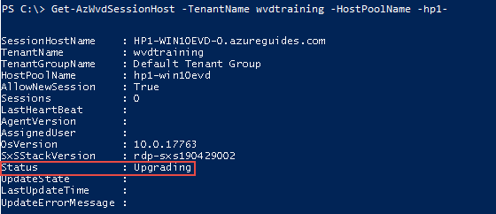

   > [!div class="mx-imgBorder"]
   > 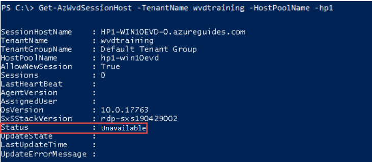

### Why are you getting this error?

If the status is stuck in *Upgrading*, it may be that the agent was not properly installed on your VM. This failure to install could be because your credentials were invalid, there was another installation happening at the same time, or for some other reason. If the status is stuck in *Unavailable*, it may be that the side-by-side stack was not properly installed on your VM.

### Resolution

#### Permissions Error

1. Retrieve the agent install logs by navigating to C:\Program Files\Microsoft RDInfra on your VM.
2. Open the AgentInstall.txt file. This file logs information during the agent installation process that can be helpful to parse through to determine why the installation failed.
3. During agent installation, you may receive an error similar to the following that will show up in this log:

*Error 1402. Could not open key: HKEY_LOCAL_MACHINE\Software\Classes\Bond.SchemaAttribute. System error 19. Verify that you have sufficient access to that key, or contact your support personnel…*

   > [!div class="mx-imgBorder"]
   > 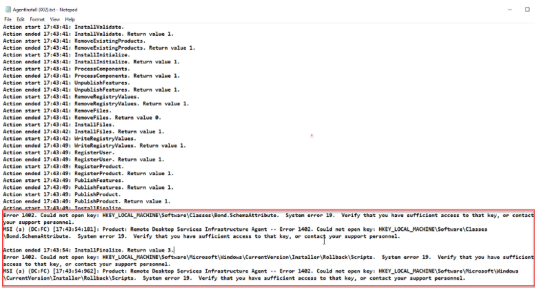

In this case, you do not have the correct credentials to install the agent on the VM.

#### Unavailable VM or other agent installation/upgrade failures

If your VM says *Unavailable* it is best to reinstall the agent, which will also reinstall the side-by-side stack. For all other errors with the agent not being properly installed, the same recourse is recommended. See [Reinstalling WVD Agent](#reinstalling-wvd-agent) and follow the steps outlined there.

## The WVD agent service is not running.

### Diagnosis

#### Verify this through services.

1. Open your Services window (in Start menu, type *services*).
2. Scroll to *Remote Desktop Agent Loader*.  
3. Verify that it says *Running* next to it. If not, see the resolution section below.

   > [!div class="mx-imgBorder"]
   > 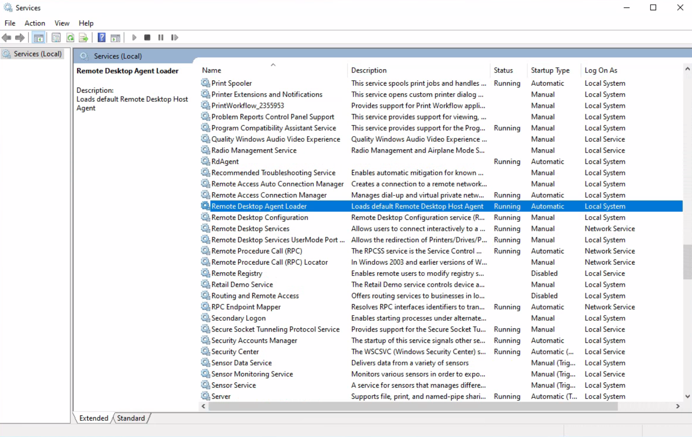

#### Verify this in PowerShell.

1. Open a PowerShell window as an administrator.
2. Run the following cmdlet:
```powershell
Get-Service RdAgentBootLoader
```
 
3. Verify that it says *Running* next to *RdAgentBootLoader*. If not, see the resolution section below.

   > [!div class="mx-imgBorder"]
   > 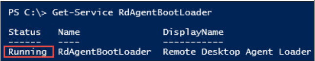

#### Verify this in Task Manager.

1. Open the Task Manager (in Start menu, type *task manager*).
2. Select *More details* at the bottom to expand the list of programs.
3. Under *Background processes*, right-click *RDAgentBootLoader*. 
4. Select *Go to details*.
5. Verify that it says *Running* next to *RdAgentBootLoader*. If not, see the resolution section below.

   > [!div class="mx-imgBorder"]
   > 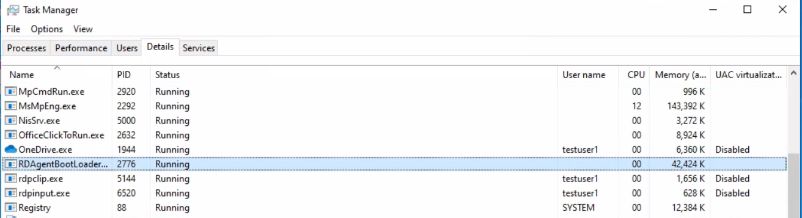

### Why are you getting this error?

If you are seeing that *RDAgentBootLoader* is either stopped or not running, this means that the bootloader, which loads the agent, was unable to properly install the agent and the agent service is not running, so you will need to start it.

### Resolution

1. In the Services window, right-click *Remote Desktop Agent Loader*.
2. Select *Start*. Note that if this option is greyed out for you, you do not have administrator permissions and will need that in order to start the service.
3. Wait 10 seconds, and then right-click *Remote Desktop Agent Loader*.
4. Select *Refresh*.
5. If the service stops after you started and refreshed it, you may have a registration failure. See [INVALID_REGISTRATION_TOKEN](#invalid_registration_token) and [NAME_ALREADY_REGISTERED](#name_already_registered).

## The WVD agent listener is not working.

### Diagnosis

1. Open your Command Prompt (in Start menu, type *cmd*) as an administrator.
2. Type and run *qwinsta*.
3. There should be two stack components displayed: *rdp-tcp* and *rdp-sxs*. 
   - Note that depending on the version of your OS, *rdp-sxs* may be followed by the build number as shown below. If it is, be sure to make note of this build number.
4. Verify that these components show *Listen* next to them. If not, see the resolution section below.

   > [!div class="mx-imgBorder"]
   > 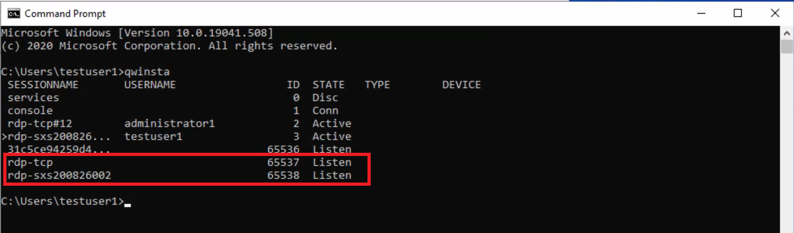

### Why are you getting this error?

If you are not seeing the two stack components say *Listen* next to them or they are not showing up at all after running *qwinsta*, it means that there is a stack issue. Stack updates get installed along with agent updates, and sometimes it may appear that there is an issue with the agent because it just had an update, but in this case the WVD listener is not working.

### Resolution

#### If you are using Windows 10 1809, 1903, or 1909...

1. Go to Programs and Features (in Start menu, type *Control Panel*, and navigate to Control Panel\Programs\Programs and Features).
2. Verify that the following four components are installed, as shown below. You may see multiple instances of any of the following, and that is ok.
   - Remote Desktop Agent BootLoader
   - Remote Desktop Services Infrastructure Agent
   - Remote Desktop Services Infrastructure Geneva Agent
   - Remote Desktop Services SxS Network Stack

   > [!div class="mx-imgBorder"]
   > 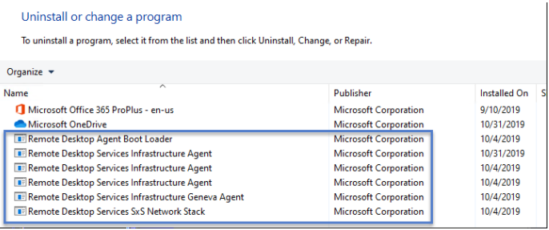

3. If you are not seeing these components installed, see [Reinstalling WVD Agent](#reinstalling-wvd-agent).

#### If you are using Windows 10 2004...

1. Open the Registry Editor (in Start menu, type *regedit*).
2. Navigate to HKEY_LOCAL_MACHINE\SYSTEM\CurrentControlSet\Control\Terminal Server\WinStations. 
3. Under *WinStations* you may see several folders for different stack versions, select the folder that matches the version information that you made note of in part 3 under the Diagnosis section. 
4. Scroll to find *fReverseConnectMode* and verify that its data value is 1. Also verify that *fEnableWinStation* is set to 1.

   > [!div class="mx-imgBorder"]
   > 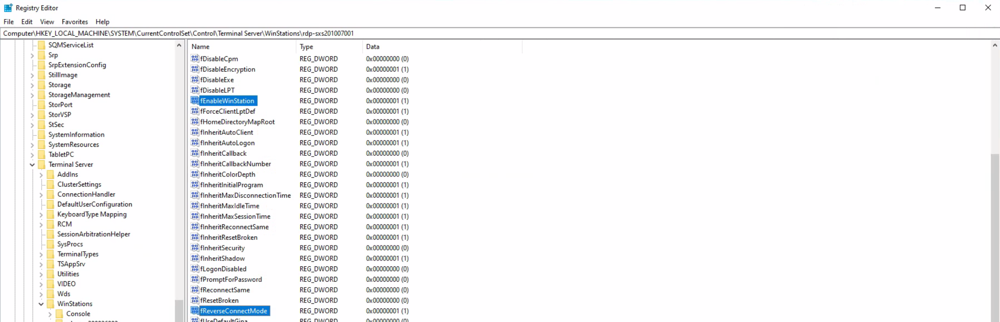

5. If *fReverseConnectMode* is not set to 1, double-click on *fReverseConnectMode* and enter the value 1 for its field. 
6. If *fEnableWinStation* is not set to 1, double-click on *fEnableWinStation* and enter the value 1 for its field. 
   - Note: to change the *fReverseConnectMode* or *fEnableWinStation* mode for multiple VMs at one time, you can either 1) export the registry key from the machine that you already have working and import it into all the other machines that need this change, or 2) create a GPO to set the registry key value for the machines that need the change.
 
## The WVD agent cannot talk to the broker.

### Diagnosis

1. Open the Event Viewer (in Start menu, type *event viewer*).
2. Select *Windows Logs*.
3. Double-click *Application*. This will show a list of events.
4. On the right-hand side of the window, select *Filter Current Log...*.
5. In the text field that says *\<All Event IDs\>*, type *3277*, and select *Ok*.
6. In the filtered list, you will see an event that includes *Agent cannot connect to broker with error NOT_FOUND. URL:* in the general description if you have received this error.

   > [!div class="mx-imgBorder"]
   > 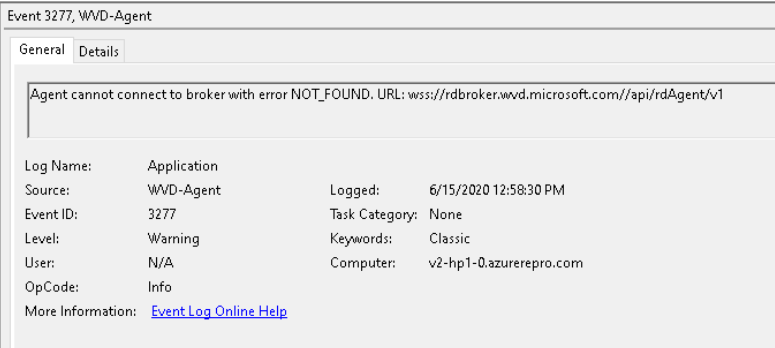

### Why are you getting this error?

The agent cannot connect to the broker and is unable to reach a particular URL. This may be because of your firewall or DNS settings.

### Resolution

1. Open the Registry Editor (in Start menu, type *regedit*). 
2. Navigate to HKEY_LOCAL_MACHINE\Software\Microsoft\RDInfraAgent. 
3. Make note of the values for *BrokerURI* and *BrokerURIGlobal*.

   > [!div class="mx-imgBorder"]
   > 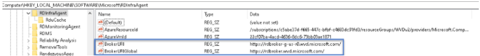

 
4. Open a browser and go to *\<BrokerURI\>api/health*. 
   - Make sure that in place of *BrokerURI* in the above link, you put the actual value from step 3. 
5. Open another tab in the browser and go to *\<BrokerURIGlobal\>api/health*. 
   - Make sure that in place of *BrokerURIGlobal* in the above link, you put the actual value from step 3. 
6. Both pages should load as shown below. 

   > [!div class="mx-imgBorder"]
   > 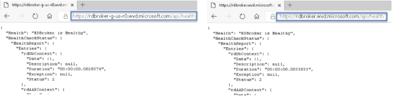
 

7. If the network is blocking, the pages will not load as shown below. 

   > [!div class="mx-imgBorder"]
   > 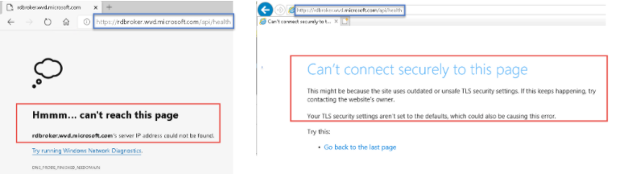

8. If the network is blocking these URLs, you will need to unblock the required URLs. See [Safe URL List](https://docs.microsoft.com/azure/virtual-desktop/safe-url-list) for instructions on how to do this.

## Trying to operate an unsupported VM OS.

### Diagnosis

1. Go to the [Azure Portal](https://portal.azure.com).
2. Go to the *Overview* page for your specific VM.
3. Make note of the *Operating system* under *Essentials*.
4. Verify that the operating system matches one of the following operating systems supported by WVD:
   - Windows 10 Enterprise multi-session, versions 1809 or later
   - Windows 7 Enterprise
   - Windows Server 2012 R2, 2016, and 2019
5. You may also receive the following error indicating that you are running an unsupported OS version: *szOutput=:Listener rdp-sxs is not allowed*

   > [!div class="mx-imgBorder"]
   > 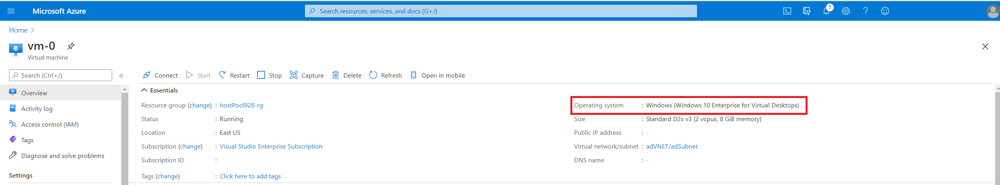

### Why are you getting this error?

The side-by-side stack is only supported by Windows Enterprise or Windows Server SKUs (that is, Pro VM is not supported). If you do not have an Enterprise or Server SKU, the stack will be installed on your VM, but will not be activated, so you will not see it show up when you run *qwinsta* in your command line.

### Resolution

#### Create a VM that is Windows Enterprise or Windows Server

1. Follow steps 1-12 under [Virtual Machine Details](https://docs.microsoft.com/azure/virtual-desktop/create-host-pools-azure-marketplace#virtual-machine-details). The recommended images for your VM are:
   - Windows 10 Enterprise multi-session, Version 1909
   - Windows 10 Enterprise multi-session, Version 1909 + Microsoft 365 Apps
   - Windows Server 2019 Datacenter
   - Windows 10 Enterprise multi-session, Version 2004
   - Windows 10 Enterprise multi-session, Version 2004 + Microsoft 365 Apps
2. Select *Review and Create*.

## Users keep getting disconnected from their session hosts due to missing heartbeat.

### Diagnosis

1. Open the Event Viewer (in Start menu, type *event viewer*).
2. Select *Windows Logs*.
3. Double-click *Application*. This will show a list of events.
4. On the right-hand side of the window, select *Filter Current Log...*.
5. In the text field that says *\<All Event IDs\>*, type *0*, and select *Ok*.
6. In the filtered list, you will see an event that includes *CheckSessionHostDomainIsReachableAsync -SessionHost unhealthy: the domain the SessionHost is joined to is not reachable!* in the general description if you have received this error.

   > [!div class="mx-imgBorder"]
   > 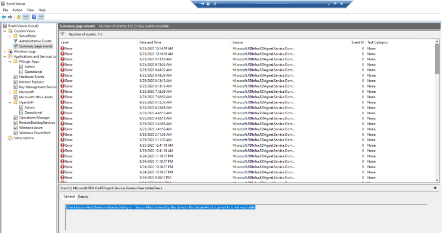

### Why are you getting this error?

You may be facing this disconnection issue if your server is missing a heartbeat to the WVD service. To resolve this, you need to change the threshold for the heartbeats.

### Resolution

1. Open your Command Prompt (in Start menu, type *cmd*) as an administrator.
2. Type and run *qwinsta*.
3. There should be two stack components displayed: *rdp-tcp* and *rdp-sxs*. 
   - Depending on the version of your OS, *rdp-sxs* may be followed by the build number as shown below. If it is, be sure to make note of this build number.
4. Open the Registry Editor (in Start menu, type *regedit*).
5. Navigate to HKEY_LOCAL_MACHINE\SYSTEM\CurrentControlSet\Control\Terminal Server\WinStations. 
6. Under *WinStations* you may see several folders for different stack versions, select the folder that matches the version information that you made note of in part 3.
7. Create the following new registry DWORD (right-click in registry editor -> New -> DWORD (32-bit) Value) with the corresponding decimal values: 
   - HeartbeatInterval: 10000
   - HeartbeatWarnCount: 30 
   - HeartbeatDropCount: 60 
8. Restart your VM.

## RDGateway URL is not accessible.

### Diagnosis

1. Open the Event Viewer (in Start menu, type *event viewer*).
2. Select *Windows Logs*.
3. Double-click *Application*. This will show a list of events.
4. On the right-hand side of the window, select *Filter Current Log...*.
5. In the text field that says *\<All Event IDs\>*, type *3703*, and select *Ok*.
6. In the filtered list, you will see an event that includes *RDGateway Url: is not accessible. Make sure the RDGateway Url is accessible from this machine.* in the general description if you have received this error.

### Why are you getting this error?

This error is raised when the RD Gateway URL cannot be reached during orchestration. To ensure connectivity on your session host and allow network traffic to these endpoints to bypass restrictions, you must unblock the URLs from the [Safe URL List](https://docs.microsoft.com/azure/virtual-desktop/safe-url-list). You should also ensure that your firewall or proxy settings do not block these URLs. Doing this is a prerequisite to using WVD.

### Resolution

1. [Use Azure Firewall to protect WVD deployments.](https://docs.microsoft.com/azure/firewall/protect-windows-virtual-desktop)
2. Configure your [Azure Firewall DNS settings](https://docs.microsoft.com/azure/firewall/dns-settings).

## ENDPOINT_NOT_FOUND

### Diagnosis

1. Open the Event Viewer (in Start menu, type *event viewer*).
2. Select *Windows Logs*.
3. Double-click *Application*. This will show a list of events.
4. On the right-hand side of the window, select *Filter Current Log...*.
5. In the text field that says *\<All Event IDs\>*, type *3277*, and select *Ok*.
6. In the filtered list, you will see an event that includes *ENDPOINT_NOT_FOUND* in the general description if you have received this error.

### Why are you getting this error?

This error indicates that the broker was unable to find an endpoint to establish a connection on. This can be for a variety of reasons including you don't have VMs in your deployment, they are not powered on, they have all exceeded the max session limit, the agent service is not working on them, etc.

### Resolution

#### Verify that the VM is powered on.

1. Go to the [Azure Portal](https://portal.azure.com).
2. Go to the *Overview* page for your specific VM(s).
3. Verify that your VMs are on. If you do not have VMs, you need to [create one](https://docs.microsoft.com/azure/virtual-desktop/expand-existing-host-pool#add-virtual-machines-with-the-azure-portal). If your VM is not powered on, you need to select *Start*.
   - If the *Status* for your VM says *Running* and the *Start* button is greyed out, your VM is on.

   > [!div class="mx-imgBorder"]
   > 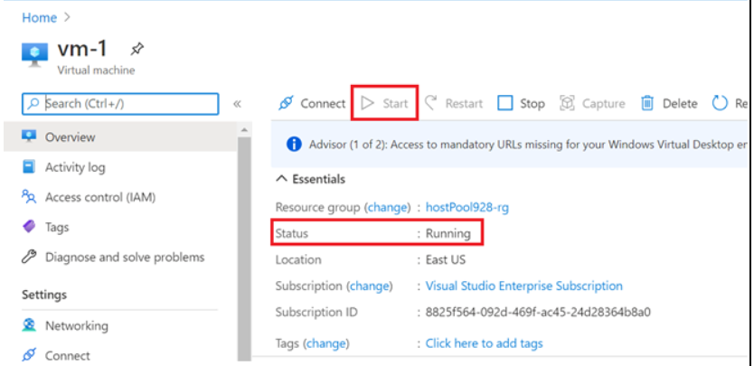

#### Verify that the max session limit has not been exceeded on your VM(s).

1. Go to the *Overview* page for the host pool that your VMs are in in the [Azure Portal](https://portal.azure.com).  
2. You will see how many session hosts you have in the host pool and how many active sessions next to *Total active sessions*. 
3. Select *Properties* under the *Settings* on the blade on the left. 
4. Under *Configuration* you will see *Max session limit*. 
5. Verify that the (Total active sessions \ # of session hosts) < Max Session Limit. If not, you need to increase the max session limit or terminate some sessions.

#### Verify that the agent services are running on your VM(s).

1. Verify [the agent service is running.](#the-wvd-agent-service-is-not-running)
2. Verify [the WVD listener is working.](#the-wvd-agent-listener-is-not-working) 

#### Verify that the agent can talk to the broker.

1. Verify [the agent can talk to the broker.](#the-wvd-agent-cannot-talk-to-the-broker)

#### Verify that this is not a registration issue.

1. See [INVALID_REGISTRATION_TOKEN.](#invalid_registration_token)
2. See [NAME_ALREADY_REGISTERED.](#name_already_registered) 

## INVALID_REGISTRATION_TOKEN

### Diagnosis

1. Open the Event Viewer (in Start menu, type *event viewer*).
2. Select *Windows Logs*.
3. Double-click *Application*. This will show a list of events.
4. On the right-hand side of the window, select *Filter Current Log...*.
5. In the text field that says *\<All Event IDs\>*, type *3277*, and select *Ok*.
6. In the filtered list, you will see an event that includes *INVALID_REGISTRATION_TOKEN* in the general description if you have received this error.

   > [!div class="mx-imgBorder"]
   > 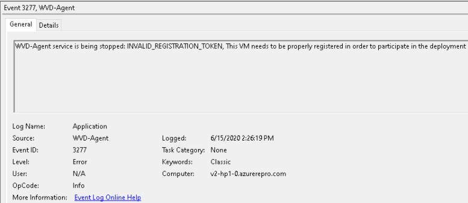

### Why are you getting this error?

The registration token that you have is not recognized as valid.

### Resolution

#### Create a new registration token.

1. Follow steps 1-5 to [generate a new registration key for the VM](#generate-a-new-registration-key-for-the-vm).

#### Change IsRegistered to 0.

2. Open the Registry Editor (in the Start menu, type *regedit*). 
3. Navigate to HKEY_LOCAL_MACHINE\SOFTWARE\Microsoft\RDInfraAgent. 
4. Double-click *IsRegistered*. 
5. In the *Value data:* entry box, type *0* and select *Ok*. 
6. Double-click *RegistrationToken*. 
7. In the *Value data:* entry box, paste the registration token from step 1. 

   > [!div class="mx-imgBorder"]
   > 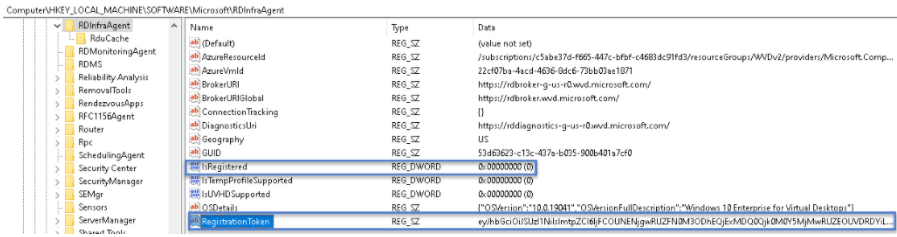

#### Stop and restart the RDAgentBootLoader.

8. Open your Command Prompt (in Start menu, type *cmd*) as an administrator.
9. Type *net stop RDAgentBootLoader*. 
10. Type *net start RDAgentBootLoader*. 

#### Check that IsRegistered is 1 and RegistrationToken is empty.

11. Open the Registry Editor (in the Start menu, type *regedit*).
12. Navigate to HKEY_LOCAL_MACHINE\SOFTWARE\Microsoft\RDInfraAgent.
13. Verify that *IsRegistered* is set to 1 and there is nothing in the data column for *RegistrationToken*. 

   > [!div class="mx-imgBorder"]
   > 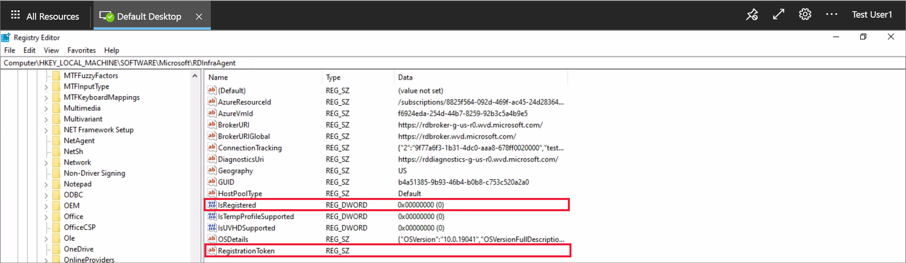

## NAME_ALREADY_REGISTERED

### Diagnosis

1. Open the Event Viewer (in Start menu, type *event viewer*).
2. Select *Windows Logs*.
3. Double-click *Application*. This will show a list of events.
4. On the right-hand side of the window, select *Filter Current Log...*.
5. In the text field that says *\<All Event IDs\>*, type *3277*, and select *Ok*.
6. In the filtered list, you will see an event that includes *NAME_ALREADY_REGISTERED* in the general description if you have received this error.

   > [!div class="mx-imgBorder"]
   > 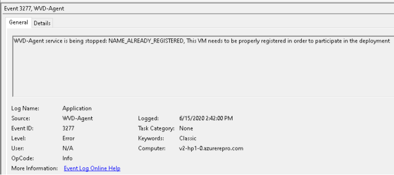

### Why are you getting this error?

The name of your VM has already been registered and is probably a duplicate.

### Resolution

1. Follow steps 1-5 to [remove the session host from the host pool](#remove-the-session-host-from-the-host-pool).
2. Go to the *Overview* page for the host pool that your VM is in in the [Azure Portal](https://portal.azure.com). 
3. Go to the *Session Hosts* tab to see the list of all session hosts in that host pool.
4. Wait for 5-10 minutes for the session host to show *Available*.

   > [!div class="mx-imgBorder"]
   > 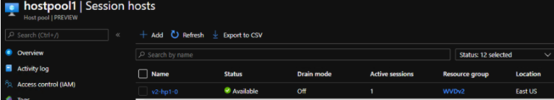

## INVALID_FORM

### Diagnosis

1. Open the Event Viewer (in Start menu, type *event viewer*).
2. Select *Windows Logs*.
3. Double-click *Application*. This will show a list of events.
4. On the right-hand side of the window, select *Filter Current Log...*.
5. In the text field that says *\<All Event IDs\>*, type *3277*, and select *Ok*.
6. In the filtered list, you will see an event that includes *INVALID_FORM* in the general description if you have received this error.

### Why are you getting this error?

Something went wrong with the communication between the agent and the broker.

### Resolution

Verify [the agent can talk to the broker.](#the-wvd-agent-cannot-talk-to-the-broker)

## EXPIRED_REGISTRATION_TOKEN

### Diagnosis

1. Open the Event Viewer (in Start menu, type *event viewer*).
2. Select *Windows Logs*.
3. Double-click *Application*. This will show a list of events.
4. On the right-hand side of the window, select *Filter Current Log...*.
5. In the text field that says *\<All Event IDs\>*, type *3277*, and select *Ok*.
6. In the filtered list, you will see an event that includes *EXPIRED_REGISTRATION_TOKEN* in the general description if you have received this error.

### Why are you getting this error?

Whenever you create a registration token, you set an expiration date for it. Receiving this error indicates that you have reached or surpassed this expiration date and need to create another registration token.

### Resolution

1. Follow steps 1-5 to [generate a new registration key for the VM](#generate-a-new-registration-key-for-the-vm).
2. Follow steps 1-13 to [reinstall the WVD Agent and Bootloader](#uninstall-all-agent-bootloader-and-stack-component-programs). 

## InstallMsiException

### Diagnosis

1. Open the Event Viewer (in Start menu, type *event viewer*).
2. Select *Windows Logs*.
3. Double-click *Application*. This will show a list of events.
4. On the right-hand side of the window, select *Filter Current Log...*.
5. In the text field that says *\<All Event IDs\>*, type *3277*, and select *Ok*.
6. In the filtered list, you will see an event that includes *InstallMsiException* in the general description if you have received this error.

### Why are you getting this error?

This exception is thrown when the installer is already running for another application and you are trying to install the agent at the same time, or the msiexec.exe is blocked. To ensure that agent updates get installed on your session host, you cannot enable any policies or configurations that block Windows Installer or msiexec.exe, this will also block the agent installation and cause it to fail.

### Resolution

Disable the following policies:
   - Turn off Windows Installer  
      - Category Path: Computer Configuration\Administrative Templates\Windows Component\Windows Installer\ 
    
>[!NOTE]
>This is not a comprehensive list of policies, just the ones that we have come across, and generally you should not enable any policy that blocks the installation of msiexec.exe files.

## Win32Exception

### Diagnosis

1. Open the Event Viewer (in Start menu, type *event viewer*).
2. Select *Windows Logs*.
3. Double-click *Application*. This will show a list of events.
4. On the right-hand side of the window, select *Filter Current Log...*.
5. In the text field that says *\<All Event IDs\>*, type *3277*, and select *Ok*.
6. In the filtered list, you will see an event that includes *Win32Exception* in the general description if you have received this error.

### Why are you getting this error?

This exception is thrown when there is a policy enabled that blocks cmd.exe from launching. This blocks the ability to run the console window, which is what is used to restart the service. 

### Resolution

Disable the following policies:
   - Prevent access to the command prompt   
      - Category Path: User Configuration\Administrative Templates\System\ 
    
>[!NOTE]
>This is not a comprehensive list of policies, just the ones that we have come across, and generally you should not enable any policy that blocks cmd.exe from launching.

## Reinstalling WVD Agent

### Uninstall all agent, bootloader, and stack component programs.

1. Log in to your VM as an administrator. 
2. Go to Programs and Features (in Start menu, type *Control Panel*, and navigate to Control Panel\Programs\Programs and Features).
3. Remove the following programs:
   - Remote Desktop Agent Boot Loader
   - Remote Desktop Services Infrastructure Agent
   - Remote Desktop Services Infrastructure Geneva Agent
   - Remote Desktop Services SxS Network Stack
   
>[!NOTE]
>You may see multiple instances of these programs, remove all of them.

   > [!div class="mx-imgBorder"]
   > 

### Remove the session host from the host pool.

1. Go to the *Overview* page for the host pool that your VM is in in the [Azure Portal](https://portal.azure.com). 
2. Go to the *Session Hosts* tab to see the list of all session hosts in that host pool.
3. Select the VM from the list of session hosts that is having issues.
4. Select *Remove* from the options along the top.  

   > [!div class="mx-imgBorder"]
   > 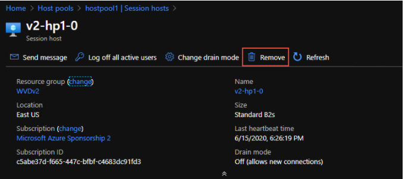

### Generate a new registration key for the VM.

1. Go to the *Overview* page for the host pool that your VM is in in the [Azure Portal](https://portal.azure.com).
2. Select *Registration key*, just to the right of the search bar.

   > [!div class="mx-imgBorder"]
   > 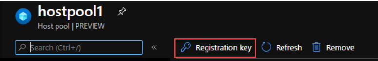

3. Select *Generate new key* in the *Registration key* blade.
4. Enter the expiration date and then select *Ok*.  

>[!NOTE]
>The expiration date can be no less than an hour and no longer than 27 days from its generation time and date. It is best practice to set the expiration date to be 27 days from now.

5. Copy the newly generated key to your clipboard; you will need this later.

### Reinstall the WVD Agent and Bootloader.

1. Log in to your VM as an administrator and go to this link [here](https://docs.microsoft.com/azure/virtual-desktop/create-host-pools-powershell#register-the-virtual-machines-to-the-windows-virtual-desktop-host-pool).
2. Download the *Windows Virtual Desktop Agent* and the *Windows Virtual Desktop Agent Bootloader* that are linked in parts 2 and 3 under *Register the virtual machines to the Windows Virtual Desktop host pool*.

   > [!div class="mx-imgBorder"]
   > 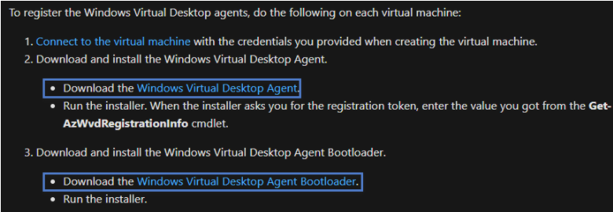

3. Right-click the downloaded installers (both the agent and the bootloader).
4. Select *Properties*.
5. Select *Unblock*.
6. Select *Ok*. This will allow your system to trust the installer.
7. Run the agent installer by double-clicking it.
8. When the installer asks you for the registration token, paste the registration key from your clipboard. 

   > [!div class="mx-imgBorder"]
   > 

9. Run the bootloader installer by double-clicking it.
10. Go to the *Overview* page for the host pool that your VM is in in the [Azure Portal](https://portal.azure.com).
11. Go to the *Session Hosts* tab to see the list of all session hosts in that host pool.
12. You should now see the session host registered in the host pool with the status *Available*. 

   > [!div class="mx-imgBorder"]
   > 

## Troubleshooting Conclusion

If any of the above steps did not resolve your issue, please create a support case and include detailed information about the problem you are having, in addition to the steps you have taken to resolve it. 

Furthermore, we would love to hear your feedback about your experience with this troubleshooting guide. We hope that it was helpful and are constantly working to improve it. Submit and view feedback for this guide [here](https://aka.ms/rddesktopfeedback). 