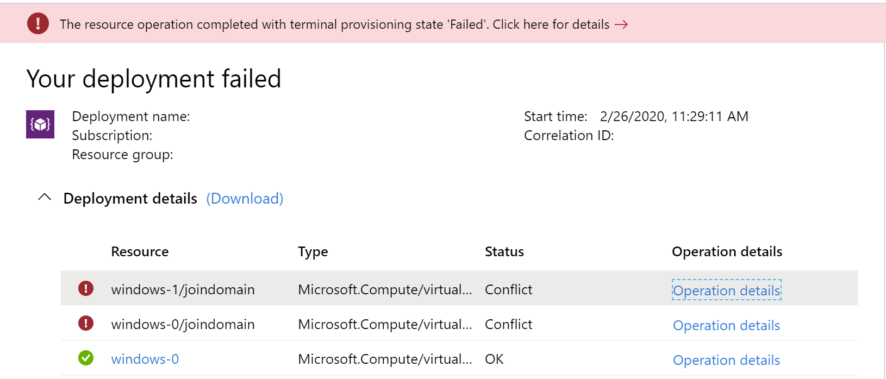
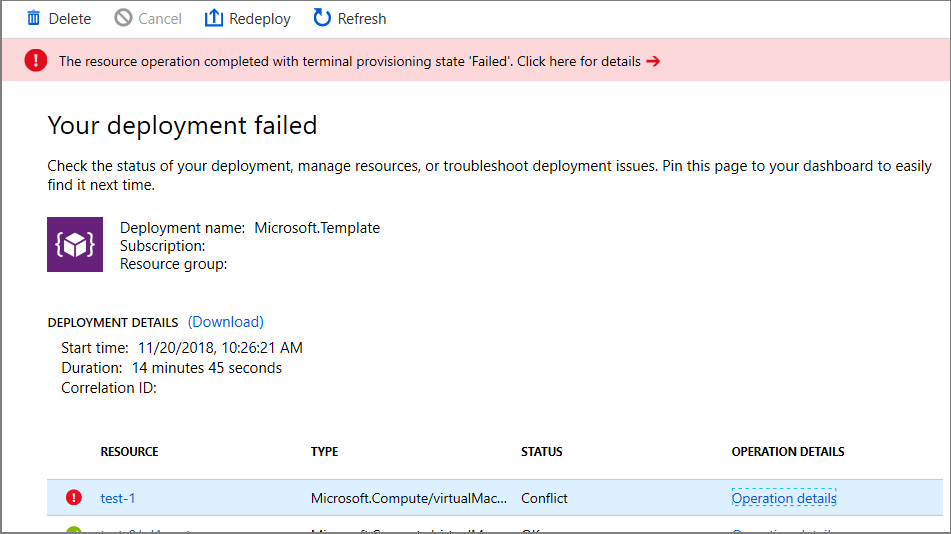
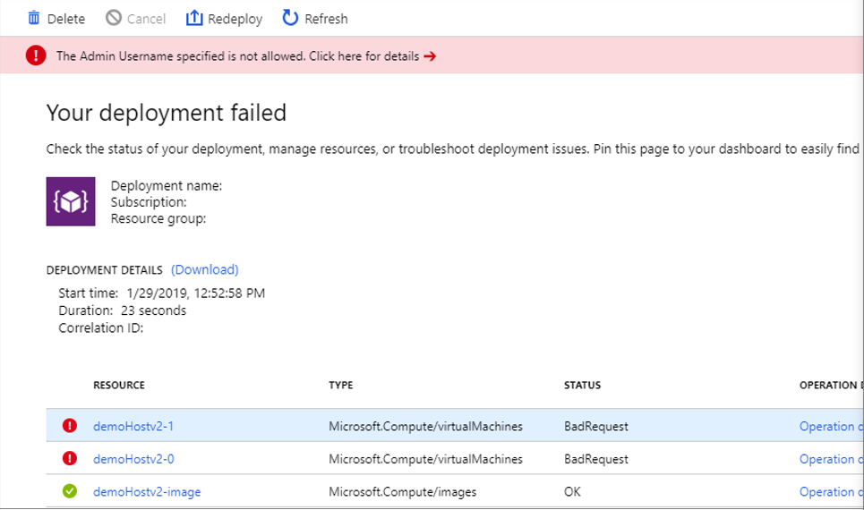
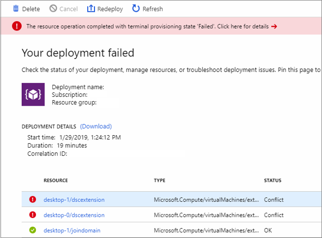
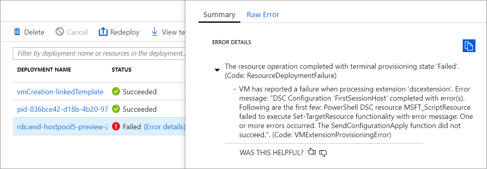

# Host pool creation

>[!IMPORTANT]
>This content applies to the Spring 2020 update with Azure Resource Manager Windows Virtual Desktop objects. If you're using the Windows Virtual Desktop Fall 2019 release without Azure Resource Manager objects, see [this article](./virtual-desktop-fall-2019/troubleshoot-set-up-issues-2019.md).
>
> The Windows Virtual Desktop Spring 2020 update is currently in public preview. This preview version is provided without a service level agreement, and we don't recommend using it for production workloads. Certain features might not be supported or might have constrained capabilities. 
> For more information, see [Supplemental Terms of Use for Microsoft Azure Previews](https://azure.microsoft.com/support/legal/preview-supplemental-terms/).

This article covers issues during the initial setup of the Windows Virtual Desktop tenant and the related session host pool infrastructure.

## Provide feedback

Visit the [Windows Virtual Desktop Tech Community](https://techcommunity.microsoft.com/t5/Windows-Virtual-Desktop/bd-p/WindowsVirtualDesktop) to discuss the Windows Virtual Desktop service with the product team and active community members.

## Acquiring the Windows 10 Enterprise multi-session image

To use the Windows 10 Enterprise multi-session image, go to the Azure Marketplace, select **Get Started** > **Microsoft Windows 10** > and [Windows 10 Enterprise multi-session, Version 1809](https://azuremarketplace.microsoft.com/marketplace/apps/microsoftwindowsdesktop.windows-10?tab=PlansAndPrice).

## Issues with using the Azure portal to create host pools

### Error: "Create a free account" appears when accessing the service


**Cause**: There aren't active subscriptions in the account you signed in to Azure with, or the account doesn't have permissions to view the subscriptions. 

**Fix**: Sign in to the subscription where you'll deploy the session host virtual machines (VMs) with an account that has at least contributor-level access.

### Error: "Exceeding quota limit"

If your operation goes over the quota limit, you can do one of the following things: 

- Create a new host pool with the same parameters but fewer VMs and VM cores.

- Open the link you see in the statusMessage field in a browser to submit a request to increase the quota for your Azure subscription for the specified VM SKU.

## Azure Resource Manager template errors

Follow these instructions to troubleshoot unsuccessful deployments of Azure Resource Manager templates and PowerShell DSC.

1. Review errors in the deployment using [View deployment operations with Azure Resource Manager](../azure-resource-manager/resource-manager-deployment-operations.md).
2. If there are no errors in the deployment, review errors in the activity log using [View activity logs to audit actions on resources](../azure-resource-manager/resource-group-audit.md).
3. Once the error is identified, use the error message and the resources in [Troubleshoot common Azure deployment errors with Azure Resource Manager](../azure-resource-manager/resource-manager-common-deployment-errors.md) to address the issue.
4. Delete any resources created during the previous deployment and retry deploying the template again.

### Error: Your deployment failed….\<hostname>/joindomain



Example of raw error:

```Error
 {"code":"DeploymentFailed","message":"At least one resource deployment operation failed. Please list deployment operations for details.
 Please see https://aka.ms/arm-debug for usage details.","details":[{"code":"Conflict","message":"{\r\n \"status\": \"Failed\",\r\n \"error\":
 {\r\n \"code\": \"ResourceDeploymentFailure\",\r\n \"message\": \"The resource operation completed with terminal provisioning state 'Failed'.
 \",\r\n \"details\": [\r\n {\r\n \"code\": \"VMExtensionProvisioningError\",\r\n \"message\": \"VM has reported a failure when processing
 extension 'joindomain'. Error message: \\\"Exception(s) occurred while joining Domain 'diamondsg.onmicrosoft.com'\\\".\"\r\n }\r\n ]\r\n }\r\n}"}]}
```

**Cause 1:** Credentials provided for joining VMs to the domain are incorrect.

**Fix 1:** See the "Incorrect credentials" error for VMs are not joined to the domain in [Session host VM configuration](troubleshoot-vm-configuration.md).

**Cause 2:** Domain name doesn't resolve.

**Fix 2:** See [Error: Domain name doesn't resolve](troubleshoot-vm-configuration.md#error-domain-name-doesnt-resolve) in [Session host VM configuration](troubleshoot-vm-configuration.md).

**Cause 3:** Your virtual network (VNET) DNS configuration is set to **Default**.

To fix this, do the following things:

1. Open the Azure portal and go to the **Virtual networks** tab.
2. Find your VNET, then select **DNS servers**.
3. The DNS servers menu should appear on the right side of your screen. On that menu, select **Custom**.
4. Make sure the DNS servers listed under Custom match your domain controller or Active Directory domain. If you don't see your DNS server, you can add it by entering its value into the **Add DNS server** field.

### Error: Your deployment failed...\Unauthorized

```Error
{"code":"DeploymentFailed","message":"At least one resource deployment operation failed. Please list deployment operations for details. Please see https://aka.ms/arm-debug for usage details.","details":[{"code":"Unauthorized","message":"{\r\n \"Code\": \"Unauthorized\",\r\n \"Message\": \"The scale operation is not allowed for this subscription in this region. Try selecting different region or scale option.\",\r\n \"Target\": null,\r\n \"Details\": [\r\n {\r\n \"Message\": \"The scale operation is not allowed for this subscription in this region. Try selecting different region or scale option.\"\r\n },\r\n {\r\n \"Code\": \"Unauthorized\"\r\n },\r\n {\r\n \"ErrorEntity\": {\r\n \"ExtendedCode\": \"52020\",\r\n \"MessageTemplate\": \"The scale operation is not allowed for this subscription in this region. Try selecting different region or scale option.\",\r\n \"Parameters\": [\r\n \"default\"\r\n ],\r\n \"Code\": \"Unauthorized\",\r\n \"Message\": \"The scale operation is not allowed for this subscription in this region. Try selecting different region or scale option.\"\r\n }\r\n }\r\n ],\r\n \"Innererror\": null\r\n}"}]}
```

**Cause:** The subscription you're using is a type that can't access required features in the region where the customer is trying to deploy. For example, MSDN, Free, or Education subscriptions can show this error.

**Fix:** Change your subscription type or region to one that can access the required features.

### Error: VMExtensionProvisioningError



**Cause 1:** Transient error with the Windows Virtual Desktop environment.

**Cause 2:** Transient error with connection.

**Fix:** Confirm Windows Virtual Desktop environment is healthy by signing in using PowerShell. Finish the VM registration manually in [Create a host pool with PowerShell](create-host-pools-powershell.md).

### Error: The Admin Username specified isn't allowed



Example of raw error:

```Error
 { …{ "provisioningOperation": 
 "Create", "provisioningState": "Failed", "timestamp": "2019-01-29T20:53:18.904917Z", "duration": "PT3.0574505S", "trackingId": 
 "1f460af8-34dd-4c03-9359-9ab249a1a005", "statusCode": "BadRequest", "statusMessage": { "error": { "code": "InvalidParameter", "message": 
 "The Admin Username specified is not allowed.", "target": "adminUsername" } … }
```

**Cause:** Password provided contains forbidden substrings (admin, administrator, root).

**Fix:** Update username or use different users.

### Error: VM has reported a failure when processing extension



Example of raw error:

```Error
{ … "code": "ResourceDeploymentFailure", "message":
 "The resource operation completed with terminal provisioning state 'Failed'.", "details": [ { "code": 
 "VMExtensionProvisioningError", "message": "VM has reported a failure when processing extension 'dscextension'. 
 Error message: \"DSC Configuration 'SessionHost' completed with error(s). Following are the first few:
 PowerShell DSC resource MSFT_ScriptResource failed to execute Set-TargetResource functionality with error message: 
 One or more errors occurred. The SendConfigurationApply function did not succeed.\"." } ] … }
```

**Cause:** PowerShell DSC extension was not able to get admin access on the VM.

**Fix:** Confirm username and password have administrative access on the virtual machine and run the Azure Resource Manager template again.

### Error: DeploymentFailed – PowerShell DSC Configuration 'FirstSessionHost' completed with Error(s)



Example of raw error:

```Error
{
    "code": "DeploymentFailed",
   "message": "At least one resource deployment operation failed. Please list
 deployment operations for details. 4 Please see https://aka.ms/arm-debug for usage details.",
 "details": [
         { "code": "Conflict",  
         "message": "{\r\n \"status\": \"Failed\",\r\n \"error\": {\r\n \"code\":
         \"ResourceDeploymentFailure\",\r\n \"message\": \"The resource
         operation completed with terminal provisioning state 'Failed'.\",\r\n
         \"details\": [\r\n {\r\n \"code\":
        \"VMExtensionProvisioningError\",\r\n \"message\": \"VM has
              reported a failure when processing extension 'dscextension'.
              Error message: \\\"DSC Configuration 'FirstSessionHost'
              completed with error(s). Following are the first few:
              PowerShell DSC resource MSFT ScriptResource failed to
              execute Set-TargetResource functionality with error message:
              One or more errors occurred. The SendConfigurationApply
              function did not succeed.\\\".\"\r\n }\r\n ]\r\n }\r\n}"  }

```

**Cause:** PowerShell DSC extension was not able to get admin access on the VM.

**Fix:** Confirm username and password provided have administrative access on the virtual machine and run the Azure Resource Manager template again.

### Error: DeploymentFailed – InvalidResourceReference

Example of raw error:

```Error
{"code":"DeploymentFailed","message":"At least one resource deployment operation
failed. Please list deployment operations for details. Please see https://aka.ms/arm-
debug for usage details.","details":[{"code":"Conflict","message":"{\r\n \"status\":
\"Failed\",\r\n \"error\": {\r\n \"code\": \"ResourceDeploymentFailure\",\r\n
\"message\": \"The resource operation completed with terminal provisioning state
'Failed'.\",\r\n \"details\": [\r\n {\r\n \"code\": \"DeploymentFailed\",\r\n
\"message\": \"At least one resource deployment operation failed. Please list
deployment operations for details. Please see https://aka.ms/arm-debug for usage
details.\",\r\n \"details\": [\r\n {\r\n \"code\": \"BadRequest\",\r\n \"message\":
\"{\\r\\n \\\"error\\\": {\\r\\n \\\"code\\\": \\\"InvalidResourceReference\\\",\\r\\n
\\\"message\\\": \\\"Resource /subscriptions/EXAMPLE/resourceGroups/ernani-wvd-
demo/providers/Microsoft.Network/virtualNetworks/wvd-vnet/subnets/default
referenced by resource /subscriptions/EXAMPLE/resourceGroups/ernani-wvd-
demo/providers/Microsoft.Network/networkInterfaces/erd. Please make sure that
the referenced resource exists, and that both resources are in the same
region.\\\",\\r\\n\\\"details\\\": []\\r\\n }\\r\\n}\"\r\n }\r\n ]\r\n }\r\n ]\r\n }\r\n}"}]}
```

**Cause:** Part of the resource group name is used for certain resources being created by the template. Due to the name matching existing resources, the template may select an existing resource from a different group.

**Fix:** When running the Azure Resource Manager template to deploy session host VMs, make the first two characters unique for your subscription resource group name.

### Error: DeploymentFailed – InvalidResourceReference

Example of raw error:

```Error
{"code":"DeploymentFailed","message":"At least one resource deployment operation
failed. Please list deployment operations for details. Please see https://aka.ms/arm-
debug for usage details.","details":[{"code":"Conflict","message":"{\r\n \"status\":
\"Failed\",\r\n \"error\": {\r\n \"code\": \"ResourceDeploymentFailure\",\r\n
\"message\": \"The resource operation completed with terminal provisioning state
'Failed'.\",\r\n \"details\": [\r\n {\r\n \"code\": \"DeploymentFailed\",\r\n
\"message\": \"At least one resource deployment operation failed. Please list
deployment operations for details. Please see https://aka.ms/arm-debug for usage
details.\",\r\n \"details\": [\r\n {\r\n \"code\": \"BadRequest\",\r\n \"message\":
\"{\\r\\n \\\"error\\\": {\\r\\n \\\"code\\\": \\\"InvalidResourceReference\\\",\\r\\n
\\\"message\\\": \\\"Resource /subscriptions/EXAMPLE/resourceGroups/ernani-wvd-
demo/providers/Microsoft.Network/virtualNetworks/wvd-vnet/subnets/default
referenced by resource /subscriptions/EXAMPLE/resourceGroups/DEMO/providers/Microsoft.Network/networkInterfaces
/EXAMPLE was not found. Please make sure that the referenced resource exists, and that both
resources are in the same region.\\\",\\r\\n \\\"details\\\": []\\r\\n }\\r\\n}\"\r\n
}\r\n ]\r\n }\r\n ]\r\n }\r\n\
```

**Cause:** This error is because the NIC created with the Azure Resource Manager template has the same name as another NIC already in the VNET.

**Fix:** Use a different host prefix.

### Error: DeploymentFailed – Error downloading

Example of raw error:

```Error
\\\"The DSC Extension failed to execute: Error downloading
https://catalogartifact.azureedge.net/publicartifacts/rds.wvd-provision-host-pool-
2dec7a4d-006c-4cc0-965a-02bbe438d6ff-prod
/Artifacts/DSC/Configuration.zip after 29 attempts: The remote name could not be
resolved: 'catalogartifact.azureedge.net'.\\nMore information about the failure can
be found in the logs located under
'C:\\\\WindowsAzure\\\\Logs\\\\Plugins\\\\Microsoft.Powershell.DSC\\\\2.77.0.0' on
the VM.\\\"
```

**Cause:** This error is due to a static route, firewall rule, or NSG blocking the download of the zip file tied to the Azure Resource Manager template.

**Fix:** Remove blocking static route, firewall rule, or NSG. Optionally, open the Azure Resource Manager template json file in a text editor, take the link to zip file, and download the resource to an allowed location.

## Next steps

- For an overview on troubleshooting Windows Virtual Desktop and the escalation tracks, see [Troubleshooting overview, feedback, and support](troubleshoot-set-up-overview.md).
- To troubleshoot issues while configuring a virtual machine (VM) in Windows Virtual Desktop, see [Session host virtual machine configuration](troubleshoot-vm-configuration.md).
- To troubleshoot issues with Windows Virtual Desktop client connections, see [Windows Virtual Desktop service connections](troubleshoot-service-connection.md).
- To troubleshoot issues with Remote Desktop clients, see [Troubleshoot the Remote Desktop client](troubleshoot-client.md)
- To troubleshoot issues when using PowerShell with Windows Virtual Desktop, see [Windows Virtual Desktop PowerShell](troubleshoot-powershell.md).
- To learn more about the service, see [Windows Virtual Desktop environment](environment-setup.md).
- To go through a troubleshoot tutorial, see [Tutorial: Troubleshoot Resource Manager template deployments](../azure-resource-manager/templates/template-tutorial-troubleshoot.md).
- To learn about auditing actions, see [Audit operations with Resource Manager](../azure-resource-manager/management/view-activity-logs.md).
- To learn about actions to determine the errors during deployment, see [View deployment operations](../azure-resource-manager/templates/deployment-history.md).
