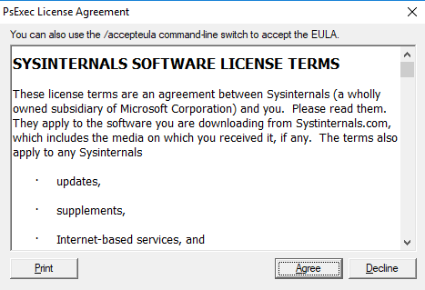

# Tenant and host pool creation

Use this article to troubleshoot issues you're having when configuring the Windows Virtual Desktop session host virtual machines (VMs).

## Provide feedback

We currently aren't taking support cases while Windows Virtual Desktop is in preview. Visit the [Windows Virtual Desktop Tech Community](https://techcommunity.microsoft.com/t5/Windows-Virtual-Desktop/bd-p/WindowsVirtualDesktop) to discuss the Windows Virtual Desktop service with the product team and active community members.

## VMs are not joined to the domain

Follow these instructions if you're having issues joining VMs to the domain.

- Join the VM manually using the process in [Join a Windows Server virtual machine to a managed domain](https://docs.microsoft.com/azure/active-directory-domain-services/Active-directory-ds-admin-guide-join-windows-vm-portal) or using the [domain join template](https://azure.microsoft.com/resources/templates/201-vm-domain-join-existing/).
- Try pinging the domain name from command line on VM.
- Review the list of domain join error messages in [Troubleshooting Domain Join Error Messages](https://social.technet.microsoft.com/wiki/contents/articles/1935.troubleshooting-domain-join-error-messages.aspx).

### Error: Incorrect credentials

**Cause:** There was a typo made when the credentials were entered in the Azure Resource Manager template interface fixes.

**Fix:** Follow these instructions to correct the credentials.

1. Manually add the VMs to a domain.
2. Redeploy once credentials have been confirmed. See [Create a host pool with PowerShell](https://docs.microsoft.com/azure/virtual-desktop/create-host-pools-powershell).
3. Join VMs to a domain using a template with [Joins an existing Windows VM to AD Domain](https://azure.microsoft.com/resources/templates/201-vm-domain-join-existing/).

### Error: Timeout waiting for user input

**Cause:** The account used to complete the domain join may have multi-factor authentication (MFA).

**Fix:** Follow these instructions to complete the domain join.

1. Temporarily remove MFA for the account.
2. Use a service account.

### Error: The account used during provisioning doesn't have permissions to complete the operation

**Cause:** The account being used doesn't have permissions to join VMs to the domain due to compliance and regulations.

**Fix:** Follow these instructions.

1. Use an account that is a member of the Administrator group.
2. Grant the necessary permissions to the account being used.

### Error: Domain name doesn't resolve

**Cause 1:** VMs are in a resource group that's not associated with the virtual network (VNET) where the domain is located.

**Fix 1:** Create VNET peering between the VNET where VMs were provisioned and the VNET where the domain controller (DC) is running. See [Create a virtual network peering - Resource Manager, different subscriptions](https://docs.microsoft.com/azure/virtual-network/create-peering-different-subscriptions).

**Cause 2:** When using AadService (AADS), DNS entries have not been set.

**Fix 2:** To set domain services, see [Enable Azure Active Directory Domain Services](https://docs.microsoft.com/azure/active-directory-domain-services/active-directory-ds-getting-started-dns).

## Windows Virtual Desktop Agent and Windows Virtual Desktop Boot Loader are not installed

The recommended way to provision VMs is using the Azure Resource Manager **Create and provision Windows Virtual Desktop host pool** template. The template automatically installs the Windows Virtual Desktop Agent and Windows Virtual Desktop Agent Boot Loader.

Follow these instructions to confirm the components are installed and to check for error messages.

1. Confirm that the two components are installed by checking in **Control Panel** > **Programs** > **Programs and Features**. If **Windows Virtual Desktop Agent** and **Windows Virtual Desktop Agent Boot Loader** are not visible, they aren't installed on the VM.
2. Open **File Explorer** and navigate to **C:\Windows\Temp\scriptlogs.log**. If the file is missing, it indicates that the PowerShell DSC that installed the two components was not able to run in the security context provided.
3. If the file **C:\Windows\Temp\scriptlogs.log** is present, open it and check for error messages.

### Error: Windows Virtual Desktop Agent and Windows Virtual Desktop Agent Boot Loader are missing. C:\Windows\Temp\scriptlogs.log is also missing

**Cause 1:** Credentials provided during input for the Azure Resource Manager template were incorrect or permissions were insufficient.

**Fix 1:** Manually add the missing components to the VMs using [Create a host pool with PowerShell](https://docs.microsoft.com/azure/virtual-desktop/create-host-pools-powershell).

**Cause 2:** PowerShell DSC was able to start and execute but failed to complete as it can't sign in to Windows Virtual Desktop and obtain needed information.

**Fix 2:** Confirm the items in the following list.

- Make sure the account doesn't have MFA.
- Confirm that the tenant name is accurate and the tenant exists in Windows Virtual Desktop.
- Confirm the account has at least RDS Contributor permissions.

### Error: Authentication failed, error in C:\Windows\Temp\scriptlogs.log

**Cause:** PowerShell DSC was able to execute but couldn't connect to Windows Virtual Desktop.

**Fix:** Confirm the items in the following list.

- Manually register the VMs with the Windows Virtual Desktop service.
- Confirm account used for connecting to Windows Virtual Desktop has permissions on the tenant to create host pools.
- Confirm account doesn't have MFA.

## Windows Virtual Desktop Agent is not registering with the Windows Virtual Desktop service

When the Windows Virtual Desktop Agent is first installed on session host VMs (either manually or through the Azure Resource Manager template and PowerShell DSC), it provides a registration token. The following section covers troubleshooting issues applicable to the Windows Virtual Desktop Agent and the token.

### Error: The status filed in Get-RdsSessionHost cmdlet shows status as Unavailable


**Cause:** The agent isn't able to update itself to a new version.

**Fix:** Follow these instructions to manually update the agent.

1. Download a new version of the agent on the session host VM.
2. Launch Task Manager and, in the Service Tab, stop the RDAgentBootLoader service.
3. Run the installer for the new version of the Windows Virtual Desktop Agent.
4. When prompted for the registration token, remove the entry INVALID_TOKEN and press next (a new token isn't required).
5. Complete the installation Wizard.
6. Open Task Manager and start the RDAgentBootLoader service.

## Error:  Windows Virtual Desktop Agent registry entry IsRegistered shows a value of 0

**Cause:** Registration token has expired or has been generated with expiration value of 999999.

**Fix:** Follow these instructions to fix the agent registry error.

1. If there's already a registration token, remove it with Remove-RDSRegistrationInfo.
2. Generate new token with Rds-NewRegistrationInfo.
3. Confirm that the -ExpriationHours parameter is set to 72 (max value is 99999).

### Error: Windows Virtual Desktop agent isn't reporting a heartbeat when running Get-RdsSessionHost

**Cause 1:** RDAgentBootLoader service has been stopped.

**Fix 1:** Launch Task Manager and, if the Service Tab reports a stopped status for RDAgentBootLoader service, start the service.

**Cause 2:** Port 443 may be closed.

**Fix 2:** Follow these instructions to open port 443.

1. Confirm port 443 is open by downloading the PSPing tool from [Sysinternal tools](https://docs.microsoft.com/sysinternals/downloads/psping).
2. Install PSPing on the session host VM where the agent is running.
3. Open the command prompt as an administrator and issue the command below:

    ```cmd
    psping rdbroker.wvdselfhost.microsoft.com:443
    ```

4. Confirm that PSPing received information back from the RDBroker:

    ```
    PsPing v2.10 - PsPing - ping, latency, bandwidth measurement utility
    Copyright (C) 2012-2016 Mark Russinovich
    Sysinternals - www.sysinternals.com
    TCP connect to 13.77.160.237:443:
    5 iterations (warmup 1) ping test:
    Connecting to 13.77.160.237:443 (warmup): from 172.20.17.140:60649: 2.00ms
    Connecting to 13.77.160.237:443: from 172.20.17.140:60650: 3.83ms
    Connecting to 13.77.160.237:443: from 172.20.17.140:60652: 2.21ms
    Connecting to 13.77.160.237:443: from 172.20.17.140:60653: 2.14ms
    Connecting to 13.77.160.237:443: from 172.20.17.140:60654: 2.12ms
    TCP connect statistics for 13.77.160.237:443:
    Sent = 4, Received = 4, Lost = 0 (0% loss),
    Minimum = 2.12ms, Maximum = 3.83ms, Average = 2.58ms
    ```

## Troubleshooting issues with the Windows Virtual Desktop side-by-side stack

The Windows Virtual Desktop side-by-side stack is automatically installed with Windows Server 2019. Use Microsoft Installer (MSI) to install the side-by-side stack on Microsoft Windows Server 2016 or Windows Server 2012 R2. For Microsoft Windows 10, the Windows Virtual Desktop side-by-side stack is enabled with **enablesxstackrs.ps1**.

There are three main ways the side-by-side stack gets installed or enabled on session host pool VMs:

- With the Azure Resource Manager **Create and provision new Windows Virtual Desktop host pool** template
- By being included and enabled on the master image
- Installed or enabled manually on each VM (or with extensions/PowerShell)

If you're having issues with the Windows Virtual Desktop side-by-side stack, type the **qwinsta** command from the command prompt to confirm that the side-by-side stack is installed or enabled.

The output of **qwinsta** will list **rdp-sxs** in the output if the side-by-side stack is installed and enabled.


Examine the registry entries listed below and confirm that their values match. If registry keys are missing or values are mismatched, follow the instructions in [Create a host pool with PowerShell](https://docs.microsoft.com/azure/virtual-desktop/create-host-pools-powershell) on how to reinstall the side-by-side stack.

```registry
    HKEY_LOCAL_MACHINE\SYSTEM\CurrentControlSet\Control\Terminal
    Server\WinStations\rds-sxs\"fEnableWinstation":DWORD=1

    HKEY_LOCAL_MACHINE\SYSTEM\CurrentControlSet\Control\Terminal
    Server\ClusterSettings\"SessionDirectoryListener":rdp-sxs
```

### Error: O_REVERSE_CONNECT_STACK_FAILURE


**Cause:** The side-by-side stack isn't installed on the session host VM.

**Fix:** Follow these instructions to install the side-by-side stack on the session host VM.

1. Use Remote Desktop Protocol (RDP) to get directly into the session host VM as local administrator.
2. Download and import [The Windows Virtual Desktop PowerShell module](https://docs.microsoft.com/powershell/windows-virtual-desktop/overview) to use in your PowerShell session if you haven't already.
3. Install the side-by-side stack using [Create a host pool with PowerShell](https://docs.microsoft.com/azure/virtual-desktop/create-host-pools-powershell).

## How to fix a Windows Virtual Desktop side-by-side stack that malfunctions

There are known circumstances that can cause the side-by-side stack to malfunction:

- Not following the correct order of the steps to enable the side-by-side stack
- Auto update to Windows 10 Enhanced Versatile Disc (EVD)
- Missing the Remote Desktop Session Host (RDSH) role
- Running enablesxsstackrc.ps1 multiple times
- Running enablesxsstackrc.ps1 in an account that doesn't have local admin privileges

The instructions in this section can help you uninstall the Windows Virtual Desktop side-by-side stack. Once you uninstall the side-by-side stack, go to “Register the VM with the Windows Virtual Desktop host pool” in [Create a host pool with PowerShell](https://docs.microsoft.com/azure/virtual-desktop/create-host-pools-powershell) to reinstall the side-by-side stack.

The VM used to run remediation must be on the same subnet and domain as the VM with the malfunctioning side-by-side stack.

Follow these instructions to run remediation from the same subnet and domain:

1. Connect with standard Remote Desktop Protocol (RDP) to the VM from where fix will be applied.
2. Download PsExec from https://docs.microsoft.com/sysinternals/downloads/psexec.
3. Unzip the downloaded file.
4. Start command prompt as local administrator.
5. Navigate to folder where PsExec was unzipped.
6. From command prompt, use the following command:

    ```cmd
            psexec.exe \\<VMname> cmd
    ```

    >[!Note]
    >VMname is the machine name of the VM with the malfunctioning side-by-side stack.

7. Accept the PsExec License Agreement by clicking Agree.

    

    >[!Note]
    >This dialog will show up only the first time PsExec is run.

8. After the command prompt session opens on the VM with the malfunctioning side-by-side stack, run qwinsta and confirm that an entry named rdp-sxs is available. If not, a side-by-side stack isn't present on the VM so the issue isn't tied to the side-by-side stack.

    

9. Run the following command, which will list Microsoft components installed on the VM with the malfunctioning side-by-side stack.

    ```cmd
        wmic product get name
    ```

10. Run the command below with product names from step above.

    ```cmd
        wmic product where name="<Remote Desktop Services Infrastructure Agent>" call uninstall
    ```

11. Uninstall all products that start with “Remote Desktop.”

12. After all Windows Virtual Desktop components have been uninstalled, follow the instructions for your operating system:

13. If your operating system is Windows Server, restart the VM that had the malfunctioning side-by-side stack (either with Azure portal or from the PsExec tool).

If your operating system is Microsoft Windows 10, continue with the instructions below:

14. From the VM running PsExec, open File Explorer and copy disablesxsstackrc.ps1 to the system drive of the VM with the malfunctioned side-by-side stack.

    ```cmd
        \\<VMname>\c$\
    ```

    >[!NOTE]
    >VMname is the machine name of the VM with the malfunctioning side-by-side stack.

15. The recommended process: from the PsExec tool, start PowerShell and navigate to the folder from the previous step and run disablesxsstackrc.ps1. Alternatively, you can run the following cmdlets:

    ```PowerShell
    Remove-ItemProperty -Path "HKLM:\SYSTEM\CurrentControlSet\Control\Terminal Server\ClusterSettings" -Name "SessionDirectoryListener" -Force
    Remove-Item -Path "HKLM:\SYSTEM\CurrentControlSet\Control\Terminal Server\WinStations\rdp-sxs" -Recurse -Force
    Remove-ItemProperty -Path "HKLM:\SYSTEM\CurrentControlSet\Control\Terminal Server\WinStations" -Name "ReverseConnectionListener" -Force
    ```

16. When the cmdlets are done running, restart the VM with the malfunctioning side-by-side stack.

## Remote Licensing model is not configured

If you sign in to Windows 10 Enterprise multi-session using an administrative account, you might receive a notification that says, “Remote Desktop licensing mode is not configured, Remote Desktop Services will stop working in X days. On the Connection Broker server, use Server Manager to specify the Remote Desktop licensing mode." If you see this message, that means you need to manually configure the licensing mode to **Per user**.

To manually configure the licensing mode:  

1. Go to your **Start menu** search box, then find and open **gpedit.msc** to access the local Group Policy editor. 
2. Go to **Computer Configuration** > **Administrative Templates** > **Windows Components** > **Remote Desktop Services** > **Remote Desktop Session Host** > **Licensing**. 
3. Select **Set the Remote Desktop licensing mode** and change it to **Per user**.

We're currently looking into the notification and grace period timeout issues and plan to address them in a future update. 

## Next steps

- For an overview on troubleshooting Windows Virtual Desktop and the escalation tracks, see [Troubleshooting overview, feedback, and support](troubleshoot-set-up-overview.md).
- To troubleshoot issues while creating a tenant and host pool in a Windows Virtual Desktop environment, see [Tenant and host pool creation](troubleshoot-set-up-issues.md).
- To troubleshoot issues while configuring a virtual machine (VM) in Windows Virtual Desktop, see [Session host virtual machine configuration](troubleshoot-vm-configuration.md).
- To troubleshoot issues with Windows Virtual Desktop client connections, see [Remote Desktop client connections](troubleshoot-client-connection.md).
- To troubleshoot issues when using PowerShell with Windows Virtual Desktop, see [Windows Virtual Desktop PowerShell](troubleshoot-powershell.md).
- To learn more about the Preview service, see [Windows Desktop Preview environment](https://docs.microsoft.com/azure/virtual-desktop/environment-setup).
- To go through a troubleshoot tutorial, see [Tutorial: Troubleshoot Resource Manager template deployments](https://docs.microsoft.com/azure/azure-resource-manager/resource-manager-tutorial-troubleshoot).
- To learn about auditing actions, see [Audit operations with Resource Manager](https://docs.microsoft.com/azure/azure-resource-manager/resource-group-audit).
- To learn about actions to determine the errors during deployment, see [View deployment operations](https://docs.microsoft.com/azure/azure-resource-manager/resource-manager-deployment-operations).