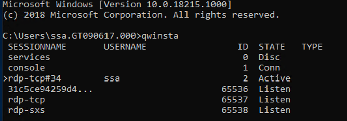
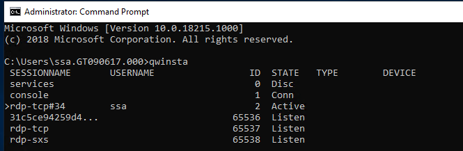
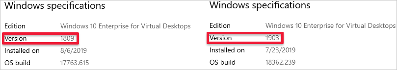

# Session host virtual machine configuration

>[!IMPORTANT]
>This content applies to Azure Virtual Desktop with Azure Resource Manager Azure Virtual Desktop objects. If you're using Azure Virtual Desktop (classic) without Azure Resource Manager objects, see [this article](./virtual-desktop-fall-2019/troubleshoot-vm-configuration-2019.md).

Use this article to troubleshoot issues you're having when configuring the Azure Virtual Desktop session host virtual machines (VMs).

## Provide feedback

Visit the [Azure Virtual Desktop Tech Community](https://techcommunity.microsoft.com/t5/azure-virtual-desktop/bd-p/AzureVirtualDesktopForum) to discuss the Azure Virtual Desktop service with the product team and active community members.

## VMs aren't joined to the domain

Follow these instructions if you're having issues joining virtual machines (VMs) to the domain.

- Join the VM manually using the process in [Join a Windows Server virtual machine to a managed domain](../active-directory-domain-services/join-windows-vm.md) or using the [domain join template](https://azure.microsoft.com/resources/templates/vm-domain-join-existing/).
- Try pinging the domain name from a command line on the VM.
- Review the list of domain join error messages in [Troubleshooting Domain Join Error Messages](https://social.technet.microsoft.com/wiki/contents/articles/1935.troubleshooting-domain-join-error-messages.aspx).

### Error: Incorrect credentials

**Cause:** There was a typo made when the credentials were entered in the Azure Resource Manager template interface fixes.

**Fix:** Take one of the following actions to resolve.

- Manually add the VMs to a domain.
- Redeploy the template once credentials have been confirmed. See [Create a host pool with PowerShell](create-host-pools-powershell.md).
- Join VMs to a domain using a template with [Joins an existing Windows VM to AD Domain](https://azure.microsoft.com/resources/templates/vm-domain-join-existing/).

### Error: Timeout waiting for user input

**Cause:** The account used to complete the domain join may have multifactor authentication (MFA).

**Fix:** Take one of the following actions to resolve.

- Temporarily remove MFA for the account.
- Use a service account.

### Error: The account used during provisioning doesn't have permissions to complete the operation

**Cause:** The account being used doesn't have permissions to join VMs to the domain due to compliance and regulations.

**Fix:** Take one of the following actions to resolve.

- Use an account that is a member of the Administrator group.
- Grant the necessary permissions to the account being used.

### Error: Domain name doesn't resolve

**Cause 1:** VMs are on a virtual network that's not associated with the virtual network (VNET) where the domain is located.

**Fix 1:** Create VNET peering between the VNET where VMs were provisioned and the VNET where the domain controller (DC) is running. See [Create a virtual network peering - Resource Manager, different subscriptions](../virtual-network/create-peering-different-subscriptions.md).

**Cause 2:** When using Azure Active Directory Domain Services (Azure AD DS), the virtual network doesn't have its DNS server settings updated to point to the managed domain controllers.

**Fix 2:** To update the DNS settings for the virtual network containing Azure AD DS, see [Update DNS settings for the Azure virtual network](../active-directory-domain-services/tutorial-create-instance.md#update-dns-settings-for-the-azure-virtual-network).

**Cause 3:** The network interface's DNS server settings don't point to the appropriate DNS server on the virtual network.

**Fix 3:** Take one of the following actions to resolve, following the steps in [Change DNS servers].
- Change the network interface's DNS server settings to **Custom** with the steps from [Change DNS servers](../virtual-network/virtual-network-network-interface.md#change-dns-servers) and specify the private IP addresses of the DNS servers on the virtual network.
- Change the network interface's DNS server settings to **Inherit from virtual network** with the steps from [Change DNS servers](../virtual-network/virtual-network-network-interface.md#change-dns-servers), then change the virtual network's DNS server settings with the steps from [Change DNS servers](../virtual-network/manage-virtual-network.md#change-dns-servers).

## Azure Virtual Desktop Agent and Azure Virtual Desktop Boot Loader aren't installed

The recommended way to provision VMs is using the Azure portal creation template. The template automatically installs the Azure Virtual Desktop Agent and Azure Virtual Desktop Agent Boot Loader.

Follow these instructions to confirm the components are installed and to check for error messages.

1. Confirm that the two components are installed by checking in **Control Panel** > **Programs** > **Programs and Features**. If **Azure Virtual Desktop Agent** and **Azure Virtual Desktop Agent Boot Loader** aren't visible, they aren't installed on the VM.
2. Open **File Explorer** and navigate to **C:\Windows\Temp\ScriptLog.log**. If the file is missing, it indicates that the PowerShell DSC that installed the two components wasn't able to run in the security context provided.
3. If the file **C:\Windows\Temp\ScriptLog.log** is present, open it and check for error messages.

### Error: Azure Virtual Desktop Agent and Azure Virtual Desktop Agent Boot Loader are missing. C:\Windows\Temp\ScriptLog.log is also missing

**Cause 1:** Credentials provided during input for the Azure Resource Manager template were incorrect or permissions were insufficient.

**Fix 1:** Manually add the missing components to the VMs using [Create a host pool with PowerShell](create-host-pools-powershell.md).

**Cause 2:** PowerShell DSC was able to start and execute but failed to complete as it can't sign in to Azure Virtual Desktop and obtain needed information.

**Fix 2:** Confirm the items in the following list.

- Make sure the account doesn't have MFA.
- Confirm the host pool's name is accurate and the host pool exists in Azure Virtual Desktop.
- Confirm the account has at least Contributor permissions on the Azure subscription or resource group.

### Error: Authentication failed, error in C:\Windows\Temp\ScriptLog.log

**Cause:** PowerShell DSC was able to execute but couldn't connect to Azure Virtual Desktop.

**Fix:** Confirm the items in the following list.

- Manually register the VMs with the Azure Virtual Desktop service.
- Confirm account used for connecting to Azure Virtual Desktop has permissions on the Azure subscription or resource group to create host pools.
- Confirm account doesn't have MFA.

## Azure Virtual Desktop Agent isn't registering with the Azure Virtual Desktop service

When the Azure Virtual Desktop Agent is first installed on session host VMs (either manually or through the Azure Resource Manager template and PowerShell DSC), it provides a registration token. The following section covers troubleshooting issues that apply to the Azure Virtual Desktop Agent and the token.

### Error: The status filed in Get-AzWvdSessionHost cmdlet shows status as Unavailable

> [!div class="mx-imgBorder"]
> 

**Cause:** The agent isn't able to update itself to a new version.

**Fix:** Follow these instructions to manually update the agent.

1. Download a new version of the agent on the session host VM.
2. Launch Task Manager and, in the Service Tab, stop the RDAgentBootLoader service.
3. Run the installer for the new version of the Azure Virtual Desktop Agent.
4. When prompted for the registration token, remove the entry INVALID_TOKEN and press next (a new token isn't required).
5. Complete the installation Wizard.
6. Open Task Manager and start the RDAgentBootLoader service.

## Error: Azure Virtual Desktop Agent registry entry IsRegistered shows a value of 0

**Cause:** Registration token has expired.

**Fix:** Follow these instructions to fix the agent registry error.

1. If there's already a registration token, remove it with Remove-AzWvdRegistrationInfo.
2. Run the **New-AzWvdRegistrationInfo** cmdlet to generate a new token.
3. Confirm that the *-ExpriationTime* parameter is set to three days.

### Error: Azure Virtual Desktop agent isn't reporting a heartbeat when running Get-AzWvdSessionHost

**Cause 1:** RDAgentBootLoader service has been stopped.

**Fix 1:** Launch Task Manager and, if the Service Tab reports a stopped status for RDAgentBootLoader service, start the service.

**Cause 2:** Port 443 may be closed.

**Fix 2:** Follow these instructions to open port 443.

1. Confirm port 443 is open by downloading the PSPing tool from [Sysinternal tools](/sysinternals/downloads/psping/).
2. Install PSPing on the session host VM where the agent is running.
3. Open the command prompt as an administrator and issue the command below:

    ```cmd
    psping rdbroker.wvdselfhost.microsoft.com:443
    ```

4. Confirm that PSPing received information back from the RDBroker:

    ```
    PsPing v2.10 - PsPing - ping, latency, bandwidth measurement utility
    Copyright (C) 2012-2016 Mark Russinovich
    Sysinternals - www.sysinternals.com
    TCP connect to 13.77.160.237:443:
    5 iterations (warmup 1) ping test:
    Connecting to 13.77.160.237:443 (warmup): from 172.20.17.140:60649: 2.00ms
    Connecting to 13.77.160.237:443: from 172.20.17.140:60650: 3.83ms
    Connecting to 13.77.160.237:443: from 172.20.17.140:60652: 2.21ms
    Connecting to 13.77.160.237:443: from 172.20.17.140:60653: 2.14ms
    Connecting to 13.77.160.237:443: from 172.20.17.140:60654: 2.12ms
    TCP connect statistics for 13.77.160.237:443:
    Sent = 4, Received = 4, Lost = 0 (0% loss),
    Minimum = 2.12ms, Maximum = 3.83ms, Average = 2.58ms
    ```

## Troubleshooting issues with the Azure Virtual Desktop side-by-side stack

There are three main ways the side-by-side stack gets installed or enabled on session host pool VMs:

- With the Azure portal creation template
- By being included and enabled on the master image
- Installed or enabled manually on each VM (or with extensions/PowerShell)

If you're having issues with the Azure Virtual Desktop side-by-side stack, type the **qwinsta** command from the command prompt to confirm that the side-by-side stack is installed or enabled.

The output of **qwinsta** will list **rdp-sxs** in the output if the side-by-side stack is installed and enabled.

> [!div class="mx-imgBorder"]
> 

Examine the registry entries listed below and confirm that their values match. If registry keys are missing or values are mismatched, make sure you're running [a supported operating system](troubleshoot-agent.md#error-operating-a-pro-vm-or-other-unsupported-os). If you are, follow the instructions in [Register session hosts to a host pool](add-session-hosts-host-pool.md#register-session-hosts-to-a-host-pool) for how to reinstall the side-by-side stack.

```registry
    HKEY_LOCAL_MACHINE\SYSTEM\CurrentControlSet\Control\Terminal
    Server\WinStations\rds-sxs\"fEnableWinstation":DWORD=1

    HKEY_LOCAL_MACHINE\SYSTEM\CurrentControlSet\Control\Terminal
    Server\ClusterSettings\"SessionDirectoryListener":rdp-sxs
```

### Error: O_REVERSE_CONNECT_STACK_FAILURE

> [!div class="mx-imgBorder"]
> 

**Cause:** The side-by-side stack isn't installed on the session host VM.

**Fix:** Follow these instructions to install the side-by-side stack on the session host VM.

1. Use Remote Desktop Protocol (RDP) to get directly into the session host VM as local administrator.
2. Install the side-by-side stack by following the steps to [Register session hosts to a host pool](add-session-hosts-host-pool.md#register-session-hosts-to-a-host-pool).

## How to fix an Azure Virtual Desktop side-by-side stack that malfunctions

There are known circumstances that can cause the side-by-side stack to malfunction:

- Not following the correct order of the steps to enable the side-by-side stack
- Auto update to Windows 10 Enhanced Versatile Disc (EVD)
- Missing the Remote Desktop Session Host (RDSH) role

The instructions in this section can help you uninstall the Azure Virtual Desktop side-by-side stack. Once you uninstall the side-by-side stack, follow the steps to [Register session hosts to a host pool](add-session-hosts-host-pool.md#register-session-hosts-to-a-host-pool) to reinstall the side-by-side stack.

The VM used to run remediation must be on the same subnet and domain as the VM with the malfunctioning side-by-side stack.

Follow these instructions to run remediation from the same subnet and domain:

1. Connect with standard Remote Desktop Protocol (RDP) to the VM from where fix will be applied.

1. [Download and install PsExec](/sysinternals/downloads/psexec).

1. Start command prompt as local administrator, then navigate to folder where PsExec was unzipped.

1. From command prompt, use the following command, where `<VMname>` is the hostname name of the VM with the malfunctioning side-by-side stack. If this is the first time you have run PsExec, you'll also need to accept the PsExec License Agreement to continue by clicking **Agree**.

    ```cmd
    psexec.exe \\<VMname> cmd
    ```

1. After the command prompt session opens on the VM with the malfunctioning side-by-side stack, run the following command and confirm that an entry named rdp-sxs is available. If not, a side-by-side stack isn't present on the VM so the issue isn't tied to the side-by-side stack.

   ```cmd
   qwinsta
   ```

   > [!div class="mx-imgBorder"]
   > 

1. Run the following command, which will list Microsoft components installed on the VM with the malfunctioning side-by-side stack.

    ```cmd
    wmic product get name
    ```

1. Run the command below with product names from step above, for example:

    ```cmd
    wmic product where name="<Remote Desktop Services Infrastructure Agent>" call uninstall
    ```

1. Uninstall all products that start with **Remote Desktop**.

1. After all Azure Virtual Desktop components have been uninstalled, restart the VM that had the malfunctioning side-by-side stack (either with Azure portal or from the PsExec tool). You can then reinstall the side-by-side stack by following the steps to [Register session hosts to a host pool](add-session-hosts-host-pool.md#register-session-hosts-to-a-host-pool).

## Remote Desktop licensing mode isn't configured

If you sign in to Windows 10 Enterprise multi-session using an administrative account, you might receive a notification that says, "Remote Desktop licensing mode isn't configured, Remote Desktop Services will stop working in X days. On the Connection Broker server, use Server Manager to specify the Remote Desktop licensing mode."

If the time limit expires, an error message will appear that says, "The remote session was disconnected because there are no Remote Desktop client access licenses available for this computer."

If you see either of these messages, it means the image doesn't have the latest Windows updates installed or you're setting the Remote Desktop licensing mode through group policy. Follow the steps in the next sections to check the group policy setting, identify the version of Windows 10 Enterprise multi-session, and install the corresponding update.

>[!NOTE]
>Azure Virtual Desktop only requires an RDS client access license (CAL) when your host pool contains Windows Server session hosts. To learn how to configure an RDS CAL, see [License your RDS deployment with client access licenses](/windows-server/remote/remote-desktop-services/rds-client-access-license/).

### Disable the Remote Desktop licensing mode group policy setting

Check the group policy setting by opening the Group Policy Editor in the VM and navigating to **Administrative Templates** > **Windows Components** > **Remote Desktop Services** > **Remote Desktop Session Host** > **Licensing** > **Set the Remote Desktop licensing mode**. If the group policy setting is **Enabled**, change it to **Disabled**. If it's already disabled, then leave it as-is.

>[!NOTE]
>If you set group policy through your domain, disable this setting on policies that target these Windows 10 Enterprise multi-session VMs.

### Identify which version of Windows 10 Enterprise multi-session you're using

To check which version of Windows 10 Enterprise multi-session you have:

1. Sign in with your admin account.
2. Enter "About" into the search bar next to the Start menu.
3. Select **About your PC**.
4. Check the number next to "Version." The number should be either "1809" or "1903," as shown in the following image.

    > [!div class="mx-imgBorder"]
    > 

Now that you know your version number, skip ahead to the relevant section.

### Version 1809

If your version number says "1809," install [the KB4516077 update](https://support.microsoft.com/help/4516077).

### Version 1903

Redeploy the host operating system with the latest version of the Windows 10, version 1903 image from the Azure Gallery.

## We couldn't connect to the remote PC because of a security error

If your users see an error that says, "We couldn't connect to the remote PC because of a security error. If this keeps happening, ask your admin or tech support for help," validate any existing policies that change default RDP permissions. One policy that might cause this error to appear is "Allow log on through Remote Desktop Services security policy."

To learn more about this policy, see [Allow log on through Remote Desktop Services](/windows/security/threat-protection/security-policy-settings/allow-log-on-through-remote-desktop-services).

## I can't deploy the golden image

Golden images must not include the Azure Virtual Desktop agent. You can install the agent only after you deploy the golden image.

## Next steps

- For an overview on troubleshooting Azure Virtual Desktop and the escalation tracks, see [Troubleshooting overview, feedback, and support](troubleshoot-set-up-overview.md).
- To troubleshoot issues while creating a host pool in an Azure Virtual Desktop environment, see [Environment and host pool creation](troubleshoot-set-up-issues.md).
- To troubleshoot issues while configuring a virtual machine (VM) in Azure Virtual Desktop, see [Session host virtual machine configuration](troubleshoot-vm-configuration.md).
- To troubleshoot issues related to the Azure Virtual Desktop agent or session connectivity, see [Troubleshoot common Azure Virtual Desktop Agent issues](troubleshoot-agent.md).
- To troubleshoot issues with Azure Virtual Desktop client connections, see [Azure Virtual Desktop service connections](troubleshoot-service-connection.md).
- To troubleshoot issues with Remote Desktop clients, see [Troubleshoot the Remote Desktop client](troubleshoot-client-windows.md)
- To troubleshoot issues when using PowerShell with Azure Virtual Desktop, see [Azure Virtual Desktop PowerShell](troubleshoot-powershell.md).
- To learn more about the service, see [Azure Virtual Desktop environment](environment-setup.md).
- To go through a troubleshoot tutorial, see [Tutorial: Troubleshoot Resource Manager template deployments](../azure-resource-manager/templates/template-tutorial-troubleshoot.md).
- To learn about auditing actions, see [Audit operations with Resource Manager](../azure-monitor/essentials/activity-log.md).
- To learn about actions to determine the errors during deployment, see [View deployment operations](../azure-resource-manager/templates/deployment-history.md).
