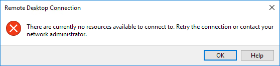
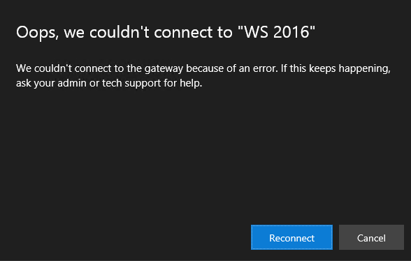

# Windows Virtual Desktop troubleshooting guide for client connections

Use this article to resolve common issues with Windows Virtual Desktop client connections.

## Provide feedback

We currently aren't taking support cases while Windows Virtual Desktop is in preview. Visit the [Windows Virtual Desktop Tech Community](https://techcommunity.microsoft.com/t5/Windows-Virtual-Desktop/bd-p/WindowsVirtualDesktop) to discuss the Windows Virtual Desktop service with the product team and active community members.

## You can't open web client

Confirm there is internet connectivity by opening another web site; for example, [www.Bing.com](https://www.bing.com).

Use **nslookup** to confirm DNS can resolve the FQDN:

```cmd
nslookup rdweb.wvd.microsoft.com
```

Try connecting with another client, like Remote Desktop client for Windows 7 or Windows 10.

### Error: Opening other site fails.

**Cause:** Network issues and/or outages.

**Fix:** Contact network support.

### Error: Nslookup cannot resolve the name.

**Cause:** Network issues and/or outages.

**Fix:** Contact network support

### Error: Other clients can connect.

**Cause:** The browser isn't behaving as expected and stopped working.

**Fix:** Follow these instructions to troubleshoot the browser.

1. Restart browser.
2. Clear browser cookies. See [How to delete cookie files in Internet Explorer](https://support.microsoft.com/help/278835/how-to-delete-cookie-files-in-internet-explorer).
3. Clear browser cache. See [clear browser cache for your browser](https://binged.it/2RKyfdU).
4. Open browser in Private mode.

## Web client stops responding or disconnects

Try connecting using another browser or client.

## Error: Other browsers and clients also malfunction or fail to open.

**Cause:** Network and/or operation system issues or outages.

**Fix:** Contact support teams.

## Web client keeps prompting for credentials

If the Web client keeps prompting for credentials, follow these instructions.

1. Confirm web client URL is correct.
2. Confirm that credentials are for the Windows Virtual Desktop environment tied to the URL.
3. Clear browser cookies. See [How to delete cookie files in Internet Explorer](https://support.microsoft.com/help/278835/how-to-delete-cookie-files-in-internet-explorer).
4. Clear browser cache. See [Clear browser cache for your browser](https://binged.it/2RKyfdU).
5. Open browser in Private mode.

## Remote Desktop client for Windows 7 or Windows 10 stops responding or cannot be opened

Use the following PowerShell cmdlets to clean up OOB client registries.

```PowerShell
Remove-ItemProperty 'HKCU:\Software\Microsoft\Terminal Server Client\Default' - Name FeedURLs

#Remove RdClientRadc registry key
Remove-Item 'HKCU:\Software\Microsoft\RdClientRadc' -Recurse

#Remove all files under %appdata%\RdClientRadc
Remove-Item C:\Users\pavithir\AppData\Roaming\RdClientRadc\* -Recurse
```

Navigate to **%AppData%\\RdClientRadc\\** and delete all content.

Uninstall and reinstall Remote Desktop client for Windows 7 and Windows 10.

## Troubleshooting end-user connectivity

Sometiems users can access their feed and local resources, but still have configuration, availability, or performance issues that prevent them from accessing remote resources. The user gets messages similar to these:





Follow these general troubleshooting instructions for common error codes.

1. Confirm user name and time when issue was experienced.
2. Open **PowerShell** and establish connection to the Windows Virtual Desktop tenant where the issue was reported.
3. Confirm connection to the correct tenant with **Get-RdsTenant.**
4. If needed, set the tenant group context with **Set-RdsContext –TenantGroupt\<TenantGroup\>**.
5. Using **Get-RdsHostPool** and **Get-RdsSessionHost** cmdlets, confirm that troubleshooting is being done on the correct host pool.
6. Execute the command below to get a list of all failed activities of type connection for the specified time window:

```cmd
 Get-RdsDiagnosticActivities -TenantName <TenantName> -username <UPN> -StartTime
 "11/21/2018 1:07:03 PM" -EndTime "11/21/2018 1:27:03 PM" -Outcome Failure -ActivityType Connection
```

7. Using the **ActivityId** from the previous cmdlet output, run the command below:

```
(Get-RdsDiagnosticActivities -TenantName $tenant -ActivityId <ActivityId> -Detailed).Errors
```

8. The command produces output of the type show below. Use **ErrorCodeSymbolic** and **ErrorMessage** to troubleshoot the root cause.

```
ErrorSource       : <Source>
ErrorOperation    : <Operation>
ErrorCode         : <Error code>
ErrorCodeSymbolic : <Error code string>
ErrorMessage      : <Error code message>
ErrorInternal     : <Internal for the OS>
ReportedBy        : <Reported by component>
Time              : <Timestampt>
```

### Error: O_ADD_USER_TO_GROUP_FAILED / Failed to add user = ≤username≥ to group = Remote Desktop Users. Reason: Win32.ERROR_NO_SUCH_MEMBER

**Cause:** VM has not been joined to the domain where user object is.

**Fix:** Add VM to the correct domain. See [Join a Windows Server virtual machine to a managed domain](https://docs.microsoft.com/azure/active-directory-domain-services/active-directory-ds-admin-guide-join-windows-vm-portal).

### Error:** Nslookup cannot resolve the name

**Cause:** Network issues or outages.

**Fix:** Contact network support

### Error: ConnectionFailedClientProtocolError

**Cause:** VMs that user is attempting to connect to are not domain joined.

**Fix:** Join all VMs that are part of a host pool to the domain controller.

### User connects but nothing is displayed (no feed)

A User can start Remote Desktop clients and is able to authenticate, however the user doesn't see any icons in the web discovery feed.

Confirm that the user reporting the issues has been assigned to application groups by using this command line:

```cmd
Get-RdsAppGroupUser \<tenantname\> \<hostpoolname\> \<appgroupname\>
```

Confirm that the user is logging in with the correct credentials.

If the web client is being used, confirm that there are no cached credentials issue.

## Next Steps

- To see an overview for troubleshooting Windows Virtual Desktop and the escalation tracks, see [Overview for troubleshooting common set up issues for Windows Virtual Desktop](troubleshoot-set-up-overview.md).
- To troubleshoot issues while setting up, see [Troubleshoot Windows Virtual Desktop set up issues](troubleshoot-set-up-issues.md)
- To troubleshoot issues with VM configuration, see [Troubleshoot Windows Virtual Desktop VM issues](troubleshoot-vm-configuration.md)
- To troubleshoot issues when using PowerShell with Windows Virtual Desktop, see [Troubleshoot common issues when using PowerShell](troubleshoot-powershell.md)
- To learn more about the Preview service, see [Windows Desktop Preview environment](https://review.docs.microsoft.com/azure/virtual-desktop/environment-setup?branch=pr-en-us-71423).
- To go through a troubleshoot tutorial, see [Tutorial: Troubleshoot Resource Manager template deployments](https://docs.microsoft.com/azure/azure-resource-manager/resource-manager-tutorial-troubleshoot).
- To learn about auditing actions, see [Audit operations with Resource Manager](https://docs.microsoft.com/azure/azure-resource-manager/resource-group-audit).
- To learn about actions to determine the errors during deployment, see [View deployment operations](https://docs.microsoft.com/azure/azure-resource-manager/resource-manager-deployment-operations).