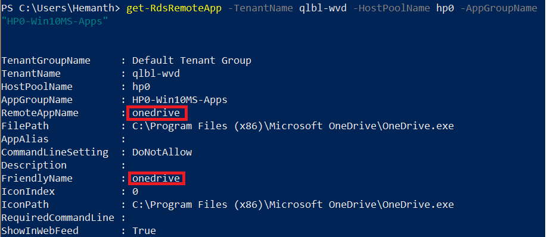
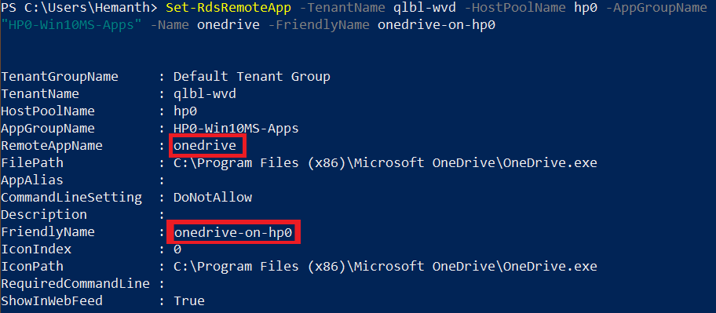
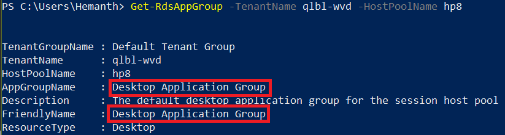
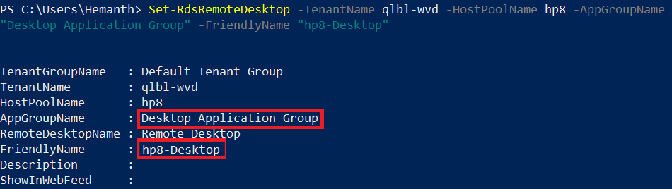

# Customize feed for Azure Virtual Desktop (classic) users

>[!IMPORTANT]
>This content applies to Azure Virtual Desktop (classic), which doesn't support Azure Resource Manager Azure Virtual Desktop objects. If you're trying to manage Azure Resource Manager Azure Virtual Desktop objects, see [this article](../customize-feed-for-virtual-desktop-users.md).

You can customize the feed so the RemoteApp and remote desktop resources appear in a recognizable way for your users.

First, [download and import the Azure Virtual Desktop PowerShell module](/powershell/windows-virtual-desktop/overview/) to use in your PowerShell session if you haven't already. After that, run the following cmdlet to sign in to your account:

```powershell
Add-RdsAccount -DeploymentUrl "https://rdbroker.wvd.microsoft.com"
```

## Customize the display name for a RemoteApp

You can change the display name for a published RemoteApp by setting the friendly name. By default, the friendly name is the same as the name of the RemoteApp program.

To retrieve a list of published applications for an application group, run the following PowerShell cmdlet:

```powershell
Get-RdsRemoteApp -TenantName <tenantname> -HostPoolName <hostpoolname> -AppGroupName <appgroupname>
```

> [!div class="mx-imgBorder"]
> 

To assign a friendly name to a RemoteApp, run the following PowerShell cmdlet:

```powershell
Set-RdsRemoteApp -TenantName <tenantname> -HostPoolName <hostpoolname> -AppGroupName <appgroupname> -Name <existingappname> -FriendlyName <newfriendlyname>
```

> [!div class="mx-imgBorder"]
> 

## Customize the display name for a Remote Desktop

You can change the display name for a published remote desktop by setting a friendly name. If you manually created a host pool and desktop application group through PowerShell, the default friendly name is "Session Desktop." If you created a host pool and desktop application group through the GitHub Azure Resource Manager template or the Azure Marketplace offering, the default friendly name is the same as the host pool name.

To retrieve the remote desktop resource, run the following PowerShell cmdlet:

```powershell
Get-RdsRemoteDesktop -TenantName <tenantname> -HostPoolName <hostpoolname> -AppGroupName <appgroupname>
```

> [!div class="mx-imgBorder"]
> 

To assign a friendly name to the remote desktop resource, run the following PowerShell cmdlet:

```powershell
Set-RdsRemoteDesktop -TenantName <tenantname> -HostPoolName <hostpoolname> -AppGroupName <appgroupname> -FriendlyName <newfriendlyname>
```

> [!div class="mx-imgBorder"]
> 

## Next steps

Now that you've customized the feed for users, you can sign in to a Azure Virtual Desktop client to test it out. To do so, continue to the Connect to Azure Virtual Desktop How-tos:

 - [Connect from the Windows Desktop client](connect-windows-2019.md)
 - [Connect from a web browser](connect-web-2019.md)
