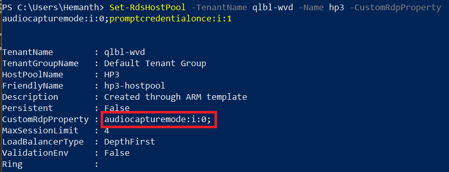
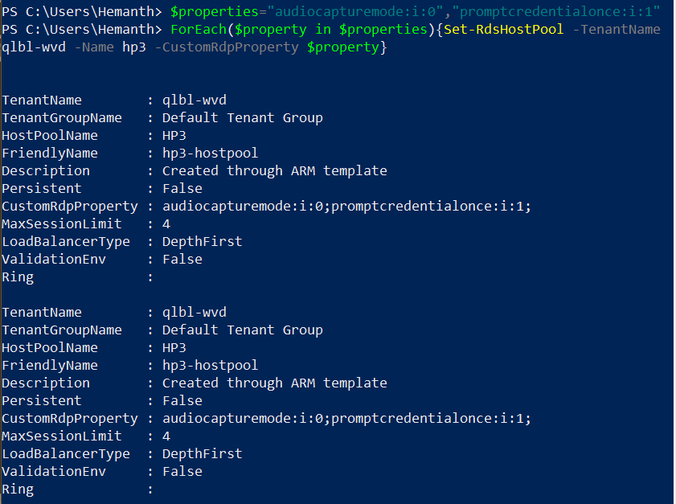
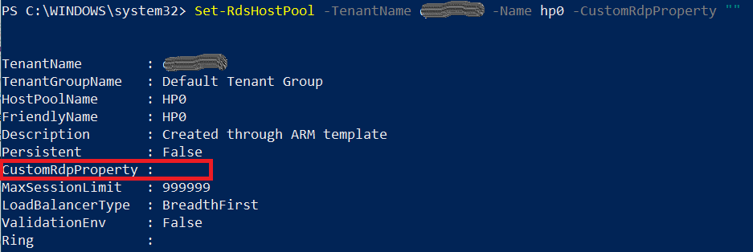

# Customize Remote Desktop Protocol properties for an Azure Virtual Desktop (classic) host pool

>[!IMPORTANT]
>This content applies to Azure Virtual Desktop (classic), which doesn't support Azure Resource Manager Azure Virtual Desktop objects. If you're trying to manage Azure Resource Manager Azure Virtual Desktop objects, see [this article](../customize-rdp-properties.md).

Customizing a host pool's Remote Desktop Protocol (RDP) properties, such as multi-monitor experience and audio redirection, lets you deliver an optimal experience for your users based on their needs. You can customize RDP properties in Azure Virtual Desktop using the **-CustomRdpProperty** parameter in the **Set-RdsHostPool** cmdlet.

See [supported RDP file settings](/windows-server/remote/remote-desktop-services/clients/rdp-files?context=%2fazure%2fvirtual-desktop%2fcontext%2fcontext) for a full list of supported properties and their default values.

First, [download and import the Azure Virtual Desktop PowerShell module](/powershell/windows-virtual-desktop/overview/) to use in your PowerShell session if you haven't already. After that, run the following cmdlet to sign in to your account:

```powershell
Add-RdsAccount -DeploymentUrl "https://rdbroker.wvd.microsoft.com"
```

## Default RDP properties

By default, published RDP files contain the following properties:

|RDP properties | Desktop session | RemoteApp session |
|---|---| --- |
| Multi-monitor mode | Enabled | N/A |
| Drive redirections enabled | Drives, clipboard, printers, COM ports, USB devices and smartcards| Drives, clipboard, and printers |
| Remote audio mode | Play locally | Play locally |

Any custom properties you define for the host pool will override these defaults.

## Add or edit a single custom RDP property

To add or edit a single custom RDP property, run the following PowerShell cmdlet:

```powershell
Set-RdsHostPool -TenantName <tenantname> -Name <hostpoolname> -CustomRdpProperty "<property>"
```

> [!div class="mx-imgBorder"]
> 

## Add or edit multiple custom RDP properties

To add or edit multiple custom RDP properties, run the following PowerShell cmdlets by providing the custom RDP properties as a semicolon-separated string:

```powershell
$properties="<property1>;<property2>;<property3>"
Set-RdsHostPool -TenantName <tenantname> -Name <hostpoolname> -CustomRdpProperty $properties
```

> [!div class="mx-imgBorder"]
> 

## Reset all custom RDP properties

You can reset individual custom RDP properties to their default values by following the instructions in [Add or edit a single custom RDP property](#add-or-edit-a-single-custom-rdp-property), or you can reset all custom RDP properties for a host pool by running the following PowerShell cmdlet:

```powershell
Set-RdsHostPool -TenantName <tenantname> -Name <hostpoolname> -CustomRdpProperty ""
```

> [!div class="mx-imgBorder"]
> 

## Next steps

Now that you've customized the RDP properties for a given host pool, you can sign in to an Azure Virtual Desktop client to test them as part of a user session. These next two How-tos will tell you how to connect to a session using the client of your choice:

- [Connect with the Windows Desktop client](connect-windows-2019.md)
- [Connect with the web client](connect-web-2019.md)
