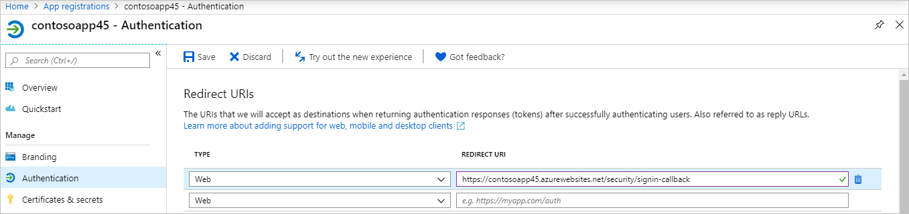

# Deploy the Azure Virtual Desktop (classic) diagnostics tool

>[!IMPORTANT]
>This content applies to Azure Virtual Desktop (classic), which doesn't support Azure Resource Manager Azure Virtual Desktop objects.

Here's what the diagnostics tool for Azure Virtual Desktop can do for you:

- Look up diagnostic activities (management, connection, or feed) for a single user over a period of one week.
- Gather session host information for connection activities from your Log Analytics workspace.
- Review virtual machine (VM) performance details for a particular host.
- See which users are signed in to the session host.
- Send message to active users on a specific session host.
- Sign users out of a session host.

## Prerequisites

You need to create an Azure Active Directory App Registration and a Log Analytics workspace before you can deploy the Azure Resource Manager template for the tool. You or the administrator need these permissions to do that:

- Owner of the Azure subscription
- Permission to create resources in your Azure subscription
- Permission to create an Azure AD app
- RDS Owner or Contributor rights

You also need to install these two PowerShell modules before you get started:

- [Azure PowerShell module](/powershell/azure/install-azure-powershell)
- [Azure AD module](/powershell/azure/active-directory/install-adv2)

Make sure you have your Subscription ID ready for when you sign in.

After you have everything in order, you can create the Azure AD app registration.

## Create an Azure Active Directory app registration

This section will show you how to use PowerShell to create the Azure Active Directory app with a service principal and get API permissions for it.

>[!NOTE]
>The API permissions are Azure Virtual Desktop, Log Analytics and Microsoft Graph API permissions are added to the Azure Active Directory Application.

1. Open PowerShell as an Administrator.
2. Sign in to Azure with an account that has Owner or Contributor permissions on the Azure subscription you would like to use for the diagnostics tool:
   ```powershell
   Login-AzAccount
   ```
3. Sign in to Azure AD with the same account:
   ```powershell
   Connect-AzureAD
   ```
4. Go to the [RDS-Templates GitHub repo](https://github.com/Azure/RDS-Templates/tree/master/wvd-templates/diagnostics-sample/deploy/scripts) and run the **CreateADAppRegistrationforDiagnostics.ps1** script in PowerShell.
5.  When the script asks you to name your app, enter a unique app name.


After the script successfully runs, it should show the following things in its output:

-  A message that confirms your app now has a service principal role assignment.
-  Your Client ID and Client Secret Key that you'll need for when you deploy the diagnostics tool.

Now that you've registered your app, it's time to configure your Log Analytics workspace.

## Configure your Log Analytics workspace

For the best possible experience, we recommend you configure your Log Analytics workspace with the following performance counters that allow you to derive statements of the user experience in a remote session. For a list of recommended counters with suggested thresholds, see [Windows performance counter thresholds](deploy-diagnostics.md#windows-performance-counter-thresholds).

### Create an Azure Log Analytics workspace using PowerShell

You can run a PowerShell script to create a Log Analytics workspace and configure the recommended Windows performance counters to monitor user experience and app performance.

>[!NOTE]
>If you already have an existing Log Analytics workspace that you made without the PowerShell script that you want to use, skip ahead to [Validate the script results in the Azure portal](#validate-the-script-results-in-the-azure-portal).

To run the PowerShell script:

1.  Open PowerShell as an admin.
2.  Go to the [RDS-Templates GitHub repo](https://github.com/Azure/RDS-Templates/tree/master/wvd-templates/diagnostics-sample/deploy/scripts) and run the **CreateLogAnalyticsWorkspaceforDiagnostics.ps1** script in PowerShell.
3. Enter the following values for the parameters:

    - For **ResourceGroupName**, enter the name for the resource group.
    - For **LogAnalyticsWorkspaceName**, enter a unique name for your Log Analytics workspace.
    - For **Location**, enter the Azure region you're using.
    - Enter the **Azure Subscription ID**, which you can find in the Azure portal under **Subscriptions**.

4. Enter the credentials of a user with delegated admin access.
5. Sign in to the Azure portal with the same user's credentials.
6. Write down or memorize the LogAnalyticsWorkspace ID for later.
7. If you set up the Log Analytics workspace with the PowerShell script, then your performance counters should already be configured and you can skip ahead to [Validate the script results in the Azure portal](#validate-the-script-results-in-the-azure-portal). Otherwise, continue to the next section.

### Configure Windows performance counters in your existing Log Analytics workspace

This section is for users who want to use an existing Azure Log Analytics workspace created without the PowerShell script in the previous section. If you haven't used the script, then you must configure the recommended Windows performance counters manually.

Here's how to manually configure the recommended performance counters:

1. Open your internet browser and sign in to the [Azure portal](https://portal.azure.com/) with your administrative account.
2. Next, go to **Log Analytics workspaces** to review the configured Windows Performance Counters.
3. In the **Settings** section, select  **Advanced settings**.
4. After that, navigate to **Data** > **Windows Performance Counters** and add the following counters:

    -   LogicalDisk(\*)\\%Free Space
    -   LogicalDisk(C:)\\Avg. Disk Queue Length
    -   Memory(\*)\\Available Mbytes
    -   Processor Information(\*)\\Processor Time
    -   User Input Delay per Session(\*)\\Max Input Delay

Learn more about the performance counters at [Windows and Linux performance data sources in Azure Monitor](../../azure-monitor/agents/data-sources-performance-counters.md).

>[!NOTE]
>Any additional counters you configure won't show up in the diagnostics tool itself. To make it appear in the diagnostics tool, you need to configure the tool's config file. Instructions for how to do this with advanced administration will be available in GitHub at a later date.

## Validate the script results in the Azure portal

Before you continue deploying the diagnostics tool, we recommend that you verify that your Azure Active Directory application has API permissions and your Log Analytics workspace has the preconfigured Windows performance counters.

### Review your app registration

To make sure your app registration has API permissions:

1. Open a browser and sign in to the [Azure portal](https://portal.azure.com/) with your administrative account.
2. Go to **Azure Active Directory**.
3. Go to **App registrations** and select **All Applications**.
4. Look for your Azure AD app registration with the same app name you entered in step 5 of [Create an Azure Active Directory app registration](deploy-diagnostics.md#create-an-azure-active-directory-app-registration).
5. On your Azure subscription, check that app registration has been assigned the *Contributor* role assignment.

### Review your Log Analytics workspace

To make sure your Log Analytics workspace has the preconfigured Windows performance counters:

1. In the [Azure portal](https://portal.azure.com/), go to **Log Analytics workspaces** to review the configured Windows Performance Counters.
2. Under **Settings**, select **Advanced settings**.
3. After that, go to **Data** > **Windows Performance Counters**.
4. Make sure the following counters are preconfigured:

   - LogicalDisk(\*)\\%Free Space: Displays the amount of free space of the total usable space on the disk as a percentage.
   - LogicalDisk(C:)\\Avg. Disk Queue Length: The length of disk transfer request for your C drive. The value shouldn't exceed 2 for more than a short period of time.
   - Memory(\*)\\Available Mbytes: The available memory for the system in megabytes.
   - Processor Information(\*)\\Processor Time: the percentage of elapsed time that the processor spends to execute a non-Idle thread.
   - User Input Delay per Session(\*)\\Max Input Delay

### Connect to VMs in your Log Analytics workspace

In order to be able to view the health of VMs, you'll need to enable the Log Analytics connection. Follow these steps to connect your VMs:

1. Open a browser and sign in to the [Azure portal](https://portal.azure.com/) with your administrative account.
2. Go to your Log Analytics Workspace.
3. In the left panel, under Workspace Data Sources, select **virtual machines**.
4. Select the name of the VM you want to connect to.
5. Select **Connect**.

## Deploy the diagnostics tool

To deploy the Azure Resource Management template for the diagnostics tool:

1.  Go to the [GitHub Azure RDS-Templates page](https://github.com/Azure/RDS-Templates/tree/master/wvd-templates/diagnostics-sample/deploy).
2.  Deploy the template to Azure and follow the instructions in the template. Make sure you have the following information available:

    -   Client-Id
    -   Client-Secret
    -   Log Analytics workspace ID

3.  Once the input parameters are provided, accept the terms and conditions, then select **Purchase**.

The deployment will take 2–3 minutes. After successful deployment, go to the resource group and make sure the web app and app service plan resources are there.

After that, you need to set the Redirect URI.

### Set the Redirect URI

To set the Redirect URI:

1.  In the [Azure portal](https://portal.azure.com/), go to **App Services** and locate the application you created.
2.  Go to the overview page and copy the URL you find there.
3.  Navigate to **app registrations** and select the app you want to deploy.
4.  In the left panel, under Manage section, select **Authentication**.
5.  Enter the desired Redirect URI into the **Redirect URI** text box, then select **Save** in the top-left corner of the menu.
6. Select **Web** in the drop-down menu under Type.
7. Enter the URL from the app overview page and add **/security/signin-callback** to the end of it. For example: `https://<yourappname>.azurewebsites.net/security/signin-callback`.

   > [!div class="mx-imgBorder"]
   > 

8. Now, go to your Azure resources, select the Azure App Services resource with the name you provided in the template and navigate to the URL associated with it. (For example, if the app name you used in the template was `contosoapp45`, then your associated URL is `http://contoso.azurewebsites.net`).
9. Sign in using the appropriate Azure Active Directory user account.
10.   Select **Accept**.

## Distribute the diagnostics tool

Before you make the diagnostics tool available to your users, make sure they have the following permissions:

- Users need read access for log analytics. For more information, see [Get started with roles, permissions, and security with Azure Monitor](../../azure-monitor/roles-permissions-security.md).
-  Users also need read access for the Azure Virtual Desktop tenant (RDS Reader role). For more information, see [Delegated access in Azure Virtual Desktop](delegated-access-virtual-desktop-2019.md).

You also need to give your users the following information:

- The app's URL
- The names of the tenant group individual tenant they can access.

## Use the diagnostics tool

After you've signed in to your account using the information you've received from your organization, have the UPN ready for the user you want to query activities for. A search will give you all activities under the specified activity type that happened within the last week.

### How to read activity search results

Activities are sorted by timestamp, with the latest activity first. If the results return an error, first check to see if it's a service error. For service errors, create a support ticket with the activity information to help us debug the issue. All other error types can usually be solved by the user or administrator. For a list of the most common error scenarios and how to solve them, see [Identify and diagnose issues](diagnostics-role-service-2019.md#common-error-scenarios).

>[!NOTE]
>Service errors are called "external errors" in the linked documentation. This will be changed when we update the PowerShell reference.

Connection activities might have more than one error. You can expand the activity type to see any other errors the user has come across. Select the name of the error code to open up a dialog to see more information about it.

### Investigate the session host

In the search results, find and select the session host you want information about.

You can analyze session host health:

- Based on a predefined threshold, you can retrieve the session host health information that Log Analytics queries.
- When there's no activity or the session host isn't connected to Log Analytics, the information won't be available.

You can also interact with users on the session host:

- You can either sign out or send a message to signed in users.
- The user you originally searched for is selected by default, but you can also select additional users to send messages or sign out multiple users at once.

### Windows performance counter thresholds

- LogicalDisk(\*)\\%Free Space:

    - Displays the percentage of the total usable space on the logical disk that is free.
    - Threshold: Less than 20% is marked as unhealthy.

- LogicalDisk(C:)\\Avg. Disk Queue Length:

    - Represents storage system conditions.
    - Threshold: Higher than 5 is marked as unhealthy.

- Memory(\*)\\Available Mbytes:

    - The available memory for the system.
    - Threshold: Less than 500 megabytes marked as unhealthy.

- Processor Information(\*)\\Processor Time:

    - Threshold: Higher than 80% is marked as unhealthy.

- [User Input Delay per Session(\*)\\Max Input Delay](/windows-server/remote/remote-desktop-services/rds-rdsh-performance-counters/):

    - Threshold: Higher than 2000 ms is marked as unhealthy.

## Next steps

- Learn how to monitor activity logs at [Use diagnostics with Log Analytics](diagnostics-log-analytics-2019.md).
- Read about common error scenarios and how to fix them at [Identify and diagnose issues](diagnostics-role-service-2019.md).