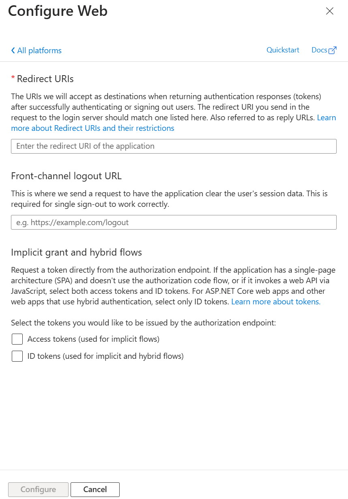
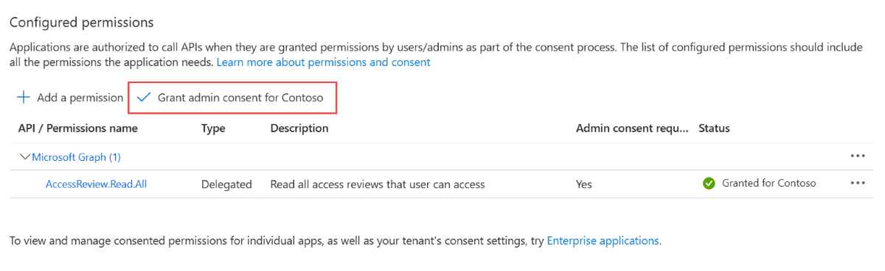

# Deploy an Azure Virtual Desktop (classic) management tool with PowerShell

>[!IMPORTANT]
>This content applies to Azure Virtual Desktop (classic), which doesn't support Azure Resource Manager Azure Virtual Desktop objects.

This article will show you how to deploy the management tool using PowerShell.

## Important considerations

Each Microsoft Entra tenant's subscription needs its own separate deployment of the management tool. This tool doesn't support Microsoft Entra Business-to-Business (B2B) scenarios.

This management tool is a sample. Microsoft will provide important security and quality updates. [The source code is available in GitHub](https://github.com/Azure/RDS-Templates/tree/master/wvd-templates/wvd-management-ux/deploy). Whether you're a customer or partner, we encourage you to customize the tool to satisfy your business needs.

The following browsers are compatible with the management tool:

- Google Chrome 68 or later
- Microsoft Edge 40.15063 or later
- Mozilla Firefox 52.0 or later
- Safari 10 or later (macOS only)

## What you need to deploy the management tool

Before deploying the management tool, you'll need a Microsoft Entra user to create an app registration and deploy the management UI. This user must:

- Have permission to create resources in your Azure subscription
- Have permission to create a Microsoft Entra application. Follow these steps to check if your user has the required permissions by following the instructions in [Required permissions](../../active-directory/develop/howto-create-service-principal-portal.md#permissions-required-for-registering-an-app).

After you deploy and configure the management tool, we recommend you ask a user to launch the management UI to make sure everything works. The user who launches the management UI must have a role assignment that lets them view or edit the Azure Virtual Desktop tenant.

## Set up PowerShell

Get started by signing in to both the Az and Azure AD PowerShell modules. Here's how to sign in:

1. Open PowerShell as an Administrator and navigate to the directory where you saved the PowerShell scripts.
2. Sign in to Azure with an account that has Owner or Contributor permissions on the Azure subscription you plan to use to create the management tool by running the following cmdlet:

    ```powershell
    Login-AzAccount
    ```

3. Run the following cmdlet to sign in to Microsoft Entra ID with the same account you used for the Az PowerShell module:

    ```powershell
    Connect-AzureAD
    ```

4. After that, navigate to the folder where you saved the two PowerShell scripts from the RDS-Templates GitHub repo.

Keep the PowerShell window you used to sign in open to run additional PowerShell cmdlets while signed in.

<a name='create-an-azure-active-directory-app-registration'></a>

## Create a Microsoft Entra app registration

In order to successfully deploy and configure the management tool, you first need to download the following PowerShell scripts from the [RDS-Templates GitHub repo](https://github.com/Azure/RDS-Templates/tree/master/wvd-templates/wvd-management-ux/deploy/scripts)

```powershell
Set-Location -Path "c:\temp"
$uri = "https://raw.githubusercontent.com/Azure/RDS-Templates/master/wvd-templates/wvd-management-ux/deploy/scripts/createWvdMgmtUxAppRegistration.ps1"
Invoke-WebRequest -Uri $uri -OutFile ".\createWvdMgmtUxAppRegistration.ps1"
$uri = "https://raw.githubusercontent.com/Azure/RDS-Templates/master/wvd-templates/wvd-management-ux/deploy/scripts/updateWvdMgmtUxApiUrl.ps1"
Invoke-WebRequest -Uri $uri -OutFile ".\updateWvdMgmtUxApiUrl.ps1"
```

Run the following commands to create the app registration with required API permissions:

```powershell
$appName = Read-Host -Prompt "Enter a unique name for the management tool's app registration. The name can't contain spaces or special characters."
$azureSubscription = Get-AzSubscription | Out-GridView -PassThru
$subscriptionId = $azureSubscription.Id
Get-AzSubscription -SubscriptionId $subscriptionId | Select-AzSubscription

.\createWvdMgmtUxAppRegistration.ps1 -AppName $appName -SubscriptionId $subscriptionId
```

Now that you've completed the Microsoft Entra app registration, you can deploy the management tool.

## Deploy the management tool

Run the following PowerShell commands to deploy the management tool and associate it with the service principal you just created:

```powershell
$resourceGroupName = Read-Host -Prompt "Enter the Resource Group name"
$location = Read-Host -Prompt "Enter the location (i.e. centralus)"
$templateParameters = @{}
$templateParameters.Add('isServicePrincipal', $true)
$templateParameters.Add('azureAdminUserPrincipalNameOrApplicationId', $ServicePrincipalCredentials.UserName)
$templateParameters.Add('azureAdminPassword', $servicePrincipalCredentials.Password)
$templateParameters.Add('applicationName', $appName)

Get-AzSubscription -SubscriptionId $subscriptionId | Select-AzSubscription
New-AzResourceGroup -Name $resourceGroupName -Location $location
New-AzResourceGroupDeployment -ResourceGroupName $resourceGroupName `
    -TemplateUri "https://raw.githubusercontent.com/Azure/RDS-Templates/master/wvd-templates/wvd-management-ux/deploy/mainTemplate.json" `
    -TemplateParameterObject $templateParameters `
    -Verbose
```

After you've created the web app, you must add a redirect URI to the Microsoft Entra application to successfully sign in users.

## Set the Redirect URI

Run the following PowerShell commands to retrieve the web app URL and set it as the authentication redirect URI (also called a reply URL):

```powershell
$webApp = Get-AzWebApp -ResourceGroupName $resourceGroupName -Name $appName
$redirectUri = "https://" + $webApp.DefaultHostName + "/"
Get-AzureADApplication -All $true | where { $_.AppId -match $servicePrincipalCredentials.UserName } | Set-AzureADApplication -ReplyUrls $redirectUri
```

Now that you've added a redirect URI, you next need to update the API URL so the management tool can interact with the API-backend service.

## Update the API URL for the web application

Run the following script to update the API URL configuration in the web application front end:

```powershell
.\updateWvdMgmtUxApiUrl.ps1 -AppName $appName -SubscriptionId $subscriptionId
```

Now that you've fully configured the management tool web app, it's time to verify the Microsoft Entra application and provide consent.

<a name='verify-the-azure-ad-application-and-provide-consent'></a>

## Verify the Microsoft Entra application and provide consent

To verify the Microsoft Entra application configuration and provide consent:

1. Open your internet browser and sign in to the [Azure portal](https://portal.azure.com/) with your administrative account.
2. From the search bar at the top of the Azure portal, search for **App registrations** and select the item under **Services**.
3. Select **All applications** and search the unique app name you provided for the PowerShell script in [Create a Microsoft Entra app registration](#create-an-azure-active-directory-app-registration).
4. In the panel on the left side of the browser, select **Authentication** and make sure the redirect URI is the same as the web app URL for the management tool, as shown in the following image.

   [  ](../media/management-ui-redirect-uri-expanded.png#lightbox)

5. In the left panel, select **API permissions** to confirm that permissions were added. If you're a global admin, select the **Grant admin consent for `tenantname`**  button and follow the dialog prompts to provide admin consent for your organization.

    [  ](../media/management-ui-permissions-expanded.png#lightbox)

You can now start using the management tool.

## Use the management tool

Now that you've set up the management tool at any time, you can launch it anytime, anywhere. Here's how to launch the tool:

1. Open the URL of the web app in a web browser. If you don't remember the URL, you can sign in to Azure, find the app service you deployed for the management tool, and then select the URL.
2. Sign in using your Azure Virtual Desktop credentials.

   > [!NOTE]
   > If you didn't grant admin consent while configuring the management tool, each user who signs in will need to provide their own user consent in order to use the tool.

3. When prompted to choose a tenant group, select **Default Tenant Group** from the drop-down list.
4. When you select **Default Tenant Group**, a menu should appear on the left side of your window. In this menu, find the name of your tenant group and select it.

   > [!NOTE]
   > If you have a custom tenant group, enter the name manually instead of choosing from the drop-down list.

## Report issues

If you come across any issues with the management tool or other Azure Virtual Desktop tools, follow the directions in [Azure Resource Manager templates for Remote Desktop Services](https://github.com/Azure/RDS-Templates/blob/master/README.md) to report them on GitHub.

## Next steps

Now that you've learned how to deploy and connect to the management tool, you can learn how to use Azure Service Health to monitor service issues and health advisories. To learn more, see our [Set up service alerts tutorial](set-up-service-alerts-2019.md).
