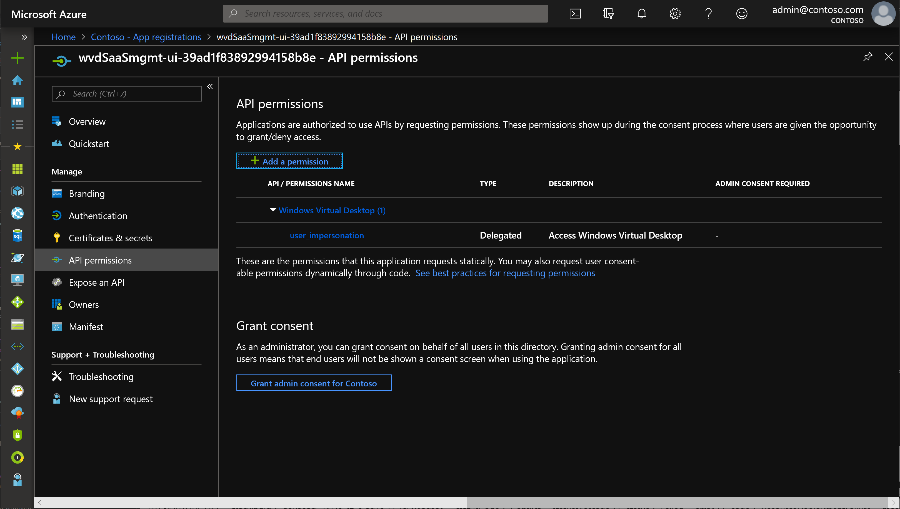
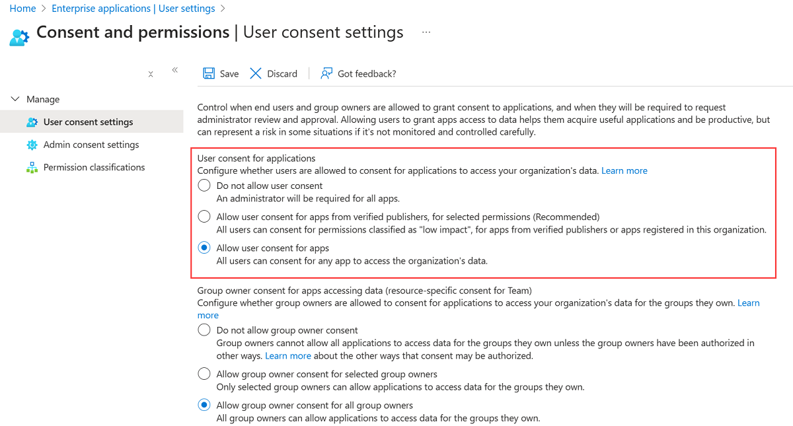

# Deploy a management tool with an Azure Resource Manager template

>[!IMPORTANT]
>This content applies to the Fall 2019 release that doesn't support Azure Resource Manager Windows Virtual Desktop objects.

The instructions in this article will tell you how to deploy the UI by using an Azure Resource Manager template.

## Important considerations

Since the app requires consent to interact with Windows Virtual Desktop, this tool doesn't support Business-to-Business (B2B) scenarios. Each Azure Active Directory (AAD) tenant's subscription will need its own separate deployment of the management tool.

This management tool is a sample. Microsoft will provide important security and quality updates. The [source code is available in GitHub](https://github.com/Azure/RDS-Templates/tree/master/wvd-templates/wvd-management-ux/deploy). Customers and partners are encouraged to customize the tool to fit their business needs.

To following browsers are compatible with the management tool:
- Google Chrome 68 or later
- Microsoft Edge 40.15063 or later
- Mozilla Firefox 52.0 or later
- Safari 10 or later (macOS only)

## What you need to deploy the management tool

Before deploying the management tool, you'll need an Azure Active Directory (Azure AD) user to create an app registration and deploy the management UI. This user must:

- Have Azure Multi-Factor Authentication (MFA) disabled
- Have permission to create resources in your Azure subscription
- Have permission to create an Azure AD application. Follow these steps to check if your user has the required permissions by following the instructions in [Required permissions](../../active-directory/develop/howto-create-service-principal-portal.md#permissions-required-for-registering-an-app).

After you deploy and configure the management tool, we recommend you ask a user to launch the management UI to make sure everything works. The user who launches the management UI must have a role assignment that lets them view or edit the Windows Virtual Desktop tenant.

## Deploy the management tool

Before you start, ensure the server and client apps have consent by visiting the [Windows Virtual Desktop Consent Page](https://rdweb.wvd.microsoft.com) for the Azure Active Directory (AAD) represented.

Follow these instructions to deploy the Azure Resource Management template:

1. Go to the [GitHub Azure RDS-Templates page](https://github.com/Azure/RDS-Templates/tree/master/wvd-templates/wvd-management-ux/deploy).
2. Deploy the template to Azure.
    - If you're deploying in an Enterprise subscription, scroll down and select **Deploy to Azure**.
    - If you're deploying in a Cloud Solution Provider subscription, follow these instructions to deploy to Azure:
        1. Scroll down and right-click **Deploy to Azure**, then select **Copy Link Location**.
        2. Open a text editor like Notepad and paste the link there.
        3. Right after <https://portal.azure.com/> and before the hashtag (#), enter an at sign (@) followed by the tenant domain name. Here's an example of the format: <https://portal.azure.com/@Contoso.onmicrosoft.com#create/>.
        4. Sign in to the Azure portal as a user with Admin/Contributor permissions to the Cloud Solution Provider subscription.
        5. Paste the link you copied to the text editor into the address bar.
3. When entering the parameters, do the following:
    - For the **isServicePrincipal** parameter, select **false**.
    - For the credentials, enter your Azure AD credentials with multi-factor authentication disabled. These credentials will be used to create the Azure AD application and Azure resources. To learn more, see the [What you need to deploy the management tool](#what-you-need-to-deploy-the-management-tool).
    - For the **applicationName**, use a unique name for your app that will be registered in your Azure Active Directory. This name will also be used for the web app URL. For example, you can use a name like "Apr3UX."
4. Once you provide the parameters, accept the terms and conditions and select **Purchase**.

## Provide consent for the management tool

After the GitHub Azure Resource Manager template completes, you'll find a resource group containing two app services along with one app service plan in the Azure portal.

Before you sign in and use the management tool, you must provide consent for the new Azure AD application associated with the management tool. Providing consent lets the management tool make Windows Virtual Desktop management calls on behalf of the user currently signed in to the tool.

> [!div class="mx-imgBorder"]
> 

To determine which user you can use to sign in to the tool, go to your [Azure Active Directory user settings page](https://portal.azure.com/#blade/Microsoft_AAD_IAM/StartboardApplicationsMenuBlade/UserSettings/menuId/) and take note of the value for **Users can consent to apps accessing company data on their behalf**.

> [!div class="mx-imgBorder"]
> 

- If the value is set to **Yes**, you can sign in with any user account in the Azure Active Directory and provide consent for that user only. However, if you sign in to the management tool with a different user later, you must perform the same consent again.
- If the value is set to **No**, you must sign in as a Global Administrator in the Azure Active Directory and provide admin consent for all users in the directory. No other users will face a consent prompt.

Once you decide which user you'll use to provide consent, follow these instructions to provide consent to the tool:

1. Go to your Azure resources, select the Azure App Services resource with the name you provided in the template (for example, Apr3UX) and navigate to the URL associated with it; for example,  <https://rdmimgmtweb-210520190304.azurewebsites.net>.
2. Sign in using the appropriate Azure Active Directory user account.
3. If you authenticated with a Global Administrator, you can now select the checkbox to **Consent on behalf of your organization**. Select **Accept** to provide consent.

   > [!div class="mx-imgBorder"]
   > 

This will now take you to the management tool.

## Use the management tool

After providing consent for the organization or for a specified user, you can access the management tool at any time.

Follow these instructions to launch the tool:

1. Select the Azure App Services resource with the name you provided in the template (for example, Apr3UX) and navigate to the URL associated with it; for example,  <https://rdmimgmtweb-210520190304.azurewebsites.net>.
2. Sign in using your Windows Virtual Desktop credentials.
3. When prompted to choose a Tenant Group, select **Default Tenant Group** from the drop-down list.
4. When you select **Default Tenant Group**, a menu should appear on the left side of your window. In this menu, find the name of your tenant group and select it.

  > [!NOTE]
  > If you have a custom tenant group, enter the name manually instead of choosing from the drop-down list.

## Report issues

If you come across any issues with the management tool or other Windows Virtual Desktop tools, follow the directions in [Azure Resource Manager templates for Remote Desktop Services](https://github.com/Azure/RDS-Templates/blob/master/README.md) to report them on GitHub.

## Next steps

Now that you've learned how to deploy and connect to the management tool, you can learn how to use Azure Service help to monitor service issues and health advisories. To learn more, see our [Set up service alerts tutorial](set-up-service-alerts-2019.md).