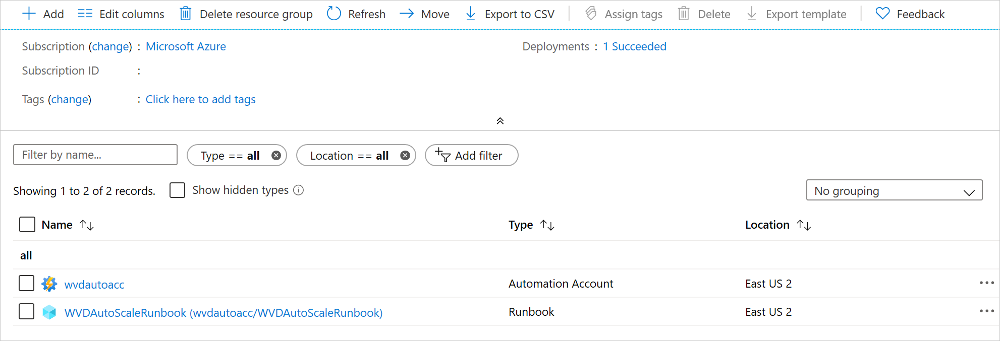
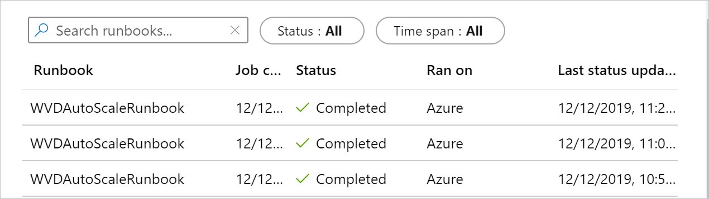
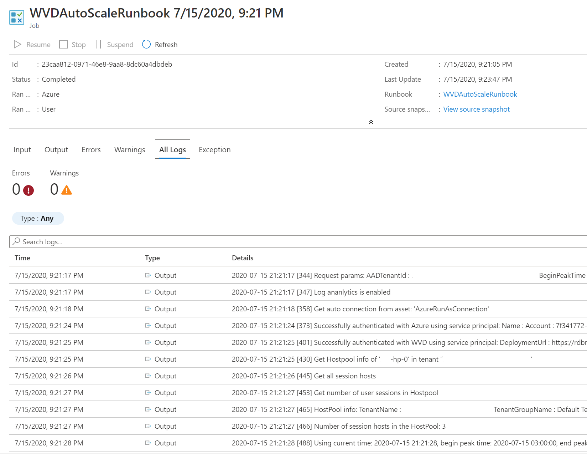

# Scale Azure Virtual Desktop (classic) session hosts using Azure Automation

>[!IMPORTANT]
>This content applies to Azure Virtual Desktop (classic), which doesn't support Azure Resource Manager Azure Virtual Desktop objects.

You can reduce your total Azure Virtual Desktop deployment cost by scaling your virtual machines (VMs). This means shutting down and deallocating session host VMs during off-peak usage hours, then turning them back on and reallocating them during peak hours.

In this article, you'll learn about the scaling tool built with the Azure Automation account and Azure Logic App that automatically scales session host VMs in your Azure Virtual Desktop environment. To learn how to use the scaling tool, skip ahead to [Prerequisites](#prerequisites).

## How the scaling tool works

The scaling tool provides a low-cost automation option for customers who want to optimize their session host VM costs.

You can use the scaling tool to:

- Schedule VMs to start and stop based on Peak and Off-Peak business hours.
- Scale out VMs based on number of sessions per CPU core.
- Scale in VMs during Off-Peak hours, leaving the minimum number of session host VMs running.

The scaling tool uses a combination of an Azure Automation account, a PowerShell runbook, a webhook, and the Azure Logic App to function. When the tool runs, Azure Logic App calls a webhook to start the Azure Automation runbook. The runbook then creates a job.

During peak usage time, the job checks the current number of sessions and the VM capacity of the current running session host for each host pool. It uses this information to calculate if the running session host VMs can support existing sessions based on the *SessionThresholdPerCPU* parameter defined for the **CreateOrUpdateAzLogicApp.ps1** file. If the session host VMs can't support existing sessions, the job starts additional session host VMs in the host pool.

>[!NOTE]
>*SessionThresholdPerCPU* doesn't restrict the number of sessions on the VM. This parameter only determines when new VMs need to be started to load-balance the connections. To restrict the number of sessions, you need to follow the instructions [Set-RdsHostPool](/powershell/module/windowsvirtualdesktop/set-rdshostpool/) to configure the *MaxSessionLimit* parameter accordingly.

During the off-peak usage time, the job determines how many session host VMs should be shut down based on the *MinimumNumberOfRDSH* parameter. If you set the *LimitSecondsToForceLogOffUser* parameter to a non-zero positive value, the job will set the session host VMs to drain mode to prevent new sessions from connecting to the hosts. The job will then notify any currently signed in users to save their work, wait the configured amount of time, and then force the users to sign out. Once all user sessions on the session host VM have been signed out, the job will shut down the VM. After the VM shuts down, the job will reset its session host drain mode.

>[!NOTE]
>If you manually set the session host VM to drain mode, the job won't manage the session host VM. If the session host VM is running and set to drain mode, it will be treated as unavailable, which will make the job start additional VMs to handle the load. We recommend you tag any Azure VMs before you manually set them to drain mode. You can name the tag with the *MaintenanceTagName* parameter when you create Azure Logic App Scheduler later. Tags will help you distinguish these VMs from the ones the scaling tool manages. Setting the maintenance tag also prevents the scaling tool from making changes to the VM until you remove the tag.

If you set the *LimitSecondsToForceLogOffUser* parameter to zero, the job allows the session configuration setting in specified group policies to handle signing off user sessions. To see these group policies, go to **Computer Configuration** > **Policies** > **Administrative Templates** > **Windows Components** > **Remote Desktop Services** > **Remote Desktop Session Host** > **Session Time Limits**. If there are any active sessions on a session host VM, the job will leave the session host VM running. If there aren't any active sessions, the job will shut down the session host VM.

During any time, the job also takes host pool's *MaxSessionLimit* into account to determine if the current number of sessions is more than 90% of the maximum capacity. If it is, the job will start additional session host VMs.

The job runs periodically based on a set recurrence interval. You can change this interval based on the size of your Azure Virtual Desktop environment, but remember that starting and shutting down VMs can take some time, so remember to account for the delay. We recommend setting the recurrence interval to every 15 minutes.

However, the tool also has the following limitations:

- This solution applies only to pooled multi-session session host VMs.
- This solution manages VMs in any region, but can only be used in the same subscription as your Azure Automation account and Azure Logic App.
- The maximum runtime of a job in the runbook is 3 hours. If starting or stopping the VMs in the host pool takes longer than that, the job will fail. For more details, see [Shared resources](../../automation/automation-runbook-execution.md#fair-share).

>[!NOTE]
>The scaling tool controls the load balancing mode of the host pool it's currently scaling. The tool uses breadth-first load balancing mode for both peak and off-peak hours.

## Prerequisites

Before you start setting up the scaling tool, make sure you have the following things ready:

- A [Azure Virtual Desktop tenant and host pool](create-host-pools-arm-template.md)
- Session host pool VMs configured and registered with the Azure Virtual Desktop service
- A user with [Contributor access](../../role-based-access-control/role-assignments-portal.md) on Azure subscription

The machine you use to deploy the tool must have:

- Windows PowerShell 5.1 or later
- The Microsoft Az PowerShell module

If you have everything ready, then let's get started.

## Create or update an Azure Automation account

>[!NOTE]
>If you already have an Azure Automation account with a runbook running an older version of the scaling script, all you need to do is follow the instructions below to make sure it's updated.

First, you'll need an Azure Automation account to run the PowerShell runbook. The process this section describes is valid even if you have an existing Azure Automation account that you want to use to set up the PowerShell runbook. Here's how to set it up:

1. Open Windows PowerShell.

2. Run the following cmdlet to sign in to your Azure account.

    ```powershell
    Login-AzAccount
    ```

    >[!NOTE]
    >Your account must have contributor rights on the Azure subscription where you want to deploy the scaling tool.

3. Run the following cmdlet to download the script for creating the Azure Automation account:

    ```powershell
    New-Item -ItemType Directory -Path "C:\Temp" -Force
    Set-Location -Path "C:\Temp"
    $Uri = "https://raw.githubusercontent.com/Azure/RDS-Templates/master/wvd-templates/wvd-scaling-script/CreateOrUpdateAzAutoAccount.ps1"
    # Download the script
    Invoke-WebRequest -Uri $Uri -OutFile ".\CreateOrUpdateAzAutoAccount.ps1"
    ```

4. Run the following cmdlet to execute the script and create the Azure Automation account. You can either fill in values for the parameters or comment them to use their defaults.

    ```powershell
    $Params = @{
         "AADTenantId"           = "<Azure_Active_Directory_tenant_ID>"   # Optional. If not specified, it will use the current Azure context
         "SubscriptionId"        = "<Azure_subscription_ID>"              # Optional. If not specified, it will use the current Azure context
         "ResourceGroupName"     = "<Resource_group_name>"                # Optional. Default: "WVDAutoScaleResourceGroup"
         "AutomationAccountName" = "<Automation_account_name>"            # Optional. Default: "WVDAutoScaleAutomationAccount"
         "Location"              = "<Azure_region_for_deployment>"
         "WorkspaceName"         = "<Log_analytics_workspace_name>"       # Optional. If specified, Log Analytics will be used to configure the custom log table that the runbook PowerShell script can send logs to
    }

    .\CreateOrUpdateAzAutoAccount.ps1 @Params
    ```

5. The cmdlet's output will include a webhook URI. Make sure to keep a record of the URI because you'll use it as a parameter when you set up the execution schedule for the Azure Logic App.

6. If you specified the parameter **WorkspaceName** for Log Analytics, the cmdlet's output will also include the Log Analytics Workspace ID and its Primary Key. Make sure to remember URI because you'll need to use it again later as a parameter when you set up the execution schedule for the Azure Logic App.

7. After you've set up your Azure Automation account, sign in to your Azure subscription and check to make sure your Azure Automation account and the relevant runbook have appeared in your specified resource group, as shown in the following image:

    >[!div class="mx-imgBorder"]
    >

    To check if your webhook is where it should be, select the name of your runbook. Next, go to your runbook's Resources section and select **Webhooks**.

## Create an Azure Automation Run As account

Now that you have an Azure Automation account, you'll also need to create an Azure Automation Run As account if you don't have one already. This account will let the tool access your Azure resources.

An Azure Automation Run As account provides authentication for managing resources in Azure with Azure cmdlets. When you create a Run As account, it creates a new service principal user in Microsoft Entra ID and assigns the Contributor role to the service principal user at the subscription level. An Azure Run As account is a great way to authenticate securely with certificates and a service principal name without needing to store a username and password in a credential object.

Any user who's a member of the Subscription Admins role and coadministrator of the subscription can create a Run As account.

To create a Run As account in your Azure Automation account:

1. In the Azure portal, select **All services**. In the list of resources, enter and select **Automation accounts**.

2. On the **Automation accounts** page, select the name of your Azure Automation account.

3. In the pane on the left side of the window, select **Run As accounts** under the **Account Settings** section.

4. Select **Azure Run As account**. When the **Add Azure Run As account** pane appears, review the overview information, and then select **Create** to start the account creation process.

5. Wait a few minutes for Azure to create the Run As account. You can track the creation progress in the menu under Notifications.

6. When the process finishes, it will create an asset named **AzureRunAsConnection** in the specified Azure Automation account. Select **Azure Run As account**. The connection asset holds the application ID, tenant ID, subscription ID, and certificate thumbprint. Remember the application ID, because you'll use it later. You can also find the same information on the **Connections** page. To go to this page, in the pane on the left side of the window, select **Connections** under the **Shared Resources** section and click on the connection asset named **AzureRunAsConnection**.

### Create a role assignment in Azure Virtual Desktop

Next, you need to create a role assignment so that **AzureRunAsConnection** can interact with Azure Virtual Desktop. Make sure to use PowerShell to sign in with an account that has permissions to create role assignments.

First, download and import the [Azure Virtual Desktop PowerShell module](/powershell/windows-virtual-desktop/overview/) to use in your PowerShell session if you haven't already. Run the following PowerShell cmdlets to connect to Azure Virtual Desktop and display your tenants.

```powershell
Add-RdsAccount -DeploymentUrl "https://rdbroker.wvd.microsoft.com"

# If your tenant is not in "Default Tenant Group", uncomment the following line and specify the name of your tenant group
# Set-RdsContext -TenantGroupName "<Tenant_Group_Name>"

Get-RdsTenant
```

When you find the tenant with the host pools you want to scale, follow the instructions in [Create an Azure Automation Run As account](#create-an-azure-automation-run-as-account) to gather the **AzureRunAsConnection** Application ID and use the Azure Virtual Desktop tenant name you got from the previous cmdlet in the following cmdlet to create the role assignment:

```powershell
New-RdsRoleAssignment -RoleDefinitionName "RDS Contributor" -ApplicationId "<applicationid>" -TenantName "<tenantname>"
```

## Create the Azure Logic App and execution schedule

Finally, you'll need to create the Azure Logic App and set up an execution schedule for your new scaling tool.

1. Open Windows PowerShell.

2. Run the following cmdlet to sign in to your Azure account.

    ```powershell
    Login-AzAccount
    ```

3. Run the following cmdlet to download the script for creating the Azure Logic App.

    ```powershell
    New-Item -ItemType Directory -Path "C:\Temp" -Force
    Set-Location -Path "C:\Temp"
    $Uri = "https://raw.githubusercontent.com/Azure/RDS-Templates/master/wvd-templates/wvd-scaling-script/CreateOrUpdateAzLogicApp.ps1"
    # Download the script
    Invoke-WebRequest -Uri $Uri -OutFile ".\CreateOrUpdateAzLogicApp.ps1"
    ```

4. Run the following cmdlet to sign into Azure Virtual Desktop with an account that has RDS Owner or RDS Contributor permissions.

    ```powershell
    Add-RdsAccount -DeploymentUrl "https://rdbroker.wvd.microsoft.com"

    # If your tenant is not in "Default Tenant Group", uncomment the following line and specify the name of your tenant group
    # Set-RdsContext -TenantGroupName "<Tenant_Group_Name>"
    ```

5. Run the following PowerShell script to create the Azure Logic App and execution schedule for your host pool

    >[!NOTE]
    >You'll need to run this script for each host pool you want to autoscale, but you need only one Azure Automation account.

    ```powershell
    $AADTenantId = (Get-AzContext).Tenant.Id

    $AzSubscription = Get-AzSubscription | Out-GridView -OutputMode:Single -Title "Select your Azure Subscription"
    Select-AzSubscription -Subscription $AzSubscription.Id

    $ResourceGroup = Get-AzResourceGroup | Out-GridView -OutputMode:Single -Title "Select the resource group for the new Azure Logic App"

    $RDBrokerURL = (Get-RdsContext).DeploymentUrl
    $WVDTenant = Get-RdsTenant | Out-GridView -OutputMode:Single -Title "Select your WVD tenant"
    $WVDHostPool = Get-RdsHostPool -TenantName $WVDTenant.TenantName | Out-GridView -OutputMode:Single -Title "Select the host pool you'd like to scale"

    $LogAnalyticsWorkspaceId = Read-Host -Prompt "If you want to use Log Analytics, enter the Log Analytics Workspace ID returned by when you created the Azure Automation account, otherwise leave it blank"
    $LogAnalyticsPrimaryKey = Read-Host -Prompt "If you want to use Log Analytics, enter the Log Analytics Primary Key returned by when you created the Azure Automation account, otherwise leave it blank"
    $RecurrenceInterval = Read-Host -Prompt "Enter how often you'd like the job to run in minutes, e.g. '15'"
    $BeginPeakTime = Read-Host -Prompt "Enter the start time for peak hours in local time, e.g. 9:00"
    $EndPeakTime = Read-Host -Prompt "Enter the end time for peak hours in local time, e.g. 18:00"
    $TimeDifference = Read-Host -Prompt "Enter the time difference between local time and UTC in hours, e.g. +5:30"
    $SessionThresholdPerCPU = Read-Host -Prompt "Enter the maximum number of sessions per CPU that will be used as a threshold to determine when new session host VMs need to be started during peak hours"
    $MinimumNumberOfRDSH = Read-Host -Prompt "Enter the minimum number of session host VMs to keep running during off-peak hours"
    $MaintenanceTagName = Read-Host -Prompt "Enter the name of the Tag associated with VMs you don't want to be managed by this scaling tool"
    $LimitSecondsToForceLogOffUser = Read-Host -Prompt "Enter the number of seconds to wait before automatically signing out users. If set to 0, any session host VM that has user sessions, will be left untouched"
    $LogOffMessageTitle = Read-Host -Prompt "Enter the title of the message sent to the user before they are forced to sign out"
    $LogOffMessageBody = Read-Host -Prompt "Enter the body of the message sent to the user before they are forced to sign out"

    $AutoAccount = Get-AzAutomationAccount | Out-GridView -OutputMode:Single -Title "Select the Azure Automation account"
    $AutoAccountConnection = Get-AzAutomationConnection -ResourceGroupName $AutoAccount.ResourceGroupName -AutomationAccountName $AutoAccount.AutomationAccountName | Out-GridView -OutputMode:Single -Title "Select the Azure RunAs connection asset"

    $WebhookURIAutoVar = Get-AzAutomationVariable -Name 'WebhookURI' -ResourceGroupName $AutoAccount.ResourceGroupName -AutomationAccountName $AutoAccount.AutomationAccountName

    $Params = @{
         "AADTenantId"                   = $AADTenantId                             # Optional. If not specified, it will use the current Azure context
         "SubscriptionID"                = $AzSubscription.Id                       # Optional. If not specified, it will use the current Azure context
         "ResourceGroupName"             = $ResourceGroup.ResourceGroupName         # Optional. Default: "WVDAutoScaleResourceGroup"
         "Location"                      = $ResourceGroup.Location                  # Optional. Default: "West US2"
         "RDBrokerURL"                   = $RDBrokerURL                             # Optional. Default: "https://rdbroker.wvd.microsoft.com"
         "TenantGroupName"               = $WVDTenant.TenantGroupName               # Optional. Default: "Default Tenant Group"
         "TenantName"                    = $WVDTenant.TenantName
         "HostPoolName"                  = $WVDHostPool.HostPoolName
         "LogAnalyticsWorkspaceId"       = $LogAnalyticsWorkspaceId                 # Optional. If not specified, script will not log to the Log Analytics
         "LogAnalyticsPrimaryKey"        = $LogAnalyticsPrimaryKey                  # Optional. If not specified, script will not log to the Log Analytics
         "ConnectionAssetName"           = $AutoAccountConnection.Name              # Optional. Default: "AzureRunAsConnection"
         "RecurrenceInterval"            = $RecurrenceInterval                      # Optional. Default: 15
         "BeginPeakTime"                 = $BeginPeakTime                           # Optional. Default: "09:00"
         "EndPeakTime"                   = $EndPeakTime                             # Optional. Default: "17:00"
         "TimeDifference"                = $TimeDifference                          # Optional. Default: "-7:00"
         "SessionThresholdPerCPU"        = $SessionThresholdPerCPU                  # Optional. Default: 1
         "MinimumNumberOfRDSH"           = $MinimumNumberOfRDSH                     # Optional. Default: 1
         "MaintenanceTagName"            = $MaintenanceTagName                      # Optional.
         "LimitSecondsToForceLogOffUser" = $LimitSecondsToForceLogOffUser           # Optional. Default: 1
         "LogOffMessageTitle"            = $LogOffMessageTitle                      # Optional. Default: "Machine is about to shutdown."
         "LogOffMessageBody"             = $LogOffMessageBody                       # Optional. Default: "Your session will be logged off. Please save and close everything."
         "WebhookURI"                    = $WebhookURIAutoVar.Value
    }

    .\CreateOrUpdateAzLogicApp.ps1 @Params
    ```

    After you run the script, the Azure Logic App should appear in a resource group, as shown in the following image.

    >[!div class="mx-imgBorder"]
    >

    To make changes to the execution schedule, such as changing the recurrence interval or time zone, go to the Azure Logic App autoscale scheduler and select **Edit** to go to the Azure Logic App Designer.

    >[!div class="mx-imgBorder"]
    >

## Manage your scaling tool

Now that you've created your scaling tool, you can access its output. This section describes a few features you might find helpful.

### View job status

You can view a summarized status of all runbook jobs or view a more in-depth status of a specific runbook job in the Azure portal.

On the right of your selected Azure Automation account, under "Job Statistics," you can view a list of summaries of all runbook jobs. Opening the **Jobs** page on the left side of the window shows current job statuses, start times, and completion times.

>[!div class="mx-imgBorder"]
>

### View logs and scaling tool output

You can view the logs of scale-out and scale-in operations by opening your runbook and selecting the job.

Navigate to the runbook in your resource group hosting the Azure Automation account and select **Overview**. On the overview page, select a job under **Recent Jobs** to view its scaling tool output, as shown in the following image.

>[!div class="mx-imgBorder"]
>

### Check the runbook script version number

You can check which version of the runbook script you're using by opening the runbook file in your Azure Automation account and selecting **View**. A script for the runbook will appear on the right side of the screen. In the script, you'll see the version number in the format `v#.#.#` under the `SYNOPSIS` section. You can find the latest version number [here](https://github.com/Azure/RDS-Templates/blob/master/wvd-templates/wvd-scaling-script/basicScale.ps1#L1). If you don't see a version number in your runbook script, that means you're running an earlier version of the script and you should update it right away. If you need to update your runbook script, follow the instructions in [Create or update an Azure Automation account](#create-or-update-an-azure-automation-account).

### Reporting issues

When you report an issue, you'll need to provide the following information to help us troubleshoot:

- A complete log from the **All Logs** tab in the job that caused the issue. To learn how to get the log, follow the instructions in [View logs and scaling tool output](#view-logs-and-scaling-tool-output). If there's any sensitive or private information in the log, you can remove it before submitting the issue to us.

- The version of the runbook script you're using. To find out how to get the version number, see [Check the runbook script version number](#check-the-runbook-script-version-number)

- The version number of each of the following PowerShell modules installed in your Azure Automation account. To find these modules, open Azure Automation account, select **Modules** under the **Shared Resources** section in the pane on the left side of the window, and then search for the module's name.
    - Az.Accounts
    - Az.Compute
    - Az.Resources
    - Az.Automation
    - OMSIngestionAPI
    - Microsoft.RDInfra.RDPowershell

- The expiration date for your [Run As account](#create-an-azure-automation-run-as-account). To find this, open your Azure Automation account, then select **Run As accounts** under **Account Settings** in the pane on the left side of the window. The expiration date should be under **Azure Run As account**.

### Log Analytics

If you decided to use Log Analytics, you can view all the log data in a custom log named **WVDTenantScale_CL** under **Custom Logs** in the **Logs** view of your Log Analytics Workspace. We've listed some sample queries you might find helpful.

- To see all logs for a host pool, enter the following query

    ```Kusto
    WVDTenantScale_CL
    | where hostpoolName_s == "<host_pool_name>"
    | project TimeStampUTC = TimeGenerated, TimeStampLocal = TimeStamp_s, HostPool = hostpoolName_s, LineNumAndMessage = logmessage_s, AADTenantId = TenantId
    ```

- To view the total number of currently running session host VMs and active user sessions in your host pool, enter the following query

    ```Kusto
    WVDTenantScale_CL
    | where logmessage_s contains "Number of running session hosts:"
         or logmessage_s contains "Number of user sessions:"
         or logmessage_s contains "Number of user sessions per Core:"
    | where hostpoolName_s == "<host_pool_name>"
    | project TimeStampUTC = TimeGenerated, TimeStampLocal = TimeStamp_s, HostPool = hostpoolName_s, LineNumAndMessage = logmessage_s, AADTenantId = TenantId
    ```

- To view the status of all session host VMs in a host pool, enter the following query

    ```Kusto
    WVDTenantScale_CL
    | where logmessage_s contains "Session host:"
    | where hostpoolName_s == "<host_pool_name>"
    | project TimeStampUTC = TimeGenerated, TimeStampLocal = TimeStamp_s, HostPool = hostpoolName_s, LineNumAndMessage = logmessage_s, AADTenantId = TenantId
    ```

- To view any errors and warnings, enter the following query

    ```Kusto
    WVDTenantScale_CL
    | where logmessage_s contains "ERROR:" or logmessage_s contains "WARN:"
    | project TimeStampUTC = TimeGenerated, TimeStampLocal = TimeStamp_s, HostPool = hostpoolName_s, LineNumAndMessage = logmessage_s, AADTenantId = TenantId
    ```

## Report issues

Issue reports for the scaling tool are currently being handled by Microsoft Support. When you make an issue report, make sure to follow the instructions in [Reporting issues](#reporting-issues). If you have feedback about the tool or want to request new features, open a GitHub issue labeled "4-WVD-scaling-tool" on the [RDS GitHub page](https://github.com/Azure/RDS-Templates/issues?q=is%3Aissue+is%3Aopen+label%3A4-WVD-scaling-tool).
