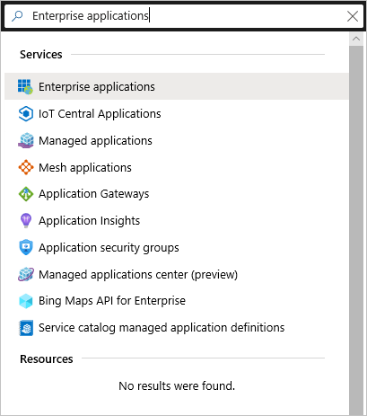

# Tutorial: Create a tenant in Azure Virtual Desktop (classic)

> [!IMPORTANT]
> - This content applies to Azure Virtual Desktop (classic), which doesn't support Azure Resource Manager Azure Virtual Desktop objects.
>
> - Beginning **September 30 2023**, you will no longer be able to create new Azure Virtual Desktop (classic) tenants. Azure Virtual Desktop (classic) will retire on **September 30, 2026**. You should transition to [Azure Virtual Desktop](../index.yml) before that date. For more information, see [Azure Virtual Desktop (classic) retirement](classic-retirement.md).

Creating a tenant in Azure Virtual Desktop is the first step toward building your desktop virtualization solution. A tenant is a group of one or more host pools. Each host pool consists of multiple session hosts, running as virtual machines in Azure and registered to the Azure Virtual Desktop service. Each host pool also consists of one or more application groups that are used to publish desktop and application resources to users. With a tenant, you can build host pools, create application groups, assign users, and make connections through the service.

In this tutorial, learn how to:

> [!div class="checklist"]
> * Grant Microsoft Entra permissions to the Azure Virtual Desktop service.
> * Assign the TenantCreator application role to a user in your Microsoft Entra tenant.
> * Create an Azure Virtual Desktop tenant.

## What you need to set up a tenant

Before you start setting up your Azure Virtual Desktop tenant, make sure you have these things:

* The [Microsoft Entra ID](https://azure.microsoft.com/services/active-directory/) tenant ID for Azure Virtual Desktop users.
* A global administrator account within the Microsoft Entra tenant.
   * This also applies to Cloud Solution Provider (CSP) organizations that are creating an Azure Virtual Desktop tenant for their customers. If you're in a CSP organization, you must be able to sign in as global administrator of the customer's Microsoft Entra instance.
   * The administrator account must be sourced from the Microsoft Entra tenant in which you're trying to create the Azure Virtual Desktop tenant. This process doesn't support Microsoft Entra B2B (guest) accounts.
   * The administrator account must be a work or school account.
* An Azure subscription.

You must have the tenant ID, global administrator account, and Azure subscription ready so that the process described in this tutorial can work properly.

## Grant permissions to Azure Virtual Desktop

If you have already granted permissions to Azure Virtual Desktop for this Microsoft Entra instance, skip this section.

Granting permissions to the Azure Virtual Desktop service lets it query Microsoft Entra ID for administrative and end-user tasks.

To grant the service permissions:

1. Open a browser and begin the admin consent flow to the [Azure Virtual Desktop server app](https://login.microsoftonline.com/common/adminconsent?client_id=5a0aa725-4958-4b0c-80a9-34562e23f3b7&redirect_uri=https%3A%2F%2Frdweb.wvd.microsoft.com%2FRDWeb%2FConsentCallback).
   > [!NOTE]
   > If you manage a customer and need to grant admin consent for the customer's directory, enter the following URL into the browser and replace {tenant} with the Microsoft Entra domain name of the customer. For example, if the customer's organization has registered the Microsoft Entra domain name of contoso.onmicrosoft.com, replace {tenant} with contoso.onmicrosoft.com.
   >```
   >https://login.microsoftonline.com/{tenant}/adminconsent?client_id=5a0aa725-4958-4b0c-80a9-34562e23f3b7&redirect_uri=https%3A%2F%2Frdweb.wvd.microsoft.com%2FRDWeb%2FConsentCallback
   >```

2. Sign in to the Azure Virtual Desktop consent page with a global administrator account. For example, if you were with the Contoso organization, your account might be admin@contoso.com or admin@contoso.onmicrosoft.com.
3. Select **Accept**.
4. Wait for one minute so Microsoft Entra ID can record consent.
5. Open a browser and begin the admin consent flow to the [Azure Virtual Desktop client app](https://login.microsoftonline.com/common/adminconsent?client_id=fa4345a4-a730-4230-84a8-7d9651b86739&redirect_uri=https%3A%2F%2Frdweb.wvd.microsoft.com%2FRDWeb%2FConsentCallback).
   >[!NOTE]
   > If you manage a customer and need to grant admin consent for the customer's directory, enter the following URL into the browser and replace {tenant} with the Microsoft Entra domain name of the customer. For example, if the customer's organization has registered the Microsoft Entra domain name of contoso.onmicrosoft.com, replace {tenant} with contoso.onmicrosoft.com.
   >```
   > https://login.microsoftonline.com/{tenant}/adminconsent?client_id=fa4345a4-a730-4230-84a8-7d9651b86739&redirect_uri=https%3A%2F%2Frdweb.wvd.microsoft.com%2FRDWeb%2FConsentCallback
   >```

6. Sign in to the Azure Virtual Desktop consent page as global administrator, as you did in step 2.
7. Select **Accept**.

## Assign the TenantCreator application role

Assigning a Microsoft Entra user the TenantCreator application role allows that user to create an Azure Virtual Desktop tenant associated with the Microsoft Entra instance. You'll need to use your global administrator account to assign the TenantCreator role.

To assign the TenantCreator application role:

1. Go to the [Azure portal](https://portal.azure.com) to manage the TenantCreator application role. Search for and select **Enterprise applications**. If you're working with multiple Microsoft Entra tenants, it's a best practice to open a private browser session and copy and paste the URLs into the address bar.

   > [!div class="mx-imgBorder"]
   > 

2. Within **Enterprise applications**, search for **Azure Virtual Desktop**. You'll see the two applications that you provided consent for in the previous section. Of these two apps, select **Azure Virtual Desktop**.

3. Select **Users and groups**. You might see that the administrator who granted consent to the application is already listed with the **Default Access** role assigned. This is not enough to create an Azure Virtual Desktop tenant. Continue following these instructions to add the **TenantCreator** role to a user.

4. Select **Add user**, and then select **Users and groups** in the **Add Assignment** tab.
5. Search for a user account that will create your Azure Virtual Desktop tenant. For simplicity, this can be the global administrator account.
   - If you're using a Microsoft Identity Provider like contosoadmin@live.com or contosoadmin@outlook.com, you might not be able to sign in to Azure Virtual Desktop. We recommend using a domain-specific account like admin@contoso.com or admin@contoso.onmicrosoft.com instead.

   > [!div class="mx-imgBorder"]
   > 

   > [!NOTE]
   > You must select a user (or a group that contains a user) that's sourced from this Microsoft Entra instance. You can't choose a guest (B2B) user or a service principal.

6. Select the user account, choose the **Select** button, and then select **Assign**.
7. On the **Azure Virtual Desktop - Users and groups** page, verify that you see a new entry with the **TenantCreator** role assigned to the user who will create the Azure Virtual Desktop tenant.

Before you continue on to create your Azure Virtual Desktop tenant, you need two pieces of information:

   - Your Microsoft Entra tenant ID (or **Directory ID**)
   - Your Azure subscription ID

To find your Microsoft Entra tenant ID (or **Directory ID**):
1. In the same [Azure portal](https://portal.azure.com) session, search for and select **Microsoft Entra ID**.

   > [!div class="mx-imgBorder"]
   > 

2. Scroll down until you find **Properties**, and then select it.
3. Look for **Directory ID**, and then select the clipboard icon. Paste it in a handy location so you can use it later as the **AadTenantId** value.

   > [!div class="mx-imgBorder"]
   > 

To find your Azure subscription ID:
1. In the same [Azure portal](https://portal.azure.com) session, search for and select **Subscriptions**.

   > [!div class="mx-imgBorder"]
   > 

2. Select the Azure subscription you want to use to receive Azure Virtual Desktop service notifications.
3. Look for **Subscription ID**, and then hover over the value until a clipboard icon appears. Select the clipboard icon and paste it in a handy location so you can use it later as the **AzureSubscriptionId** value.

   > [!div class="mx-imgBorder"]
   > 

## Create an Azure Virtual Desktop tenant

Now that you've granted the Azure Virtual Desktop service permissions to query Microsoft Entra ID and assigned the TenantCreator role to a user account, you can create an Azure Virtual Desktop tenant.

First, [download and import the Azure Virtual Desktop module](/powershell/windows-virtual-desktop/overview/) to use in your PowerShell session if you haven't already.

Sign in to Azure Virtual Desktop by using the TenantCreator user account with this cmdlet:

```powershell
Add-RdsAccount -DeploymentUrl "https://rdbroker.wvd.microsoft.com"
```

After that, create a new Azure Virtual Desktop tenant associated with the Microsoft Entra tenant:

```powershell
New-RdsTenant -Name <TenantName> -AadTenantId <DirectoryID> -AzureSubscriptionId <SubscriptionID>
```

Replace the bracketed values with values relevant to your organization and tenant. The name you choose for your new Azure Virtual Desktop tenant should be globally unique. For example, let's say you're the Azure Virtual Desktop TenantCreator for the Contoso organization. The cmdlet you'd run would look like this:

```powershell
New-RdsTenant -Name Contoso -AadTenantId 00000000-1111-2222-3333-444444444444 -AzureSubscriptionId 55555555-6666-7777-8888-999999999999
```

It's a good idea to assign administrative access to a second user in case you ever find yourself locked out of your account, or you go on vacation and need someone to act as the tenant admin in your absence. To assign admin access to a second user, run the following cmdlet with `<TenantName>` and `<Upn>` replaced with your tenant name and the second user's UPN.

```powershell
New-RdsRoleAssignment -TenantName <TenantName> -SignInName <Upn> -RoleDefinitionName "RDS Owner"
```

## Next steps
After you've created your tenant, you'll need to create a service principal in Microsoft Entra ID and assign it a role within Azure Virtual Desktop. The service principal will allow you to successfully deploy the Azure Virtual Desktop Azure Marketplace offering to create a host pool. To learn more about host pools, continue to the tutorial for creating a host pool in Azure Virtual Desktop.

> [!div class="nextstepaction"]
> [Create service principals and role assignments with PowerShell](create-service-principal-role-powershell.md)
