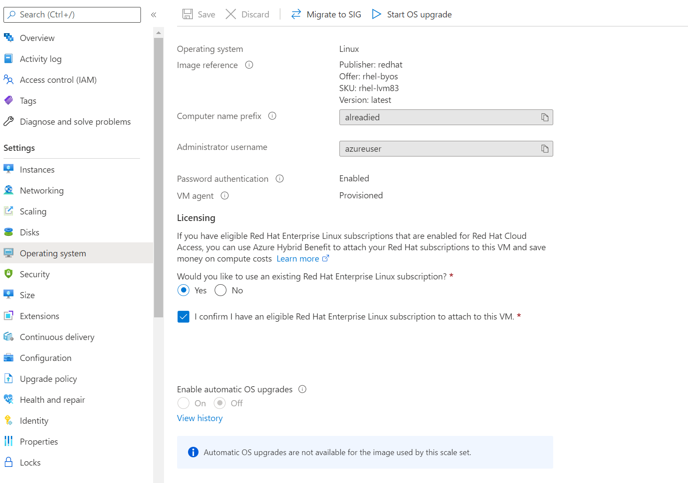

# Explore Azure Hybrid Benefit for Linux Virtual Machine Scale Sets

Azure Hybrid Benefit can reduce the cost of running your Red Hat Enterprise Linux (RHEL) and SUSE Linux Enterprise Server (SLES) [Virtual Machine Scale Sets](./overview.md). Azure Hybrid Benefit for Linux Virtual Machine Scale Sets is generally available now. It's available for all RHEL and SLES pay-as-you-go images from Azure Marketplace. 

When you enable Azure Hybrid Benefit, the only fee that you incur is the cost of your scale set infrastructure.

> [!NOTE]
> This article focuses on Virtual Machine Scale Sets running in Uniform orchestration mode. We recommend using Flexible orchestration for new workloads. For more information, see [Orchestration modes for Virtual Machine Scale Sets in Azure](virtual-machine-scale-sets-orchestration-modes.md).

## What is Azure Hybrid Benefit for Linux Virtual Machine Scale Sets?
Azure Hybrid Benefit allows you to switch your Virtual Machine Scale Sets to *bring-your-own-subscription (BYOS)* billing. You can use your cloud access licenses from Red Hat or SUSE for this. You can also switch pay-as-you-go instances to BYOS without the need to redeploy.

A Virtual Machine Scale Set deployed from pay-as-you-go Azure Marketplace images is charged both infrastructure and software fees when Azure Hybrid Benefit is enabled.

:::image type="content" source="./media/azure-hybrid-benefit-linux/azure-hybrid-benefit-linux-cost.png" alt-text="Diagram that shows the effect of Azure Hybrid Benefit on costs for Linux virtual machines.":::

## Which Linux virtual machines can use Azure Hybrid Benefit?
Azure Hybrid Benefit can be used on all RHEL and SLES pay-as-you-go images from Azure Marketplace. Azure Hybrid Benefit isn't yet available for RHEL or SLES BYOS images or custom images from Azure Marketplace.

Azure dedicated host instances and SQL hybrid benefits are not eligible for Azure Hybrid Benefit if you're already using Azure Hybrid Benefit with Linux virtual machines.

## Get started

### Enable Azure Hybrid Benefit for Red Hat Virtual Machine Scale Sets

Azure Hybrid Benefit for RHEL is available to Red Hat customers who meet the following criteria:

- Have active or unused RHEL subscriptions that are eligible for use in Azure
- Have correctly enabled one or more subscriptions for use in Azure with the [Red Hat Cloud Access](https://www.redhat.com/en/technologies/cloud-computing/cloud-access) program

To start using Azure Hybrid Benefit for Red Hat:

1. Enable your eligible RHEL subscriptions in Azure by using the [Red Hat Cloud Access customer interface](https://access.redhat.com/management/cloud).

   The Azure subscriptions that you provide during the Red Hat Cloud Access enablement process are permitted to use Azure Hybrid Benefit.
1. Apply Azure Hybrid Benefit to any of your new or existing RHEL pay-as-you-go Virtual Machine Scale Sets. You can use the Azure portal or the Azure CLI to enable Azure Hybrid Benefit.
1. Follow the recommended [next steps](https://access.redhat.com/articles/5419341) to configure update sources for your RHEL virtual machines and for RHEL subscription compliance guidelines.

### Enable Azure Hybrid Benefit for SUSE Virtual Machine Scale Sets

To start using Azure Hybrid Benefit for SUSE:

1. Register with the SUSE public cloud program.
1. Apply Azure Hybrid Benefit to your newly created or existing Virtual Machine Scale Sets via the Azure portal or the Azure CLI.
1. Register your virtual machines that are receiving Azure Hybrid Benefit with a separate source of updates.


## Enable Azure Hybrid Benefit in the Azure portal 
### Enable Azure Hybrid Benefit during Virtual Machine Scale Set creation
1. Go to the [Azure portal](https://portal.azure.com/).
1. Go to **Create a Virtual Machine Scale Set**.
   
    :::image type="content" source="./media/azure-hybrid-benefit-linux/create-vmss-ahb.png" alt-text="Screenshot of the portal page for creating a Virtual Machine Scale Set.":::
1. In the **Licensing** section, select the checkbox that asks if you want to use an existing RHEL subscription and the checkbox to confirm that your subscription is eligible.
   
    :::image type="content" source="./media/azure-hybrid-benefit-linux/create-vmss-ahb-checkbox.png" alt-text="Screenshot of the Azure portal that shows checkboxes selected for licensing.":::
1. Create a Virtual Machine Scale Set by following the next set of instructions.
1. On the **Operating system** pane, confirm that the option is enabled.
   
    :::image type="content" source="./media/azure-hybrid-benefit-linux/create-vmss-ahb-os-blade.png" alt-text="Screenshot of the Azure Hybrid Benefit pane for the operating system after you create a virtual machine.":::

### Enable Azure Hybrid Benefit in an existing Virtual Machine Scale Set
1. Go to the [Azure portal](https://portal.azure.com/).
1. Open the page for the Virtual Machine Scale Set on which you want to apply the conversion.
1. Go to **Operating system** > **Licensing**. To enable the Azure Hybrid Benefit conversion, select **Yes**, and then select the confirmation checkbox.



## Enable and disable Azure Hybrid Benefit by using the Azure CLI

In the Azure CLI, you can use the `az vmss update` command to enable Azure Hybrid Benefit. For RHEL virtual machines, run the command with a `--license-type` parameter of `RHEL_BYOS`. For SLES virtual machines, run the command with a `--license-type` parameter of `SLES_BYOS`.

```azurecli
# This will enable Azure Hybrid Benefit on a RHEL Virtual Machine Scale Set
az vmss update --resource-group myResourceGroup --name myVmName --license-type RHEL_BYOS

# This will enable Azure Hybrid Benefit on a SLES Virtual Machine Scale Set
az vmss update --resource-group myResourceGroup --name myVmName --license-type SLES_BYOS
```

To disable Azure Hybrid Benefit, use a `--license-type` value of `None`:

```azurecli
# This will disable Azure Hybrid Benefit on a virtual machine
az vmss update -g myResourceGroup -n myVmName --license-type None
```

>[!NOTE]
> Scale sets have an [upgrade policy](./virtual-machine-scale-sets-upgrade-policy.md) that determines how virtual machines are brought up to date with the latest scale set model. 
>
> If your scale sets have an **Automatic** upgrade policy, Azure Hybrid Benefit will be applied automatically as virtual machines are updated. If your scale sets have a **Rolling** upgrade policy, based on the scheduled updates, Azure Hybrid Benefit will be applied. 
>
> If your scale sets have a **Manual** upgrade policy, you'll have to manually upgrade your virtual machines by using the Azure CLI: 
>
> ```azurecli
> # This will bring Virtual Machine Scale Set instances up to date with the latest Virtual Machine Scale Set model 
> az vmss update-instances --resource-group myResourceGroup --name myScaleSet --instance-ids {instanceIds}
> ```

## Apply Azure Hybrid Benefit to Virtual Machine Scale Sets at creation time 
In addition to applying Azure Hybrid Benefit to existing pay-as-you-go Virtual Machine Scale Sets, you can invoke it when you create Virtual Machine Scale Sets. The benefits of doing so are threefold:

- You can provision both pay-as-you-go and BYOS Virtual Machine Scale Sets by using the same image and process.
- It enables future licensing mode changes. These changes aren't available with a BYOS-only image.
- The Virtual Machine Scale Sets will be connected to Red Hat Update Infrastructure (RHUI) by default, to help keep it up to date and secure. You can change the updated mechanism after deployment at any time.

To apply Azure Hybrid Benefit to Virtual Machine Scale Sets at creation time by using the Azure CLI, use one of the following commands:

```azurecli
# This will enable Azure Hybrid Benefit while creating a RHEL Virtual Machine Scale Set
az vmss create --name myVmName --resource-group myResourceGroup --vnet-name myVnet --subnet mySubnet  --image myRedHatImageURN --admin-username myAdminUserName --admin-password myPassword --instance-count myInstanceCount --license-type RHEL_BYOS 

# This will enable Azure Hybrid Benefit while creating a SLES Virtual Machine Scale Set
az vmss create --name myVmName --resource-group myResourceGroup --vnet-name myVnet --subnet mySubnet  --image myRedHatImageURN --admin-username myAdminUserName --admin-password myPassword --instance-count myInstanceCount --license-type SLES_BYOS
```

## Next steps
* [Learn how to create and update virtual machines and add license types (RHEL_BYOS, SLES_BYOS) for Azure Hybrid Benefit by using the Azure CLI](/cli/azure/vmss)
