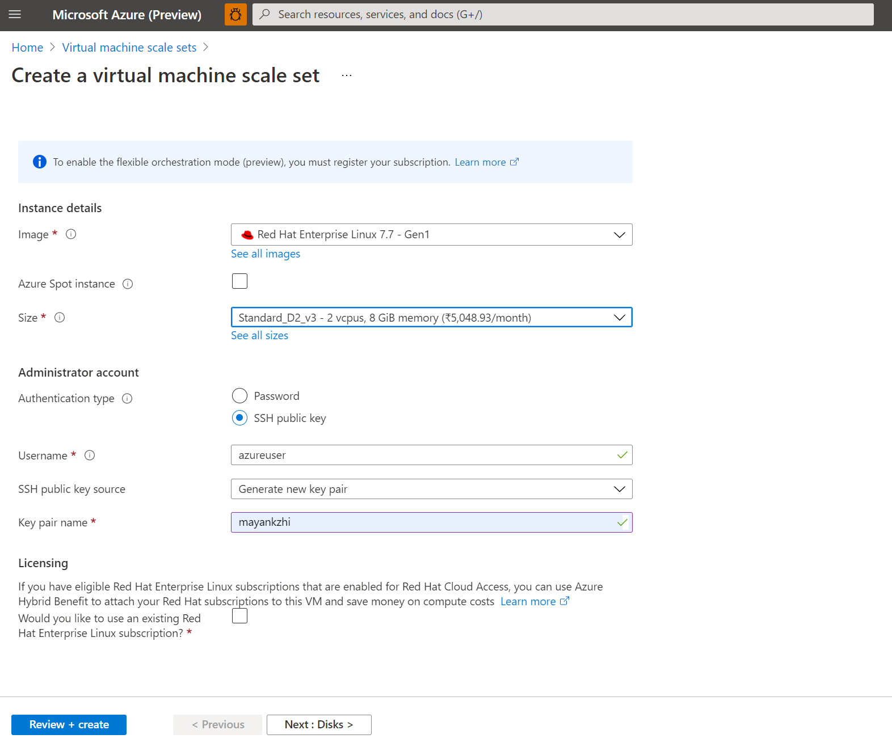
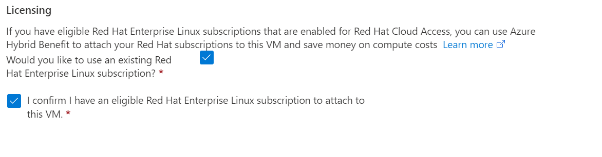

# Explore Azure Hybrid Benefit for Linux virtual machine scale sets

**Applies to:** :heavy_check_mark: Linux VMs :heavy_check_mark: Uniform scale sets

**Hybrid Benefit for Linux virtual machine scale set is in GA now**. *Azure Hybrid Benefit* can reduce the cost of running your *Red Hat Enterprise Linux (RHEL)* and *SUSE Linux Enterprise Server (SLES)* [virtual machine scale sets](./overview.md).

Hybrid Benefit is available for all RHEL and SLES Marketplace pay-as-you-go (PAYG) images. When you enable Hybrid Benefit, the only fee that you incur is the cost of your scale set infrastructure.


>[!NOTE]
> This article explores Hybrid Benefit for Linux *virtual machine scale sets (VMSS)*. A separate article discusses [Hybrid Benefit for Linux VMs](../virtual-machines/linux/azure-hybrid-benefit-linux.md), a service available to Azure customers since November 2020.

## What is Hybrid Benefit for Linux virtual machine scale sets?
Hybrid Benefit allows you to switch your virtual machine scale sets to *bring-your-own-subscription (BYOS)* billing. Your Cloud access licenses from Red Hat or SUSE can be used for this. You can also switch PAYG instances to BYOS without any need to redeploy, when you enable Hybrid Benefit.

A VMSS deployed from PAYG marketplace images is charged both infrastructure and software fees when Hybrid Benefit is enabled.

:::image type="content" source="./media/azure-hybrid-benefit-linux/azure-hybrid-benefit-linux-cost.png" alt-text="A screenshot that shows Hybrid Benefit costs for Linux VMs.":::

## Which Linux VMs can use Hybrid Benefit?
Hybrid Benefit can be used on all RHEL and SLES PAYG images from Azure Marketplace. Hybrid Benefit isn't yet available for RHEL or SLES BYOS images or custom images from Azure Marketplace.

Azure Dedicated Host instances, and SQL hybrid benefits are not eligible for Hybrid Benefit if you're already using Hybrid Benefit with Linux VMs.

## Get started

### How to enable Hybrid Benefit for Red Hat VMSS

Hybrid Benefit for RHEL is available to Red Hat customers who meet the following criteria:

- Have active or unused RHEL subscriptions that are eligible for use in Azure
- Have enabled one or more subscriptions for use in Azure with the [Red Hat Cloud Access](https://www.redhat.com/en/technologies/cloud-computing/cloud-access) program

> [!IMPORTANT]
> Ensure the correct subscription has been enabled in the [cloud-access](https://www.redhat.com/en/technologies/cloud-computing/cloud-access) program.

To start using Hybrid Benefit for Red Hat:

1. Enable your eligible RHEL subscriptions in Azure by using the [Red Hat Cloud Access customer interface](https://access.redhat.com/management/cloud).

   The Azure subscriptions that you provide during the Red Hat Cloud Access enablement process are permitted to use Hybrid Benefit.
1. Apply Hybrid Benefit to any of your existing or new RHEL PAYG VMSSs. You can use Azure portal or Azure *command-line interface (CLI)* to enable Hybrid Benefit.
1. Configure update sources for your RHEL VMs and RHEL subscription compliance guidelines with the following, recommended [next steps](https://access.redhat.com/articles/5419341).


### How to enable Hybrid Benefit for SUSE VMSS

To start using Hybrid Benefit for SUSE:

1. Register with the SUSE Public Cloud Program.
1. Apply Hybrid Benefit to your newly created or existing virtual machine scale set via Azure portal or Azure CLI.
1. Register your VMs that are receiving Hybrid Benefit with a separate source of updates.


## How to enable and disable Hybrid Benefit in Azure portal 
### How to enable Hybrid Benefit during VMSS creation in Azure portal:
1. Visit [Microsoft Azure portal](https://portal.azure.com/)
1. Go to 'Create a Virtual Machine scale set' page on the portal.
 
1. Click on the checkbox to enable Hybrid Benefit and to use cloud access licenses.
 
1. Create a Virtual Machine scale set following the next set of instructions
1. Check the **Configuration** blade. You'll see the option enabled.


### How to enable Hybrid Benefit in existing virtual machine scale sets in Azure portal:
1. Visit [Microsoft Azure portal](https://portal.azure.com/)
1. Open the 'Virtual Machine scale set' page on which you want to apply the conversion.
1. Go the **Operating system** option on the left. You will see the Licensing section. To enable the Hybrid Benefit conversion, check the 'Yes' radio button and check the Confirmation checkbox.


## How to enable and disable Hybrid Benefit using Azure CLI

You can use the `az vmss update` command to update existing VMs. For RHEL VMs, run the command with a `--license-type` parameter of `RHEL_BYOS`. For SLES VMs, run the command with a `--license-type` parameter of `SLES_BYOS`.

### How to enable Hybrid Benefit using a CLI
```azurecli
# This will enable Hybrid Benefit on a RHEL VMSS
az vmss update --resource-group myResourceGroup --name myVmName --license-type RHEL_BYOS

# This will enable Hybrid Benefit on a SLES VMSS
az vmss update --resource-group myResourceGroup --name myVmName --license-type SLES_BYOS
```
### How to disable Hybrid Benefit using a CLI
To disable Hybrid Benefit, use a `--license-type` value of `None`:

```azurecli
# This will disable Hybrid Benefit on a VM
az vmss update -g myResourceGroup -n myVmName --license-type None
```

>[!NOTE]
> Scale sets have an ["upgrade policy"](./virtual-machine-scale-sets-upgrade-scale-set.md#how-to-bring-vms-up-to-date-with-the-latest-scale-set-model) that determine how VMs are brought up-to-date with the latest scale set model. 
Hence, if your VMSS have 'Automatic' upgrade policy, Hybrid Benefit will be applied automatically as VM instances get updated. 
If VMSS have 'Rolling' upgrade policy, based on the scheduled updates, Hybrid Benefit will be applied.
In case of 'Manual' upgrade policy, you will have to perform "manual upgrade" of each existing VM.  

### How to upgrade virtual machine scale set instances in case of "Manual Upgrade" policy using a CLI 
```azurecli
# This will bring VMSS instances up to date with latest VMSS model 
az vmss update-instances --resource-group myResourceGroup --name myScaleSet --instance-ids {instanceIds}
```

## How to apply Hybrid Benefit at VMSS creation time 
In addition to applying the Hybrid Benefit to existing pay-as-you-go virtual machine scale set, you can invoke it at the time of virtual machine scale set creation. Hybrid Benefits of doing so are threefold:
- You can provision both PAYG and BYOS virtual machine scale set instances by using the same image and process.
- It enables future licensing mode changes, something not available with a BYOS-only image.
- The virtual machine scale set instances will be connected to *Red Hat Update Infrastructure (RHUI)* by default, to ensure that it remains up to date and secure. You can change the updated mechanism after deployment at any time.

### How to apply Hybrid Benefit at VMSS creation time using a CLI
```azurecli
# This will enable Hybrid Benefit while creating RHEL VMSS
az vmss create --name myVmName --resource-group myResourceGroup --vnet-name myVnet --subnet mySubnet  --image myRedHatImageURN --admin-username myAdminUserName --admin-password myPassword --instance-count myInstanceCount --license-type RHEL_BYOS 

# This will enable Hybrid Benefit while creating RHEL VMSS
az vmss create --name myVmName --resource-group myResourceGroup --vnet-name myVnet --subnet mySubnet  --image myRedHatImageURN --admin-username myAdminUserName --admin-password myPassword --instance-count myInstanceCount --license-type SLES_BYOS
```

## Next steps
* [Learn how to create and update VMs and add license types (RHEL_BYOS, SLES_BYOS) for Hybrid Benefit by using the Azure CLI](/cli/azure/vmss)