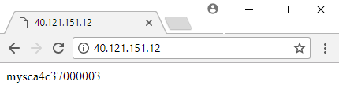

# Quickstart: Create a virtual machine scale set with the Azure CLI
A virtual machine scale set allows you to deploy and manage a set of identical, auto-scaling virtual machines. You can scale the number of VMs in the scale set manually, or define rules to autoscale based on resource usage like CPU, memory demand, or network traffic. An Azure load balancer then distributes traffic to the VM instances in the scale set. In this quickstart, you create a virtual machine scale set and deploy a sample application with the Azure CLI.

If you don't have an Azure subscription, create a [free account](https://azure.microsoft.com/free/?WT.mc_id=A261C142F) before you begin.

[!INCLUDE [cloud-shell-try-it.md](../../includes/cloud-shell-try-it.md)]

If you choose to install and use the CLI locally, this tutorial requires that you are running the Azure CLI version 2.0.29 or later. Run `az --version` to find the version. If you need to install or upgrade, see [Install Azure CLI]( /cli/azure/install-azure-cli). 


## Create a scale set
Before you can create a scale set, create a resource group with [az group create](/cli/azure/group). The following example creates a resource group named *myResourceGroup* in the *eastus* location:

```azurecli-interactive
az group create --name myResourceGroup --location eastus
```

Now create a virtual machine scale set with [az vmss create](/cli/azure/vmss). The following example creates a scale set named *myScaleSet* that is set to automatically update as changes are applied, and generates SSH keys if they do not exist in *~/.ssh/id_rsa*. These SSH keys are used if you need to log in to the VM instances. To use an existing set of SSH keys, instead use the `--ssh-key-value` parameter and specify the location of your keys.

```azurecli-interactive
az vmss create \
  --resource-group myResourceGroup \
  --name myScaleSet \
  --image UbuntuLTS \
  --upgrade-policy-mode automatic \
  --admin-username azureuser \
  --generate-ssh-keys
```

It takes a few minutes to create and configure all the scale set resources and VMs.


## Deploy sample application
To test your scale set, install a basic web application. The Azure Custom Script Extension is used to download and run a script that installs an application on the VM instances. This extension is useful for post deployment configuration, software installation, or any other configuration / management task. For more information, see the [Custom Script Extension overview](../virtual-machines/linux/extensions-customscript.md).

Use the Custom Script Extension to install a basic NGINX web server. Apply the Custom Script Extension that installs NGINX with [az vmss extension set](/cli/azure/vmss/extension) as follows:

```azurecli-interactive
az vmss extension set \
  --publisher Microsoft.Azure.Extensions \
  --version 2.0 \
  --name CustomScript \
  --resource-group myResourceGroup \
  --vmss-name myScaleSet \
  --settings '{"fileUris":["https://raw.githubusercontent.com/Azure-Samples/compute-automation-configurations/master/automate_nginx.sh"],"commandToExecute":"./automate_nginx.sh"}'
```


## Allow traffic to application
When the scale set was created, an Azure load balancer was automatically deployed. The load balancer distributes traffic to the VM instances in the scale set. To allow traffic to reach the sample web application, create a load balancer rule with [az network lb rule create](/cli/azure/network/lb/rule). The following example creates a rule named *myLoadBalancerRuleWeb*:

```azurecli-interactive
az network lb rule create \
  --resource-group myResourceGroup \
  --name myLoadBalancerRuleWeb \
  --lb-name myScaleSetLB \
  --backend-pool-name myScaleSetLBBEPool \
  --backend-port 80 \
  --frontend-ip-name loadBalancerFrontEnd \
  --frontend-port 80 \
  --protocol tcp
```


## Test your scale set
To see your scale set in action, access the sample web application in a web browser. Obtain the public IP address of your load balancer with [az network public-ip show](/cli/azure/network/public-ip). The following example obtains the IP address for *myScaleSetLBPublicIP* created as part of the scale set:

```azurecli-interactive
az network public-ip show \
  --resource-group myResourceGroup \
  --name myScaleSetLBPublicIP \
  --query '[ipAddress]' \
  --output tsv
```

Enter the public IP address of the load balancer in to a web browser. The load balancer distributes traffic to one of your VM instances, as shown in the following example:




## Clean up resources
When no longer needed, you can use [az group delete](/cli/azure/group) to remove the resource group, scale set, and all related resources as follows. The `--no-wait` parameter returns control to the prompt without waiting for the operation to complete. The `--yes` parameter confirms that you wish to delete the resources without an additional prompt to do so.

```azurecli-interactive
az group delete --name myResourceGroup --yes --no-wait
```


## Next steps
In this quickstart, you created a basic scale set and used the Custom Script Extension to install a basic NGINX web server on the VM instances. To learn more, continue to the tutorial for how to create and manage Azure virtual machine scale sets.

> [!div class="nextstepaction"]
> [Create and manage Azure virtual machine scale sets](tutorial-create-and-manage-cli.md)

