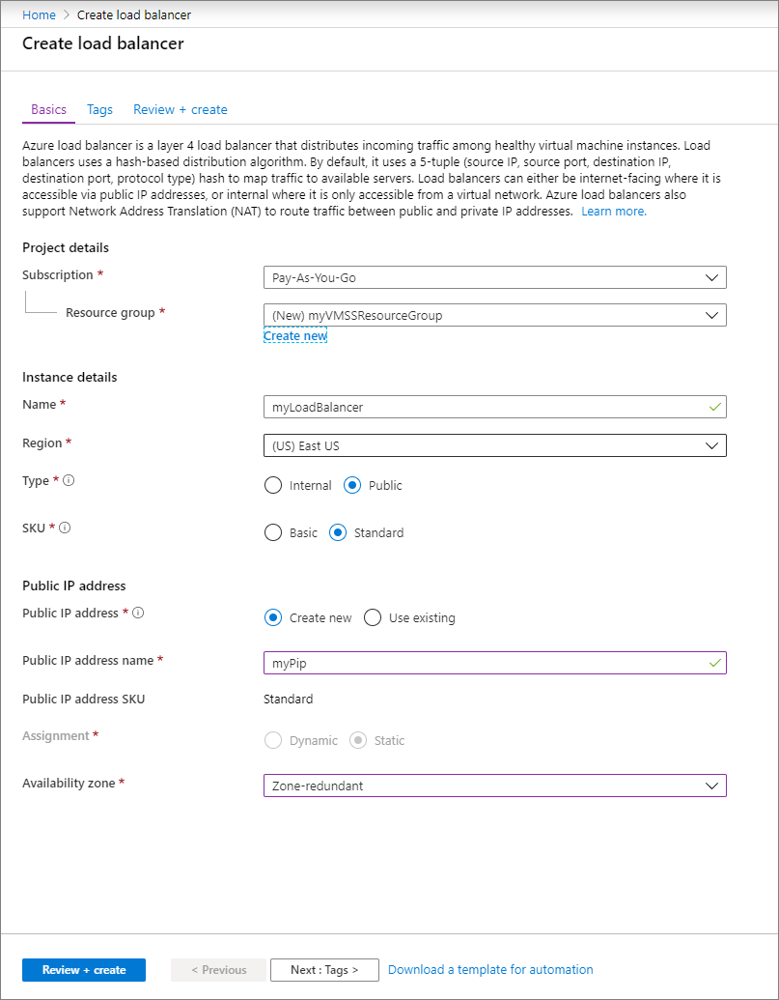
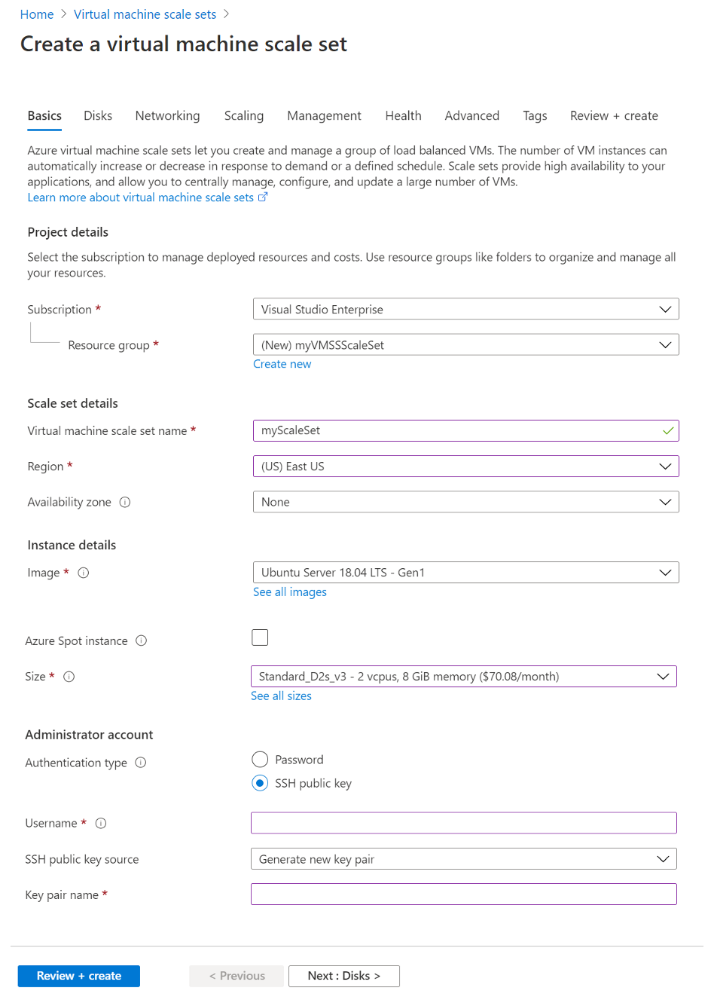

# Quickstart: Create a virtual machine scale set in the Azure portal

A virtual machine scale set allows you to deploy and manage a set of identical, auto-scaling virtual machines. You can scale the number of VMs in the scale set manually, or define rules to autoscale based on resource usage like CPU, memory demand, or network traffic. An Azure load balancer then distributes traffic to the VM instances in the scale set. In this quickstart, you create a virtual machine scale set in the Azure portal.

If you don't have an Azure subscription, create a [free account](https://azure.microsoft.com/free/?WT.mc_id=A261C142F) before you begin.

## Log in to Azure
Log in to the Azure portal at https://portal.azure.com.

## Create a load balancer

Azure [load balancer](../load-balancer/load-balancer-overview.md) distributes incoming traffic among healthy virtual machine instances. 

First, create a public Standard Load Balancer by using the portal. The name and public IP address you create are automatically configured as the load balancer's front end.

1. In the search box, type **load balancer**. Under **Marketplace** in the search results, pick **Load balancer**.
1. In the **Basics** tab of the **Create load balancer** page, enter or select the following information:

    | Setting                 | Value   |
    | ---| ---|
    | Subscription  | Select your subscription.    |    
    | Resource group | Select **Create new** and type *myVMSSResourceGroup* in the text box.|
    | Name           | *myLoadBalancer*         |
    | Region         | Select **East US**.       |
    | Type          | Select **Public**.       |
    | SKU           | Select **Standard**.       |
    | Public IP address | Select **Create new**. |
    | Public IP address name  | *MyPip*   |
    | Assignment| Static |

1. When you are done, select **Review + create** 
1. After it passes validation, select **Create**. 

## Create virtual machine scale set
You can deploy a scale set with a Windows Server image or Linux image such as RHEL, CentOS, Ubuntu, or SLES.

1. Type **Scale set** in the search box. In the results, under **Marketplace**, select **Virtual machine scale sets**. The **Create a virtual machine scale set** page will open. 
1. In the **Basics** tab, under **Project details**, make sure the correct subscription is selected and then choose to **Create new** resource group. Type *myVMSSResourceGroup* for the name and then select **OK** . 
1. Type *myScaleSet* as the name for your scale set.
1. In **Region**, select a region that is close to your area.
1. Leave the default value of **ScaleSet VMs** for **Orchestrator**.
1. Select a marketplace image for **Image**. In this example, we have chosen *Ubuntu Server 18.04 LTS*.
1. Enter your desired username, and select which authentication type you prefer.
   - A **Password** must be at least 12 characters long and meet three out of the four following complexity requirements: one lower case character, one upper case character, one number, and one special character. For more information, see [username and password requirements](../virtual-machines/windows/faq.md#what-are-the-username-requirements-when-creating-a-vm).
   - If you select a Linux OS disk image, you can instead choose **SSH public key**. Only provide your public key, such as *~/.ssh/id_rsa.pub*. You can use the Azure Cloud Shell from the portal to [create and use SSH keys](../virtual-machines/linux/mac-create-ssh-keys.md).
   
    

1. Select **Next** to move the the other pages. 
1. Leave the defaults for the **Instance** and **Disks** pages.
1. On the **Networking** page, under **Load balancing**, select **Yes** to put the scale set instances behind a load balancer. 
1. In **Load balancing options**, select **Azure load balancer**.
1. In **Select a load balancer**, select *myLoadBalancer* that you created earlier.
1. For **Select a backend pool**, select **Create new**, type *myBackendPool*, then select **Create**.
1. When you are done, select **Review + create**. 
1. After it passes validation, select **Create** to deploy the scale set.

## Clean up resources
When no longer needed, delete the resource group, scale set, and all related resources. To do so, select the resource group for the scale set and then select **Delete**.

## Next steps
In this quickstart, you created a basic scale set in the Azure portal. To learn more, continue to the tutorial for how to create and manage Azure virtual machine scale sets.

> [!div class="nextstepaction"]
> [Create and manage Azure virtual machine scale sets](tutorial-create-and-manage-powershell.md)
