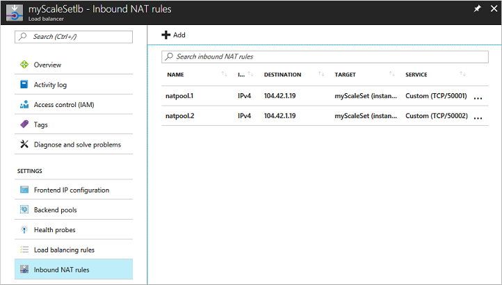

# Quickstart: Create a virtual machine scale set in the Azure portal
A virtual machine scale set allows you to deploy and manage a set of identical, auto-scaling virtual machines. You can scale the number of VMs in the scale set manually, or define rules to autoscale based on resource usage like CPU, memory demand, or network traffic. An Azure load balancer then distributes traffic to the VM instances in the scale set. In this quickstart, you create a virtual machine scale set in the Azure portal.

If you don't have an Azure subscription, create a [free account](https://azure.microsoft.com/free/?WT.mc_id=A261C142F) before you begin.

## Log in to Azure
Log in to the Azure portal at https://portal.azure.com.

## Create virtual machine scale set
You can deploy a scale set with a Windows Server image or Linux image such as RHEL, CentOS, Ubuntu, or SLES.

1. Click **Create a resource** in the upper left-hand corner of the Azure portal.
2. Search for *scale set*, choose **Virtual machine scale set**, then select **Create**.
3. Enter a name for the scale set, such as *myScaleSet*.
4. Select your desired OS type, such as *Windows Server 2016 Datacenter*.
5. Enter your desired resource group name, such as *myResourceGroup*, and location, such as *East US*.
6. Enter your desired username, and select which authentication type you prefer.
   - A **Password** must be at least 12 characters long and meet three out of the four following complexity requirements: one lower case character, one upper case character, one number, and one special character. For more information, see [username and password requirements](../virtual-machines/windows/faq.md#what-are-the-username-requirements-when-creating-a-vm).
   - If you select a Linux OS disk image, you can instead choose **SSH public key**. Only provide your public key, such as *~/.ssh/id_rsa.pub*. You can use the Azure Cloud Shell from the portal to [create and use SSH keys](../virtual-machines/linux/mac-create-ssh-keys.md).

     
1. Select a load balancing option, such as *Load balancer*, under **Choose Load balancing options**. Enter the remaining details for your load balancing option. For example, for *Load balancer* you need to enter a **Public IP address name** and **Domain name label**.
1. Enter the virtual network details under **Configure Virtual Networks**. For example, you can create a new virtual network, *myVirtualNetwork*, and a new subnet, *default*.
1. To confirm the scale set options, select **Create**.
    

## Connect to a VM in the scale set
When you create a scale set in the portal, a load balancer is created. Network Address Translation (NAT) rules are used to distribute traffic to the scale set instances for remote connectivity such as RDP or SSH.

To view these NAT rules and connection information for your scale set instances:

1. Select the resource group you created in the previous step, such as *myResourceGroup*.
2. From the list of resources, select your **Load balancer**, such as *myScaleSetLab*.
3. Choose **Inbound NAT rules** from the menu on the left-hand side of the window.

    

You can connect to each VM in the scale set using these NAT rules. Each VM instance lists a destination IP address and TCP port value. For example, if the destination IP address is *104.42.1.19* and the TCP port is *50001*, you connect to the VM instance as follows:

- For a Windows scale set, connect to the VM instance with RDP on `104.42.1.19:50001`
- For a Linux scale set, connect to the VM instance with SSH on `ssh azureuser@104.42.1.19 -p 50001`

When prompted, enter the credentials you specified from the previous step when you created the scale set. The scale set instances are regular VMs that you can interact with as normal. For more information on how to deploy and run applications on your scale set instances, see [Deploy your application on virtual machine scale sets](virtual-machine-scale-sets-deploy-app.md)

## Clean up resources
When no longer needed, delete the resource group, scale set, and all related resources. To do so, select the resource group for the VM and click **Delete**.

## Next steps
In this quickstart, you created a basic scale set in the Azure portal. To learn more, continue to the tutorial for how to create and manage Azure virtual machine scale sets.

> [!div class="nextstepaction"]
> [Create and manage Azure virtual machine scale sets](tutorial-create-and-manage-powershell.md)
