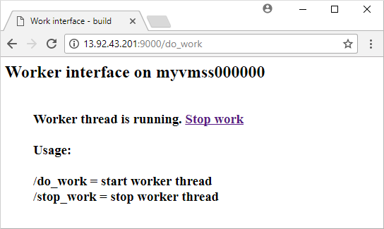

# Quickstart: Create a Linux Virtual Machine Scale Set with an ARM template

**Applies to:** :heavy_check_mark: Linux VMs :heavy_check_mark: Uniform scale sets

> [!NOTE]
> The following article is for Uniform Virtual Machine Scale Sets. We recommend using Flexible Virtual Machine Scale Sets for new workloads. Learn more about this new orchestration mode in our [Flexible Virtual Machine Scale Sets overview](flexible-virtual-machine-scale-sets.md).

A Virtual Machine Scale Set allows you to deploy and manage a set of auto-scaling virtual machines. You can scale the number of VMs in the scale set manually, or define rules to autoscale based on resource usage like CPU, memory demand, or network traffic. An Azure load balancer then distributes traffic to the VM instances in the scale set. In this quickstart, you create a Virtual Machine Scale Set and deploy a sample application with an Azure Resource Manager template (ARM template).

[!INCLUDE [About Azure Resource Manager](../../includes/resource-manager-quickstart-introduction.md)]

ARM templates let you deploy groups of related resources. In a single template, you can create the Virtual Machine Scale Set, install applications, and configure autoscale rules. With the use of variables and parameters, this template can be reused to update existing, or create additional, scale sets. You can deploy templates through the Azure portal, Azure CLI, or Azure PowerShell, or from continuous integration / continuous delivery (CI/CD) pipelines.

If your environment meets the prerequisites and you're familiar with using ARM templates, select the **Deploy to Azure** button. The template will open in the Azure portal.

:::image type="content" source="~/reusable-content/ce-skilling/azure/media/template-deployments/deploy-to-azure-button.svg" alt-text="Button to deploy the Resource Manager template to Azure." border="false" link="https://portal.azure.com/#create/Microsoft.Template/uri/https%3A%2F%2Fraw.githubusercontent.com%2FAzure%2Fazure-quickstart-templates%2Fmaster%2Fapplication-workloads%2Fpython%2Fvmss-bottle-autoscale%2Fazuredeploy.json":::

## Prerequisites

If you don't have an Azure subscription, create a [free account](https://azure.microsoft.com/free/?WT.mc_id=A261C142F) before you begin.

## Review the template

The template used in this quickstart is from [Azure Quickstart Templates](https://azure.microsoft.com/resources/templates/vmss-bottle-autoscale/).

These resources are defined in the template:

- [**Microsoft.Network/virtualNetworks**](/azure/templates/microsoft.network/virtualnetworks)
- [**Microsoft.Network/publicIPAddresses**](/azure/templates/microsoft.network/publicipaddresses)
- [**Microsoft.Network/loadBalancers**](/azure/templates/microsoft.network/loadbalancers)
- [**Microsoft.Compute/virtualMachineScaleSets**](/azure/templates/microsoft.compute/virtualmachinescalesets)
- [**Microsoft.Insights/autoscaleSettings**](/azure/templates/microsoft.insights/autoscalesettings)

### Define a scale set

To create a scale with a template, you define the appropriate resources. The core parts of the Virtual Machine Scale Set resource type are:

| Property                     | Description of property                                  | Example template value                    |
|------------------------------|----------------------------------------------------------|-------------------------------------------|
| type                         | Azure resource type to create                            | Microsoft.Compute/virtualMachineScaleSets |
| name                         | The scale set name                                       | myScaleSet                                |
| location                     | The location to create the scale set                     | East US                                   |
| sku.name                     | The VM size for each scale set instance                  | Standard_A1                               |
| sku.capacity                 | The number of VM instances to initially create           | 2                                         |
| upgradePolicy.mode           | VM instance upgrade mode when changes occur              | Automatic                                 |
| imageReference               | The platform or custom image to use for the VM instances | Canonical Ubuntu Server 16.04-LTS         |
| osProfile.computerNamePrefix | The name prefix for each VM instance                     | myvmss                                    |
| osProfile.adminUsername      | The username for each VM instance                        | azureuser                                 |
| osProfile.adminPassword      | The password for each VM instance                        | P@ssw0rd!                                 |

To customize a scale set template, you can change the VM size or initial capacity. Another option is to use a different platform or a custom image.

### Add a sample application

To test your scale set, install a basic web application. When you deploy a scale set, VM extensions can provide post-deployment configuration and automation tasks, such as installing an app. Scripts can be downloaded from Azure storage or GitHub, or provided to the Azure portal at extension run-time. To apply an extension to your scale set, you add the *extensionProfile* section to the preceding resource example. The extension profile typically defines the following properties:

- Extension type
- Extension publisher
- Extension version
- Location of configuration or install scripts
- Commands to execute on the VM instances

The template uses the Custom Script Extension to install [Bottle](https://bottlepy.org/docs/dev/), a Python web framework, and a simple HTTP server.

Two scripts are defined in **fileUris** - *installserver.sh*, and *workserver.py*. These files are downloaded from GitHub, then *commandToExecute* runs `bash installserver.sh` to install and configure the app.

## Deploy the template

You can deploy the template by selecting the following **Deploy to Azure** button. This button opens the Azure portal, loads the complete template, and prompts for a few parameters such as a scale set name, instance count, and admin credentials.

:::image type="content" source="~/reusable-content/ce-skilling/azure/media/template-deployments/deploy-to-azure-button.svg" alt-text="Button to deploy the Resource Manager template to Azure." border="false" link="https://portal.azure.com/#create/Microsoft.Template/uri/https%3A%2F%2Fraw.githubusercontent.com%2FAzure%2Fazure-quickstart-templates%2Fmaster%2Fapplication-workloads%2Fpython%2Fvmss-bottle-autoscale%2Fazuredeploy.json":::

You can also deploy a Resource Manager template by using Azure CLI:

```azurecli-interactive
# Create a resource group
az group create --name myResourceGroup --location EastUS

# Deploy template into resource group
az deployment group create \
    --resource-group myResourceGroup \
    --template-uri https://raw.githubusercontent.com/Azure/azure-quickstart-templates/master/application-workloads/python/vmss-bottle-autoscale/azuredeploy.json
```

Answer the prompts to provide a scale set name, instance count, and admin credentials for the VM instances. It takes a few minutes for the scale set and supporting resources to be created.

## Validate the deployment

To see your scale set in action, access the sample web application in a web browser. Obtain the public IP address of the load balancer with [az network public-ip list](/cli/azure/network/public-ip) as follows:

```azurecli-interactive
az network public-ip list \
    --resource-group myResourceGroup \
    --query [*].ipAddress -o tsv
```

Enter the public IP address of the load balancer in to a web browser in the format *http:\//publicIpAddress:9000/do_work*. The load balancer distributes traffic to one of your VM instances, as shown in the following example:



## Clean up resources

When no longer needed, you can use [az group delete](/cli/azure/group) to remove the resource group, scale set, and all related resources as follows. The `--no-wait` parameter returns control to the prompt without waiting for the operation to complete. The `--yes` parameter confirms that you wish to delete the resources without an additional prompt to do so.

```azurecli-interactive
az group delete --name myResourceGroup --yes --no-wait
```

## Next steps

In this quickstart, you created a Linux scale set with an ARM template and used the Custom Script Extension to install a basic Python web server on the VM instances. To learn more, continue to the tutorial for how to create and manage Azure Virtual Machine Scale Sets.

> [!div class="nextstepaction"]
> [Create and manage Azure Virtual Machine Scale Sets](tutorial-create-and-manage-cli.md)
