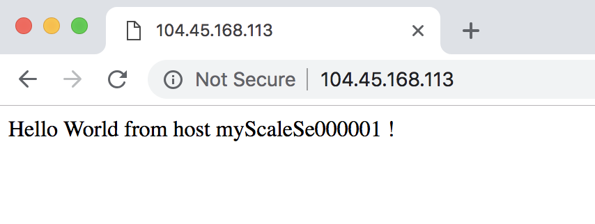

# Quickstart: Create a Windows virtual machine scale set with an Azure template

A virtual machine scale set allows you to deploy and manage a set of identical, auto-scaling virtual machines. You can scale the number of VMs in the scale set manually, or define rules to autoscale based on resource usage like CPU, memory demand, or network traffic. An Azure load balancer then distributes traffic to the VM instances in the scale set. In this quickstart, you create a virtual machine scale set and deploy a sample application with an Azure Resource Manager template.

[!INCLUDE [About Azure Resource Manager](../../includes/resource-manager-quickstart-introduction.md)]

If you don't have an Azure subscription, create a [free account](https://azure.microsoft.com/free/?WT.mc_id=A261C142F) before you begin.

## Prerequisites

None.

## Create a scale set

Azure Resource Manager templates let you deploy groups of related resources. In a single template, you can create the virtual machine scale set, install applications, and configure autoscale rules. With the use of variables and parameters, this template can be reused to update existing, or create additional, scale sets. You can deploy templates through the Azure portal, Azure CLI, Azure PowerShell, or from continuous integration / continuous delivery (CI/CD) pipelines.

### Review the template

The template used in this quickstart is from [Azure Quickstart templates](https://azure.microsoft.com/resources/templates/201-vmss-windows-webapp-dsc-autoscale/).

:::code language="json" source="~/quickstart-templates/201-vmss-windows-webapp-dsc-autoscale/azuredeploy.json" range="1-397" highlight="236-325":::

These resources are defined in these templates:

- [**Microsoft.Network/virtualNetworks**](/azure/templates/microsoft.network/virtualnetworks)
- [**Microsoft.Network/publicIPAddresses**](/azure/templates/microsoft.network/publicipaddresses)
- [**Microsoft.Network/loadBalancers**](/azure/templates/microsoft.network/loadbalancers)
- [**Microsoft.Compute/virtualMachineScaleSets**](/azure/templates/microsoft.compute/virtualmachinescalesets)
- [**Microsoft.Insights/autoscaleSettings**](/azure/templates/microsoft.insights/autoscalesettings)

#### Define a scale set

The highlighted portion is the scale set resource definition. To create a scale with a template, you define the appropriate resources. The core parts of the virtual machine scale set resource type are:

| Property                     | Description of property                                  | Example template value                    |
|------------------------------|----------------------------------------------------------|-------------------------------------------|
| type                         | Azure resource type to create                            | Microsoft.Compute/virtualMachineScaleSets |
| name                         | The scale set name                                       | myScaleSet                                |
| location                     | The location to create the scale set                     | East US                                   |
| sku.name                     | The VM size for each scale set instance                  | Standard_A1                               |
| sku.capacity                 | The number of VM instances to initially create           | 2                                         |
| upgradePolicy.mode           | VM instance upgrade mode when changes occur              | Automatic                                 |
| imageReference               | The platform or custom image to use for the VM instances | Microsoft Windows Server 2016 Datacenter  |
| osProfile.computerNamePrefix | The name prefix for each VM instance                     | myvmss                                    |
| osProfile.adminUsername      | The username for each VM instance                        | azureuser                                 |
| osProfile.adminPassword      | The password for each VM instance                        | P@ssw0rd!                                 |

To customize a scale set template, you can change the VM size or initial capacity. Another option is to use a different platform or a custom image.

#### Add a sample application

To test your scale set, install a basic web application. When you deploy a scale set, VM extensions can provide post-deployment configuration and automation tasks, such as installing an app. Scripts can be downloaded from Azure storage or GitHub, or provided to the Azure portal at extension run-time. To apply an extension to your scale set, you add the *extensionProfile* section to the preceding resource example. The extension profile typically defines the following properties:

- Extension type
- Extension publisher
- Extension version
- Location of configuration or install scripts
- Commands to execute on the VM instances

The template uses the PowerShell DSC extension to install an ASP.NET MVC app that runs in IIS.

An install script is downloaded from GitHub, as defined in *url*. The extension then runs *InstallIIS* from the *IISInstall.ps1* script, as defined in *function* and *Script*. The ASP.NET app itself is provided as a Web Deploy package, which is also downloaded from GitHub, as defined in *WebDeployPackagePath*:

## Deploy the template

You can deploy the template by selecting the **Deploy to Azure** button. This button opens the Azure portal, loads the complete template, and prompts for a few parameters such as a scale set name, instance count, and admin credentials.

[](https://portal.azure.com/#create/Microsoft.Template/uri/https%3A%2F%2Fraw.githubusercontent.com%2FAzure%2Fazure-quickstart-templates%2Fmaster%2F201-vmss-windows-webapp-dsc-autoscale%2Fazuredeploy.json)

You can also deploy a Resource Manager template by using Azure PowerShell:

```azurepowershell-interactive
# Create a resource group
New-AzResourceGroup -Name myResourceGroup -Location EastUS

# Deploy template into resource group
New-AzResourceGroupDeployment `
    -ResourceGroupName myResourceGroup `
    -TemplateURI https://raw.githubusercontent.com/Azure/azure-quickstart-templates/master/201-vmss-windows-webapp-dsc-autoscale/azuredeploy.json

# Update the scale set and apply the extension
Update-AzVmss `
    -ResourceGroupName myResourceGroup `
    -VmScaleSetName myVMSS `
    -VirtualMachineScaleSet $vmssConfig
```

Answer the prompts to provide a scale set name and admin credentials for the VM instances. It can take 10-15 minutes for the scale set to be created and apply the extension to configure the app.

## Test the deployment

To see your scale set in action, access the sample web application in a web browser. Obtain the public IP address of your load balancer with [Get-AzPublicIpAddress](/powershell/module/az.network/get-azpublicipaddress) as follows:

```azurepowershell-interactive
Get-AzPublicIpAddress -ResourceGroupName myResourceGroup | Select IpAddress
```

Enter the public IP address of the load balancer in to a web browser in the format *http:\//publicIpAddress/MyApp*. The load balancer distributes traffic to one of your VM instances, as shown in the following example:



## Clean up resources

When no longer needed, you can use the [Remove-AzResourceGroup](/powershell/module/az.resources/remove-azresourcegroup) to remove the resource group, scale set. The `-Force` parameter confirms that you wish to delete the resources without an additional prompt to do so. The `-AsJob` parameter returns control to the prompt without waiting for the operation to complete.

```azurepowershell-interactive
Remove-AzResourceGroup -Name "myResourceGroup" -Force -AsJob
```

## Next steps

In this quickstart, you created a Windows scale set with an Azure template and used the PowerShell DSC extension to install a basic ASP.NET app on the VM instances. To learn more, continue to the tutorial for how to create and manage Azure virtual machine scale sets.

> [!div class="nextstepaction"]
> [Create and manage Azure virtual machine scale sets](tutorial-create-and-manage-powershell.md)
