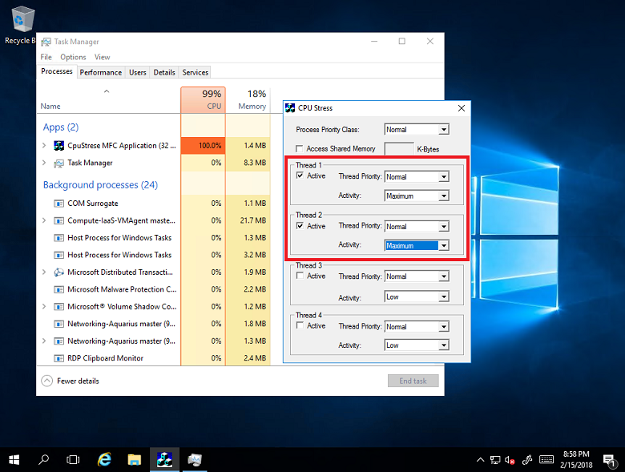

# Tutorial: Automatically scale a virtual machine scale set with Azure PowerShell

[!INCLUDE [requires-azurerm](../../includes/requires-azurerm.md)]

When you create a scale set, you define the number of VM instances that you wish to run. As your application demand changes, you can automatically increase or decrease the number of VM instances. The ability to autoscale lets you keep up with customer demand or respond to application performance changes throughout the lifecycle of your app. In this tutorial you learn how to:

> [!div class="checklist"]
> * Use autoscale with a scale set
> * Create and use autoscale rules
> * Stress-test VM instances and trigger autoscale rules
> * Autoscale back in as demand is reduced

If you don't have an Azure subscription, create a [free account](https://azure.microsoft.com/free/?WT.mc_id=A261C142F) before you begin.

There's a known issue that affects Azure PowerShell module version 6.8.1 or later, including the current version of the Azure Cloud Shell. This tutorial can only run using  Azure PowerShell module version 6.0.0 to 6.8.0. Run `Get-Module -ListAvailable AzureRM` to find the version. If you are running PowerShell locally, you also need to run `Connect-AzureRmAccount` to create a connection with Azure.


## Create a scale set
To make it easier to create the autoscale rules, define some variables for your scale set. The following example defines variables for the scale set named *myScaleSet* in the resource group named *myResourceGroup* and in the *East US* region. Your subscription ID is obtained with [Get-AzureRmSubscription](/powershell/module/azurerm.profile/get-azurermsubscription). If you have multiple subscriptions associated with your account, only the first subscription is returned. Adjust the names and subscription ID as follows:

```azurepowershell-interactive
$mySubscriptionId = (Get-AzureRmSubscription)[0].Id
$myResourceGroup = "myResourceGroup"
$myScaleSet = "myScaleSet"
$myLocation = "East US"
```

Now create a virtual machine scale set with [New-AzureRmVmss](/powershell/module/azurerm.compute/new-azurermvmss). To distribute traffic to the individual VM instances, a load balancer is also created. The load balancer includes rules to distribute traffic on TCP port 80, as well as allow remote desktop traffic on TCP port 3389 and PowerShell remoting on TCP port 5985. When prompted, provide your own desired administrative credentials for the VM instances in the scale set:

```azurepowershell-interactive
New-AzureRmVmss `
  -ResourceGroupName $myResourceGroup `
  -VMScaleSetName $myScaleSet `
  -Location $myLocation `
  -VirtualNetworkName "myVnet" `
  -SubnetName "mySubnet" `
  -PublicIpAddressName "myPublicIPAddress" `
  -LoadBalancerName "myLoadBalancer"
```

It takes a few minutes to create and configure all the scale set resources and VMs.

## Create a rule to autoscale out
If your application demand increases, the load on the VM instances in your scale set increases. If this increased load is consistent, rather than just a brief demand, you can configure autoscale rules to increase the number of VM instances in the scale set. When these VM instances are created and your applications are deployed, the scale set starts to distribute traffic to them through the load balancer. You control what metrics to monitor, such as CPU or disk, how long the application load must meet a given threshold, and how many VM instances to add to the scale set.

Let's create a rule with [New-AzureRmAutoscaleRule](/powershell/module/AzureRM.Insights/New-AzureRmAutoscaleRule) that increases the number of VM instances in a scale set when the average CPU load is greater than 70% over a 5-minute period. When the rule triggers, the number of VM instances is increased by three.

The following parameters are used for this rule:

| Parameter               | Explanation                                                                                                         | Value          |
|-------------------------|---------------------------------------------------------------------------------------------------------------------|----------------|
| *-MetricName*           | The performance metric to monitor and apply scale set actions on.                                                   | Percentage CPU |
| *-TimeGrain*            | How often the metrics are collected for analysis.                                                                   | 1 minute       |
| *-MetricStatistic*      | Defines how the collected metrics should be aggregated for analysis.                                                | Average        |
| *-TimeWindow*           | The amount of time monitored before the metric and threshold values are compared.                                   | 5 minutes      |
| *-Operator*             | Operator used to compare the metric data against the threshold.                                                     | Greater Than   |
| *-Threshold*            | The value that causes the autoscale rule to trigger an action.                                                      | 70%            |
| *-ScaleActionDirection* | Defines if the scale set should scale up or down when the rule applies.                                             | Increase       |
| *-ScaleActionScaleType* | Indicates that the number of VM instances should be changed by a specific value.                                    | Change Count   |
| *-ScaleActionValue*     | The percentage of VM instances should be changed when the rule triggers.                                            | 3              |
| *-ScaleActionCooldown*  | The amount of time to wait before the rule is applied again so that the autoscale actions have time to take effect. | 5 minutes      |

The following example creates an object named *myRuleScaleOut* that holds this scale up rule. The *-MetricResourceId* uses the variables previously defined for the subscription ID, resource group name, and scale set name:

```azurepowershell-interactive
$myRuleScaleOut = New-AzureRmAutoscaleRule `
  -MetricName "Percentage CPU" `
  -MetricResourceId /subscriptions/$mySubscriptionId/resourceGroups/$myResourceGroup/providers/Microsoft.Compute/virtualMachineScaleSets/$myScaleSet `
  -TimeGrain 00:01:00 `
  -MetricStatistic "Average" `
  -TimeWindow 00:05:00 `
  -Operator "GreaterThan" `
  -Threshold 70 `
  -ScaleActionDirection "Increase" `
  -ScaleActionScaleType "ChangeCount" `
  -ScaleActionValue 3 `
  -ScaleActionCooldown 00:05:00
```


## Create a rule to autoscale in
On an evening or weekend, your application demand may decrease. If this decreased load is consistent over a period of time, you can configure autoscale rules to decrease the number of VM instances in the scale set. This scale-in action reduces the cost to run your scale set as you only run the number of instances required to meet the current demand.

Create another rule with [New-AzureRmAutoscaleRule](/powershell/module/AzureRM.Insights/New-AzureRmAutoscaleRule) that decreases the number of VM instances in a scale set when the average CPU load then drops below 30% over a 5-minute period. When the rule triggers, the number of VM instances is decreased by one.The following example creates an object named *myRuleScaleDown* that holds this scale up rule. The *-MetricResourceId* uses the variables previously defined for the subscription ID, resource group name, and scale set name:

```azurepowershell-interactive
$myRuleScaleIn = New-AzureRmAutoscaleRule `
  -MetricName "Percentage CPU" `
  -MetricResourceId /subscriptions/$mySubscriptionId/resourceGroups/$myResourceGroup/providers/Microsoft.Compute/virtualMachineScaleSets/$myScaleSet `
  -Operator "LessThan" `
  -MetricStatistic "Average" `
  -Threshold 30 `
  -TimeGrain 00:01:00 `
  -TimeWindow 00:05:00 `
  -ScaleActionCooldown 00:05:00 `
  -ScaleActionDirection "Decrease" `
  -ScaleActionScaleType "ChangeCount" `
  -ScaleActionValue 1
```


## Define an autoscale profile
To associate your autoscale rules with a scale set, create a profile. The autoscale profile defines the default, minimum, and maximum scale set capacity, and associates your autoscale rules. Create an autoscale profile with [New-AzureRmAutoscaleProfile](/powershell/module/AzureRM.Insights/New-AzureRmAutoscaleProfile). The following example sets the default, and minimum, capacity of *2* VM instances, and a maximum of *10*. The scale out and scale in rules created in the preceding steps are then attached:

```azurepowershell-interactive
$myScaleProfile = New-AzureRmAutoscaleProfile `
  -DefaultCapacity 2  `
  -MaximumCapacity 10 `
  -MinimumCapacity 2 `
  -Rule $myRuleScaleOut,$myRuleScaleIn `
  -Name "autoprofile"
```


## Apply autoscale profile to a scale set
The final step is to apply the autoscale profile to your scale set. Your scale set is then able to automatically scale in or out based on the application demand. Apply the autoscale profile with [Add-AzureRmAutoscaleSetting](/powershell/module/AzureRM.Insights/Add-AzureRmAutoscaleSetting) as follows:

```azurepowershell-interactive
Add-AzureRmAutoscaleSetting `
  -Location $myLocation `
  -Name "autosetting" `
  -ResourceGroup $myResourceGroup `
  -TargetResourceId /subscriptions/$mySubscriptionId/resourceGroups/$myResourceGroup/providers/Microsoft.Compute/virtualMachineScaleSets/$myScaleSet `
  -AutoscaleProfile $myScaleProfile
```


## Generate CPU load on scale set
To test the autoscale rules, generate some CPU load on the VM instances in the scale set. This simulated CPU load causes the autoscale rules to scale out and increase the number of VM instances. As the simulated CPU load is then decreased, the autoscale rules scale in and reduce the number of VM instances.

To list the NAT ports to connect to VM instances in a scale set, first get the load balancer object with [Get-AzureRmLoadBalancer](/powershell/module/AzureRM.Network/Get-AzureRmLoadBalancer). Then, view the inbound NAT rules with [Get-AzureRmLoadBalancerInboundNatRuleConfig](/powershell/module/AzureRM.Network/Get-AzureRmLoadBalancerInboundNatRuleConfig):

```azurepowershell-interactive
# Get the load balancer object
$lb = Get-AzureRmLoadBalancer -ResourceGroupName "myResourceGroup" -Name "myLoadBalancer"

# View the list of inbound NAT rules
Get-AzureRmLoadBalancerInboundNatRuleConfig -LoadBalancer $lb | Select-Object Name,Protocol,FrontEndPort,BackEndPort
```

The following example output shows the instance name, public IP address of the load balancer, and port number that the NAT rules forward traffic to:

```powershell
Name        Protocol FrontendPort BackendPort
----        -------- ------------ -----------
myRDPRule.0 Tcp             50001        3389
myRDPRule.1 Tcp             50002        3389
```

The *Name* of the rule aligns with the name of the VM instance as shown in a previous [Get-AzureRmVmssVM](/powershell/module/azurerm.compute/get-azurermvmssvm) command. For example, to connect to VM instance *0*, you use *myRDPRule.0* and connect to port *50001*. To connect to VM instance *1*, use the value from *myRDPRule.1* and connect to port *50002*.

View the public IP address of the load balancer with [Get-AzureRmPublicIpAddress](/powershell/module/AzureRM.Network/Get-AzureRmPublicIpAddress):

```azurepowershell-interactive
Get-AzureRmPublicIpAddress -ResourceGroupName "myResourceGroup" -Name myPublicIP | Select IpAddress
```

Example output:

```powershell
IpAddress
---------
52.168.121.216
```

Create a remote connection to your first VM instance. Specify your own public IP address and port number of the required VM instance, as shown from the preceding commands. When prompted, enter the credentials used when you created the scale set (by default in the sample commands, they are *azureuser* and *P\@ssw0rd!*). If you use the Azure Cloud Shell, perform this step from a local PowerShell prompt or Remote Desktop Client. The following example connects to VM instance *0*:

```powershell
mstsc /v 52.168.121.216:50001
```

Once logged in, open Internet Explorer from the taskbar.

- Select **OK** to accept the prompt to *Use recommended security, privacy, and compatibility settings*
- Type *http://download.sysinternals.com/files/CPUSTRES.zip* in the address bar.
- As Internet Explorer Enhanced Security Configuration is enabled, choose to **Add** the *http://download.sysinternals.com* domain to your list of trusted sites.
- When prompted for the file download, select **Open**, then select and **Run** the *CPUSTRES.EXE* tool.

To generate some CPU load, check two boxes for **Active** threads. From the **Activity** drop-down menu for both threads, select *Maximum*. You can open Task Manager to confirm that the CPU load on the VM is at 100%.



Leave the remote desktop connection session open, and open another remote desktop connection session. Connect to the second VM instance with the port number listed from the previous [Get-AzureRmLoadBalancerInboundNatRuleConfig](/powershell/module/AzureRM.Network/Get-AzureRmLoadBalancerInboundNatRuleConfig) cmdlet:

```powershell
mstsc /v 52.168.121.216:50002
```

Once logged in to the second VM instance, repeat the previous steps to download and run *CPUSTRES.EXE*. Again, start two **Active** threads, and set the activity to *Maximum*.

To allow the **CPU Stress** tool to continue running, leave both remote desktop connection sessions open.


## Monitor the active autoscale rules
To monitor the number of VM instances in your scale set, use **while**. It takes 5 minutes for the autoscale scales to begin the scale out process in response to the CPU load generated by **CPUStress** on each of the VM instances:

```azurepowershell-interactive
while (1) {Get-AzureRmVmssVM `
    -ResourceGroupName $myResourceGroup `
    -VMScaleSetName $myScaleSet; sleep 10}
```

Once the CPU threshold has been met, the autoscale rules increase the number of VM instances in the scale set. The following output shows three VMs created as the scale set autoscales out:

```powershell
ResourceGroupName         Name Location          Sku Capacity InstanceID ProvisioningState
-----------------         ---- --------          --- -------- ---------- -----------------
MYRESOURCEGROUP   myScaleSet_2   eastus Standard_DS2                   2         Succeeded
MYRESOURCEGROUP   myScaleSet_3   eastus Standard_DS2                   3         Succeeded
MYRESOURCEGROUP   myScaleSet_4   eastus Standard_DS2                   4          Creating
MYRESOURCEGROUP   myScaleSet_5   eastus Standard_DS2                   5          Creating
MYRESOURCEGROUP   myScaleSet_6   eastus Standard_DS2                   6          Creating
```

In your remote desktop connection session to each of your VM instances, close the **CPU Stress** tool. The average CPU load across the scale set returns to normal. After another 5 minutes, the autoscale rules then scale in the number of VM instances. Scale in actions remove VM instances with the highest IDs first. When a scale set uses Availability Sets or Availability Zones, scale in actions are evenly distributed across those VM instances. The following example output shows one VM instance deleted as the scale set autoscales in:

```powershell
MYRESOURCEGROUP   myScaleSet_6   eastus Standard_DS2                   6          Deleting
```

Exit *while* with `Ctrl-c`. The scale set continues to scale in every 5 minutes and remove one VM instance until the minimum instance count of two is reached.


## Clean up resources
To remove your scale set and additional resources, delete the resource group and all its resources with [Remove-AzureRmResourceGroup](/powershell/module/azurerm.resources/remove-azurermresourcegroup). The `-Force` parameter confirms that you wish to delete the resources without an additional prompt to do so. The `-AsJob` parameter returns control to the prompt without waiting for the operation to complete.

```azurepowershell-interactive
Remove-AzureRmResourceGroup -Name "myResourceGroup" -Force -AsJob
```


## Next steps
In this tutorial, you learned how to automatically scale in or out a scale set with Azure PowerShell:

> [!div class="checklist"]
> * Use autoscale with a scale set
> * Create and use autoscale rules
> * Stress-test VM instances and trigger autoscale rules
> * Autoscale back in as demand is reduced
