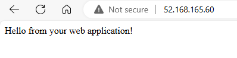
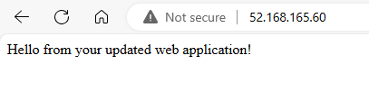

# Tutorial: Install applications in Virtual Machine Scale Sets with the Azure CLI
To run applications on virtual machine (VM) instances in a scale set, you first need to install the application components and required files. In a previous tutorial, you learned how to create and use a custom VM image to deploy your VM instances. This custom image included manual application installs and configurations. You can also automate the install of applications to a scale set after each VM instance is deployed, or update an application that already runs on a scale set. In this tutorial you learn how to:

> [!div class="checklist"]
> * Automatically install applications to your scale set
> * Use the Azure Custom Script Extension
> * Update a running application on a scale set

[!INCLUDE [quickstarts-free-trial-note](../../includes/quickstarts-free-trial-note.md)]

[!INCLUDE [azure-cli-prepare-your-environment.md](~/articles/reusable-content/azure-cli/azure-cli-prepare-your-environment.md)]

- This article requires version 2.0.29 or later of the Azure CLI. If using Azure Cloud Shell, the latest version is already installed. 

## What is the Azure Custom Script Extension?
The Custom Script Extension downloads and executes scripts on Azure VMs. This extension is useful for post deployment configuration, software installation, or any other configuration / management task. Scripts can be downloaded from Azure storage or GitHub, or provided to the Azure portal at extension run-time.

The Custom Script extension integrates with Azure Resource Manager templates, and can also be used with the Azure CLI, Azure PowerShell, Azure portal, or the REST API. For more information, see the [Custom Script Extension overview](../virtual-machines/extensions/custom-script-linux.md).

To use the Custom Script Extension with the Azure CLI, you create a JSON file that defines what files to obtain and commands to execute. These JSON definitions can be reused across scale set deployments to apply consistent application installs.

## Create Custom Script Extension definition
To see the Custom Script Extension in action, let's create a scale set that installs the NGINX web server and outputs the hostname of the scale set VM instance. The following Custom Script Extension definition downloads a sample script from GitHub, installs the required packages, then writes the VM instance hostname to a basic HTML page.

In your current shell, create a file named *customConfig.json* and paste the following configuration. For example, create the file in the Cloud Shell not on your local machine. You can use any editor you wish. In this tutorial we will use Vi. Enter`vi` in the Cloud Shell. Paste the below JSON into the editor and type `:w customConfig.json`.

```json
{
  "fileUris": ["https://raw.githubusercontent.com/Azure-Samples/compute-automation-configurations/master/automate_nginx.sh"],
  "commandToExecute": './automate_nginx.sh'
}
```

> [!NOTE]
> You may need to invert the use of the single (') and double quotes (") within the JSON block if you decide to reference the JSON directly (instead of referencing the *customConfig.json* file) in the *--settings* parameter below. 


## Create a scale set
Create a resource group with [az group create](/cli/azure/group). The following example creates a resource group named *myResourceGroup* in the *eastus* location:

```azurecli-interactive
az group create --name myResourceGroup --location eastus
```

Now create a Virtual Machine Scale Set with [az vmss create](/cli/azure/vmss#az-vmss-create). The following example creates a scale set named *myScaleSet*, and generates SSH keys if they do not exist:

```azurecli-interactive
az vmss create \
  --resource-group myResourceGroup \
  --name myScaleSet \
  --image Ubuntu2204 \
  --orchestration-mode Flexible \
  --admin-username azureuser \
  --generate-ssh-keys
```

It takes a few minutes to create and configure all the scale set resources and VMs.

## Apply the Custom Script Extension
Apply the Custom Script Extension configuration to the VM instances in your scale set with [az vmss extension set](/cli/azure/vmss/extension). The following example applies the *customConfig.json* configuration to the *myScaleSet* VM instances in the resource group named *myResourceGroup*:

```azurecli-interactive
az vmss extension set \
  --publisher Microsoft.Azure.Extensions \
  --version 2.0 \
  --name CustomScript \
  --resource-group myResourceGroup \
  --vmss-name myScaleSet \
  --settings customConfig.json
```

Each VM instance in the scale set downloads and runs the script from GitHub. In a more complex example, multiple application components and files could be installed. If the scale set is scaled up, the new VM instances automatically apply the same Custom Script Extension definition and install the required application.

## Test your scale set
To allow traffic to reach the web server, create a load balancer rule with [az network lb rule create](/cli/azure/network/lb/rule). The following example creates a rule named *myLoadBalancerRuleWeb*:

```azurecli-interactive
az network lb rule create \
  --resource-group myResourceGroup \
  --name myLoadBalancerRuleWeb \
  --lb-name myScaleSetLB \
  --backend-pool-name myScaleSetLBBEPool \
  --backend-port 80 \
  --frontend-ip-name loadBalancerFrontEnd \
  --frontend-port 80 \
  --protocol tcp
```

To see your web server in action, obtain the public IP address of your load balancer with [az network public-ip show](/cli/azure/network/public-ip). The following example obtains the IP address for *myScaleSetLBPublicIP* created as part of the scale set:

```azurecli-interactive
az network public-ip show \
  --resource-group myResourceGroup \
  --name myScaleSetLBPublicIP \
  --query [ipAddress] \
  --output tsv
```

Enter the public IP address of the load balancer in to a web browser. The load balancer distributes traffic to one of your VM instances, as shown in the following example:



Leave the web browser open so that you can see an updated version in the next step.

## Update app deployment
Throughout the lifecycle of a scale set, you may need to deploy an updated version of your application. With the Custom Script Extension, you can reference an updated deploy script and then reapply the extension to your scale set. When the scale set was created in a previous step, the `--upgrade-policy-mode` was set to *automatic*. This setting allows the VM instances in the scale set to automatically update and apply the latest version of your application.

In your current shell, create a file named *customConfigv2.json* and paste the following configuration. This definition runs an updated *v2* version of the application install script:

```json
{
  "fileUris": ["https://raw.githubusercontent.com/Azure-Samples/compute-automation-configurations/master/automate_nginx_v2.sh"],
  "commandToExecute": "./automate_nginx_v2.sh"
}
```

Apply the Custom Script Extension configuration to the VM instances in your scale set again with [az vmss extension set](/cli/azure/vmss/extension). The *customConfigv2.json* is used to apply the updated version of the application:

```azurecli-interactive
az vmss extension set \
  --publisher Microsoft.Azure.Extensions \
  --version 2.0 \
  --name CustomScript \
  --resource-group myResourceGroup \
  --vmss-name myScaleSet \
  --settings @customConfigv2.json
```

All VM instances in the scale set are automatically updated with the latest version of the sample web page. To see the updated version, refresh the web site in your browser:



## Clean up resources
To remove your scale set and additional resources, delete the resource group and all its resources with [az group delete](/cli/azure/group). The `--no-wait` parameter returns control to the prompt without waiting for the operation to complete. The `--yes` parameter confirms that you wish to delete the resources without an additional prompt to do so.

```azurecli-interactive
az group delete --name myResourceGroup --no-wait --yes
```

## Next steps
In this tutorial, you learned how to automatically install and update applications on your scale set with the Azure CLI:

> [!div class="checklist"]
> * Automatically install applications to your scale set
> * Use the Azure Custom Script Extension
> * Update a running application on a scale set

Advance to the next tutorial to learn how to automatically scale your scale set.

> [!div class="nextstepaction"]
> [Automatically scale your scale sets](tutorial-autoscale-cli.md)
