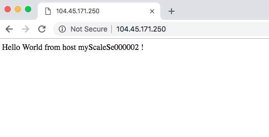
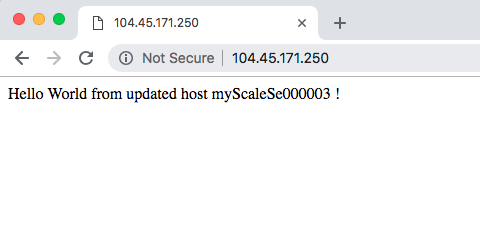

---
title: Tutorial - Install applications in a scale set with Azure PowerShell | Microsoft Docs
description: Learn how to use Azure PowerShell to install applications into virtual machine scale sets with the Custom Script Extension
services: virtual-machine-scale-sets
documentationcenter: ''
author: cynthn
manager: jeconnoc
editor: ''
tags: azure-resource-manager

ms.assetid: 
ms.service: virtual-machine-scale-sets
ms.workload: na
ms.tgt_pltfrm: na
ms.devlang: na
ms.topic: tutorial
ms.date: 11/08/2018
ms.author: cynthn
ms.custom: mvc

---
# Tutorial: Install applications in virtual machine scale sets with Azure PowerShell

To run applications on virtual machine (VM) instances in a scale set, you first need to install the application components and required files. In a previous tutorial, you learned how to create and use a custom VM image to deploy your VM instances. This custom image included manual application installs and configurations. You can also automate the install of applications to a scale set after each VM instance is deployed, or update an application that already runs on a scale set. In this tutorial you learn how to:

> [!div class="checklist"]
> * Automatically install applications to your scale set
> * Use the Azure Custom Script Extension
> * Update a running application on a scale set

If you don’t have an Azure subscription, create a [free account](https://azure.microsoft.com/free/?WT.mc_id=A261C142F) before you begin.

[!INCLUDE [updated-for-az.md](../../includes/updated-for-az.md)]

[!INCLUDE [cloud-shell-try-it.md](../../includes/cloud-shell-try-it.md)]


## What is the Azure Custom Script Extension?
The Custom Script Extension downloads and executes scripts on Azure VMs. This extension is useful for post deployment configuration, software installation, or any other configuration / management task. Scripts can be downloaded from Azure storage or GitHub, or provided to the Azure portal at extension run-time.

The Custom Script extension integrates with Azure Resource Manager templates. It can also be used with the Azure CLI, Azure PowerShell, Azure portal, or the REST API. For more information, see the [Custom Script Extension overview](../virtual-machines/windows/extensions-customscript.md).

To see the Custom Script Extension in action, create a scale set that installs the IIS web server and outputs the hostname of the scale set VM instance. The Custom Script Extension definition downloads a sample script from GitHub, installs the required packages, then writes the VM instance hostname to a basic HTML page.


## Create a scale set
Now create a virtual machine scale set with [New-AzVmss](/powershell/module/az.compute/new-azvmss). To distribute traffic to the individual VM instances, a load balancer is also created. The load balancer includes rules to distribute traffic on TCP port 80. It also allows remote desktop traffic on TCP port 3389 and PowerShell remoting on TCP port 5985. When prompted, you can set your own administrative credentials for the VM instances in the scale set:

```azurepowershell-interactive
New-AzVmss `
  -ResourceGroupName "myResourceGroup" `
  -VMScaleSetName "myScaleSet" `
  -Location "EastUS" `
  -VirtualNetworkName "myVnet" `
  -SubnetName "mySubnet" `
  -PublicIpAddressName "myPublicIPAddress" `
  -LoadBalancerName "myLoadBalancer" `
  -UpgradePolicyMode "Automatic"
```

It takes a few minutes to create and configure all the scale set resources and VMs.


## Create Custom Script Extension definition
Azure PowerShell uses a hashtable to store the file to download and the command to execute. In the following example, a sample script from GitHub is used. First, create this configuration object as follows:

```azurepowershell-interactive
$customConfig = @{
  "fileUris" = (,"https://raw.githubusercontent.com/Azure-Samples/compute-automation-configurations/master/automate-iis.ps1");
  "commandToExecute" = "powershell -ExecutionPolicy Unrestricted -File automate-iis.ps1"
}
```


Now, apply the Custom Script Extension with [Add-AzVmssExtension](/powershell/module/az.Compute/Add-azVmssExtension). The configuration object previously defined is passed to the extension. Update and run the extension on the VM instances with [Update-AzVmss](/powershell/module/az.compute/update-azvmss).


```azurepowershell-interactive
# Get information about the scale set
$vmss = Get-AzVmss `
          -ResourceGroupName "myResourceGroup" `
          -VMScaleSetName "myScaleSet"

# Add the Custom Script Extension to install IIS and configure basic website
$vmss = Add-AzVmssExtension `
  -VirtualMachineScaleSet $vmss `
  -Name "customScript" `
  -Publisher "Microsoft.Compute" `
  -Type "CustomScriptExtension" `
  -TypeHandlerVersion 1.9 `
  -Setting $customConfig

# Update the scale set and apply the Custom Script Extension to the VM instances
Update-AzVmss `
  -ResourceGroupName "myResourceGroup" `
  -Name "myScaleSet" `
  -VirtualMachineScaleSet $vmss
```

Each VM instance in the scale set downloads and runs the script from GitHub. In a more complex example, multiple application components and files could be installed. If the scale set is scaled up, the new VM instances automatically apply the same Custom Script Extension definition and install the required application.


## Allow traffic to application

To allow access to the basic web application, create a network security group with [New-AzNetworkSecurityRuleConfig](/powershell/module/az.network/new-aznetworksecurityruleconfig) and [New-AzNetworkSecurityGroup](/powershell/module/az.network/new-aznetworksecuritygroup). For more information, see [Networking for Azure virtual machine scale sets](virtual-machine-scale-sets-networking.md).

```azurepowershell-interactive
# Get information about the scale set
$vmss = Get-AzVmss `
            -ResourceGroupName "myResourceGroup" `
            -VMScaleSetName "myScaleSet"

#Create a rule to allow traffic over port 80
$nsgFrontendRule = New-AzNetworkSecurityRuleConfig `
  -Name myFrontendNSGRule `
  -Protocol Tcp `
  -Direction Inbound `
  -Priority 200 `
  -SourceAddressPrefix * `
  -SourcePortRange * `
  -DestinationAddressPrefix * `
  -DestinationPortRange 80 `
  -Access Allow

#Create a network security group and associate it with the rule
$nsgFrontend = New-AzNetworkSecurityGroup `
  -ResourceGroupName  "myResourceGroup" `
  -Location EastUS `
  -Name myFrontendNSG `
  -SecurityRules $nsgFrontendRule

$vnet = Get-AzVirtualNetwork `
  -ResourceGroupName  "myResourceGroup" `
  -Name myVnet

$frontendSubnet = $vnet.Subnets[0]

$frontendSubnetConfig = Set-AzVirtualNetworkSubnetConfig `
  -VirtualNetwork $vnet `
  -Name mySubnet `
  -AddressPrefix $frontendSubnet.AddressPrefix `
  -NetworkSecurityGroup $nsgFrontend

Set-AzVirtualNetwork -VirtualNetwork $vnet

# Update the scale set and apply the Custom Script Extension to the VM instances
Update-AzVmss `
    -ResourceGroupName "myResourceGroup" `
    -Name "myScaleSet" `
    -VirtualMachineScaleSet $vmss
```


## Test your scale set
To see your web server in action, get the public IP address of your load balancer with [Get-AzPublicIpAddress](/powershell/module/az.network/get-azpublicipaddress). The following example displays the IP address created in the *myResourceGroup* resource group:

```azurepowershell-interactive
Get-AzPublicIpAddress -ResourceGroupName "myResourceGroup" | Select IpAddress
```

Enter the public IP address of the load balancer in to a web browser. The load balancer distributes traffic to one of your VM instances, as shown in the following example:



Leave the web browser open so that you can see an updated version in the next step.


## Update app deployment
Throughout the lifecycle of a scale set, you may need to deploy an updated version of your application. With the Custom Script Extension, you can reference an updated deploy script and then reapply the extension to your scale set. When the scale set was created in a previous step, the `-UpgradePolicyMode` was set to *Automatic*. This setting allows the VM instances in the scale set to automatically update and apply the latest version of your application.

Create a new config definition named *customConfigv2*. This definition runs an updated *v2* version of the application install script:

```azurepowershell-interactive
$customConfigv2 = @{
  "fileUris" = (,"https://raw.githubusercontent.com/Azure-Samples/compute-automation-configurations/master/automate-iis-v2.ps1");
  "commandToExecute" = "powershell -ExecutionPolicy Unrestricted -File automate-iis-v2.ps1"
}
```

Update the Custom Script Extension configuration to the VM instances in your scale set. The *customConfigv2* definition is used to apply the updated version of the application:

```azurepowershell-interactive
$vmss = Get-AzVmss `
          -ResourceGroupName "myResourceGroup" `
          -VMScaleSetName "myScaleSet"
 
$vmss.VirtualMachineProfile.ExtensionProfile[0].Extensions[0].Settings = $customConfigv2
 
Update-AzVmss `
  -ResourceGroupName "myResourceGroup" `
  -Name "myScaleSet" `
  -VirtualMachineScaleSet $vmss
```

All VM instances in the scale set are automatically updated with the latest version of the sample web page. To see the updated version, refresh the web site in your browser:




## Clean up resources
To remove your scale set and additional resources, delete the resource group and all its resources with [Remove-AzResourceGroup](/powershell/module/az.resources/remove-azresourcegroup). The `-Force` parameter confirms that you wish to delete the resources without an additional prompt to do so. The `-AsJob` parameter returns control to the prompt without waiting for the operation to complete.

```azurepowershell-interactive
Remove-AzResourceGroup -Name "myResourceGroup" -Force -AsJob
```


## Next steps
In this tutorial, you learned how to automatically install and update applications on your scale set with Azure PowerShell:

> [!div class="checklist"]
> * Automatically install applications to your scale set
> * Use the Azure Custom Script Extension
> * Update a running application on a scale set

Advance to the next tutorial to learn how to automatically scale your scale set.

> [!div class="nextstepaction"]
> [Automatically scale your scale sets](tutorial-autoscale-powershell.md)
