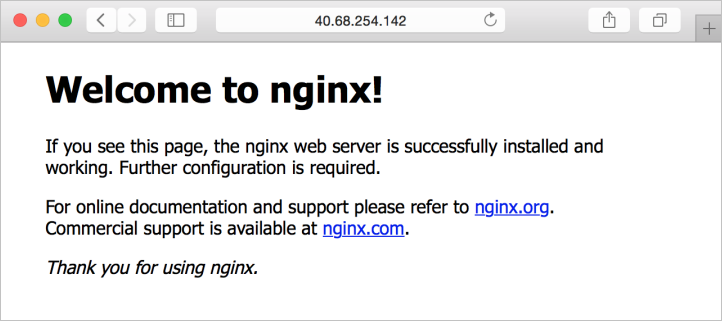

# Tutorial: Create and use a custom image for virtual machine scale sets with the Azure CLI
When you create a scale set, you specify an image to be used when the VM instances are deployed. To reduce the number of tasks after VM instances are deployed, you can use a custom VM image. This custom VM image includes any required application installs or configurations. Any VM instances created in the scale set use the custom VM image and are ready to serve your application traffic. In this tutorial you learn how to:

> [!div class="checklist"]
> * Create and customize a VM
> * Deprovision and generalize the VM
> * Create a custom VM image
> * Deploy a scale set that uses the custom VM image

If you don’t have an Azure subscription, create a [free account](https://azure.microsoft.com/free/?WT.mc_id=A261C142F) before you begin.

[!INCLUDE [cloud-shell-try-it.md](../../includes/cloud-shell-try-it.md)]

If you choose to install and use the CLI locally, this tutorial requires that you are running the Azure CLI version 2.0.29 or later. Run `az --version` to find the version. If you need to install or upgrade, see [Install Azure CLI]( /cli/azure/install-azure-cli).


## Create and configure a source VM

>[!NOTE]
> This tutorial walks through the process of creating and using a generalized VM image. It is not supported to create a scale set from a specialized VM image.

First, create a resource group with [az group create](/cli/azure/group#az_group_create), then create a VM with [az vm create](/cli/azure/vm#az_vm_create). This VM is then used as the source for a custom VM image. The following example creates a VM named *myVM* in the resource group named *myResourceGroup*:

```azurecli-interactive
az group create --name myResourceGroup --location eastus

az vm create \
  --resource-group myResourceGroup \
  --name myVM \
  --image ubuntults \
  --admin-username azureuser \
  --generate-ssh-keys
```

The public IP address of your VM is shown in the output of the [az vm create](/cli/azure/vm#az_vm_create) command. SSH to the public IP address of your VM as follows:

```azurecli-interactive
ssh azureuser@<publicIpAddress>
```

To customize your VM, let's install a basic web server. When the VM instance in the scale set would be deployed, it would then have all the required packages to run a web application. Use `apt-get` to install *NGINX* as follows:

```bash
sudo apt-get install -y nginx
```

The final step to prepare your VM for use as a custom image is to deprovision your VM. This step removes machine-specific information from the VM and makes it possible to deploy many VMs from a single image. When the VM is deprovisioned, the host name is reset to *localhost.localdomain*. SSH host keys, nameserver configurations, root password, and cached DHCP leases are also deleted.

To deprovision the VM, use the Azure VM agent (*waagent*). The Azure VM agent is installed on every VM and is used to communicate with the Azure platform. The `-force` parameter tells the agent to accept prompts to reset the machine-specific information.

```bash
sudo waagent -deprovision+user -force
```

Close your SSH connection to the VM:

```bash
exit
```


## Create a custom VM image from the source VM
The source VM is now customized with the Nginx web server installed. Let's create the custom VM image to use with a scale set.

To create an image, the VM needs to be deallocated. Deallocate the VM with [az vm deallocate](/cli//azure/vm#az_vm_deallocate). Then, set the state of the VM as generalized with [az vm generalize](/cli//azure/vm#az_vm_generalize) so that the Azure platform knows the VM is ready for use a custom image. You can only create an image from a generalized VM:

```azurecli-interactive
az vm deallocate --resource-group myResourceGroup --name myVM
az vm generalize --resource-group myResourceGroup --name myVM
```

It may take a few minutes to deallocate and generalize the VM.

Now, create an image of the VM with [az image create](/cli//azure/image#az_image_create). The following example creates an image named *myImage* from your VM:

```azurecli-interactive
az image create \
  --resource-group myResourceGroup \
  --name myImage \
  --source myVM
```


## Create a scale set from the custom VM image
Create a scale set with [az vmss create](/cli/azure/vmss#az-vmss-create). Instead of a platform image, such as *UbuntuLTS* or *CentOS*, specify the name of your custom VM image. The following example creates a scale set named *myScaleSet* that uses the custom image named *myImage* from the previous step:

```azurecli-interactive
az vmss create \
  --resource-group myResourceGroup \
  --name myScaleSet \
  --image myImage \
  --admin-username azureuser \
  --generate-ssh-keys
```

It takes a few minutes to create and configure all the scale set resources and VMs.


## Test your scale set
To allow traffic to reach your scale set and that verify that the web server works correctly, create a load balancer rule with [az network lb rule create](/cli/azure/network/lb/rule#create). The following example creates a rule named *myLoadBalancerRuleWeb* that allows traffic on *TCP* port *80*:

```azurecli-interactive
az network lb rule create \
  --resource-group myResourceGroup \
  --name myLoadBalancerRuleWeb \
  --lb-name myScaleSetLB \
  --backend-pool-name myScaleSetLBBEPool \
  --backend-port 80 \
  --frontend-ip-name loadBalancerFrontEnd \
  --frontend-port 80 \
  --protocol tcp
```

To see your scale set in action, get the public IP address of your load balancer with [az network public-ip show](/cli/azure/network/public-ip#show). The following example gets the IP address for *myScaleSetLBPublicIP* created as part of the scale set:

```azurecli-interactive
az network public-ip show \
  --resource-group myResourceGroup \
  --name myScaleSetLBPublicIP \
  --query [ipAddress] \
  --output tsv
```

Type the public IP address into your web browser. The default NGINX web page is displayed, as shown in the following example:




## Clean up resources
To remove your scale set and additional resources, delete the resource group and all its resources with [az group delete](/cli/azure/group#az_group_delete). The `--no-wait` parameter returns control to the prompt without waiting for the operation to complete. The `--yes` parameter confirms that you wish to delete the resources without an additional prompt to do so.

```azurecli-interactive
az group delete --name myResourceGroup --no-wait --yes
```


## Next steps
In this tutorial, you learned how to create and use a custom VM image for your scale sets with the Azure CLI:

> [!div class="checklist"]
> * Create and customize a VM
> * Deprovision and generalize the VM
> * Create a custom VM image
> * Deploy a scale set that uses the custom VM image

Advance to the next tutorial to learn how to deploy applications to your scale set.

> [!div class="nextstepaction"]
> [Deploy applications to your scale sets](tutorial-install-apps-cli.md)