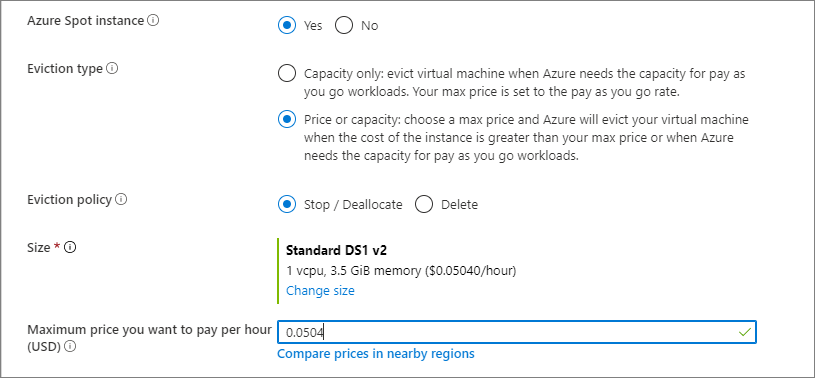

# Preview: Azure Spot VMs for virtual machine scale sets 

Using Azure Spot on scale sets allows you to take advantage of our unused capacity at a significant cost savings. At any point in time when Azure needs the capacity back, the Azure infrastructure will evict Spot instances. Therefore, Spot instances are great for workloads that can handle interruptions like batch processing jobs, dev/test environments, large compute workloads, and more.

The amount of available capacity can vary based on size, region, time of day, and more. When deploying Spot instances on scale sets, Azure will allocate the instance only if there is capacity available, but there is no SLA for these instances. A Spot scale set is deployed in a single fault domain and offers no high availability guarantees.

> [!IMPORTANT]
> Spot instances are currently in public preview.
> This preview version is not recommended for production workloads. Certain features might not be supported or might have constrained capabilities. 
> For more information, see [Supplemental Terms of Use for Microsoft Azure Previews](https://azure.microsoft.com/support/legal/preview-supplemental-terms/).
>
> For the early part of the public preview, Spot instances will have a fixed price, so there will not be any price-based evictions.

## Pricing

Pricing for Spot instances is variable, based on region and SKU. For more information, see pricing for [Linux](https://azure.microsoft.com/pricing/details/virtual-machine-scale-sets/linux/) and [Windows](https://azure.microsoft.com/pricing/details/virtual-machine-scale-sets/windows/). 


With variable pricing, you have option to set a max price, in US dollars (USD), using up to 5 decimal places. For example, the value `0.98765`would be a max price of $0.98765 USD per hour. If you set the max price to be `-1`, the instance won't be evicted based on price. The price for the instance will be the current price for Spot or the price for a standard instance, which ever is less, as long as there is capacity and quota available.

## Eviction policy

When creating Spot scale sets, you can set the eviction policy to *Deallocate* (default) or *Delete*. 

The *Deallocate* policy moves your evicted instances to the stopped-deallocated state allowing you to redeploy evicted instances. However, there is no guarantee that the allocation will succeed. The deallocated VMs will count against your scale set instance quota and you will be charged for your underlying disks. 

If you would like your instances in your Spot scale set to be deleted when they are evicted, you can set the eviction policy to *delete*. With the eviction policy set to delete, you can create new VMs by increasing the scale set instance count property. The evicted VMs are deleted together with their underlying disks, and therefore you will not be charged for the storage. You can also use the auto-scaling feature of scale sets to automatically try and compensate for evicted VMs, however, there is no guarantee that the allocation will succeed. It is recommended you only use the auto-scale feature on Spot scale sets when you set the eviction policy to delete to avoid the cost of your disks and hitting quota limits. 

Users can opt-in to receive in-VM notifications through [Azure Scheduled Events](../virtual-machines/linux/scheduled-events.md). This will notify you if your VMs are being evicted and you will have 30 seconds to finish any jobs and perform shutdown tasks prior to the eviction. 


## Deploying Spot VMs in scale sets

To deploy Spot VMs on scale sets, you can set the new *Priority* flag to *Spot*. All VMs in your scale set will be set to Spot. To create a scale set with Spot VMs, use one of the following methods:
- [Azure portal](#portal)
- [Azure CLI](#azure-cli)
- [Azure PowerShell](#powershell)
- [Azure Resource Manager templates](#resource-manager-templates)

## Portal

The process to create a scale set that uses Spot VMs is the same as detailed in the [getting started article](quick-create-portal.md). When you are deploying a scale set, you can choose to set the Spot flag, and the eviction policy:



## Azure CLI

The process to create a scale set with Spot VMs is the same as detailed in the [getting started article](quick-create-cli.md). Just add the '--Priority Spot', and add `--max-price`. In this example, we use `-1` for `--max-price` so the instance won't be evicted based on price.

```azurecli
az vmss create \
    --resource-group myResourceGroup \
    --name myScaleSet \
    --image UbuntuLTS \
    --upgrade-policy-mode automatic \
    --admin-username azureuser \
    --generate-ssh-keys \
    --priority Spot \
    --max-price -1 
```

## PowerShell

The process to create a scale set with Spot VMs is the same as detailed in the [getting started article](quick-create-powershell.md).
Just add '-Priority Spot', and supply a `-max-price` to the [New-AzVmssConfig](/powershell/module/az.compute/new-azvmssconfig).

```powershell
$vmssConfig = New-AzVmssConfig `
    -Location "East US 2" `
    -SkuCapacity 2 `
    -SkuName "Standard_DS2" `
    -UpgradePolicyMode Automatic `
    -Priority "Spot" `
    --max-price -1
```

## Resource Manager templates

The process to create a scale set that uses Spot VMs is the same as detailed in the getting started article for [Linux](quick-create-template-linux.md) or [Windows](quick-create-template-windows.md). 

For Spot template deployments, use`"apiVersion": "2019-03-01"` or later. Add the `priority`, `evictionPolicy` and `billingProfile` properties to the `"virtualMachineProfile":` section in your template: 

```json
                "priority": "Spot",
                "evictionPolicy": "Deallocate",
                "billingProfile": {
                    "maxPrice": -1
                }
```

To delete the instance after it has been evicted, change the `evictionPolicy` parameter to `Delete`.

## FAQ

**Q:** Once created, is a Spot instance the same as standard instance?

**A:** Yes, except there is no SLA for Spot VMs and they can be evicted at any time.


**Q:** What to do when you get evicted, but still need capacity?

**A:** We recommend you use standard VMs instead of Spot VMs if you need capacity right away.


**Q:** How is quota managed for Spot?

**A:** Spot instances and standard instances will have separate quota pools. Spot quota will be shared between VMs and scale-set instances. For more information, see [Azure subscription and service limits, quotas, and constraints](https://docs.microsoft.com/azure/azure-resource-manager/management/azure-subscription-service-limits).


**Q:** Can I request for additional quota for Spot?

**A:** Yes, you will be able to submit the request to increase your quota for Spot VMs through the [standard quota request process](https://docs.microsoft.com/azure/azure-portal/supportability/per-vm-quota-requests).


**Q:** Can I convert existing scale sets to Spot scale sets?

**A:** No, setting the `Spot` flag is only supported at creation time.


**Q:** If I was using `low` for low-priority scale sets, do I need to start using `Spot` instead?

**A:** For now, both `low` and `Spot` will work, but you should start transitioning to using `Spot`.


**Q:** Can I create a scale set with both regular VMs and Spot VMs?

**A:** No, a scale set cannot support more than one priority type.


**Q:**  Can I use autoscale with Spot scale sets?

**A:** Yes, you can set autoscaling rules on your Spot scale set. If your VMs are evicted, autoscale can try to create new Spot VMs. Remember, you are not guaranteed this capacity though. 


**Q:**  Does autoscale work with both eviction policies (deallocate and delete)?

**A:** It is recommended that you set your eviction policy to delete when using autoscale. This is because deallocated instances are counted against your capacity count on the scale set. When using autoscale, you will likely hit your target instance count quickly due to the deallocated, evicted instances. 


**Q:** What channels support Spot VMs?

**A:** See the table below for Spot VM availability.

<a name="channel"></a>

| Azure Channels               | Azure Spot VMs Availability       |
|------------------------------|-----------------------------------|
| Enterprise Agreement         | Yes                               |
| Pay As You Go                | Yes                               |
| Cloud Service Provider (CSP) | [Contact your partner](https://docs.microsoft.com/partner-center/azure-plan-get-started) |
| Benefits                     | Not available                     |
| Sponsored                    | Not available                     |
| Free Trial                   | Not available                     |


**Q:** Where can I post questions?

**A:** You can post and tag your question with `azure-spot` at [Q&A](https://docs.microsoft.com/answers/topics/azure-spot.html). 

## Next steps
Now that you have created a scale set with Spot VMs, try deploying our [auto scale template using Spot](https://github.com/Azure/vm-scale-sets/tree/master/preview/lowpri).

Check out the [virtual machine scale set pricing page](https://azure.microsoft.com/pricing/details/virtual-machine-scale-sets/linux/) for pricing details.
