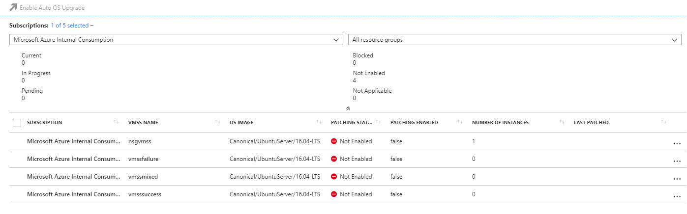

# Azure virtual machine scale set automatic OS upgrades

Automatic OS image upgrade is a preview feature for Azure virtual machine scale sets that automatically upgrades all VMs to the latest OS image.

Automatic OS upgrade has the following characteristics:

- Once configured, the latest OS image published by image publishers is automatically applied to the scale set without user intervention.
- Upgrades batches of instances in a rolling manner each time a new platform image is published by the publisher.
- Integrates with application health probe (optional, but highly recommended for safety).
- Works for all VM sizes.
- Works for Windows and Linux platform images.
- You can opt out of automatic upgrades at any time (OS Upgrades can be initiated manually as well).
- The OS Disk of a VM is replaced with the new OS Disk created with latest image version. Configured extensions and custom data scripts are run, while persisted data disks are retained.


## Preview notes 
While in preview, the following limitations and restrictions apply:

- Automatic OS upgrades only support [four OS SKUs](#supported-os-images). There is no SLA or guarantees. We recommend you do not use automatic upgrades on production critical workloads during preview.
- Azure disk encryption (currently in preview) is **not** currently supported with virtual machine scale set automatic OS upgrade.


## Register to use Automatic OS Upgrade
To use the automated OS upgrade feature, register the preview provider with [Register-AzureRmProviderFeature](/powershell/module/azurerm.resources/register-azurermproviderfeature) as follows:

```powershell
Register-AzureRmProviderFeature -ProviderNamespace Microsoft.Compute -FeatureName AutoOSUpgradePreview
```

It takes approximately 10 minutes for registration state to report as *Registered*. You can check the current registration status with [Get-AzureRmProviderFeature](/powershell/module/AzureRM.Resources/Get-AzureRmProviderFeature). Once registered, ensure that the *Microsoft.Compute* provider is registered with [Register-AzureRmResourceProvider](/powershell/module/AzureRM.Resources/Register-AzureRmResourceProvider) as follows:

```powershell
Register-AzureRmResourceProvider -ProviderNamespace Microsoft.Compute
```

We recommend that your applications use health probes. To register the provider feature for health probes, use [Register-AzureRmProviderFeature](/powershell/module/azurerm.resources/register-azurermproviderfeature) as follows:

```powershell
Register-AzureRmProviderFeature -ProviderNamespace Microsoft.Network -FeatureName AllowVmssHealthProbe
```

Again, it takes approximately 10 minutes for registration state to report as *Registered*. You can check the current registration status with [Get-AzureRmProviderFeature](/powershell/module/AzureRM.Resources/Get-AzureRmProviderFeature). Once registered ensure that the *Microsoft.Network* provider is registered with [Register-AzureRmResourceProvider](/powershell/module/AzureRM.Resources/Register-AzureRmResourceProvider) as follows:

```powershell
Register-AzureRmResourceProvider -ProviderNamespace Microsoft.Network
```

## Portal experience
Once you follow the registration steps above, you can go to [the Azure portal](https://aka.ms/managed-compute) to enable automatic OS upgrades on your scale sets and to see the progress of upgrades:




## Supported OS images
Only certain OS platform images are currently supported. You cannot currently use custom images that you have you created yourself. The *version* property of the platform image must be set to *latest*.

The following SKUs are currently supported (more will be added):
	
| Publisher               | Offer         |  Sku               | Version  |
|-------------------------|---------------|--------------------|----------|
| Canonical               | UbuntuServer  | 16.04-LTS          | latest   |
| MicrosoftWindowsServer  | WindowsServer | 2012-R2-Datacenter | latest   |
| MicrosoftWindowsServer  | WindowsServer | 2016-Datacenter    | latest   |
| MicrosoftWindowsServer  | WindowsServer | 2016-Datacenter-Smalldisk | latest   |


## Application Health
During an OS Upgrade, VM instances in a scale set are upgraded one batch at a time. The upgrade should continue only if the customer application is healthy on the upgraded VM instances. We recommend that the application provides health signals to the scale set OS Upgrade engine. By default, during OS Upgrades the platform considers VM power state and extension provisioning state to determine if a VM instance is healthy after an upgrade. During the OS Upgrade of a VM instance, the OS disk on a VM instance is replaced with a new disk based on latest image version. After the OS Upgrade has completed, the configured extensions are run on these VMs. Only when all the extensions on a VM are successfully provisioned, is the application considered healthy. 

A scale set can optionally be configured with Application Health Probes to provide the platform with accurate information on the ongoing state of the application. Application Health Probes are Custom Load Balancer Probes that are used as a health signal. The application running on a scale set VM instance can respond to external HTTP or TCP requests indicating whether it is healthy. For more information on how Custom Load Balancer Probes work, see to [Understand load balancer probes](../load-balancer/load-balancer-custom-probe-overview.md). An Application Health Probe is not required for automatic OS upgrades, but it is highly recommended.

If the scale set is configured to use multiple placement groups, probes using a [Standard Load Balancer](https://docs.microsoft.com/azure/load-balancer/load-balancer-standard-overview) need to be used.

### Important: Keep credentials up to date
If your scale set uses any credentials to access external resources, for example if a VM extension is configured which uses a SAS token for storage account, you will need to make sure the credentials are kept up to date. If any credentials, including certificates and tokens have expired, the upgrade will fail, and the first batch of VMs will be left in a failed state.

The recommended steps to recover VMs and re-enable automatic OS upgrade if there is a resource authentication failure are:

* Regenerate the token (or any other credentials) passed into your extension(s).
* Ensure that any credential used from inside the VM to talk to external entities is up to date.
* Update extension(s) in the scale set model with any new tokens.
* Deploy the updated scale set, which will update all VM instances including the failed ones. 

### Configuring a Custom Load Balancer Probe as Application Health Probe on a scale set
As a best practice, create a load balancer probe explicitly for scale set health. The same endpoint for an existing HTTP probe or TCP probe may be used, but a health probe may require different behavior from a traditional load-balancer probe. For example, a traditional load balancer probe may return unhealthy if the load on the instance is too high, whereas that may not be appropriate for determining the instance health during an automatic OS upgrade. Configure the probe to have a high probing rate of less than two minutes.

The load-balancer probe can be referenced in the *networkProfile* of the scale set and can be associated with either an internal or public facing load-balancer as follows:

```json
"networkProfile": {
  "healthProbe" : {
    "id": "[concat(variables('lbId'), '/probes/', variables('sshProbeName'))]"
  },
  "networkInterfaceConfigurations":
  ...
```


## Enforce an OS image upgrade policy across your subscription
For safe upgrades, it is highly recommended to enforce an upgrade policy. This policy can require application health probes across your subscription. The following Azure Resource Manager policy rejects deployments that do not have automated OS image upgrade settings configured:

1. Obtain the built-in Azure Resource Manager policy definition with [Get-AzureRmPolicyDefinition](/powershell/module/AzureRM.Resources/Get-AzureRmPolicyDefinition) as follows:

    ```powershell
    $policyDefinition = Get-AzureRmPolicyDefinition -Id "/providers/Microsoft.Authorization/policyDefinitions/465f0161-0087-490a-9ad9-ad6217f4f43a"
    ```

2. Assign policy to a subscription with [New-AzureRmPolicyAssignment](/powershell/module/AzureRM.Resources/New-AzureRmPolicyAssignment) as follows:

    ```powershell
    New-AzureRmPolicyAssignment `
        -Name "Enforce automatic OS upgrades with app health checks" `
        -Scope "/subscriptions/<SubscriptionId>" `
        -PolicyDefinition $policyDefinition
    ```


## Configure auto-updates
To configure automatic upgrades, ensure that the *automaticOSUpgrade* property is set to *true* in the scale set model definition. You can configure this property with Azure PowerShell or the Azure CLI 2.0.

The following example uses Azure PowerShell (4.4.1 or later) to configure automatic upgrades for the scale set named *myVMSS* in the resource group named *myResourceGroup*:

```powershell
$rgname = myResourceGroup
$vmssname = myVMSS
$vmss = Get-AzureRmVMss -ResourceGroupName $rgname -VmScaleSetName $vmssname
$vmss.UpgradePolicy.AutomaticOSUpgrade = $true
Update-AzureRmVmss -ResourceGroupName $rgname -VMScaleSetName $vmssname -VirtualMachineScaleSet $vmss
```


The following example uses the Azure CLI (2.0.20 or later) to configure automatic upgrades for the scale set named *myVMSS* in the resource group named *myResourceGroup*:

```azurecli
rgname="myResourceGroup"
vmssname="myVMSS"
az vmss update --name $vmssname --resource-group $rgname --set upgradePolicy.AutomaticOSUpgrade=true
```


## Check the status of an automatic OS upgrade
You can check the status of the most recent OS upgrade performed on your scale set with Azure PowerShell, Azure CLI 2.0, or the REST APIs.

### Azure PowerShell
To following example uses Azure PowerShell (4.4.1 or later) to check the status for the scale set named *myVMSS* in the resource group named *myResourceGroup*:

```powershell
Get-AzureRmVmssRollingUpgrade -ResourceGroupName myResourceGroup -VMScaleSetName myVMSS
```

### Azure CLI 2.0
The following example uses the Azure CLI (2.0.20 or later) to check the status for the scale set named *myVMSS* in the resource group named *myResourceGroup*:

```azurecli
az vmss rolling-upgrade get-latest --resource-group myResourceGroup --name myVMSS
```

### REST API
The following example uses the REST API to check the status for the scale set named *myVMSS* in the resource group named *myResourceGroup*:

```
GET on `/subscriptions/subscription_id/resourceGroups/myResourceGroup/providers/Microsoft.Compute/virtualMachineScaleSets/myScaleSet/rollingUpgrades/latest?api-version=2017-03-30`
```

The GET call returns properties similar to the following example output:

```json
{
  "properties": {
    "policy": {
      "maxBatchInstancePercent": 20,
      "maxUnhealthyInstancePercent": 5,
      "maxUnhealthyUpgradedInstancePercent": 5,
      "pauseTimeBetweenBatches": "PT0S"
    },
    "runningStatus": {
      "code": "Completed",
      "startTime": "2017-06-16T03:40:14.0924763+00:00",
      "lastAction": "Start",
      "lastActionTime": "2017-06-22T08:45:43.1838042+00:00"
    },
    "progress": {
      "successfulInstanceCount": 3,
      "failedInstanceCount": 0,
      "inprogressInstanceCount": 0,
      "pendingInstanceCount": 0
    }
  },
  "type": "Microsoft.Compute/virtualMachineScaleSets/rollingUpgrades",
  "location": "southcentralus"
}
```


## Automatic OS Upgrade Execution
To expand on the use of application health probes, scale set OS upgrades execute following steps:

1. If more than 20% of instances are Unhealthy, stop the upgrade; otherwise proceed.
2. Identify the next batch of VM instances to upgrade, with a batch having maximum 20% of total instance count.
3. Upgrade the OS of the next batch of VM instances.
4. If more than 20% of upgraded instances are Unhealthy, stop the upgrade; otherwise proceed.
5. If the customer has configured Application Health Probes, the upgrade waits up to 5 minutes for probes to become healthy, then immediately continues onto the next batch; otherwise, it waits 30 minutes before moving on to the next batch.
6. If there are remaining instances to upgrade, goto step 1) for the next batch; otherwise the upgrade is complete.

The scale set OS Upgrade Engine checks for the overall VM instance health before upgrading every batch. While upgrading a batch, there may be other concurrent Planned or Unplanned maintenance happening in Azure Datacenters that may impact availability of your VMs. Hence, it is possible that temporarily more than 20% instances may be down. In such cases, at the end of current batch, the scale set upgrade stops.


## Deploy with a template

You can use the following template to deploy a scale set that uses automatic upgrades <a href='https://github.com/Azure/vm-scale-sets/blob/master/preview/upgrade/autoupdate.json'>Automatic rolling upgrades - Ubuntu 16.04-LTS</a>

<a href="https://portal.azure.com/#create/Microsoft.Template/uri/https%3A%2F%2Fraw.githubusercontent.com%2FAzure%2Fvm-scale-sets%2Fmaster%2Fpreview%2Fupgrade%2Fautoupdate.json" target="_blank">
    
</a>


## Next steps
For more examples on how to use automatic OS upgrades with scale sets, see the [GitHub repo for preview features](https://github.com/Azure/vm-scale-sets/tree/master/preview/upgrade).
