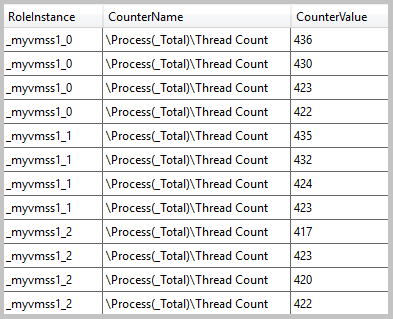
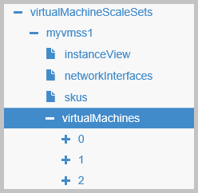
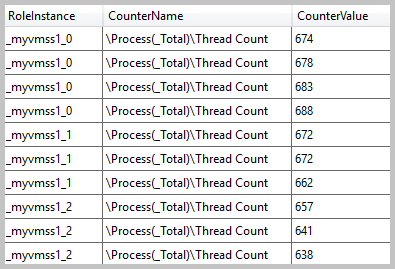
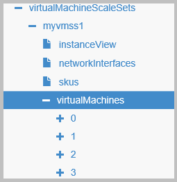

<properties
	pageTitle="Automatic scaling and virtual machine scale sets | Microsoft Azure"
	description="Learn about using diagnostics and autoscale resources to automatically scale virtual machines in a scale set."
    services="virtual-machine-scale-sets"
	documentationCenter=""
	authors="davidmu1"
	manager="timlt"
	editor=""
	tags="azure-resource-manager"/>

<tags
	ms.service="virtual-machine-scale-sets"
	ms.workload="infrastructure-services"
	ms.tgt_pltfrm="na"
	ms.devlang="na"
	ms.topic="article"
	ms.date="06/10/2016"
	ms.author="davidmu"/>

# Automatic scaling and virtual machine scale sets

Automatic scaling of virtual machines in a scale set is the creation or deletion of machines in the set as needed by an application to match performance requirements and satisfy service level agreements (SLAs). As the volume of work grows, an application may require additional resources to enable it to effectively perform tasks.

Automatic scaling is an automated process that helps ease management overhead. By reducing overhead, continual monitoring of system performance as well as making decisions about adding or removing resources are not needed. Scaling is an elastic process; more resources can be provisioned as the load increases on the system, but as demand decreases resources can be deallocated to minimize costs while still maintaining adequate performance and meeting SLAs.

Set up automatic scaling on a scale set by using an Azure Resource Manager template, by using Azure PowerShell, or by using Azure CLI.

## Set up scaling by using Resource Manager templates

Rather than deploying and managing each resource of your application separately, use a template that deploys and provisions all of the resources in a single, coordinated operation. In the template, application resources are defined and deployment parameters are specified for different environments. The template consists of JSON and expressions which you can use to construct values for your deployment. To learn more, take a look at [Authoring Azure Resource Manager templates](../resource-group-authoring-templates.md).

In the template, you specify the capacity element:

    "sku": {
      "name": "Standard_A0",
      "tier": "Standard",
      "capacity": 3
    },

Capacity identifies the number of virtual machines in the set. You can manually change the capacity by deploying a template with a different value. If you are deploying a template to just change the capacity, you can include only the SKU element with the updated capacity.

Automatically change the capacity of your scale set by using a combination of the autoscaleSettings resource provided by Azure Resource Manager and the Azure Diagnostics extension installed on the machines in the scale set.

### Configure the Azure Diagnostics extension

Automatic scaling can only be done if metrics collection is successful on each virtual machine in the scale set. The Azure Diagnostics Extension provides the monitoring and diagnostics capabilities that meets the metrics collection needs of the autoscale resource. You can install the extension as part of the Resource Manager template.

This example shows the variables that are used in the template to configure the diagnostics extension:

	"diagnosticsStorageAccountName": "[concat(parameters('resourcePrefix'), 'saa')]",
	"accountid": "[concat('/subscriptions/',subscription().subscriptionId,'/resourceGroups/', resourceGroup().name,'/providers/', 'Microsoft.Storage/storageAccounts/', variables('diagnosticsStorageAccountName'))]",
	"wadlogs": "<WadCfg> <DiagnosticMonitorConfiguration overallQuotaInMB=\"4096\" xmlns=\"http://schemas.microsoft.com/ServiceHosting/2010/10/DiagnosticsConfiguration\"> <DiagnosticInfrastructureLogs scheduledTransferLogLevelFilter=\"Error\"/> <WindowsEventLog scheduledTransferPeriod=\"PT1M\" > <DataSource name=\"Application!*[System[(Level = 1 or Level = 2)]]\" /> <DataSource name=\"Security!*[System[(Level = 1 or Level = 2)]]\" /> <DataSource name=\"System!*[System[(Level = 1 or Level = 2)]]\" /></WindowsEventLog>",
	"wadperfcounter": "<PerformanceCounters scheduledTransferPeriod=\"PT1M\"><PerformanceCounterConfiguration counterSpecifier=\"\\Processor(_Total)\\Thread Count\" sampleRate=\"PT15S\" unit=\"Percent\"><annotation displayName=\"Thread Count\" locale=\"en-us\"/></PerformanceCounterConfiguration></PerformanceCounters>",
	"wadcfgxstart": "[concat(variables('wadlogs'),variables('wadperfcounter'),'<Metrics resourceId=\"')]",
	"wadmetricsresourceid": "[concat('/subscriptions/',subscription().subscriptionId,'/resourceGroups/',resourceGroup().name ,'/providers/','Microsoft.Compute/virtualMachineScaleSets/',parameters('vmssName'))]",
	"wadcfgxend": "[concat('\"><MetricAggregation scheduledTransferPeriod=\"PT1H\"/><MetricAggregation scheduledTransferPeriod=\"PT1M\"/></Metrics></DiagnosticMonitorConfiguration></WadCfg>')]"

Parameters are provided when the template is deployed for values such as the name of the storage account where data is stored and the name of the scale set from which data is collected. Also in this Windows Server example, only the Thread Count performance counter is collected, but all of the available performance counters  in Windows or Linux can be used to collect diagnostics information and can be included in the extension configuration.

This example shows the definition of the extension in the template:

    "extensionProfile": {
      "extensions": [
        {
          "name": "Microsoft.Insights.VMDiagnosticsSettings",
          "properties": {
            "publisher": "Microsoft.Azure.Diagnostics",
            "type": "IaaSDiagnostics",
            "typeHandlerVersion": "1.5",
            "autoUpgradeMinorVersion": true,
            "settings": {
              "xmlCfg": "[base64(concat(variables('wadcfgxstart'),variables('wadmetricsresourceid'),variables('wadcfgxend')))]",
              "storageAccount": "[variables('diagnosticsStorageAccountName')]"
            },
            "protectedSettings": {
              "storageAccountName": "[variables('diagnosticsStorageAccountName')]",
              "storageAccountKey": "[listkeys(variables('accountid'), variables('apiVersion')).key1]",
              "storageAccountEndPoint": "https://core.windows.net"
            }
          }
        }
      ]
    }

When the diagnostics extension runs, the data is collected in a table that is located in the storage account that you specify. In the WADPerformanceCounters table, you can find the collected data. For example, this is the thread count collected when the virtual machines were first created in a scale set:

### Configure the autoScaleSettings resource

The autoscaleSettings resource uses the information that the diagnostics extension collected to make decisions about how to increase or decrease the number of virtual machines in the scale set.

This example shows the configuration of the resource in the template:

    {
      "type": "Microsoft.Insights/autoscaleSettings",
      "apiVersion": "2015-04-01",
      "name": "[concat(parameters('resourcePrefix'),'as1')]",
      "location": "[resourceGroup().location]",
      "dependsOn": [
        "[concat('Microsoft.Compute/virtualMachineScaleSets/',parameters('vmSSName'))]"
      ],
      "properties": {
        "enabled": true,
        "name": "[concat(parameters('resourcePrefix'),'as1')]",
        "profiles": [
          {
            "name": "Profile1",
            "capacity": {
              "minimum": "1",
              "maximum": "10",
              "default": "1"
            },
            "rules": [
              {
                "metricTrigger": {
                  "metricName": "\\Process(_Total)\\Thread Count",
                  "metricNamespace": "",
                  "metricResourceUri": "[concat('/subscriptions/',subscription().subscriptionId, '/resourceGroups/', resourceGroup().name, '/providers/Microsoft.Compute/virtualMachineScaleSets/', parameters('vmSSName'))]",
                  "timeGrain": "PT1M",
                  "statistic": "Average",
                  "timeWindow": "PT5M",
                  "timeAggregation": "Average",
                  "operator": "GreaterThan",
                  "threshold": 650
                },
                "scaleAction": {
                  "direction": "Increase",
                  "type": "ChangeCount",
                  "value": "1",
                  "cooldown": "PT5M"
                }
              },
              {
                "metricTrigger": {
                  "metricName": "\\Process(_Total)\\Thread Count",
                  "metricNamespace": "",
                  "metricResourceUri": "[concat('/subscriptions/',subscription().subscriptionId, '/resourceGroups/', resourceGroup().name, '/providers/Microsoft.Compute/virtualMachineScaleSets/', parameters('vmSSName'))]",
                  "timeGrain": "PT1M",
                  "statistic": "Average",
                  "timeWindow": "PT5M",
                  "timeAggregation": "Average",
                  "operator": "LessThan",
                  "threshold": 550
                },
                "scaleAction": {
                  "direction": "Decrease",
                  "type": "ChangeCount",
                  "value": "1",
                  "cooldown": "PT5M"
                }
              }
            ]
          }
        ],
        "targetResourceUri": "[concat('/subscriptions/', subscription().subscriptionId, '/resourceGroups/', resourceGroup().name, '/providers/Microsoft.Compute/virtualMachineScaleSets/', parameters('vmSSName'))]"
      }
    }

In the example above, two rules are created for defining the automatic scaling actions. The first rule defines the scale out action and the second rule defines the scale in action. These values are provided in the rules:

- **metricName** - This is the same as the performance counter that you defined in the wadperfcounter variable for the diagnostics extension. In the example above, the Thread Count counter is used.  
- **metricResourceUri** - This is the resource identifier of the virtual machine scale set. This identifier contains the name of the resource group, the name of the resource provider, and the name of the scale set to scale.
- **timeGrain** – This is the granularity of the metrics that are collected. In the example above, data is collected on an interval of one minute. This value is used in combination with timeWindow.
- **statistic** – This determines how the metrics are combined to accommodate the automatic scaling action. The possible values are: Average, Min, Max.
- **timeWindow** – This is the range of time in which instance data is collected. It must be between 5 minutes and 12 hours.
- **timeAggregation** –This determines how the data that is collected should be combined over time. The default value is Average. The possible values are: Average, Minimum, Maximum, Last, Total, Count.
- **operator** – This is the operator that is used to compare the metric data and the threshold. The possible values are: Equals, NotEquals, GreaterThan, GreaterThanOrEqual, LessThan, LessThanOrEqual.
- **threshold** – This is the value that triggers the scale action. You must make sure to provide a sufficient difference between the threshold that you set for the scale out action and the threshold that you set for the scale in action. If you set the values to be the same, for example setting both to 600 threads in the example above, the system anticipates constant increasing and decreasing the size of the set and will not implement a scaling action.
- **direction** – This determines the action that is taken when the threshold value is achieved. The possible values are Increase or Decrease.
- **type** – This is the type of action that should occur, this must be set to ChangeCount.
- **value** – This is the number of virtual machines that are added to or removed from the scale set. This value must be 1 or greater.
- **cooldown** – This is the amount of time to wait since the last scaling action before the next action occurs. This must be between one minute and one week.

Depending on the performance counter you are using, some of the elements in the template configuration are used differently. In the example shown, the performance counter used is Thread Count and the threshold value is set to 650 for a scale out action and 550 for the scale in action. If you use a counter such as %Processor Time, the threshold value would be set to the percentage of CPU usage that would determine a scaling action.

When a load is created on the virtual machines in the set that triggers a scaling action, the number of machines in the set is increased based on the value element in the template. For example, in a scale set where the capacity is set to 3 and the scale action value is set to 1:

When the load is created that causes the average thread count to go above the threshold of 650:

A scale out action is triggered that causes the capacity of the set to be increased by one:

    "sku": {
      "name": "Standard_A0",
      "tier": "Standard",
      "capacity": 4
    },

And a virtual machine is added to the scale set:

After a cooldown period of five minutes, if the average number of threads on the machines stays over 600, another machine is added to the set. If the average thread count stays below 550, the capacity of the scale set is reduced by one and a machine is removed from the set.

## Set up scaling using Azure PowerShell

Azure PowerShell can be used to set up automatic scaling for a scale set. Here is an example using PowerShell to create the rules that were described earlier in this article:

    $rule1 = New-AutoscaleRule -MetricName "\Processor(_Total)\Thread Count" -MetricResourceId "/subscriptions/{subscription-id}/resourceGroups/myrg1/providers/Microsoft.Compute/virtualMachineScaleSets/myvmss1" -Operator GreaterThan -MetricStatistic Average -Threshold 650 -TimeGrain 00:01:00 -ScaleActionCooldown 00:05:00 -ScaleActionDirection Increase -ScaleActionScaleType ChangeCount -ScaleActionValue "1"  
 
    $rule2 = New-AutoscaleRule -MetricName "\Processor(_Total)\% Processor Time" -MetricResourceId "/subscriptions/df602c9c-7aa0-407d-a6fb-eb20c8bd1192/resourceGroups/rainvmss/providers/Microsoft.Compute/virtualMachineScaleSets/rainvmss1" -Operator LessThan -MetricStatistic Average -Threshold 10 -TimeGrain 00:01:00 -ScaleActionCooldown 00:10:00 -ScaleActionDirection Decrease -ScaleActionScaleType ChangeCount -ScaleActionValue "2" 
 
    $profile1 = New-AutoscaleProfile -DefaultCapacity "2" -MaximumCapacity "10" -MinimumCapacity "2" -Rules $rule1, $rule2 -Name "ScalePuppy" 
 
    Add-AutoscaleSetting -Location "East US" -Name 'MyScaleVMSSSetting' -ResourceGroup rainvmss -TargetResourceId "/subscriptions/df602c9c-7aa0-407d-a6fb-eb20c8bd1192/resourceGroups/rainvmss/providers/Microsoft.Compute/virtualMachineScaleSets/rainvmss1" -AutoscaleProfiles $profile1 

## Set up scaling using Azure CLI

(Information not available yet)

## Investigate scaling actions

- [Azure portal]() - You can currently get a limited amount of information using the portal.
- [Azure Resource Explorer]() - This is the best tool to explore the current state of your scale set. Follow this path and you should see the instance view of the scale set that you created:
subscriptions > {your subscription} > resourceGroups > {your resource group} > providers > Microsoft.Compute > virtualMachineScaleSets > {your scale set} > virtualMachines
- Azure PowerShell - Use this command to get some information:

        Get-AzureRmResource -name vmsstest1 -ResourceGroupName vmsstestrg1 -ResourceType Microsoft.Compute/virtualMachineScaleSets -ApiVersion 2015-06-15
        Get-Autoscalesetting -ResourceGroup rainvmss -DetailedOutput
        
- Connect to the jumpbox virtual machine just like you would any other machine and then you can remotely access the virtual machines in the scale set to monitor individual processes.

## Next Steps

- Take a look at [Automatically scale machines in a Virtual Machine Scale Set](virtual-machine-scale-sets-windows-autoscale.md) to see an example of how to create a scale set with automatic scaling configured.
- Find examples of Azure Insights monitoring features in [Azure Insights PowerShell quick start samples](../azure-portal/insights-powershell-samples.md)
- Learn about notification features in [Use autoscale actions to send email and webhook alert notifications in Azure Insights](../azure-portal/insights-autoscale-to-webhook-email.md) and [Use audit logs to send email and webhook alert notifications in Azure Insights](../azure-portal/insights-auditlog-to-webhook-email.md)
