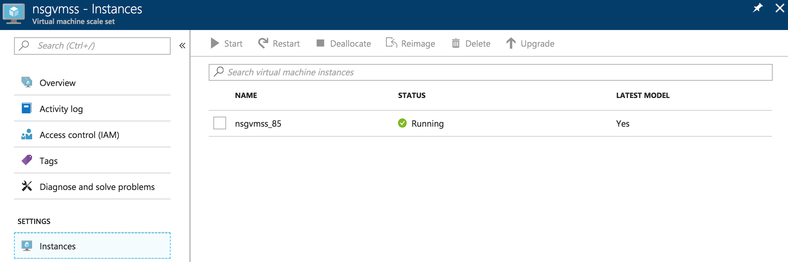

# Understand instance IDs for Azure VM scale set VMs
This article describes instance IDs for scale sets and the various ways they surface.

## Scale set instance IDs

Each VM in a scale set gets an instance ID that uniquely identifies it. This instance ID is used in the scale set APIs to do operations on a specific VM in the scale set. For instance, you can specify a specific instance ID to reimage when using the reimage API:

REST API: `POST https://management.azure.com/subscriptions/{subscriptionId}/resourceGroups/{resourceGroupName}/providers/Microsoft.Compute/virtualMachineScaleSets/{vmScaleSetName}/virtualmachines/{instanceId}/reimage?api-version={apiVersion}` (for more information, see the [REST API documentation](https://docs.microsoft.com/rest/api/compute/virtualmachinescalesetvms/reimage))

Powershell: `Set-AzVmssVM -ResourceGroupName {resourceGroupName} -VMScaleSetName {vmScaleSetName} -InstanceId {instanceId} -Reimage` (for more information, see the [Powershell documentation](https://docs.microsoft.com/powershell/module/az.compute/set-azvmssvm))

CLI: `az vmss reimage -g {resourceGroupName} -n {vmScaleSetName} --instance-id {instanceId}` (for more information, see the [CLI documentation](https://docs.microsoft.com/cli/azure/vmss?view=azure-cli-latest)).

You can get the list of instance IDs by listing all instances in a scale set:

REST API: `GET https://management.azure.com/subscriptions/{subscriptionId}/resourceGroups/{resourceGroupName}/providers/Microsoft.Compute/virtualMachineScaleSets/{vmScaleSetName}/virtualMachines?api-version={apiVersion}` (for more information, see the [REST API documentation](https://docs.microsoft.com/rest/api/compute/virtualmachinescalesetvms/list))

Powershell: `Get-AzVmssVM -ResourceGroupName {resourceGroupName} -VMScaleSetName {vmScaleSetName}` (for more information, see the [Powershell documentation](https://docs.microsoft.com/powershell/module/az.compute/get-azvmssvm))

CLI: `az vmss list-instances -g {resourceGroupName} -n {vmScaleSetName}` (for more information, see the [CLI documentation](https://docs.microsoft.com/cli/azure/vmss?view=azure-cli-latest)).

You can also use [resources.azure.com](https://resources.azure.com) or the [Azure SDKs](https://azure.microsoft.com/downloads/) to list the VMs in a scale set.

The exact presentation of the output depends on the options you provide to the command, but here is some sample output from the CLI:

```azurecli
az vmss show -g {resourceGroupName} -n {vmScaleSetName}
```

```output
[
  {
    "instanceId": "85",
    "latestModelApplied": true,
    "location": "westus",
    "name": "nsgvmss_85",
    .
    .
    .
```

As you can see, the "instanceId" property is just a decimal number. The instance IDs may be reused for new instances once old instances are deleted.

>[!NOTE]
> There is **no guarantee** on the way instance IDs are assigned to the VMs in the scale set. They might seem sequentially increasing at times, but this is not always the case. Do not take a dependency on the specific way in which instance IDs are assigned to the VMs.

## Scale set VM names

In the sample output above, there is also a "name" for the VM. This name takes the form "{scale-set-name}_{instance-id}". This name is the one that you see in the Azure portal when you list instances in a scale set:



The {instance-id} part of the name is the same decimal number as the "instanceId" property discussed previously.

## Instance Metadata VM name

If you query the [instance metadata](../virtual-machines/windows/instance-metadata-service.md) from within a scale set VM, you see a "name" in the output:

```output
{
  "compute": {
    "location": "westus",
    "name": "nsgvmss_85",
    .
    .
    .
```

This name is the same as the name discussed previously.

## Scale set VM computer name

Each VM in a scale set also gets a computer name assigned to it. This computer name is the hostname of the VM in the [Azure-provided DNS name resolution within the virtual network](../virtual-network/virtual-networks-name-resolution-for-vms-and-role-instances.md). This computer name is of the form "{computer-name-prefix}{base-36-instance-id}".

The {base-36-instance-id} is in [base 36](https://en.wikipedia.org/wiki/Base36) and is always six digits in length. If the base 36 representation of the number takes fewer than six digits, the {base-36-instance-id} is padded with zeros to make it six digits in length. For example, an instance with {computer-name-prefix} "nsgvmss" and instance ID 85 will have computer name "nsgvmss00002D".

>[!NOTE]
> The computer name prefix is a property of the scale set model that you can set, so it can be different from the scale set name itself.
