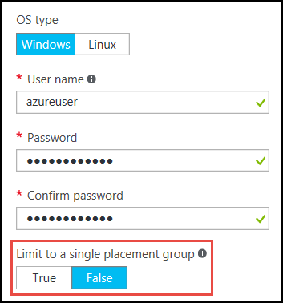

# Virtual Machine Scale Sets and placement groups

> [!NOTE]
> This document covers Virtual Machine Scale Sets running in Uniform Orchestration mode. We recommend using Flexible Orchestration for new workloads. For more information, see [Orchesration modes for Virtual Machine Scale Sets in Azure](virtual-machine-scale-sets-orchestration-modes.md).

You can now create Azure [Virtual Machine Scale Sets](./index.yml) with a capacity of up to 1,000 VMs. In this document, a _large Virtual Machine Scale Set_ is defined as a scale set capable of scaling to greater than 100 VMs. This capability is set by a scale set property (_singlePlacementGroup=False_). 

Certain aspects of large scale sets, such as load balancing and fault domains behave differently to a standard scale set. This document explains the characteristics of large scale sets, and describes what you need to know to successfully use them in your applications. 

A common approach for deploying cloud infrastructure at large scale is to create a set of _scale units_, for example by creating multiple VMs scale sets across multiple VNETs and storage accounts. This approach provides easier management compared to single VMs, and multiple scale units are useful for many applications, particularly those that require other stackable components like multiple virtual networks and endpoints. If your application requires a single large cluster however, it can be more straightforward to deploy a single scale set of up to 1,000 VMs. Example scenarios include centralized big data deployments, or compute grids requiring simple management of a large pool of worker nodes. Combined with Virtual Machine Scale Set [attached data disks](virtual-machine-scale-sets-attached-disks.md), large scale sets enable you to deploy a scalable infrastructure consisting of thousands of vCPUs and petabytes of storage, as a single operation.

## Placement groups 
What makes a _large_ scale set special is not the number of VMs, but the number of _placement groups_ it contains. A placement group is a construct similar to an Azure availability set, with its own fault domains and upgrade domains. By default, a scale set consists of a single placement group with a maximum size of 100 VMs. If a scale set property called _singlePlacementGroup_ is set to _false_, the scale set can be composed of multiple placement groups and has a range of 0-1,000 VMs. When set to the default value of _true_, a scale set is composed of a single placement group, and has a range of 0-100 VMs.

## Checklist for using large scale sets
To decide whether your application can make effective use of large scale sets, consider the following requirements:

- If you are planning to deploy large number of VMs, your Compute vCPU quota limits may need to be increased. 
- Scale sets created from Azure Marketplace images or Azure Compute Gallery images can scale up to 1,000 VMs.
- Scale sets created from custom images (VM images you create and upload yourself) can currently scale up to 600 VMs.
- Large scale sets require Azure Managed Disks. Scale sets that are not created with Managed Disks require multiple storage accounts (one for every 20 VMs). Large scale sets are designed to work exclusively with Managed Disks to reduce your storage management overhead, and to avoid the risk of running into subscription limits for storage accounts. 
- Large scale (SPG=false) does not support InfiniBand networking
- Layer-4 load balancing with scale sets composed of multiple placement groups requires [Azure Load Balancer Standard SKU](../load-balancer/load-balancer-overview.md). The Load Balancer Standard SKU provides additional benefits, such as the ability to load balance between multiple scale sets. Standard SKU also requires that the scale set has a Network Security Group associated with it, otherwise NAT pools don't work correctly. If you need to use the Azure Load Balancer Basic SKU, make sure the scale set is configured to use a single placement group, which is the default setting.
- Layer-7 load balancing with the Azure Application Gateway is supported for all scale sets.
- A scale set is defined with a single subnet - make sure your subnet has an address space large enough for all the VMs you need. By default a scale set overprovisions (creates extra VMs at deployment time or when scaling out, which you are not charged for) to improve deployment reliability and performance. Allow for an address space 20% greater than the number of VMs you plan to scale to.
- Fault domains and upgrade domains are only consistent within a placement group. This architecture does not change the overall availability of a scale set, as VMs are evenly distributed across distinct physical hardware, but it does mean that if you need to guarantee two VMs are on different hardware, make sure they are in different fault domains in the same placement group. Please refer to this link [Availability options](../virtual-machines/availability.md). 
- Fault domain and placement group ID are shown in the _instance view_ of a scale set VM. You can view the instance view of a scale set VM in the [Azure Resource Explorer](https://resources.azure.com/).

## Creating a large scale set
When you create a scale set in the Azure portal, just specify the *Instance count* value of up to 1,000. If it is more than 100 instances, *Enable scaling beyond 100 instances* will be set to *Yes*, which will allow it to scale to multiple placement groups. 



You can create a large Virtual Machine Scale Set using the [Azure CLI](https://github.com/Azure/azure-cli) _az vmss create_ command. This command sets intelligent defaults such as subnet size based on the _instance-count_ argument:

```azurecli
az group create -l southcentralus -n biginfra
az vmss create -g biginfra -n bigvmss --image Ubuntu2204 --instance-count 1000
```

The _vmss create_ command defaults certain configuration values if you do not specify them. To see the available options that you can override, try:

```azurecli
az vmss create --help
```

If you are creating a large scale set by composing an Azure Resource Manager template, make sure the template creates a scale set based on Azure Managed Disks. You can set the _singlePlacementGroup_ property to _false_ in the _properties_ section of the _Microsoft.Compute/virtualMachineScaleSets_ resource. The following JSON fragment shows the beginning of a scale set template, including the 1,000 VM capacity and the _"singlePlacementGroup" : false_ setting:

```json
{
  "type": "Microsoft.Compute/virtualMachineScaleSets",
  "location": "australiaeast",
  "name": "bigvmss",
  "sku": {
    "name": "Standard_DS1_v2",
    "tier": "Standard",
    "capacity": 1000
  },
  "properties": {
    "singlePlacementGroup": false,
    "upgradePolicy": {
      "mode": "Automatic"
    }
```

For a complete example of a large scale set template, refer to [https://github.com/gbowerman/azure-myriad/blob/main/bigtest/bigbottle.json](https://github.com/gbowerman/azure-myriad/blob/main/bigtest/bigbottle.json).

## Converting an existing scale set to span multiple placement groups
To make an existing Virtual Machine Scale Set capable of scaling to more than 100 VMs, you need to change the _singlePlacementGroup_ property to _false_ in the scale set model. You can test changing this property with the [Azure Resource Explorer](https://resources.azure.com/). Find an existing scale set, select _Edit_ and change the _singlePlacementGroup_ property. If you do not see this property, you may be viewing the scale set with an older version of the Microsoft.Compute API.

> [!NOTE]
> You can change a scale set from supporting a single placement group only (the default behavior) to a supporting multiple placement groups, but you cannot convert the other way around. Therefore make sure you understand the properties of large scale sets before converting.
