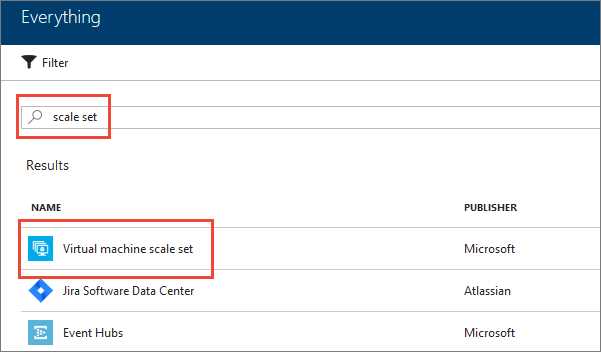
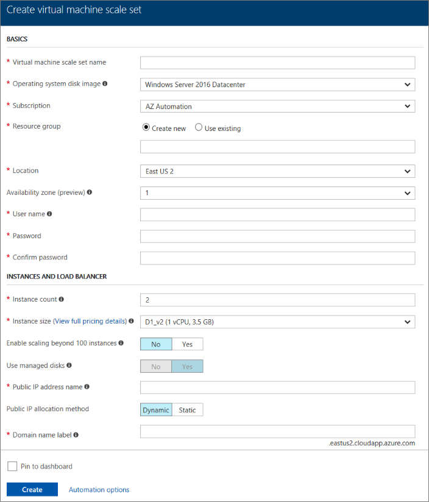
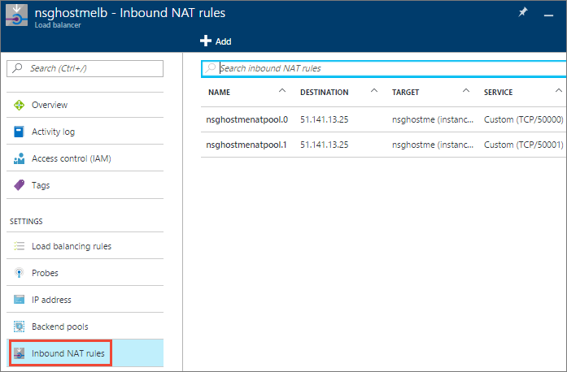

# How to create a Virtual Machine Scale Set with the Azure portal
This tutorial shows you how easy it is to create a Virtual Machine Scale Set in just a few minutes, by using the Azure portal. If you don't have an Azure subscription, create a [free account](https://azure.microsoft.com/free/) before you begin.

## Choose the VM image from the marketplace
From the portal, you can easily deploy a scale set with CentOS, CoreOS, Debian, Ubuntu Server, other Linux images, and Windows Server images.

First, navigate to the [Azure portal](https://portal.azure.com) in a web browser. Click **New**, search for **scale set**, and then select the **Virtual machine scale set** entry:

## Create the scale set
Now you can use the default settings and quickly create the scale set.

* Enter a name for the scale set.  
This name becomes the base of the FQDN of the load balancer in front of the scale set, so make sure the name is unique across all Azure.

* Select your desired OS type.

* Enter your desired username, and select which authentication type you prefer.  
If you choose a password, it must be at least 12 characters long and meet three out of the four following complexity requirements: one lower case character, one upper case character, one number, and one special character. See more about [username and password requirements](../virtual-machines/windows/faq.md#what-are-the-username-requirements-when-creating-a-vm). If you choose **SSH public key**, be sure to only paste in your public key, *NOT* your private key:

* Select **Yes** or **No** to **Enable scaling beyond 100 instances**.  
If Yes, the scale set can span across multiple placement groups. For more information, see [this documentation](./virtual-machine-scale-sets-placement-groups.md).

* Make sure to select an appropriate **instance size**.  
For more information about virtual machine sizes, see either [Windows VM sizes](..\virtual-machines\windows\sizes.md) or [Linux VM sizes](..\virtual-machines\linux\sizes.md).

* Enter your desired resource group name and location.  
If your region and **instance size** supports availability zones, the **Availability zones** field is enabled. For more information on availability zones, see this [overview](../availability-zones/az-overview.md) article.

* Enter your desired domain name label (the base of the FQDN for the load balancer in front of the scale set).  
This label must be unique across all Azure.

* Choose your desired operating system disk image, instance count, and machine size.

* Choose your desired disk type: managed or unmanaged.  
For more information, see [this documentation](./virtual-machine-scale-sets-managed-disks.md). If you chose to have the scale set span multiple placement groups, this option will not be available because managed disk is required for scale sets to span placement groups.

* Enable or disable autoscale and configure if enabled.

## Connect to a VM in the scale set
If you chose to limit your scale set to a single placement group, then the scale set is deployed with NAT rules configured to let you connect to the scale set easily (if not, to connect to the virtual machines in the scale set, you likely need to create a jumpbox in the same virtual network as the scale set). To see them, navigate to the `Inbound NAT Rules` tab of the load balancer for the scale set:

You can connect to each VM in the scale set using these NAT rules. For instance, for a Windows scale set, if there is a NAT rule on incoming port 50000, you could connect to that machine via RDP on `<load-balancer-ip-address>:50000`. For a Linux scale set, you would connect using the command `ssh -p 50000 <username>@<load-balancer-ip-address>`.

## Next steps
For documentation on how to deploy scale sets from the CLI, see [this documentation](virtual-machine-scale-sets-cli-quick-create.md).

For documentation on how to deploy scale sets from PowerShell, see [this documentation](virtual-machine-scale-sets-windows-create.md).

For documentation on how to deploy scale sets from Visual Studio, see [this documentation](virtual-machine-scale-sets-vs-create.md).

For general documentation, check out the [documentation overview page for scale sets](virtual-machine-scale-sets-overview.md).

For general information, check out the [main landing page for scale sets](https://azure.microsoft.com/services/virtual-machine-scale-sets/).

